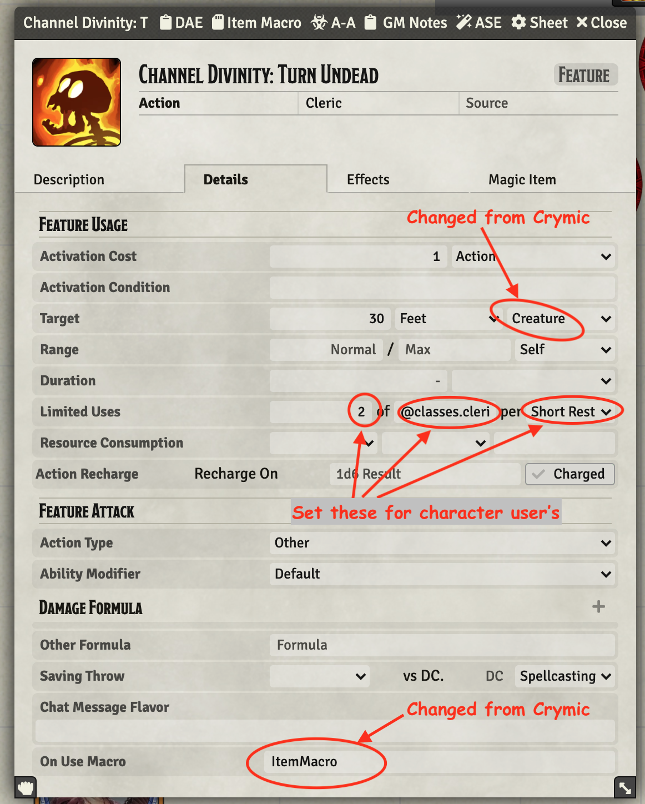
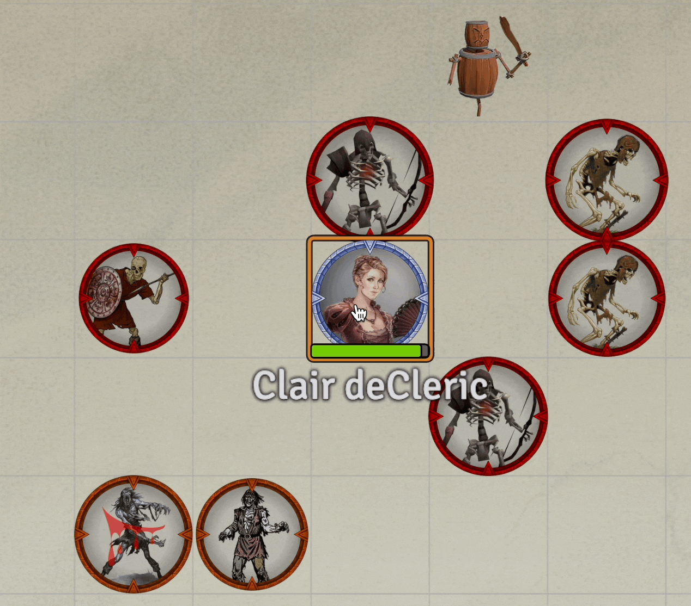

# Cleric

Standard Cleric

* [Channel Divinity: True Strike](#channel-divinity-true-strike)
* [Channel Divinity: Turn Undead](#channel-divinity-turn-undead)

[*Back to All Class Features*](../README.md)

## Feature Notes

### Channel Divinity: True Strike

This is my import of Crymic's [Channel Divinity](https://www.patreon.com/posts/channel-divinity-71778568), dated 11/1/22.  I have added some trace statements, changed variable names to my convention and commented out what totally looks like unneeded code, presumably cruft from development.

This ability hinges on the use of Midi [flags.midi-qol.onUseMacroName](https://gitlab.com/tposney/midi-qol#onuse-macroper-item-and-damage-bonus-macro-actor-special-traits-fields) feature to trigger the macro at the correct spot in the workflow. This is done with a DAE effect on the otherwise passive and empty (except the ItemMacro).  The effect is defined as:

* **Attribute Key**: flags.midi-qol.onUseMacroName
* **Change Mode**: custom
* **Effect Value**: ItemMacro.Channel Divinity: Guided Strike,preCheckHits

The effect value must match the name of the item defining tis ability so that the macro can be found to execute.

Key operations:

1. Make sure actor has required resource (Channel Divinity) defined with charges
2. Make sure action triggered by an attack action and that it is being executed *preCheckHits*
3. Pop a dialog to ask if ability should be used
4. Add the 10 bonus to the attack roll before it is evaluated/announced
5. Decrement the resource
6. Update the item card in chat

---

### Channel Divinity: Turn Undead

This is essentially Crymic's 04/12/22 code with the following changes:

- Change console.warn() and console.error() commands to jez.log()
- Add my typical header block
- Add a few additional jez.log() tracing statements
- Changed "Frightened" to "Turn" to differentiate from the RAW condition 
- Change calling item target data from "30 feet enemy" to "30 feet creature"
- Eliminate [postActiveEffects] prefix from item's ItemMacro line

The item card needs to be modified a bit depending on the using creature's status as an NPC or Character.  NPCs are allowed *infinite* uses (throttled by GM judgement) while PCs need their channel divinity uses tracked.  I've included a NPC and unmarked (character) version of the item card as JSONs in the GitRepo.  

Below is the item card showing changes from Crymic's setup and the character settings needed. The data field, sets the number of channels to 3 if greater than level 17, 2 if greater than level 5 and 1 otherwise.  It is partially obscured in the screen snap:

~~~
@classes.cleric.levels > 17 ? 3 : @classes.cleric.levels > 5 ? 2 : 1
~~~

Following is the feature in action and then the associated chat card that was produced.

[*Back to Cleric top of document*](#cleric)

---

