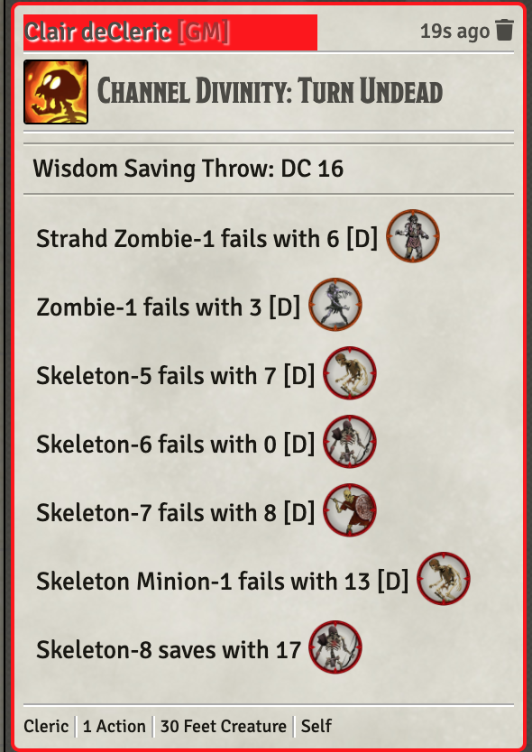

# Cleric

Standard Cleric

* [Channel Divinity: Turn Undead](#Cleric/channel-divinity-turn-undead)

[*Back to All Class Features*](../README.md)

## Feature Notes

### Channel Divinity: Turn Undead

This is essentially Crymic's 04/12/22 code with the following changes:

- Change console.warn() and console.error() commands to jez.log()
- Add my typical header block
- Add a few additional jez.log() tracing statements
- Changed "Frightened" to "Turn" to differentiate from the RAW condition 
- Change calling item from target data from "30 feet enemy" to "30 feet creature"
- Eliminate [postActiveEffects] prefix from item's ItemMacro line

The item card needs to be modified a bit depending on the using creature's status as an NPC or Character.  NPCs are allowed *infinite* uses (throttled by GM judgement) while PCs need their channel divinity uses tracked.  I've included a NPC and unmarked (character) version of the item card as JSONs in the GitRepo.  

Below is the item card showing changes from Crymic's setup and the character settings needed. The data field, sets the number of channels to 3 if greater than level 17, 2 if greater than level 5 and 1 otherwise.  It is partially obscured in the screen snap:

~~~
@classes.cleric.levels > 17 ? 3 : @classes.cleric.levels > 5 ? 2 : 1
~~~

Following is the feature in action and then the associated chat card that was produced.

[*Back to Cleric top of document*](#cleric)

---

