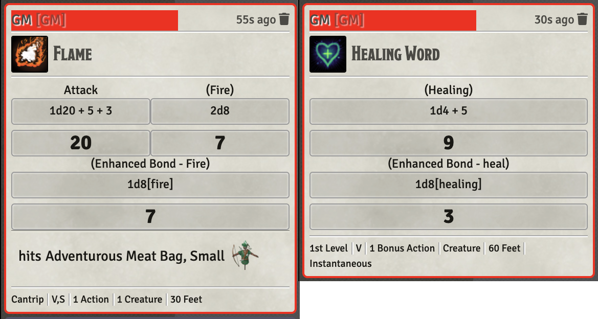
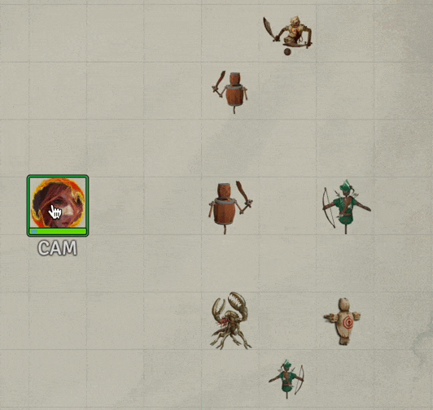
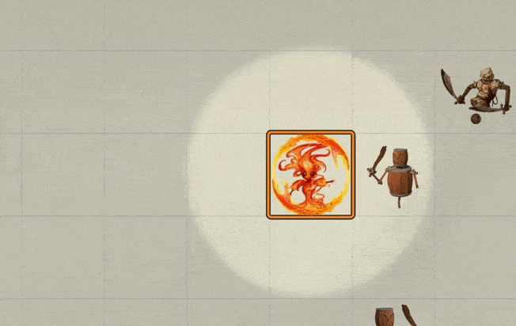
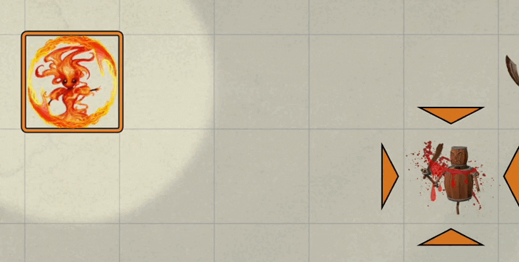

# Druid

Standard Druid, specifically Wildfire Druid abilities

* [Enhanced Bond](#enhanced-bond)
* [Summon Wildfire Spirit](#summon-wildfire-spirit)

[*Back to All Class Features*](../README.md)

## Feature Notes

### Enhanced Bond

This fun little ability works vaguely like a warlock's hex, in fact, I based my approach on that ability's implementation.  Following is my description of this ability:

> *6th-level Circle of Wildfire feature*
> 
> The bond with your wildfire spirit enhances your destructive and restorative spells. Whenever you cast a spell that deals fire damage or restores hit points while your wildfire spirit is summoned: roll a d8, and you gain a bonus equal to the number rolled to one damage or healing roll of the spell.
> 
> In addition, when you cast a spell with a range other than self, the spell can originate from you or your wildfire spirit.
> 
> **FoundryVTT**: Your familiar's name is set with the  *Set Familiar Name* item.  A token with that name must be on the scene for this feature to automagically trigger.

The macro operates as a MIDI damageMacro.  

1. It checks for the existence of the familiar, exiting if not found. 
2. It then checks the nature of the invoking item.  If it is an item that does fire damage it adds a die of damage and a splash VFX.
3. If the invoking item was a heal, it adds a die of healing and a splash VFX.

[*Back to Druid top of document*](#druid)

---

### Summon Wildfire Spirit

This is a 2nd level wildfire Druid ability that uses one of the daily shape-shift charges to call forth the druid's wildfire spirit familiar.

This implementation automates the splash of damage and summoning the familiar from the **Actors Directory** (where it must already exist).  It will adjust the creatures hit points per the RAW description. 

This ability is implemented with Warpgate and Sequencer module calls.

#### Fiery Teleport

This is an ability backed into the wildfire spirit.  It's actually two abilities (Fiery Teleport and Fiery Damage, both located on the sphere's sheet in the Skills tab) a multi-step process to use. 

1. Use this ability and poof the familiar to a new location,
2. Manually move any passengers with the familiar by hand,
3. Use the  Fiery Damage item, targeted on the space the familiar exited to inflict the damage.

Having the friendly moved automatically would be nice, but it's challenging to implement and would need a dialog to confirm those being moved with the familiar.  Keeping this manual feels reasonable to me.

No macro is used to implement this.

#### Flame Seed

This is the other unique ability backed into the wildfire spirit.  This one is in the *Inventory* tab as it is classed as a ranged melee ability (thrown weapon).  

It is modified via *warpgate* when the token is summoned to set the attack and damage modifiers in accordance with the ability description. 

THE VFX recognizes a hit and plays an explosion in addition the basic firebolt graphic.  On a miss, the firebolt is redirected to an area near the intended target. The color of the bolt and explosion is adjusted based on a color keyword found in the icon image file name.

No macro is used to implement this.s

[*Back to Druid top of document*](#druid)

---

