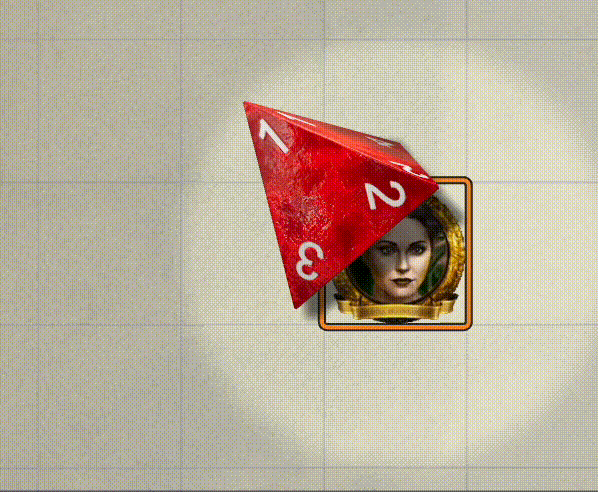
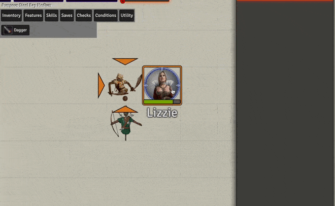
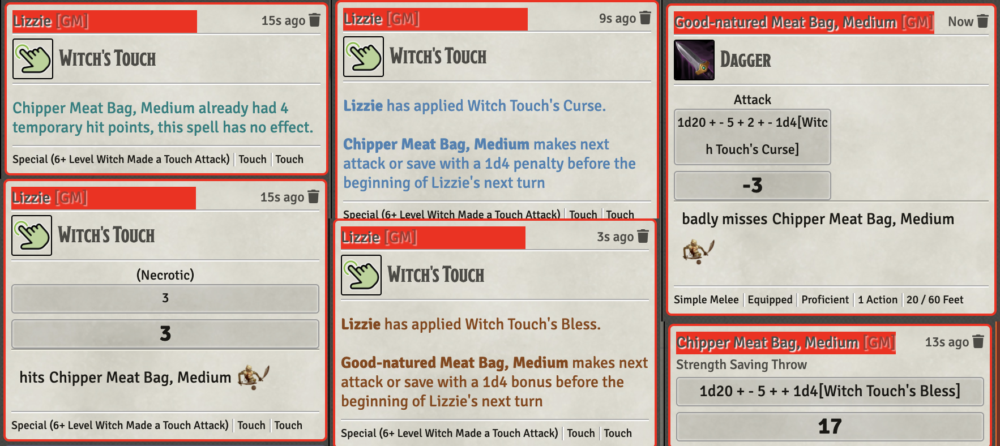

# Occultist

This is a home-brew class found online: **[5e - Occultist - Witch, Oracle, Shaman (KibblesTasty)](https://www.gmbinder.com/share/-M-WtrKeZNFdEXq0MKXw)** by KibblesTasty.

Abilities have been slightly modified for balance and clarity.

* [Sacrificial Summon](#sacrificial-summon)
* [Witch's Touch](#witch-touch)

[*Back to All Class Features*](../README.md)

## Feature Notes

### Sacrificial Summon

This is essentially a find familiar tied directly to the Occultist's familiar.  It drains a few hit points and reduces maximum health to avoid the material component.  

The spell implementation uses Warpgate to bring the minion onto the canvas.

[*Back to Occultist Feature List*](#feature-notes)

---

### Witch's Touch

This ability allows the occultist to add 1 of 4 effects to a *touch* attack, either their own or via a familiar.  This spell is from [Kibble](https://www.gmbinder.com/share/-M-WtrKeZNFdEXq0MKXw)'s, described (slightly edited) as follows:

*Starting at 6th level, whenever you cast a spell with a range of touch (including through your familiar), you can add one of the following modifiers to the spell:*

* **Bolster** *-- It grants one affected target temporary hit points equal to your casting modifier. Only one creature can have these temporary hit points at a time.*
* **Wither** *-- It deals additional damage equal to your casting modifier to one affected creature.*
* **Curse** *-- Subtracts 1d4 from the target's next attack roll or saving throw before the start of your next turn.*
* **Bless** *-- Add 1d4 to target's next attack roll or saving throw before the start of your next turn.*

*You can also confer these effects to another spell with a range longer than touch by making its range touch, or confer these effects as an action without casting a spell by touching a target (making a melee spell attack to do if the target is an unwilling creature). If you make the range of a curse spell touch, you no longer need the material component for the spell.*

As written, the spell is not well defined at to how to enforce **Bolster's** *only one creature at a time* limitation.  I have opted to implement it by using a buff that represents a full load of temp hit points that expires when any damage is taken by that token.  This creates a small, exploitable issue, in that the buff drops when the target takes any damage, which may leave a few temp points in place.  It may also have issues if a combat spans maps.  Both of these seem to be corner cases that I will leave to manual adjudication. 

A second known issue is that wither does not cause damage when used on a bolstered token.  This seems like a very odd thing to do, but if it happens it will need manual intervention. 
 

[*Back to Occultist Feature List*](#feature-notes)

---