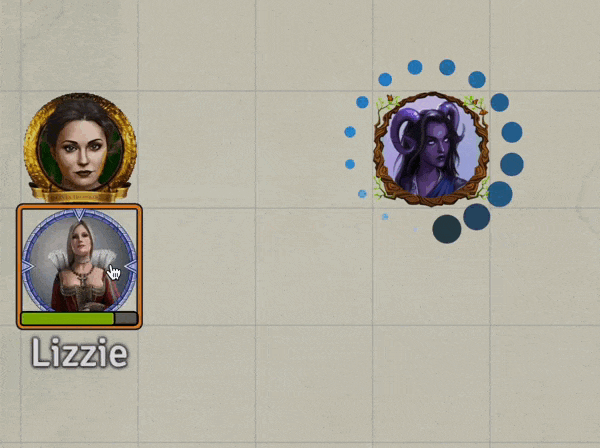
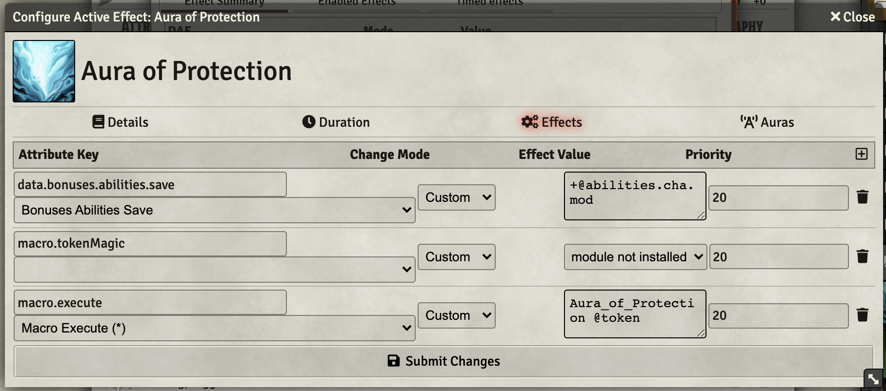
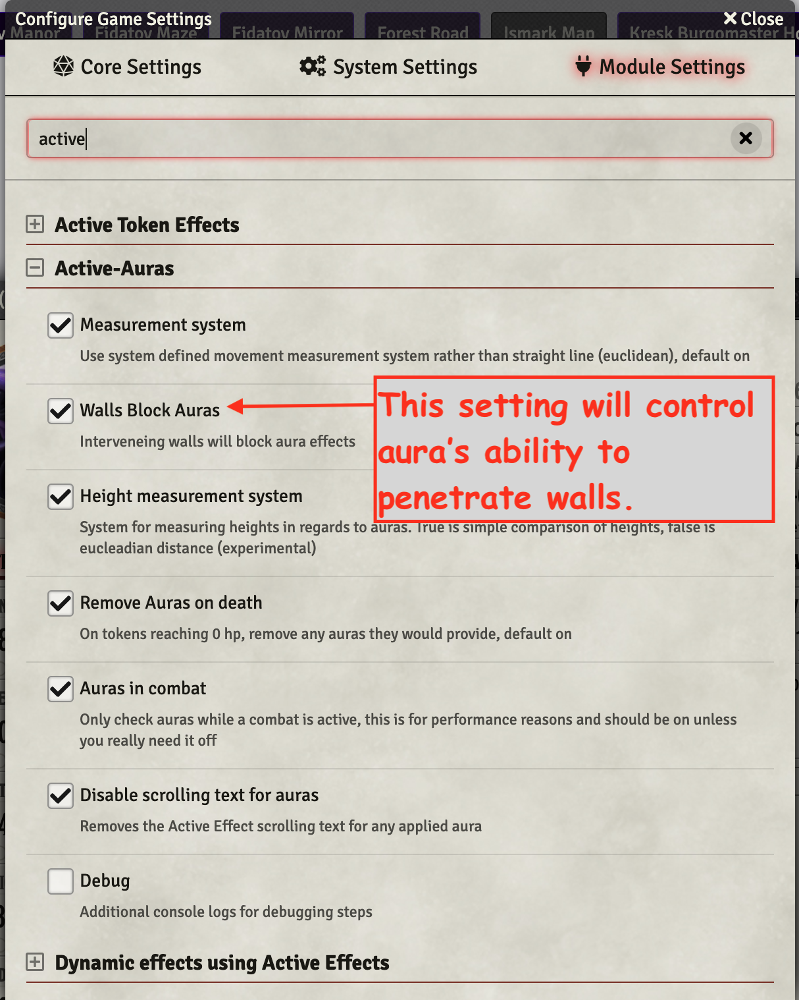
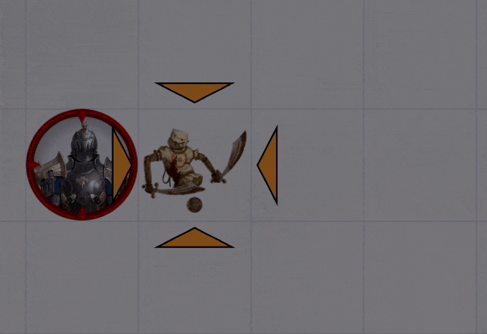

# Paladin

Standard Paladin, specifically Oath of the Ancients Paladin abilities

* [Aura of Protection](#aura-of-protection)
* [Divine Smite](#divine-smite)
* [Divine Sense](#divine-sense)
* [Harness Divine Power](#harness=divine-power)
* [Lay on Hands](#lay-on-hands)
* [Nature's Wrath](#natures-wrath)
* [Turn the Faithless](#turn-the-faithless)

[*Back to All Class Features*](../README.md)

## Feature Notes

### Aura of Protection

This item implements the RAW ability with VFX. It leverages [Active Auras](https://github.com/kandashi/Active-Auras) and [DAE](https://gitlab.com/tposney/dae).

It uses a world macro (**Aura_of_Protection)** that applies a twinkling stars effect on protected tokens.  Three things to be aware of:

1. The aura only works when combat is active on the scene.  This is a (minor?) performance protection.  There is an option in the Active Auras settings to make it always apply.
2. The VFX may play in the wrong location when a token is moved several spaces into the aura effect.  If this is the case, bouncing the token a space and back should correct the issue.
3. The aura depends on the token(s) being *friendly*.  This is a setting on the Token/Character dialog that may be an issue at times.

The DAE and Active Aura settings are key to this item. The DAE Effects provide the following:

1. Charisma modifier added to saving throws
2. An unused Token Magic call (I have Token Magic disabled as it conflicts with [ASE](https://github.com/Vauryx/AdvancedSpellEffects))
3. A macro.execute to my world macro that substitutes for Token Magic

6/12/22 Session of Barovia had an issue with aura not penetrating walls.  That is actually controlled by a global setting of active auras (unfortunate), but I think it is safe enough to change it so all auras penetrate walls. I opened an [enhancement request](https://github.com/kandashi/Active-Auras/issues/231) to allow more granular control. 

6/16/22 Update added flag that allows disabling of sparkles effect and set it to FALSE (off).

[*Back to top of document*](#paladin)

---

### Divine Smite

Imported from older work without further investigation or documentation.

[*Back to top of document*](#paladin)

---

### Divine Sense

Imported from older work without further investigation or documentation.

[*Back to top of document*](#paladin)

---

### Harness Divine Power

Imported from older work without further investigation or documentation.

[*Back to top of document*](#paladin)

---

### Lay on Hands

Rewritten to use item's Limited Uses as a fall back to a PC resource, enabling the use of this feature for NPCs

[*Back to top of document*](#paladin)

---

### Nature's Wrath

Imported from older work without further investigation or documentation.

[*Back to top of document*](#paladin)

---

### Turn the Faithless

Imported from older archive and updated for FoundryVTT 9.x

[*Back to top of document*](#paladin)

---