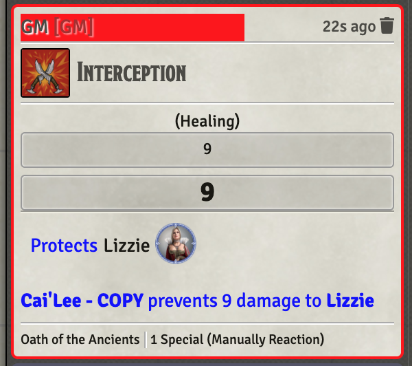

# Shared

Abilities that are common across multiple classes

* [Fighting Style - Interception](#fighting-style-interception)

[*Back to All Class Features*](../README.md)

## Feature Notes

### Fighting Style - Interception

This item provides partial automation of the **Fighting Style: Interception** reaction ability. It is used as follows:

When the activation conditions are met, the possessor of the ability may:

1. Target the token within 5 feet that you are protecting,
1. Activate this item (click it),
1. GM will need to enter the amount of damage the protectee suffered,
1. Protectee will be healed by the amount that was blocked.

It does not use a reaction in the Midi-QoL sense and in fact, the action the details pages needs to NOT be reaction.  If it is, the possessor of this ability will deal with a pop-up asking if they want to use this ability to protect themselves, which they cannot do (per RAW). The Details page is included as a PNG in my Git Repo.

[*Back to top of document*](#paladin)

---
