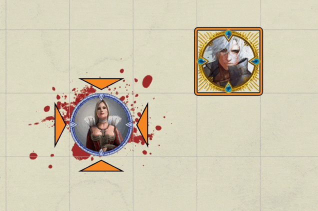
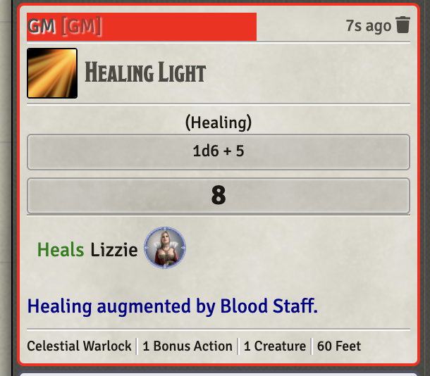
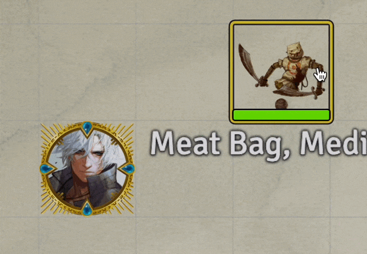
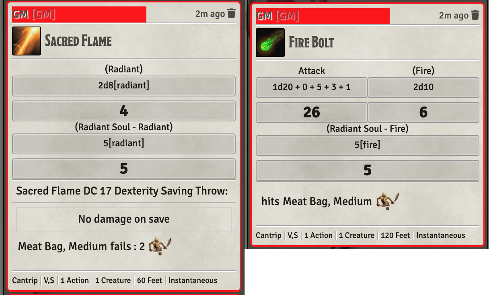

# Warlock

Standard Warlock, specifically Celestial Warlock abilities

* [Healing Light](#healing-light)
* [Radiant Soul](#radiant-soul)

[*Back to All Class Features*](../README.md)

## Feature Notes

### Healing Light

This item implements the RAW ability with VFX **AND** an option to have a HEAL_ITEM (defined in the macro as a constant) that if possessed by the actor and attuned will add the actor's casting modifier to the amount healed.

In my campaign, the additional feature is triggered by the Blood Staff.

[*Back to Warlock Feature List*](#feature-notes)

---

### Radiant Soul

This item implements the **Celestial Warlock**'s 6th level ability: **Radiant Soul**.

It places a DAE effect on the actor with this item that grants resistance to Radiant damage -and- it adds a DamageBonus function that does the following:

1. Verify the user is a Celestial Warlock of at least 6th level, if not exit
1. Check to see if the invoking action is a msak, rsak, or save, if not exit
1. Check to see if *fire* or *radiant* damage was done by invoking action, if not exit
1. Launch a minor VFX on the target appropriate for the damage type
1. Return a function that will add the user's charisma modifier as an additional damage source with same type.

#### Known and Suspected Issues

The way this is implemented, the damage addition will be applied to all targets.  This is not what RAW specifies, although, it might well be accepted as a HOMEBREW.  Alternatively, the GM can back the extra damage out.  Also, the extra VFX only applies to one target.  Since my game's Celestial Warlock has no AOE spells, I don't feel motivated to do anything more with this at this time.

The code looks for three specific action types: msak, rsak, and save.  If it finds one, it then scans damage types.  Its possible I have missed a case where the caster should be entitled to extra damage, though I can't think of it at this point.

[*Back to Warlock Feature List*](#feature-notes)

---