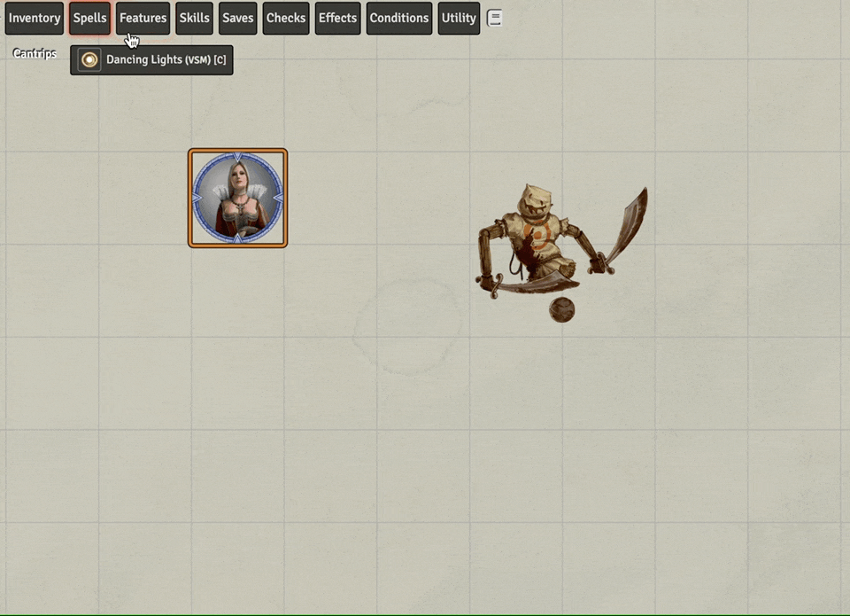
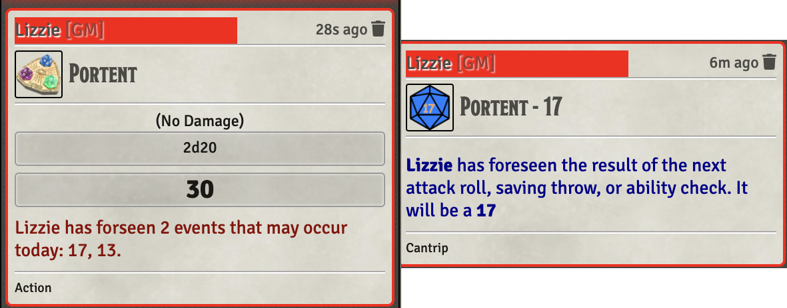

# Wizard

Standard Wizard

* [Portent](#portent)

[*Back to All Class Features*](../README.md)

## Feature Notes

### Portent

This ability is only partially automated.  It is composed of two major scripts:

* Portent.js
* Portent-Helper.js

The first is to be attached to an item that can be used daily and will generate a number of Portent-Helper items in the inventory of the using character.  The intent is that this is used daily to roll those tasty portent dice.

The second are temporary items that initially store the results of Portent.  When used they announce the use of the die roll, the value, a bit of text explaining that the effect is to be handled manually and of course a VFX.  The helper item deletes itself when used. 

[*Back to Wizard top of document*](#wizard)

---

