# Creature Features

Creature Abilities that aren't exactly spells, but they may be close.

I'll try to document functions as I add them to the repository. 

[Link back to my Repo Listing](https://github.com/Jeznar/GitRepo)

## Abilities in this Repo

* **[Angelic Weapons](#angelic_weapons)** -- Bonus damage on all weapon hits.
* **[Beyond Death](#beyond-death)** -- Ability to restore 1HP when dropped to zero
* **[Blessing of the Mother Night](#blessing-of-the-mother-night)** -- Baba Lysaga ability
* **[Brown Mold Freezing Wave](#brown-mold-freezing-wave)** -- Environmental damage component of Brown Mold.
* **[Change Shape, Deva](#change-shape-deva)** -- **[The Abbot's](https://www.dndbeyond.com/monsters/the-abbot)** shape change ability.
* **[Clay Golem Haste](@clay-golem-haste)** -- Applies a DAE Effect
* **[Clay Golem Slam](@clay-golem-slam)** -- Reduces targets hit points by amount of damage inflicted
* **[Consuming Bite](#consuming-bite)** -- Ilya's ability per MandyMod in her Kresk extension.
* **[Constrict](#constrict)** -- Vine Blight's Constrict ability.
* **[Coven Casting](#coven-casting)** -- Night Hag's shared Casting
* **[Create Specter](#create-specter)** -- Wraith's ability to convert corpse to a specter
* **[Crocodile Bite](#crocodile-bite)** -- Crocodile bite and grapple possibility
* **[Etherealness](#etherealness)** -- Transitions a token to ethereal realm (sort of).
* **[Fading Image](#fadingimage)** -- Applies a turn-end dot to the possessor.
* **[Falling](#falling)** -- Applies 1d6 (by default) damage and the CUB Prone condition
* **[Grasping Root](#grasping-root)** -- Tree Blight's (aka Wintersplinter) grasping root ability.
* **[Gray Ooze](#gray-ooze)** -- Gray Ooze Abilities
* **[Healing Touch](#healing-touch)** -- The Abbot's lay on hands like ability
* **[Horrifying Visage](#horrifying-visage)** -- Banshee's visage can terrify creatures that can see it and are within 60 feet.
* **[Howling Babble](#howling-babble)** -- Allip's special attack.
* **Knock Down** -- Implements a dog/wolf's bite and knock down
* **[Life Drain](#life-drain)** -- Wraith's Life Drain Ability
* **[Maddening Touch](#maddening-touch)** -- Allip's main melee attack.
* **[Magic Resistance](#magic-resistance)** -- Grants advantage on saves vs magic
* **[Nightmare Haunting](#nightmare-haunting)** -- Nighthag's haunting ability.
* **[Pit](#pit)** -- Abilities for use by the pit *monster*
* **[Ravenous Tenacity](#ravenous-tenacity)** -- Ilya's ability per MandyMod in her Kresk extension.
* **[Retched Spittle](#retched-spittle)** -- Ilya's ability per MandyMod in her Kresk extension.
* **[Shapechange, Baba Lysaga](#shanpechange-baba-lysaga)** -- Simply states the ability
* **[Slow, Golem](#slow-golem)** -- Golem slow ability mimicing the spell effect
* **[Spore Cloud](#spore-cloud)** -- The damage effect of Yellow Mold
* **[Summon Swarm of Insects](#summon-swarm-of-insects)** -- Calls for 1d4 Swarms of Insects
* **[Standing Stone Lightning Strike](#standing-stone-lightning-strike)** -- Ability to use from journal to implement an effect on Yester Hill.
* **Portent (Arabelle)** -- Portent slightly modified for Arabelle
* **[Threat Display](#threat-display)** -- Potential Frightened Application
* **[Trampling Charge](#trampling-charge)** -- Equine charge / knockdown
* **[Undead Fortitude](#undead-fortitude)** -- Certain undead's (e.g. Zombie) ability to deny death  
* **[Undead Slayer](#undead-slayer)** -- Adds an extra 3d6 of damage to weapon attacks vs undead
* **[Wail](#wail)** -- Banshee's wail that can drop things in their tracks.
* **[Whispers of Madness]($whispersofmadness) -- Allip's ability
* **[Vampire Abilities](#vampire-abilities) -- A number of vampire specific abilities.
* **[Wooden Sword](#wooden-sword)** -- Arabelle's wooden sword debuffing machine.

## Additional Notes on Functions

### **Angelic Weapons**

This ability requires only a bit of DAE configuration to add 4d8 Radiant damage to all MWAK and RWAK actions for an actor.  It does not add the magical characteristic, I don't know how to do that easily, so I am leaving it for manual twiddling in the (presumably) rare situations where it would matter.  

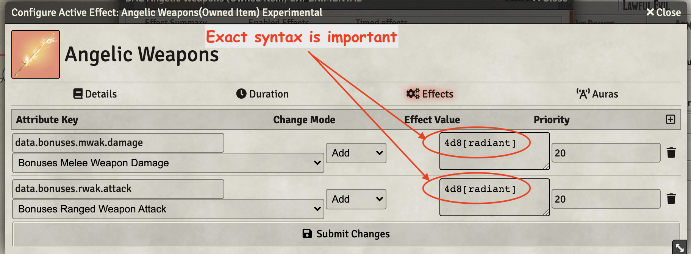

*[Back to the Table of Contents](#abilities-in-this-repo)*

---

### **Beyond Death**

This macro does a couple of things:

* Set current health to one if it was zero, 
* Run a simple VFX via [Automated Animations](https://github.com/otigon/automated-jb2a-animations),
* Decrement a usage count (allowed to be used twice).

Limitations:

* It does not check to see if the hit that reduced to zero was a critical 
* It does not automatically fire (manually invoked)
* It decrements the usage count even if it has no effect.

I've let the limitations stand as this is a *corner case* ability, only on one minor actor in my game.

*[Back to the Table of Contents](#abilities-in-this-repo)*

---

### **Blessing of the Mother Night**

Simple ability, only needs a description set.

*[Back to the Table of Contents](#abilities-in-this-repo)*

---

### **Brown Mold Freezing Wave**

This macro allows the damage component of Brown Mold's effects to be executed from a macro.  This one expects to be located in a journal article or the hot bar not to be used as an ItemMacro.  Description of Brown Mold can be found on DnDBeyond: [Brown Mold](https://www.dndbeyond.com/sources/dmg/adventure-environments#BrownMold).

To use this macro, select (not target, just select) the token to be affected and run the macro.  It should do everything from there including:

* VFX
* Saving Throw
* Damage Calulation and Application
* Post a Results Message. 

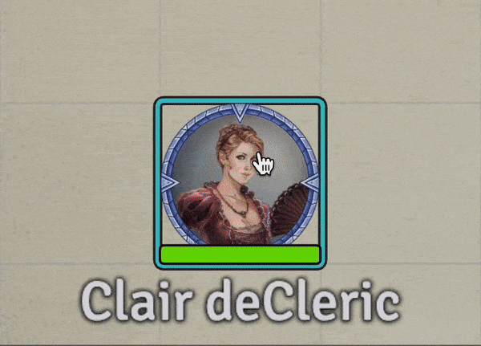

*[Back to the Table of Contents](#abilities-in-this-repo)*

---

### **Change Shape, Deva**

The Abbot's ability to **change shape** from Curse of Strahd..

Essentially just the Druid Wild Shape ability reskinned.

*[Back to the Table of Contents](#abilities-in-this-repo)*

---

### **Constrict**

Implements Vine Blight's ability to attack and automatically initiate a grapple of targets size large or smaller.

Cool Things in this macro (e.g. first time things for me):

1. Journal Entries are looked up by name and added to various chat cards generated.
2. The paired effects (Grappled and Grappling) are both removed if either is removed.
3. Information to enable paired removal passed as parameters to itemMacro.

It has a minor JB2A effect, not super appropriate, but it is something.

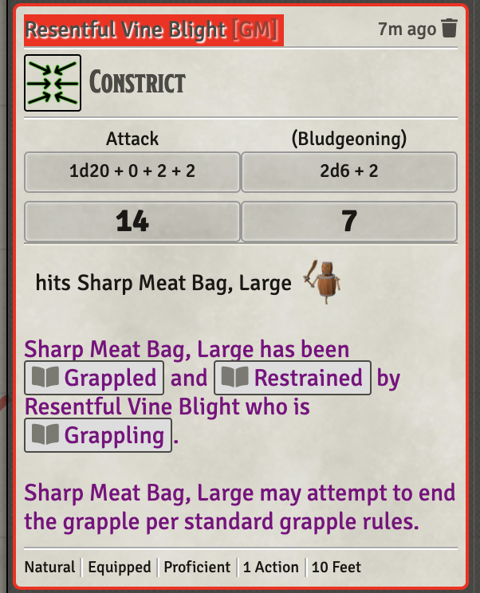

*[Back to the Table of Contents](#abilities-in-this-repo)*

---

### **Coven Casting**

This is a bit of a kludge solution...An extra *actor* named Coven has been added to my Actor's Directory that has the Coven Casting feature (which is nothing more than a spell description) with stats set to generate the RAW spell to hit and saving throws.  This synthetic creature has all of the spells it should and has the spell slots set.

The idea is add one (or more) of these to handle the special shared spell pool.  Concentration has to be handled carefully, but generally this synthetic character should never be targetted directly, rather the GM can bop it with damage for a concentration check when the actual hag is hit.

Its not an ideal solution, but this feels practical to me.

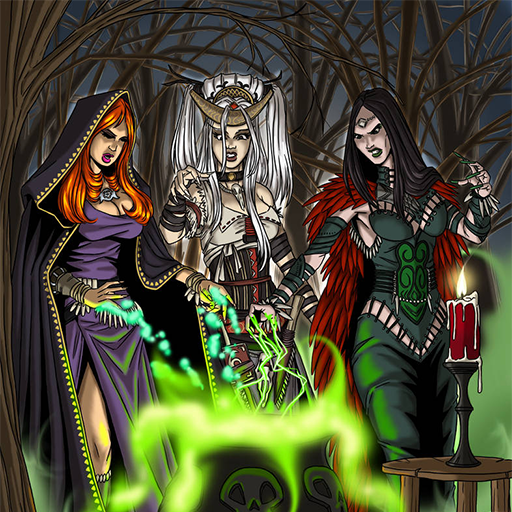

*[Back to the Table of Contents](#abilities-in-this-repo)*

---

### **Clay Golem Haste**

Simple macro that applies a DAE effect to implement Golem's haste ability.

*[Back to the Table of Contents](#abilities-in-this-repo)*

---

### **Clay Golem Slam**

Simple macro that applies a DAE effect to reduce target's max hit points by same amount as damage inflicted.

*[Back to the Table of Contents](#abilities-in-this-repo)*

---

### **Consuming Bite**

This one implments one of Ilya Kreskov's ability as defined by MandyMod in her [Fleshing Out Curse of Strahd: Kresk](https://www.reddit.com/r/CurseofStrahd/comments/8w8488/fleshing_out_curse_of_strahd_kresk/) post on Reddit. 

This troublemaker can bite someone doing some damage and self healing **AND** creating a 30 foot radius fear effect.  The macro implements all elements of Mandy's write up including an immunity effect that occurs on save or fear expiration. 

It checks for LoS blockage by walls, as well as blinded, but nothing ore sophisticated on the "can see" bit of this ability.

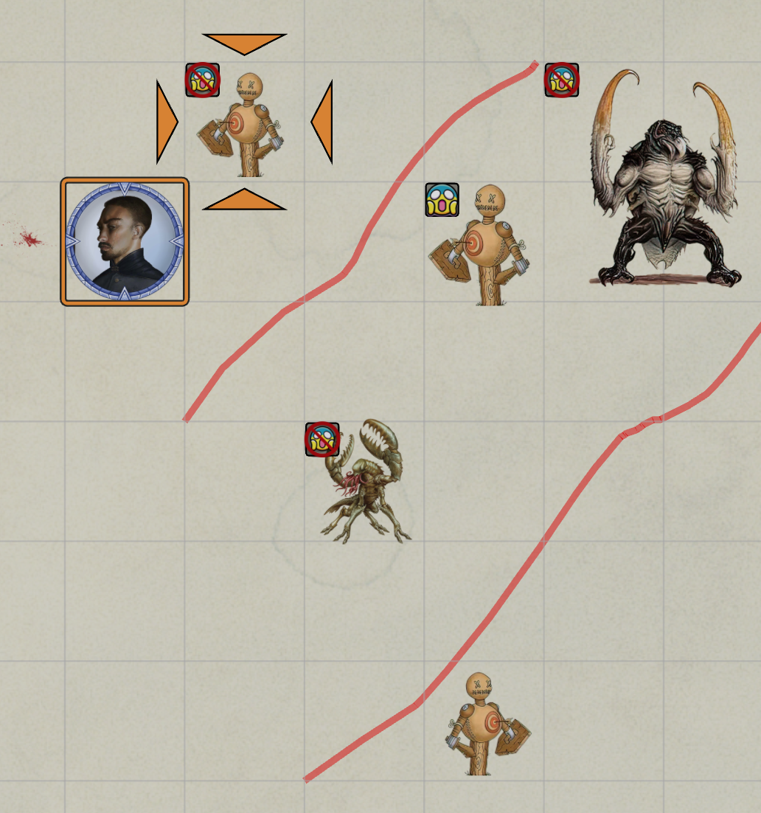

*[Back to the Table of Contents](#abilities-in-this-repo)*

---

### **Create Specter**

Perform several checks before using WarpGate to bring in a Specter which will have a customized name marking as belong to summoning wrath (I'm assuming that wraiths have unique names).  No check is made to prevent multiple summonings from the same corpse.

*[Back to the Table of Contents](#abilities-in-this-repo)*

---

### **Crocodile Bite**

Import of older macro.

*[Back to the Table of Contents](#abilities-in-this-repo)*

---
### **Ethrealness**

This macro runs a VFX on the targeted token and flips the hidden status too true when it is run.  When the effect it applies is removed it runs the VFX in reverse and flips the hidden status to false.  

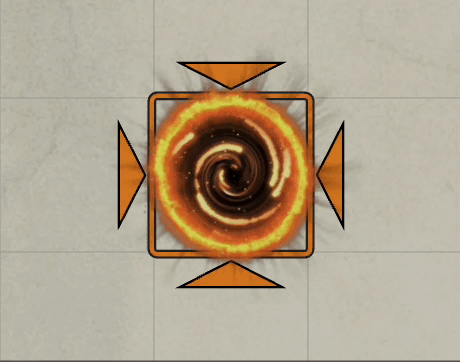

*[Back to the Table of Contents](#abilities-in-this-repo)*

---

### **Fading Image**

This feature applies a turn-end DoT via MidiQoL OverTime to a creature that has the ability, while they are in combat. I am using to represent a fading of *reality* for the mirror fight in MandyMod's Fidatov manor.  

The key element of this spell is the overtime effect that is defined as follows:

~~~javascript
flags.midi-qol.OverTime CUSTOM turn=end,label=Fading Image,damageRoll=1d6,damageType=psychic
~~~

*[Back to the Table of Contents](#abilities-in-this-repo)*

---

### **Falling**

This item applies a d6 of damage and the prone condition.  It should be adjusted to make the number of dice *correct* for different height falls.

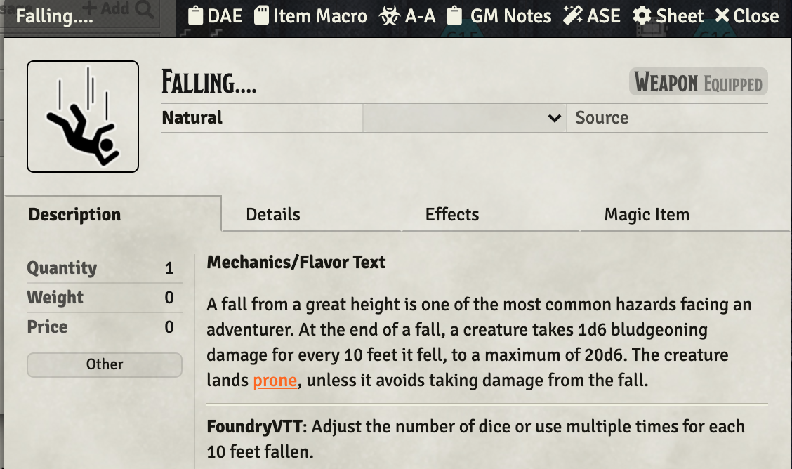

*[Back to the Table of Contents](#abilities-in-this-repo)*

---

### **Grasping Root**

This ability automates Wintersplinter (Tree Blight)'s grasping root.  It does the following:

1. Verify that one target has been hit
1. Summon a new token *Grasping Root* at location of the target
1. Rename the summoned root for uniqueness
1. Initiate a grapple between the root and target by placing appropriate paired debuffs
1. Setup a DoT on the target
1. Post appropriate summary information 

The summoned *Grasping Root* is taken from the *Actors Directory* with several key attributes set:

* 20 Strength - for the +5 to grapple on average matching RAW's DC15,
* 1 Hit Point - Combined with 5 points of damage reduction implments the single hit feature,
* 15 Armor Class - As defined in RAW,
* 0 ft of Movement - Root is supposed to be immoble.
* Immune to the following damage types: Bludgeoning, Force, Necrotic, Piercing, Psychic, Radiant,Thunder, Poison, and Healing.

If either the grappled or grappling effect is removed, the paired effect will be automatically removed.

**Note:** The grapple does not automatically drop when the root dies.  It should be removed manually.

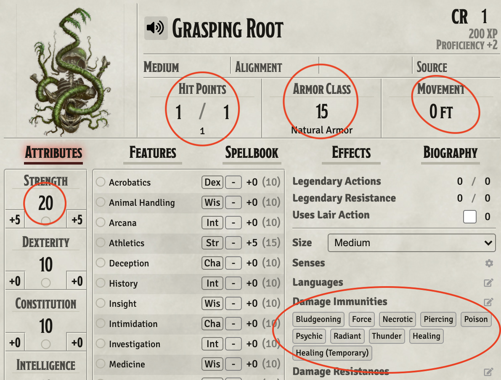

*[Back to the Table of Contents](#abilities-in-this-repo)*

---

### **Gray Ooze**

The Gray Ooze has a set of unique abilities.  Here is what is implemented:

1. Gray Ooze Pseudopod -- A conventional melee attack that applies a penalty to AC if it hits metal armor.  That's a bit beyond my ability to implement, so it just used the [DisplayDescription](../Utility_Macros#displaydescription) macro to echo the item's description to the chat card for the players to handle manually.
2. Gray Ooze Corrode Metal -- This ability needs to be handled manually as noted in the description.

*[Back to the Table of Contents](#abilities-in-this-repo)*

---

### **Healing Touch**

The Abbot's lay on hands ability. To use it, target a token and fire it off.  It will heal for up to the defined anmount and then try to remove the CUB conditions: *Diseased*, *Poisoned*, *Blinded*, and *Deafened*.  It will also try to remove the *Cursed* condition, though that is very much a shot in the dark.  

The GM may well need to manually cleanup other lingering effects that can be cured by this ability but do not meet the narrow list of effects that are automatically removed. 

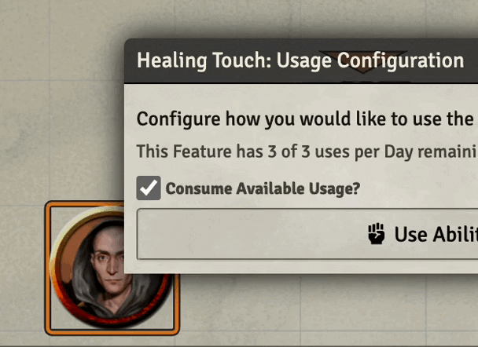

*[Back to the Table of Contents](#abilities-in-this-repo)*

---

### **Horrifying Visage**

I rather skipped documenting this as I wrote it, so, well...

*[Back to the Table of Contents](#abilities-in-this-repo)*

---

This ability requires nothing more than being a feature name "Magic Resistance." Midi-QoL apparently treats this as a magic cookie and will roll saves vs magic for a creature that has this feature with advantage.

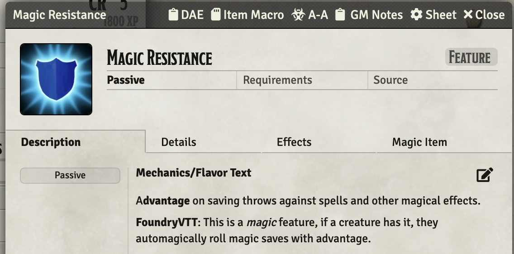

*[Back to the Table of Contents](#abilities-in-this-repo)*

---

### **Howling Babble**

Special magic attack of the **[Allip](https://www.dndbeyond.com/monsters/93770-allip)** undead critter. It affects all creatures that can hear the cast within 30 feet.  The associated ItemMacro pops a dialog that allows for selection of all the tokens to be affected after eliminating any undead or constructs (they are immune). 

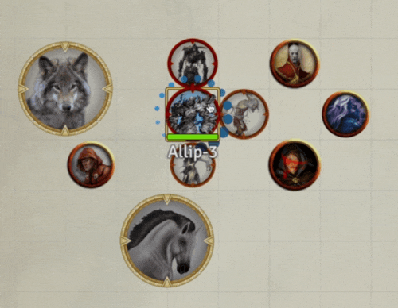

*[Back to the Table of Contents](#abilities-in-this-repo)*

---

### **Life Drain**

The Wraith's life drain has an additional effect reducing the targets max hp on a failed save.  This item applies a DAE effect that implements this including being cleared by a long rest.  

The interesting element of this item is in the value of that DAE effect. The value is an "@parm" which is provided by DAE at time of execution.  In this case: `-@data.flags.dae.damageApplied` does the trick for me.

It does generate a warning on the console: `@data.key is deprecated, use @key instead -@data.flags.dae.damageApplied`

I tried using `-@flags.dae.damageApplied` but that ended up generating a zero which is wrong, so the warning remains for now.

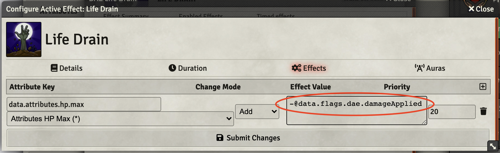

*[Back to the Table of Contents](#abilities-in-this-repo)*

---

### **Maddening Touch**

Basic melee attack for the **[Allip](https://www.dndbeyond.com/monsters/93770-allip)** undead critter.  Only *interesting* aspect is the use of Automated Animations to show an appropriate effect. 

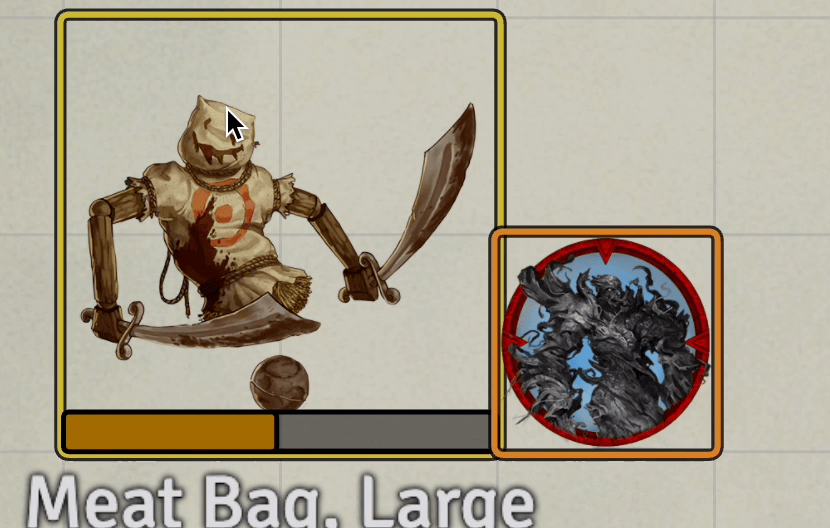

*[Back to the Table of Contents](#abilities-in-this-repo)*

---

### **Nightmare Haunting**

This one implments the Nighthag haunting ability.  It relies on the GM to run it at the appropriate time, it does nothing to manage requirements of application.

What it does do is run a VFX and add a persistent debuff that reduces the maximum hit points.  The GM will likely want to remove the duration element of the effect so that it becomes *permanent*, well until explicitly removed which is allowed by Greater Restoration and similar abilities.  This should be done manually by the GM.

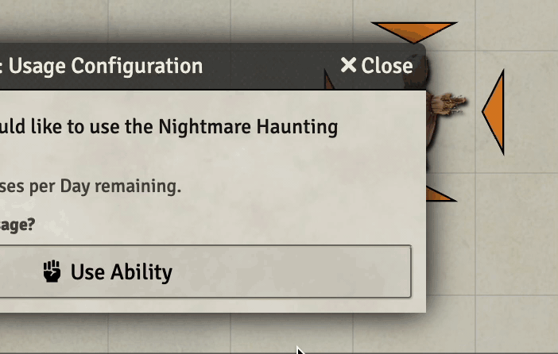

*[Back to the Table of Contents](#abilities-in-this-repo)*

---

### **Pit**

Abilities to automate damage from a spiked pit and a poisoned spike pit.  Damage amounts may need to be adjusted for circumstances. 

*[Back to the Table of Contents](#abilities-in-this-repo)*

---

### **Ravenous Tenacity**

This one implments one of Ilya Kreskov's ability as defined by MandyMod in her [Fleshing Out Curse of Strahd: Kresk](https://www.reddit.com/r/CurseofStrahd/comments/8w8488/fleshing_out_curse_of_strahd_kresk/) post on Reddit. 

Ilya has advantage on all DEX and WIS saves.  This requires only a bit of DAE setup, no macro at all. DAE needs the following effects turned on:

* flags.midi-qol.advantage.ability.save.dex
* flags.midi-qol.advantage.ability.save.wis

I've added screen shots of the pages where I added config info for this ability.

*[Back to the Table of Contents](#abilities-in-this-repo)*

---

### **Retched Spittle**

This one implments one of Ilya Kreskov's ability as defined by MandyMod in her [Fleshing Out Curse of Strahd: Kresk](https://www.reddit.com/r/CurseofStrahd/comments/8w8488/fleshing_out_curse_of_strahd_kresk/) post on Reddit. 

Here's the decription of the ability:

> Launch a glob of rancid spittle at a point within 60 feet. Each creature within a
> 10-foot radius of that point must succeed on a DC 13 Constitution saving throw or take
> 14 (4d6) poison damage and be poisoned for 1 minute.
>  
> On a success, a target takes only half damage and is not poisoned. At the end of each 
> of its turns, a target may attempt another saving throw, ending the poisoned condition 
> early on a success.

This ability has the user place a targeting, makes con checks for those in the area of effect (not necessarily DC13, it is calculated, so different stats and CR can change it). It also uses DAE's on each to make saving throws at appropriate times for those poisoned. 

*[Back to the Table of Contents](#abilities-in-this-repo)*

---

### **Shapechange, Baba Lysaga**

Simple configuration of the ability with reminder to use the drop to shift feature of FoundryVTT.

*[Back to the Table of Contents](#abilities-in-this-repo)*

---

### **Slow, Golem**

This is an implementation of the Slow Spell for Golems (Stone and Amber).  The effects are set to match the spell not the Stone Golem's RAW description that missed some elements that just feel like they should have been included.

*[Back to the Table of Contents](#abilities-in-this-repo)*

---

### **Spore Cloud**

An ability for the Yellow Mold *dungeon haard* that:

> Cloud of spores that fills a 10-foot cube originating from the mold. Any creature in the area must succeed on a DC 15  Constitution Save or take 11 (2d10)  Poison Damage and become  Poisoned for 1 minute. No damage on save.
> 
> While poisoned in this way, the creature takes 5 (1d10)   Poison Damage  at the start of each of its turns. The creature can repeat the saving throw at the end of each of its turns, ending the effect on itself on a successful save.

This is implemented with three DAE effects and an automated animation line (shown in repo files).  The DAE effects are:

~~~
flags.midi-qol.OverTime OVERIDE turn=start,label=Poison DoT,damageRoll=1d10,damageType=poison
macro.CUB CUSTOM Poisoned
flags.midi-qol.OverTime OVERIDE turn=end,label=Poison Save,saveDC=15,saveAbility=con
~~~

No macro required.

*[Back to the Table of Contents](#abilities-in-this-repo)*

---

### **Summon Swarm of Insects**

This implments **Baba Lysaga**'s ability to call forth 1d4 swarms of insects.  This is implemented with warpgate and does a couple of interesting things:

1. It adds a suffix number on the end of each summoned swarm
2. It plays a pre and post VFX for each summon. 

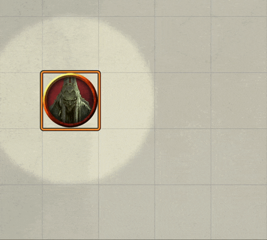

*[Back to the Table of Contents](#abilities-in-this-repo)*

---

### **Standing Stone Lightning Strike**

This one is intended to be run from the hot bar or more likely from a journal article outlining the standing stones at Yester Hill.

It (maybe) zaps the one and only selected token for a bunch of lightning damage.  The cha
nce of zapping is set in a constant in the macro that can be easily adjusted.   

I wanted to use  MidiQOL.applyTokenDamage() for this, but I couldn't get it to actually apply damage to the token.  Discussions on discord suggested a possible bug in Midi, so I implemented the damage more directly.  This macro does consider damage immunity/resistance/vulnerability to lightning.  Not quite up to Midi's usual checking, but seemingly more than good enough for a one off ability. 

Damage is announced with a simple chat card like the following:

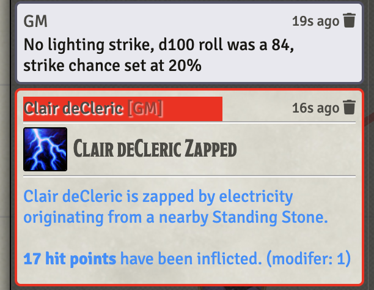

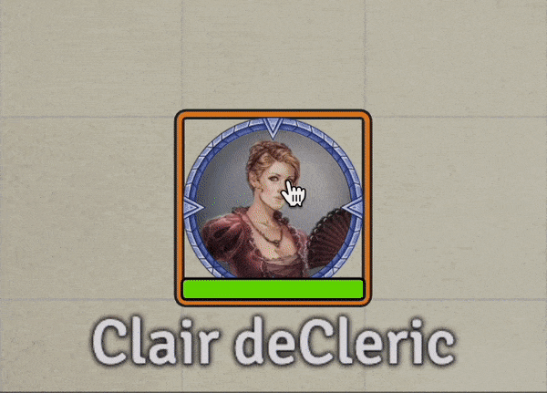

*[Back to the Table of Contents](#abilities-in-this-repo)*

---

### **Threat Display**

This is a homebrew freature I cooked up for Galahad (others might know him as Lancelot), a GSD my party of Travelers in Barovia befriended in Durst Manor. Following is my description of the ability:

> As a bonus action, force a creature within 15 feet make a wisdom saving throw vs Caster DC or become  Frightened until the end of the creature's next turn. The targeted creature must hear the treat for it to be effective.
> 
> If the target is smaller, the save is made with diadvantage.  If the target is two categories larger, it has advantage.  If it is three or more larger, it is immune.
> 
> Creatures affected by the unwavering loyalty trait automatically succed on this saving throw. Once a creature has saved against this effect it is immune for the combat.

The macro manages immunities cause by saves, checks size differences, performs the appropriate save. Finally, it places the appropriate effect on the target.

*[Back to the Table of Contents](#abilities-in-this-repo)*

---

### **Trampling Charge**

Import from older work and update for FoundryVTT 9.x.

*[Back to the Table of Contents](#abilities-in-this-repo)*

---

### **Undead Fortitude**

This ability is implemented through one of the ***annoying magic item names***, that is having a feature named **Undead Fortitude** causes the automation of this ability to trigger. 

The RAW ability for zombie describes this feature like this:

> If damage reduces the zombie to 0 hit points, it must make a Constitution saving throw with a DC of 5 + the damage taken, unless the damage is radiant or from a critical hit. On a success, the zombie drops to 1 hit point instead.

The [D&D 5E Helpers](https://foundryvtt.com/packages/dnd5e-helpers) module provides support for this ability and is discussed on [Reddit HERE](https://www.reddit.com/r/FoundryVTT/comments/nnd3pc/dd_5e_automating_zombies_undead_fortitude/). Here are the salient points from that thread:

#### D&D 5E Helpers Effects & Settings

* Automatically checks actors with the **Undead Fortitude** feature
* When they are reduced to 0hp it will prompt the GM to choose the type of damage that was applied
* Then prompts the GM for a Con save for that actor, and will auto heal the NPC if the roll beats the save needed

There are two settings for levels of checks:

* Quick saves will just measure the change in hp and will not measure "overkill"
* Advanced saves will query the GM for the amount of damage taken as a more complex system (I use this version)

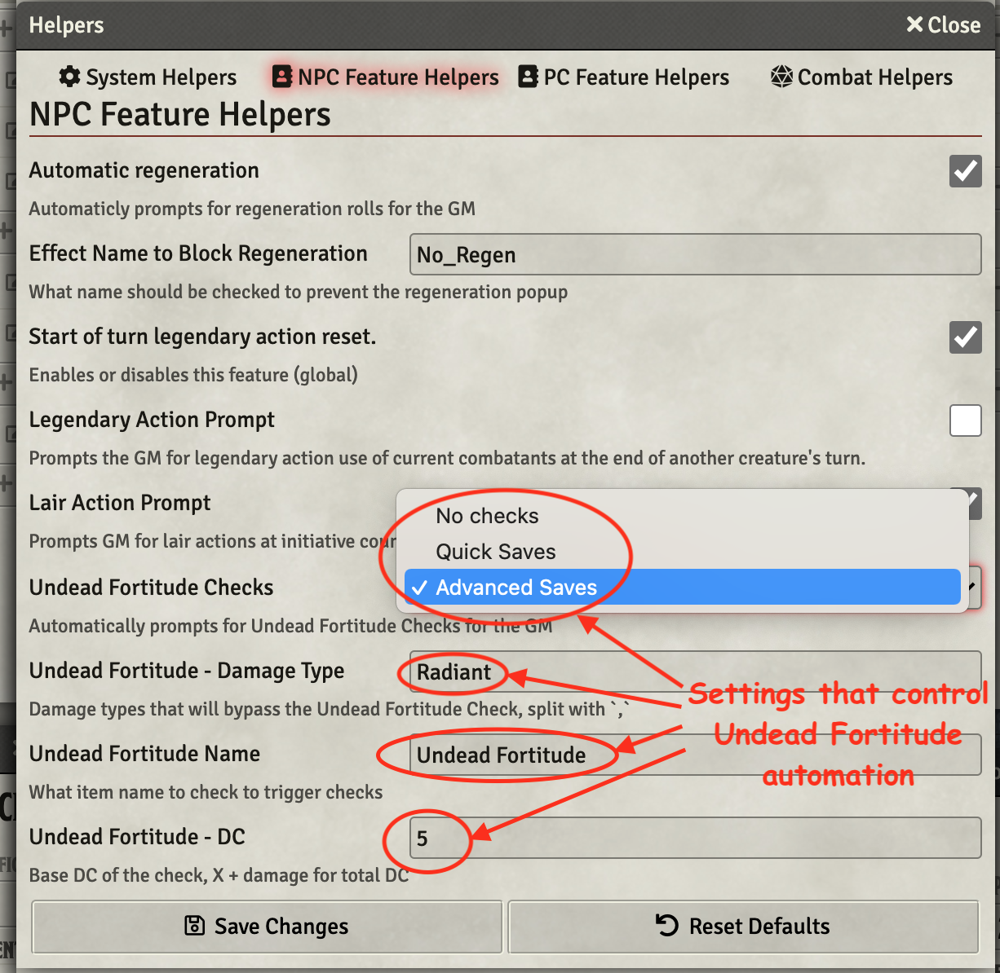

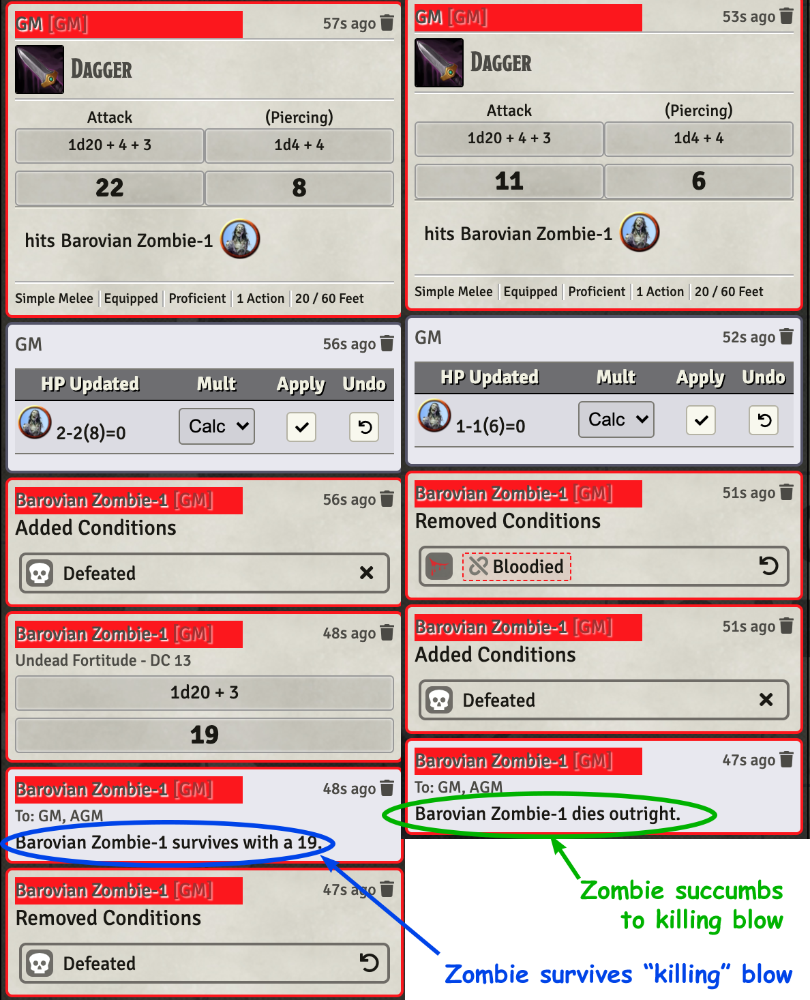

*[Back to the Table of Contents](#abilities-in-this-repo)*

---

### **Wail**

This ability (typically on a Banshee) hits like, well, harder than a Mac Truck. It is an AoE effect that drops targets that fail their saves to zero HP and a nominal amount to those that save.

Creatures that can't hear the **Wail** are supposed to be unaffected.  That's something I find unacceptably difficult to automate, so I'll fix those issues as they occur.  

Since I may need to do some manual fixing after the spell, I setup the chat log to show the amount of damage done to each target, making such fixes fairly easy.  

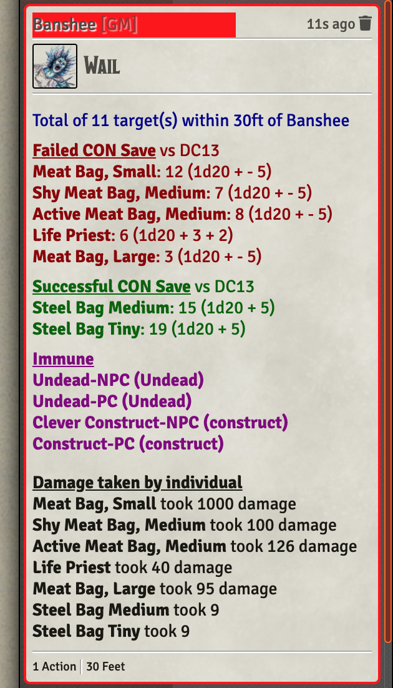

*[Back to the Table of Contents](#abilities-in-this-repo)*

---

### Vampire Abilities

A number of abilities imported from older work.  Including:

- **Regeneration**: A now obsolete macro that implements regeneration is a painful manner.  This is now done with the D&D 5E helper module. 
- **Set No Regen**: Applies a one turn effect that works in concert with D&D 5E helper module to prevent regen for one turn. 
- **Vampire Bite**: Returns part of the necrotic damage from the bite as healing to the Vamp.
- **Vampire Charm**: Obsolete macro, now implemented entirely via DAE configuration.
- **Vampire Claw**: Inflict damage and grappling.

*[Back to the Table of Contents](#abilities-in-this-repo)*

---

### **Undead Slayer**

Implements the [Rudolph van Richten/Rictavio's](https://www.dndbeyond.com/monsters/17371-rictavio) special ability to do 3d6 extra damage with weapons vs undead targets.  This ability uses a DAE DamageBonusMacro to work its magic (and triggers a macro).  The DAE effect config follows.  Note: no *ItemMacro* line is needed on the items sheet.

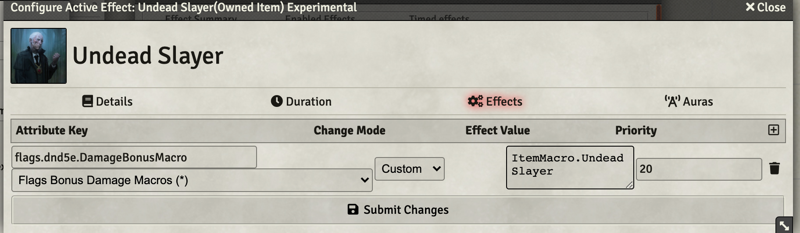

*[Back to the Table of Contents](#abilities-in-this-repo)*

---

### **Whispers of Madness**

Implements the [Allip](https://www.dndbeyond.com/monsters/93770-allip) ability that forces saving throws from up to three targets.  Undead and Constructs are immune.  Failed saves result in some damage and being forced to attack a target of the Allip's choice.

This item also runs a runeVFX on the affected tokens. 

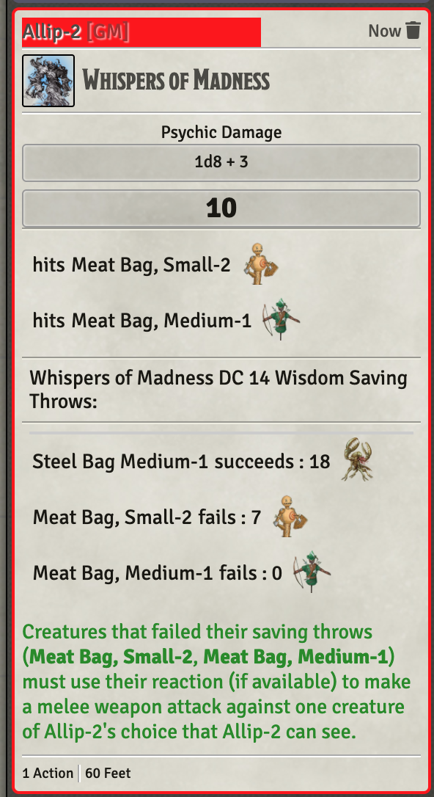

*[Back to the Table of Contents](#abilities-in-this-repo)*

---

### **Wooden Sword**

Home brewed ability for Arabelle that applies one or two debuffing affects for one round when she hits. 

*[Back to the Table of Contents](#abilities-in-this-repo)*

---