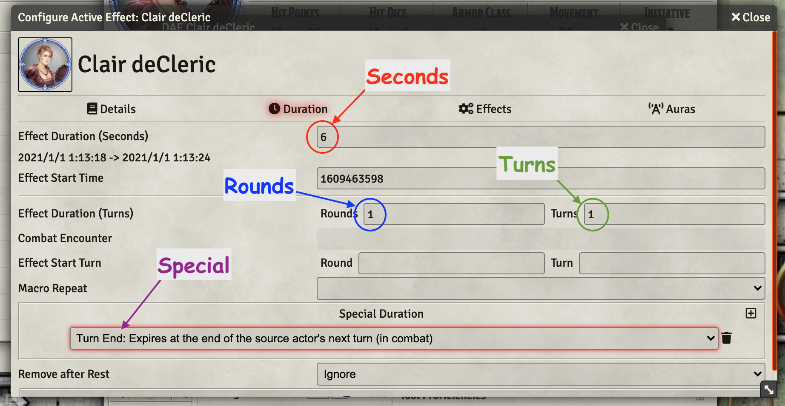
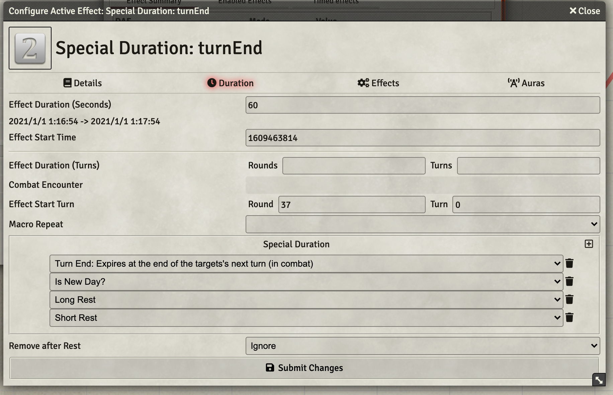

# Effect Duration
I've spent more time than I'd like to admit puzzling over the multiple ways to set the duration for an Active Effect (I'm using Midi-QoL, About Time, and quite a few other modules) and what they mean. This document is intended to hold what I have learned about these settings and how I can use them.

In my setup I see four different ways to specify the duration of an effect:

1. [Seconds (6 per combat round in D&D 5E)](#effect-duration---seconds)
1. [Rounds (combat rounds)](effect-duration---rounds)
1. [Turns (combat turns?)](effect-duration---turns)
1. [Special](#special-duration)

The following image shows where the four settings appear on the DAE Duration screen. Each of the settings can terminante an effect, with the first one to terminate a given effect having effect.  Knowing what each means should be really helpful in picking the correct settings.

## Why is Duration Interesting?

The duration on an active effect, in my experience is interesting for two major reasons:

1. Allow automated removal of effects at the appropriate time,
1. Allow display of effect icon on tokens in the scene.

Diving into the deep end of automation as I have been, having effects automatically expire at the *right* time is super helpful.  It relieves the players from needing to record keep the duration and remember when to remove them. 

The second reason I only discovered after considerable head scratching when effects that I knew were on a token just refused to appear on the display of the scene.  A *normal* duration (seconds, rounds, turns) must be set for an effect to appear.  *Permanenent* effects defined via DAE *work* (i.e. their effects are effective) but they don't appear on screen which makes perfect sense after reflection, but confused me at first. 

## Seconds vs Rounds vs Turns

This is a terminology thing that tripped me up, so I'll review it before continuing.

**Seconds** represent the passage of time.  The game operates in seconds, not hours:minutes:seconds, or any other convient (for humans) measurement and can get to be large numbers.  An hour long effect is 3,600 seconds not one hour. For this metric to be useful, one or more modules that manage time need to be active.  I use [times-up](https://gitlab.com/tposney/times-up) in my game, others are available. 

In the D&D 5E system a round is defined to be exactly 6 seconds allowing rounds to be used as a proxy for the passage of time.  There are some difference between seconds * 6 and rounds in regards to duration which I'll address in following sections.

**Rounds** are a construct generally applied to combat.  In D&D 5E, a round is 6 seconds which allows all of the particpants a sequential opportunity to act.  Generally the particiapnts have a fixed sequence within a round.  

**Turns** define individual participants chance to perform normal actions.  There are typically as many turns in a round as there are participants.  In D&D 5E all of the turns are viewed as happening in the time window defined by a given round.  

[*Back to the top*](#effect-duration)

## Effect Duration - Seconds
An effect defined to expire in X seconds will generally do exactly that.  

This is mostly useful to deal with spells that may expire outside of combat in a game setup that moves time along outside of combat rounds. It can also be important in other game systems, which I will be ignoring other than noting a possible application.

This duration triggers removal of an effect when at least as much time has passed as defined on this effect.  My game clock *ticks* a round of time (6 seconds, D&D 5E) at the top of each round. So, anything that would be removed on time is removed at the beginning of the appropiate round.  This is a bit tricky to use and generally fits D&D 5E rather poorly, so I want to avoid depending on it, though I do rather like it in support of [Special Duratuions](special-duration).

An example: Duration is seconds set to 13 during round 1 of a combat will result in the effect being removed at the start of round 4, that is 3 rounds later.  Any fraction of a round defined in seconds ends up raounding up.

Below is a function that sets a rather pointless dynamic active effect.

~~~javascript
async function durationSeconds(dur, iconNum) {
    console.log("Setting Time Based Effect");
    let effectData = [{
        label: `${dur} Seconds`,
        icon: `Icons_JGB/Markers/Numbers_Transparent_Grey_Background/${iconNum}.png`,
        origin: LAST_ARG.uuid,
        disabled: false,
        duration: { seconds: dur, startTime: game.time.worldTime },
        changes: [
            { key: `flags.gm-notes.notes`, mode: CUSTOM, value: `${dur} Seconds Duration`, priority: 20 },
        ]
    }];
    await MidiQOL.socket().executeAsGM("createEffects", { actorUuid: aActor.uuid, effects: effectData });
}
~~~

[*Back to the top*](#effect-duration)

## Effect Duration - Rounds

This is the meat and potatoes of the basic duration settings.  It defines the number of rounds that an effect will remain active.  It doesn't do anything useful (that I know of) outside of combat. 

When this setting is used, the effect expires at the start of the actor-who-was-active's Nth turn after it is set.  So an effect marked with 3 rounds of duration will be active for the remainder of the current round and expire at the start of the invoking actor's 3rd turn in the future. 

A spell that lasts 1 minute, may well want to be defined as lasting 10 rounds and not 60 seconds if it is important that it expire at the start of the triggering actor's turn.

Below is a function that sets a rather pointless dynamic active effect.

~~~javascript
async function durationRounds(rnds, iconNum) {
    console.log("Setting Round Based Effect");
    const GAME_RND = game.combat ? game.combat.round : 0;
    let effectData = [{
        label: `${rnds} Rounds`,
        icon: `Icons_JGB/Markers/Numbers_Transparent_Grey_Background/${iconNum}.png`,
        origin: LAST_ARG.uuid,
        disabled: false,
        duration: { rounds: rnds, startRound: GAME_RND },
        changes: [
            { key: `flags.gm-notes.notes`, mode: CUSTOM, value: `${rnds} Round Duration`, priority: 20 },
        ]
    }];
    await MidiQOL.socket().executeAsGM("createEffects", { actorUuid: aActor.uuid, effects: effectData });
}
~~~

[*Back to the top*](#effect-duration)

## Effect Duration - Turns

This seems to be a curious setting in my environment.  It is triggered by the number of *turns* that pass after it is defined, that is, turns of all participants in combat; or, the start of the next round of combat.  If an effect should only last through the next few actor's turns, I suppose it might be useful, but since it automatically clears at the start of the next round, it comes across as essentially useless to me, a trap for my mind that I will endeavor to avoid.

## Special Duration

Now, this is interesting and seemingly easier to use correctly.  There are a large number of special conditions implmented by the **times-up** module that strike me as super useful.  The four most directly applicable to this topic are:

1. turnEnd: "Turn End: Expires at the end of the targets's next turn (in combat)"
1. turnStart: "Turn Start: Expires at the start of the targets's next turn (in combat)"
1. turnEndSource: "Turn End: Expires at the end of the source actor's next turn (in combat)"
1. turnStartSource: "Turn Start: Expires at the start of the source actor's next turn (in combat)"

With three more that I like to think of as safety nets for effects that should expire outside of combat but that don't since I tend to not advance time rigorously at all. 

1. newDay: "Is New Day?"
1. longRest: "Long Rest"
1. shortRest: "Short Rest"

I intend to make a habit of including all three, or at least the two rest triggers on future macros.  

Below is a function that demonstrates setting a special duration with an array of triggers, followed by a screen shot of the details of the effect created.

~~~javascript
await durationSpecial("turnEnd","2");
async function durationSpecial(specDur, iconNum) {
    console.log(`Setting Special Duration ${specDur}`);
    let specialDuration = [specDur, "newDay", "longRest", "shortRest"]
    let effectData = [{
        label: `Special Duration: ${specDur}`,
        icon: `Icons_JGB/Markers/Numbers_Transparent_Grey_Background/${iconNum}.png`,
        origin: LAST_ARG.uuid,
        disabled: false,
        duration: { seconds: 60, startTime: game.time.worldTime },
        flags: { dae: { itemData: aItem, specialDuration: specialDuration } },
        changes: [
            { key: `flags.gm-notes.notes`, mode: CUSTOM, value: `Special Duration ${specDur}`, priority: 20 },
        ]
    }];
    await MidiQOL.socket().executeAsGM("createEffects", { actorUuid: aActor.uuid, effects: effectData });
}
~~~

[*Back to the top*](#effect-duration)

## Other Special Durations

There are a ton of special duration conditions.  Below is my list of them, after removing the seven already given. I have hidden the listings within groupings by type to make them a bit easier to dig through. 

<b>Actor Attacks, Hits, Reacts, Casts Spell, Does Damage</b>

~~~javascript
1Action:      "1 Action: Expires on the next action (item roll) of the character"
1Attack:      "1 Attack: Expires on the next Spell/Weapon Attack by the character"
1Attack:msak: "Melee Spell Attack: 1 Attack: Expires on the next Melee Spell Attack by the character"
1Attack:mwak: "Melee Weapon Attack: 1 Attack: Expires on the next Melee Weapon Attack by the character"
1Attack:rsak: "Ranged Spell Attack: 1 Attack: Expires on the next Ranged Spell Attack by the character"
1Attack:rwak: "Ranged Weapon Attack: 1 Attack: Expires on the next Ranged Weapon Attack by the character"
1Hit:         "1 Hit: Expires on the next Spell/Weapon hit by the character"
1Hit:msak:    "Melee Spell Attack: 1 Hit: Expires on the next Melee Spell Attack hit by the character"
1Hit:mwak:    "Melee Weapon Attack: 1 Hit: Expires on the next Melee Weapon Attack hit by the character"
1Hit:rsak:    "Ranged Spell Attack: 1 Hit: Expires on the next Ranged Spell Attack hit by the character"
1Hit:rwak:    "Ranged Weapon Attack: 1 Hit: Expires on the next Ranged Weapon Attack hit by the character"
1Reaction:    "1 Reaction: Expires after the attack that triggered the reaction is complete"
1Spell:       "1 Spell: Expires on the next spell cast (ANY spell) by the character"
DamageDealt:  "DamageDealt: Expires when the character deals damage"
None:         ""
isAttacked:   "Is Attacked: Expires if the character is attacked"
~~~

<b>Actor Rolls an Ability Check</b>

~~~javascript
isCheck:     "Expires if the character rolls:  ability check"
isCheck.cha: "Expires if the character rolls:  Charisma ability check"
isCheck.con: "Expires if the character rolls:  Constitution ability check"
isCheck.dex: "Expires if the character rolls:  Dexterity ability check"
isCheck.int: "Expires if the character rolls:  Intelligence ability check"
isCheck.str: "Expires if the character rolls:  Strength ability check"
isCheck.wis: "Expires if the character rolls:  Wisdom ability check"
~~~

<b>Actor is damaged, hit or moved</b>

~~~javascript
isDamaged:            "is Damaged: Expires if the character is damaged"
isDamaged.acid:       "is Damaged: Expires if the character is damaged: Acid"
isDamaged.bludgeoning:"is Damaged: Expires if the character is damaged: Bludgeoning"
isDamaged.cold:       "is Damaged: Expires if the character is damaged: Cold"
isDamaged.fire:       "is Damaged: Expires if the character is damaged: Fire"
isDamaged.force:      "is Damaged: Expires if the character is damaged: Force"
isDamaged.lightning:  "is Damaged: Expires if the character is damaged: Lightning"
isDamaged.midi-none:  "is Damaged: Expires if the character is damaged: No Damage"
isDamaged.necrotic:   "is Damaged: Expires if the character is damaged: Necrotic"
isDamaged.piercing:   "is Damaged: Expires if the character is damaged: Piercing"
isDamaged.poison:     "is Damaged: Expires if the character is damaged: Poison"
isDamaged.psychic:    "is Damaged: Expires if the character is damaged: Psychic"
isDamaged.radiant:    "is Damaged: Expires if the character is damaged: Radiant"
isDamaged.slashing:   "is Damaged: Expires if the character is damaged: Slashing"
isDamaged.thunder:    "is Damaged: Expires if the character is damaged: Thunder"
isHit:                "is Hit: Expires if the character is hit by any weapon/spell attack even if the weapon/spell does not deal damage"
isMoved:              "Moved: expires when the token is moved"
~~~

<b>Actor rolls a Saving Throw</b>

~~~javascript
isSave:            "Expires if the character rolls:  saving throw"
isSave.cha:        "Expires if the character rolls:  Charisma saving throw"
isSave.con: 	   "Expires if the character rolls:  Constitution saving throw"
isSave.dex: 	   "Expires if the character rolls:  Dexterity saving throw"
isSave.int: 	   "Expires if the character rolls:  Intelligence saving throw"
isSave.str: 	   "Expires if the character rolls:  Strength saving throw"
isSave.wis: 	   "Expires if the character rolls:  Wisdom saving throw"
isSaveFailure:     "Expires if the character rolls:  saving throw: Failure"
isSaveFailure.cha: "Expires if the character rolls:  Charisma saving throw: Failure"
isSaveFailure.con: "Expires if the character rolls:  Constitution saving throw: Failure"
isSaveFailure.dex: "Expires if the character rolls:  Dexterity saving throw: Failure"
isSaveFailure.int: "Expires if the character rolls:  Intelligence saving throw: Failure"
isSaveFailure.str: "Expires if the character rolls:  Strength saving throw: Failure"
isSaveFailure.wis: "Expires if the character rolls:  Wisdom saving throw: Failure"
isSaveSuccess:     "Expires if the character rolls:  saving throw: Success"
isSaveSuccess.cha: "Expires if the character rolls:  Charisma saving throw: Success"
isSaveSuccess.con: "Expires if the character rolls:  Constitution saving throw: Success"
isSaveSuccess.dex: "Expires if the character rolls:  Dexterity saving throw: Success"
isSaveSuccess.int: "Expires if the character rolls:  Intelligence saving throw: Success"
isSaveSuccess.str: "Expires if the character rolls:  Strength saving throw: Success"
isSaveSuccess.wis: "Expires if the character rolls:  Wisdom saving throw: Success"
~~~

<b>Actor rolls a Skill Check</b>

~~~javascript
isSkill:     "Expires if the character rolls:  skill check"
isSkill.acr: "Expires if the character rolls:  skill check Acrobatics"
isSkill.ani: "Expires if the character rolls:  skill check Animal Handling"
isSkill.arc: "Expires if the character rolls:  skill check Arcana"
isSkill.ath: "Expires if the character rolls:  skill check Athletics"
isSkill.dec: "Expires if the character rolls:  skill check Deception"
isSkill.his: "Expires if the character rolls:  skill check History"
isSkill.ins: "Expires if the character rolls:  skill check Insight"
isSkill.inv: "Expires if the character rolls:  skill check Investigation"
isSkill.itm: "Expires if the character rolls:  skill check Intimidation"
isSkill.med: "Expires if the character rolls:  skill check Medicine"
isSkill.nat: "Expires if the character rolls:  skill check Nature"
isSkill.per: "Expires if the character rolls:  skill check Persuasion"
isSkill.prc: "Expires if the character rolls:  skill check Perception"
isSkill.prf: "Expires if the character rolls:  skill check Performance"
isSkill.rel: "Expires if the character rolls:  skill check Religion"
isSkill.slt: "Expires if the character rolls:  skill check Sleight of Hand"
isSkill.ste: "Expires if the character rolls:  skill check Stealth"
isSkill.sur: "Expires if the character rolls:  skill check Survival"
~~~

[*Back to the top*](#effect-duration)

## Macro to Exercise Durations

I put a little macro together that applies a set of effects to the user with various expiration settings to exercise my understanding of this bit of FoundryVTT.  The code is posted on one of my other repositories:

[Demonstrate DAE Durations.js](https://github.com/Jeznar/Utility_Macros/tree/main/Demo_DAE_Durations)

---

[Link back to my Documentation Listing](README.md) 

[Link back to my Repo Listing](https://github.com/Jeznar/Jeznar/blob/main/README.md) 
