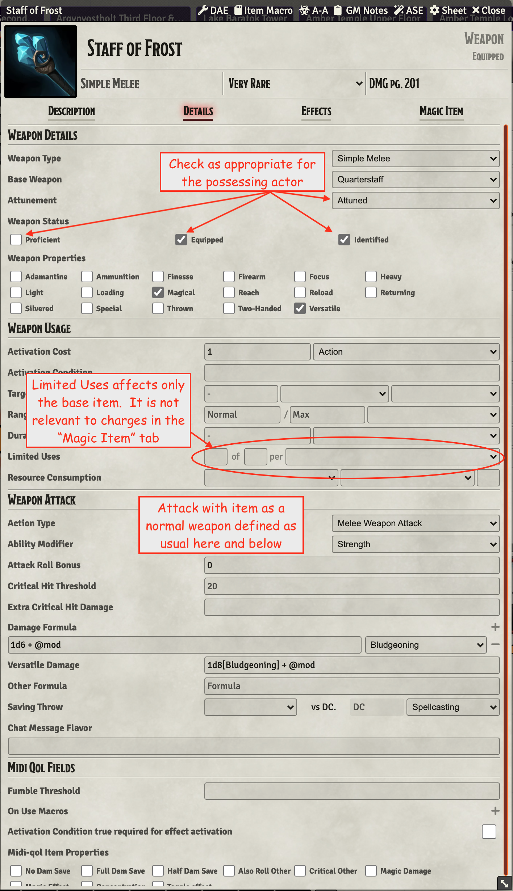
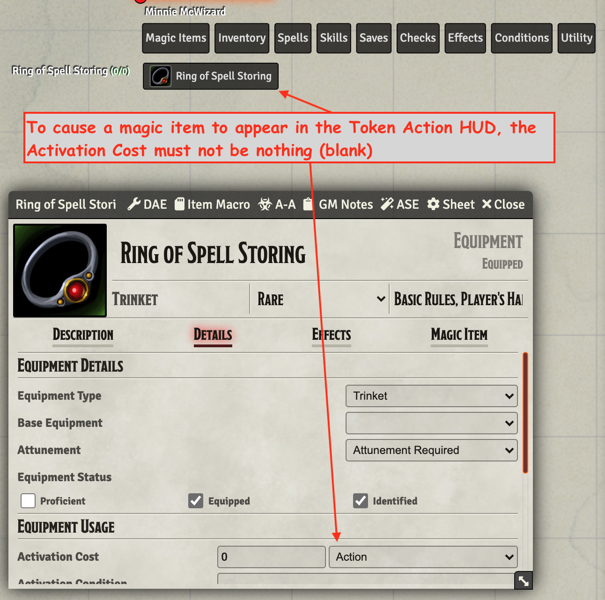
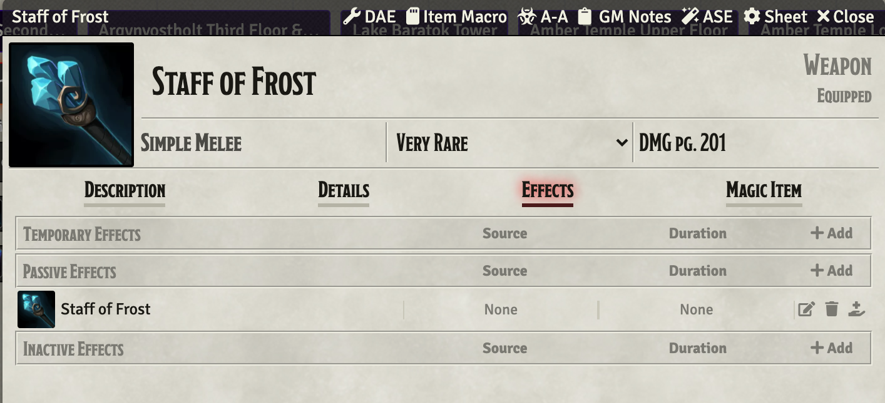
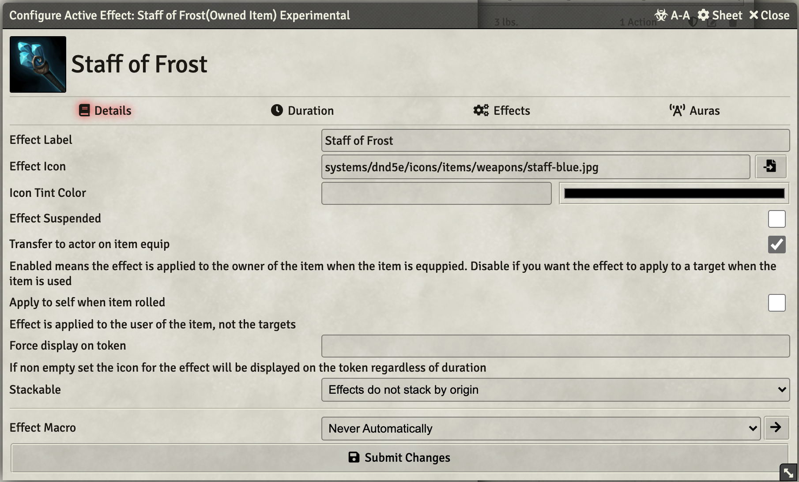
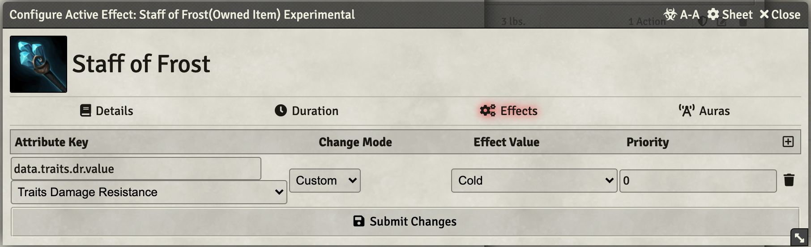
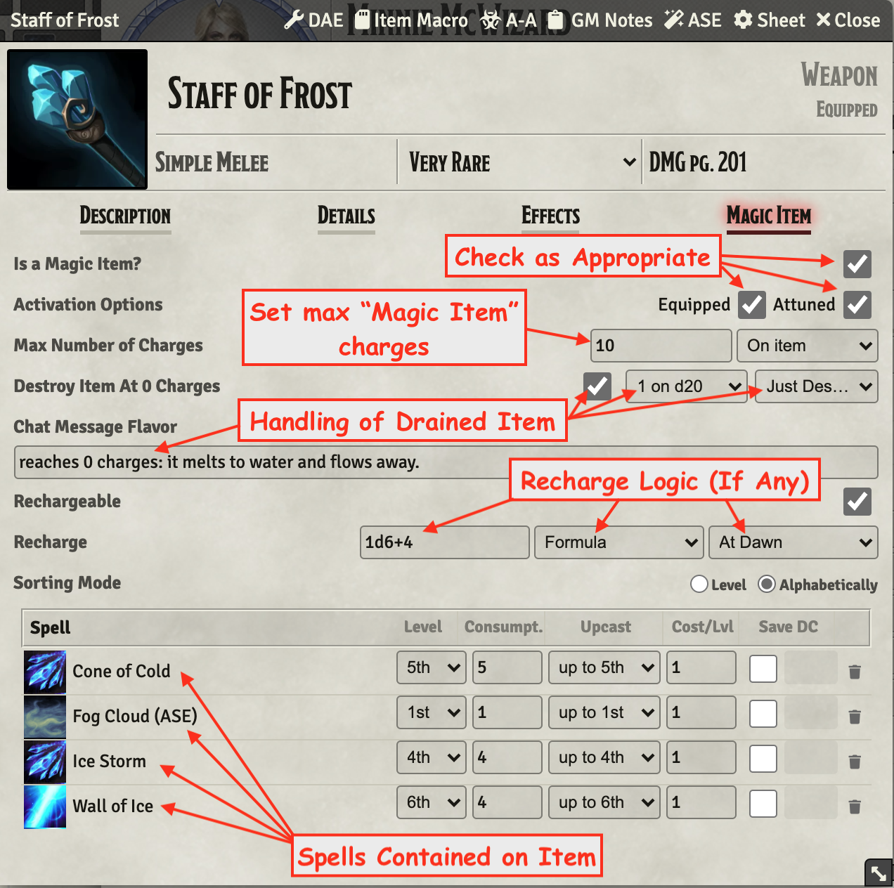
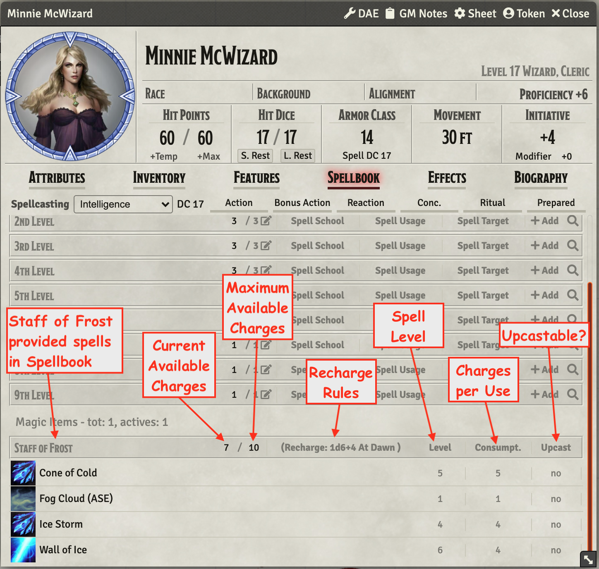
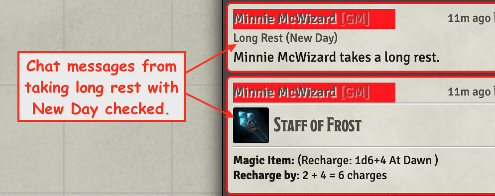

# Configuring Staff of Frost
I've done more than a bit of wrestling with items while trying to configure them as *Magic Items* for my game.  I finally decided to slow down try to understand what is happening and document it so that I can struggle less moving forward.  

Before diving it, a couple of important external sources.

The module that makes this work is [Simone's](https://foundryvtt.com/community/simone) [Magic Items](https://foundryvtt.com/packages/magicitems) module for FoundryVTT D&D 5e.

I had my understanding improved watching two YouTube videos put together by [Likely Mimics](https://www.youtube.com/c/LikelyMimics):

1. [Magic Items Module: Part 1 - FoundryVTT - Demonstration for my players](https://www.youtube.com/watch?v=2D3GddFY7Qk)
2. [Magic Items Module: Part 2 - Foundry VTT - Demonstration for my players](https://www.youtube.com/watch?v=qkw66SIfEUM)

While they were helpful, a couple elements that I found to be important were glossed over and one was wrong in what I believe is an important way.

## Setting Up the Base Item
The item I am working on is a Staff of Frost that contains a number of charges that can be used to cast spells as well functioning as a perfectly good stick that can bash creatures like a quarterstaff.  

So the first step is to build a quarterstaff based weapon that will contain the spells.  

### Description Tab 

The Description tab can be setup as the DM chooses (having no direct effect on usage of the item).  

### Details Tab

The details tab should likely have Attunement set to **Attunement Required** (though in my example I have flipped it to **Attuned**) and the weapon status boxes should be unchecked until assigned to an actor and then checked appropriately.

An important thing to know when filling out this page is that the line marked **Limited Uses** defines the use limit (charges) of the basic item item in its basic use.  In the case of the *Staff of Frost* setting this line to the seemingly obvious **10/10/Daily** settings will cause the staff to attempt to drain a charge each time it is swung in melee and has absolutely nothing to do with the spells in the **Magic Item** tab.

The rest of the details tab should be filled out appropriately for the staff when used as a melee weapon.

 
Example Details Tab

One other thing to note before moving off this tab is that the **Activation Cost** must be set to something appropriate, e.g. Action, and not left blank for the [Token Action HUD](https://foundryvtt.com/packages/token-action-hud/) Module to pick it us as an item to display in its on screen HUD.

 
Example Showing Token Action HUD Display

Example uses a Ring of Spell Storing, the difference isn't important here.

### Effects Tab

The effects tab should contain any DAE effects that are needed for the item.  In this case, damage resistance to cold is baked into the item.

 
Example Effects Tab Settings

                              

 
Example Effects DAE Details

 
Example Effects DAE Effects

### Magic Item Tab

The magic item tab is where the, dare I say it, the magic happens?  The configuration on this tab is outlined in the example embedded below.

The details on this one are important.  The charges defined on this tab have nothing to do with the charges on the items's details tab.

 
Example Magic Item Tab settings

## Using the Item

When the item is used (presumably it is equipped and attuned), a player may click a spell from the Token Action HUD or from the actor's Spellbook.  If the HUD is used, please be aware that the charge cast to cast each spell is displayed but not the charges available; for this reason I prefer using items from the spell book.

The spellbook provides information about spells from items at the bottom of its window and includes the important information such as charges available, charges to cast, recharge logic etc.  

 
Example Spellbook Information

## Recharging the Item

The item will recharge automatically based on the recharge logic setup on the [Magic Item Tab](#magic-item-tab).  In this example it happens *daily* which is trigged by a long rest with the *new day* check box checked.  It generates a pair of chat messages as shown below.

 
Example Recharge Chat Messages

---

[Link back to my Documentation Listing](README.md) 

[Link back to my Repo Listing](https://github.com/Jeznar/Jeznar/blob/main/README.md) 
