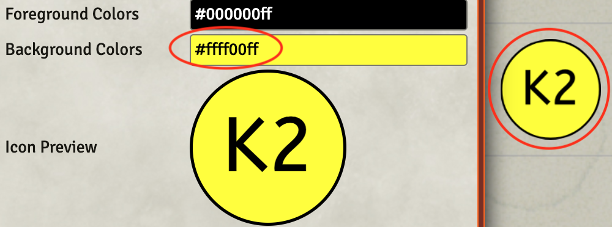
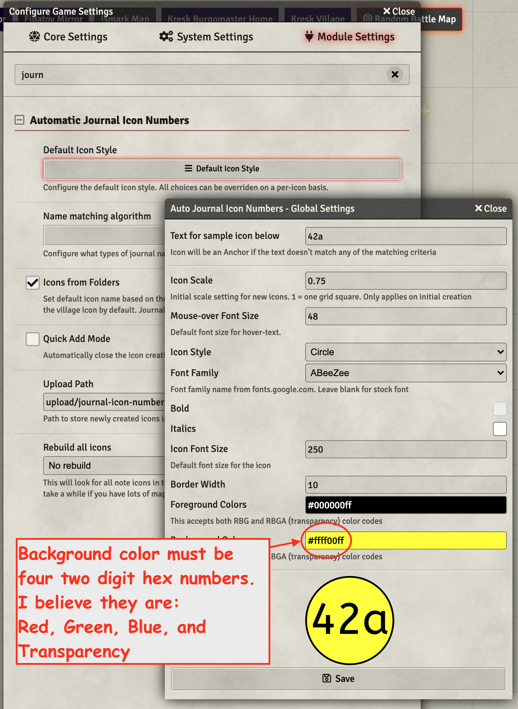

The following is a quote from [Crymic on Discord](https://discord.com/channels/562549978506199042/849048013468598272/968966845833019412), 4/27/21.

~~~
all token updates are now token.document.update()
creation now goes through: token.actor.createEmbeddedDocuments("Type", [array data]);
updates updateEmbeddedDocuments()
deletes deleteEmbeddedDocuments()
You can now pass multiple objects since it's an array. 
rolls new Roll("1d4").evaluate({async: true or false}); if you pick true, you'll need to await the roll. 
there's couple of changes to the canvas as well.
~~~

So, as in almost everything Crymic posts, there is a lot to unpack in those lines.  I need a deeper understanding, the following is my attempt at understanding each element.

## Token updates now token.document.update()

### token.update
My code has more than a few token updates.  Create_Specter.js contains an example:

~~~javascript
tToken.update({ "hidden": true });
~~~

I think the above needs to be updated to read as follows:

~~~javascript
tToken.document.update({ "hidden": true });
~~~

#### Similar issue with token.uuid reference 

I found a similar warning for MidiQOL.socket calls as shown below.  The second line clears it up.

~~~javascript
// Following line seems busted in 9.x
await MidiQOL.socket().executeAsGM("createEffects", { actorUuid: token1.uuid, effects: restrainedEffect });
// The following clears the warning
await MidiQOL.socket().executeAsGM("createEffects", { actorUuid: token1.document.uuid, effects: restrainedEffect });
// This also works and feels more correct, so I will be using this form
await MidiQOL.socket().executeAsGM("createEffects", { actorUuid: token1.actor.uuid, effects: restrainedEffect });
~~~

The first line in the above can fail quietly, no error message, no application of the effect.  

Another concern are lines like:

~~~javascript
MidiQOL.socket().executeAsGM("removeEffects",{actorUuid:pairedToken.actor.uuid, effects: [pairedEffectObj.id] });
~~~

#### Plane_Shift_Self_Only.js Contains two Instances of This

This script contains the following two lines that look to have this issue:

~~~javascript
await aToken.update({ "hidden": false });
aToken.update({ "hidden": true });
~~~

Running the script generates the following console warning:

~~~
You are calling PlaceableObject#update which has been deprecated in favor of Document#update or Scene#updateEmbeddedDocuments. Support will be removed in 0.9.0
~~~

### actor.update
I fiddled with what looks to be a similar call in *Healing_Light.js* that read as:

~~~javascript
await aToken.actor.update(resUpdate);
~~~ 

The above does not generate a warning and it worked on my test 9.x setup, so I am not going to try to *fix* this type of call

### chatmsg.update 
This type of call is not a token, but its similarity makes me wonder if it might be affected.  The following line is pretty common in my scripts for updating a chat card:

~~~javascript
await chatmsg.update({ content: content });
~~~

From observation this is not an issue.

### effect.update

Do the calls to effect.update need to be updated?  There are lots of uses similar to the following:

~~~javascript
const result = await effect.update({ 'flags.dae.specialDuration': effect.data.flags.dae.specialDuration,
                                         'origin': LAST_ARG.itemUuid });                                    
~~~

From observation this is not an issue.

### tokens.updateMany

I have a few instances of using this call, which read similarly to the following:

~~~javascript
canvas.tokens.updateMany(updates);
~~~

The above generates the following warning (and dies in 9.x)

~~~javascript
You are calling PlaceablesLayer#updateMany which has been deprecated in favor Scene#updateEmbeddedDocuments. Support will be removed in 0.9.0
~~~

need to call game.scenes.current.updateEmbeddedDocuments

That seems like another potential area needing its calls changed.

## Creation: createEmbeddedDocuments(...)

The 9.x format for this call looks like the following:

~~~javascript
token.actor.createEmbeddedDocuments("Type", [array data])
~~~

Crymic pointed out: *You can now pass multiple objects since it's an array.* I'll need to fiddle with this to get benefit, I think.

Scanning my code, it seems I have been mostly using the *new* style and should generally be ok on this one.  

Two exceptions, the first being *Tile.create(...)* calls.  This snippet is from *Cloudkill.js*

~~~javascript
let newTile = await Tile.create({
        x: templateCenter.x,
        y: templateCenter.y,
        img: "modules/jb2a_patreon/Library/1st_Level/Fog_Cloud/FogCloud_03_Regular_Green02_800x800.webm",
        width: GRID_SIZE * 8,   // 20 foot across
        height: GRID_SIZE * 8   // 20 foot tall 
    });
~~~

The second being *ChatMessage.create(...)* calls, quite a few of them, but the most often used from within *jez-lib.js*

~~~javascript
await ChatMessage.create({
          speaker: speaker ? ChatMessage.getSpeaker(speaker) : null,
          type: CONST.CHAT_MESSAGE_TYPES.OTHER,
          content: chatCard
      });
~~~

## Update: updateEmbeddedDocuments(...)

I have a fairly large number of calls that look like (this one from Etherealness.js)

~~~javascript
await aToken.update({ "hidden": false });
~~~


## Delete deleteEmbeddedDocuments(...)

Lots of calls to *.delete(...)* that may be affected here.  One example from *Toggle_Flanking_1.0.s*

~~~javascript
await existingEffect.delete();
~~~

## Roll now requires async true/false
Crymic pointed out, rolls needs to specify async:false or be awaited. 

~~~javascript
new Roll("1d4").evaluate({async: true or false}); 
~~~

Lines like the following from *Howling Babble* are going to fail with damageRoll getting an unfulfilled promise, or perhaps other error condition. 

~~~javascript
// The line below will fail
let damageRoll = new Roll(`${DAM_DICE}+${jez.getCastMod(aToken)}`).evaluate();
// Following line is a working version
let damageRoll = new Roll(`${DAM_DICE}+${jez.getCastMod(aToken)}`).evaluate({async:false});
~~~

## Couple of changes to the canvas

I have no idea what these are, so I suppose I will bump into them. 

## Sequencer Updates

In testing I noticed the following warning: 

~~~javascript
Sequencer | Window | reachTowards - This method has been deprecated, please use .stretchTo() instead
~~~

This was generated by *Healing_Light.js* which contained the following line:

~~~javascript
.reachTowards(token1)
~~~

Changing it to this, resolved the warning:

~~~javascript
.stretchTo(token1) // Replacement for .reachTowards
~~~

My GitRepo contains the following problem children for this case:

.png)
 
The above have been fixed.  

## New Method to Roll Damage

This is from [Crymic 4/28/22](https://discord.com/channels/562549978506199042/849048013468598272/969364807423782922)

> If you're rolling damage, should switch to 
> ```new game.dnd5e.dice.DamageRoll("1d4", {},  {critical: true}).evaluate({async:false});```
> 
> It'll automatically roll the correct number of dice.

## .createEmbeddedEntity Throws an Error

[Freeze on Discord](https://discord.com/channels/170995199584108546/699750150674972743/928018172865552434)

> createEmbeddedEntity is deprecated, use createEmbeddedDocuments and put [ ] around effectData
> also lose user: game.user._id (it does nothing), or make it user: game.user.id still doesn't really do anything but at least gives the correct id and not undefined 🙂 in your chatmessage object

These cases need to be moved to use ```.createEmbeddedDocuments("Type", [array data])```.

## Additional Issues

### ChatMessage.create

Investigate: ```ChatMessage.create``` for ```user:``` which seemingly do nothing.

### ATL 

ATL uses a new format for its flags.  Any script that has settings of the form:

~~~javascript
changes: [
    { key: "ATL.dimLight", mode: UPGRADE, value: 40, priority: 20 },
    { key: "ATL.brightLight", mode: UPGRADE, value: 20, priority: 20 },
    { key: "ATL.lightColor", mode: OVERRIDE, value: color, priority: 30 },
    { key: "ATL.lightAlpha", mode: OVERRIDE, value: 0.25, priority: 20 },
]
~~~

Should be more like this:

~~~javascript
{ key: "ATL.light.dim", mode: UPGRADE, value: 40, priority: 20 },
{ key: "ATL.light.bright", mode: UPGRADE, value: 20, priority: 20 },
{ key: "ATL.light.color", mode: OVERRIDE, value: color, priority: 30 },
{ key: "ATL.light.alpha", mode: OVERRIDE, value: 0.05, priority: 20 },
~~~

Notice the tiny alpha value now used to prevent blowing out the scene. 

# Apparent Module Issues

## Compendium Folders

When I have Compendium Folders active and I close certain items' sheet that was imported from a compendium folder (e.g. Dagger, JSON of that item, disguised as a .txt file, attached) a big fat error message pops in the log.

[fvtt-Item-dagger.json.txt](Attachments/fvtt-Item-dagger.json.txt)

~~~javascript
Uncaught (in promise) TypeError: Cannot read properties of undefined (reading 'folders')
[Detected 2 packages: compendium-folders, system:dnd5e]
    at Function.importFolderData (fic-folders.js:1509)
    at fic-folders.js:460
    at Function._call (foundry.js:294)
    at Function.callAll (foundry.js:253)
    at TokenDocument5e._onUpdateTokenActor (foundry.js:19244)
    at TokenDocument5e._onUpdate (foundry.js:19140)
    at ClientDatabaseBackend.callback (foundry.js:10300)
    at foundry.js:10283
    at Array.map (<anonymous>)
    at ClientDatabaseBackend._handleUpdateEmbeddedDocuments (foundry.js:10283)
    at ClientDatabaseBackend._updateEmbeddedDocuments (foundry.js:10163)
    at async Function.updateDocuments (document.mjs:373)
    at async TokenDocument5e.update (document.mjs:456)
    at async TokenDocument5e.updateActorEmbeddedDocuments (foundry.js:18996)
    at async Function.updateDocuments (document.mjs:373)
    at async Item5e.update (document.mjs:456)
    at async ItemSheet5e._onSubmit (foundry.js:3853)
    at async ItemSheet5e._onSubmit (sheet.js:543)
    at async ItemSheet5e.submit (foundry.js:4136)
    at async ItemSheet5e.close (foundry.js:4108)
    at async ItemSheet5e.close (foundry.js:4220)
~~~

Sometimes, when I make additions to the dagger's description, both the above error and the following pop into the log:

~~~javascript
contexts.ts:164 Uncaught TypeError: Cannot read properties of undefined (reading 'top')
[Detected 1 package: quick-insert]
    at new TinyMCEContext (contexts.ts:164)
    at _x.<anonymous> (tinyMCEPlugin.ts:9)
    at rx.fire (tinymce.min.js:9)
    at _x.fire (tinymce.min.js:9)
    at ax (tinymce.min.js:9)
    at Object.e (tinymce.min.js:9)
    at ui.executeHandlers (tinymce.min.js:9)
    at HTMLBodyElement.o (tinymce.min.js:9)
~~~

Changes made appear to be entered correctly.  I've not seen any other impact to the game from this, other than polluting the log with error messages.  

### Isolated Testing

When I turn off all modules, except Compendium Folders, a warning appears about lib-wrapper being missing and the troublesome items generate a smaller, but similar error message.

Activating lib-wrapper generates, what appears to be the same error message as when all modules were active for my trouble making Dagger:

~~~javascript
Uncaught (in promise) TypeError: Cannot read properties of undefined (reading 'folders')
[Detected 2 packages: compendium-folders, system:dnd5e]
    at Function.importFolderData (fic-folders.js:1509)
    at fic-folders.js:460
    at Function._call (foundry.js:294)
    at Function.callAll (foundry.js:253)
    at TokenDocument5e._onUpdateTokenActor (foundry.js:19244)
    at TokenDocument5e._onUpdate (foundry.js:19140)
    at ClientDatabaseBackend.callback (foundry.js:10300)
    at foundry.js:10283
    at Array.map (<anonymous>)
    at ClientDatabaseBackend._handleUpdateEmbeddedDocuments (foundry.js:10283)
    at ClientDatabaseBackend._updateEmbeddedDocuments (foundry.js:10163)
    at async Function.updateDocuments (document.mjs:373)
    at async TokenDocument5e.update (document.mjs:456)
    at async TokenDocument5e.updateActorEmbeddedDocuments (foundry.js:18996)
    at async Function.updateDocuments (document.mjs:373)
    at async Item5e.update (document.mjs:456)
    at async ItemSheet5e._onSubmit (foundry.js:3853)
    at async ItemSheet5e._onSubmit (sheet.js:543)
    at async ItemSheet5e.submit (foundry.js:4136)
    at async ItemSheet5e.close (foundry.js:4108)
    at async ItemSheet5e.close (foundry.js:4220)
~~~

### Uninformed Speculation

Perhaps the problem is something that is *polluting* the data structure of existing items, perhaps those that were pulled from a compendium in (or not in a folder).  The problem appears to have no impact other than tossing an error message, but that is worrisome and justifies my disabling the module (sadly, as I like what it does).

## Automatic Journal Numbers

Sometime during my upgrade to Foundry 9.256 from 8.9, the **Automatic Journal Numbers** module stopped popping customized symbols for notes onto my scenes.  I noticed the following warning on the console as I drop notes onto the map:

~~~javascript
jquery.min.js:2 The specified value "" does not conform to the required format.  The format is "#rrggbb" where rr, gg, bb are two-digit hexadecimal numbers.
index.js:105 null
~~~

Upon investigation, I noticed that my typical **Background Colors** were set to ```#ffff00``` as shown in the screen shot below. 


This appears to drive the warning I observed and results in a map not appearing with the default *book* icon instead of the customized image. 

I discovered this could be corrected by adding another two digit hex number as shown for the foreground color.  In earlier versions, these final two characters seemingly did nothing and were, from observation, optional.  Now they appear to control opacity and are required. 

Also, curiously, the warning that is generated specifies the format as a 6 place hexadecimal value.  This is wrong, and likely the bug that should be fixed.

Changing to 8 characters fixed my problem:



I have updated my default note format to make this a non-issue for my games.



## DnD5e Helpers / Long Rest Hit Die Healing for D&D5e

On load, I get a pop up warning and a console message telling me the following:

~~~javascript
libWrapper-notifications.js:90 [W] libWrapper: Potential conflict detected between module DnD5e Helpers and module Long Rest Hit Die Healing for D&D5e.
Detected non-libWrapper wrapping of 'CONFIG.Actor.documentClass.prototype.longRest' by module dnd5e-helpers. This will potentially lead to conflicts.
~~~

As I read that, the module **libWrapper**, is trying to warn me of a potential conflict between **DnD5e Helpers** and **Long Rest Hit Die Healing for D&D5e**.  I don't actually see a negative impact in my game from this, but I may just not have figured out where it is.  

Since libwrapper seems to be pointing to **DnD5e Helpers**, I am reporting it as an issue for that module. 


