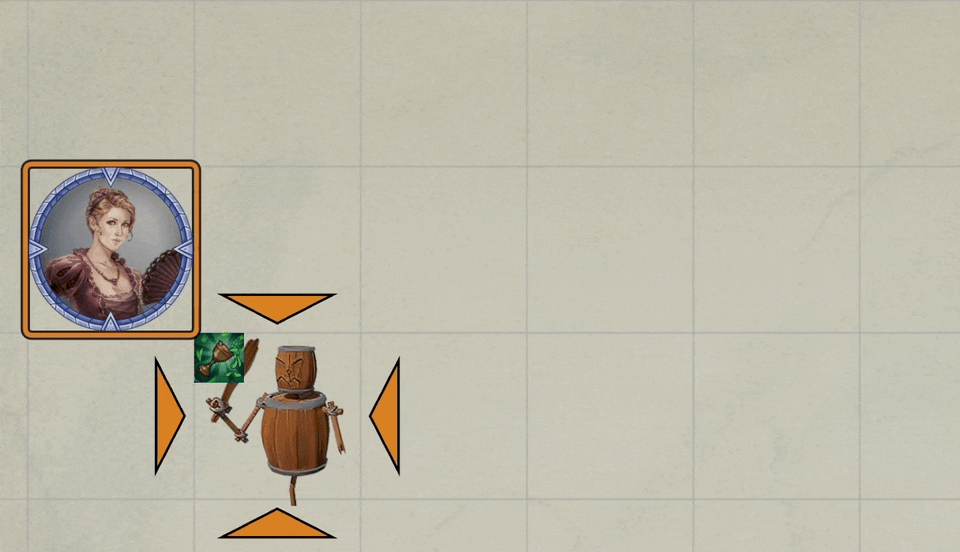

# Vicious Mockery via World Macro

Yesterday on discord in [roll20's macro-polo channel](https://discord.com/channels/170995199584108546/699750150674972743/965703145076437013), I asked about how to have a chat bubble of dynamically created text appear on my current scene spoken via a macro from one of the actors (actually token).  I received helpful input from:

- **Morthallion**, 
- **Crymic** and, 
- **Freeze**

I appreciate all of their inputs and help.  As a result of their help, I was able to craft the Vicious Mockery macro that I wanted to have.  

## First Attempt

After a short bit of noodling, **Morthallion** gave me the following code snippet that seemed to work well:

~~~javascript
let mockery = "Some witty general purpose insult"
let theBubble = new ChatBubbles();
await theBubble.say(tokenD, mockery, true);   
~~~

The above, when inserted in **Crymic's** [Vicious Mockery](https://www.patreon.com/posts/vicious-mockery-47900003) macro popped the intrusive chat bubble that I generally dislike but that was perfect for this use case. 

**Freeze** chimed in with a cleaner way to write the above code:

~~~javascript
canvas.hud.bubbles.say(tokenD, mockery, true)
await theBubble.say(tokenD, mockery, true);   
~~~

This worked great on my view of the world.

Then he burst my *bubble* pointing out that the chat bubble created by that code only shows on the client that ran the code -- Boo!   This approach was a failure.

## Need a World Script

Fortunately, Freeze quickly added *I can whip up a way that does do it, I think...but it would require a world script*

Well, not long after Freeze posted the following code which he said would do the job:

~~~javascript
async function bubbleForAll(tokenId, message, emote, push=false){
    if ( push ) {
        game.socket.emit(`world.${game.world.id}`, { action: "displayBubble", tokenId, message, emote });
    }
    const token = canvas.tokens.get(tokenId);
    await canvas.hud.bubbles.say(token, message, emote);
}
Hooks.on("ready", () => {
    game.socket.on(`world.${game.world.id}`, request => {
        if ( request.action === "displayBubble") {
            bubbleForAll(request.tokenId, request.message, request.emote);
        }
    });
});
~~~

He then added *as long as you put the name of the file in "scripts": ["name_of_worldscript.js"],
in the world.json and check if socket: true*

Fortunately, he patiently walked me through my total failure to understand what he had just said.

## Installing World Script

This section walks through the my steps to add a world script.

### Add the Script file to the World

The script that is to be used needs to be placed somewhere in world's data where it will be referred to in a later step.  For me, for my world called *travels-in-barovia*, I choose to put it here: 

~~~
data/worlds/travels-in-barovia/macros/BubblesForAll.js
~~~

Where:

- **data** is the root of my FoundryVTT data (stored locally, because I serve the game locally),
- **travels-in-barovia** is the name of my game world and is pre-existing directory,
- **macros** is a sub-directory created when I imported this game from roll20
- **BubblesForAll.js** is the file name of the file that contains Freeze's code

### Add Link to Script in world.json

The next step was, to me, a bit unsettling.  I needed to add a reference to the script that I had added to the world.json.  

I already knew that json is more than a bit picky and not forgiving of errors, so my first step was to make a backup copy of: `javascript
data/worlds/travels-in-barovia/world.json` in anticipation of me foobar'ing the file.

The relevant portion of the file that I needed to edit, when I opened it was:

~~~json
  "compatibleCoreVersion": "1.0.0",
  "scripts": [
    "templates/roll20-templates.js"
  ],
  "esmodules": [],
~~~

I needed to carefully add the needed reference so that it would read as follows:

~~~json
  "compatibleCoreVersion": "1.0.0",
  "scripts": [
    "templates/roll20-templates.js",
    "macros/BubbleForAll.js"
  ],
  "esmodules": [],
~~~

The trailing comma on the line before the new file is important (and easy to overlook)!

The file reference must point at the script file created.  It can be in an arbitrary subdirectory.  I dropped mine into macros which had been created on world import.

### Restart Game World (Reload Clients)

After that is done, it is time to restart the game world, **RESTART!** (not reload).  Look on the console for any error messages and give the macro a try.  Oh, yes, also need any previously connected clients to reload. 

## Give It a Spin

I added a call to `bubbleForAll` to my copy of Crymic's code, the relevant portion shown below...

~~~javascript
// COOL-THING: Draw a text message from a roll table
let tableName = "Mockeries";
let table = game.tables.getName(tableName);
jez.log("table", table)
let damageType = "psychic";
let mockery = "";
if (table) {
    let roll = await table.roll();
    mockery = roll.results[0].data.text;
} else {
    mockery = "Now go away or I shall taunt you a second time-a!";
}
// Call to my library function to generate a formatted chat card
jez.postMessage({color:"purple", fSize:16, icon:tokenD.data.img, 
    msg:mockery, title:`${tokenD.name} speaks mockingly...`, token:tokenD})
// COOL-THING: Generate a chat bubble on the scene, using a World script!  
bubbleForAll(tokenD.id, mockery, true, true)
~~~

...and voila, it worked! (After some debugging to find my errors which I have, hopefully, omitted.)

# Victory

At this point I have a macro that pops a bubble on all of may attached clients, exactly what I wanted.  Thank you to my three, perhaps unknowing co-conspirators: **Morthallion**, **Crymic** and,  **Freeze**, especially Freeze who walked my ignorant butt through this process to success.