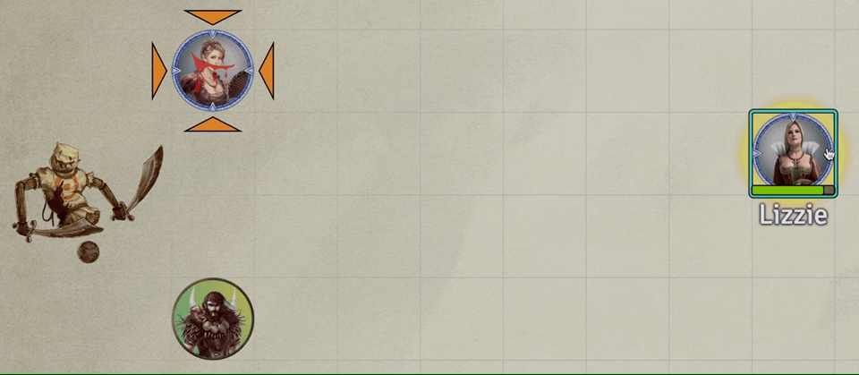
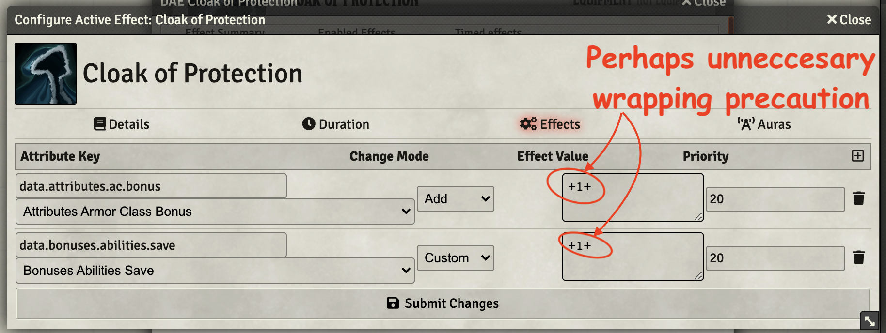
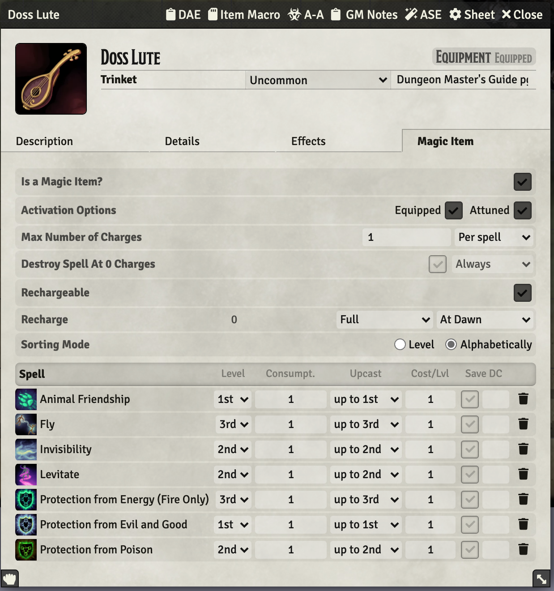
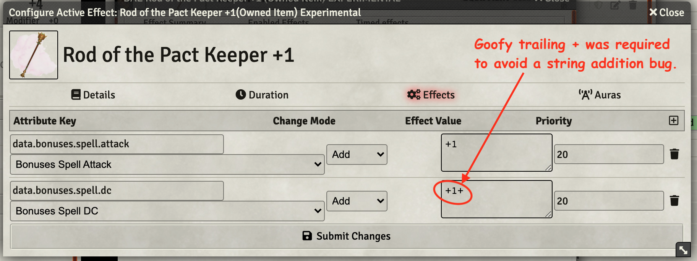
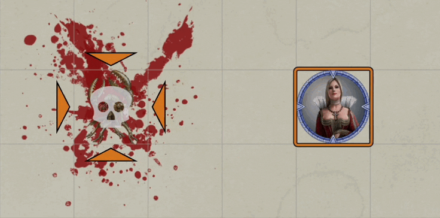
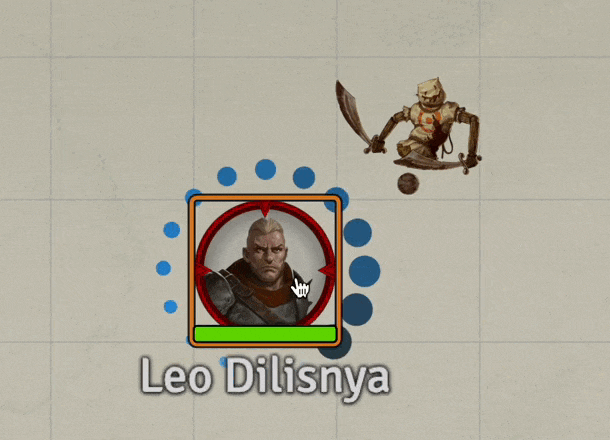
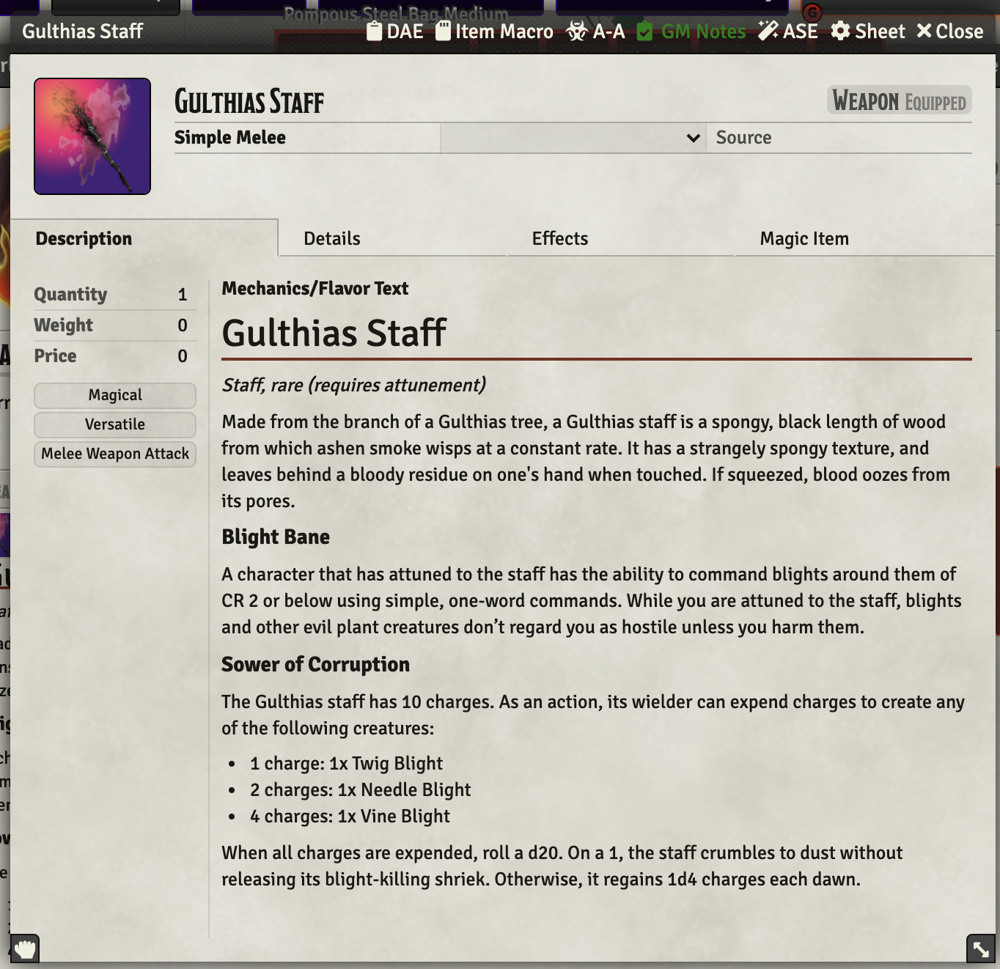
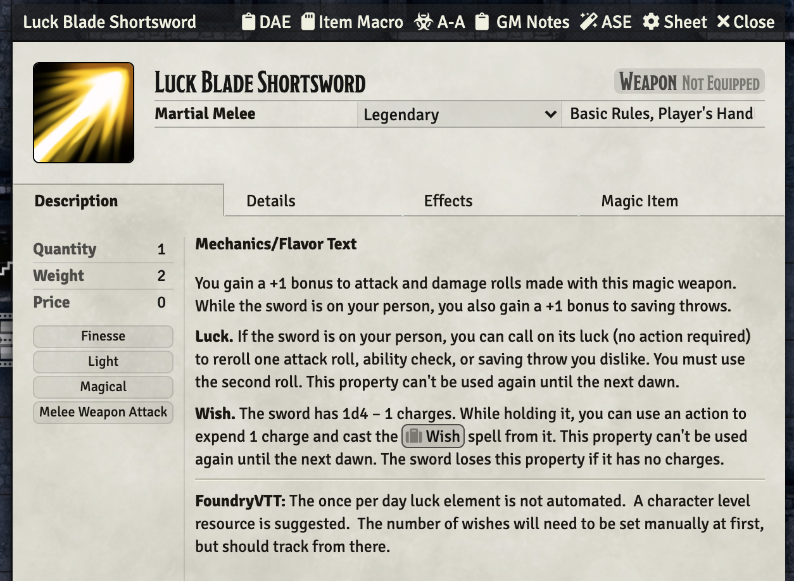
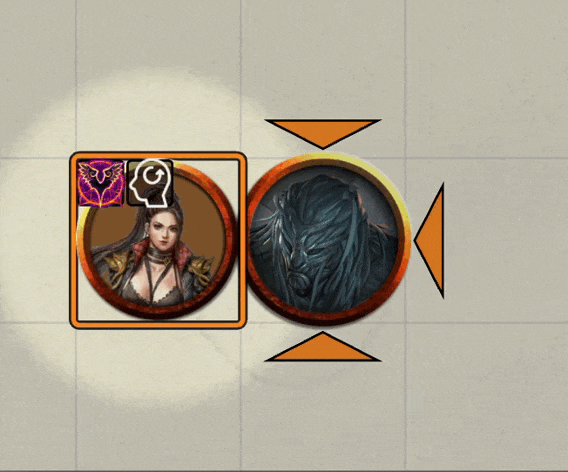

# Items and Things
This repo holds item macros and such.  Mostly, but perhaps, not entirely magic items.

[Link back to my Repo Listing](https://github.com/Jeznar/GitRepo)

---

## Contents of this Repo

Since there should eventually be a enourmous number of things in this repo, I have broken it up into subdirectories.  I'll keep all the README information in this file until and if there gets to be enough to warrent breaking them up like I have for spells.

* [Components](#components)
* [Items](#items)
* [Potions](#potions)
* [Weapons](#weapons)

---

## Components

Components for spells that can be used as required items.

* **[Diamond](Components/Diamond)** 300gp worth of diamonds for use of [Revivify](../Spells/3rd_Level#revivify). 

---

## Items

This is a generic catch all for things that don't fit into other categories.

* [Cloak of Protection](#cloak-of-protection)
* [Daern's Instant Fortress](#daerns-instant-fortress)
* [Doss Lute](#doss-lute)
* [Icon of Ravenloft](#icon-of-ravenloft)
* [Helm of Brilliance](#helm-of-brillance)
* [Rod of the Pact Keeper](#rod-of-the-pact-keeper)

---

### **Icon of Ravenloft**

This item is a Curse of Strahd it is described as follows:

> *Wondrous item, legendary (requires attunement by a creature of good alignment)*
> 
> The Icon of Ravenloft is a 12-inch-tall statuette made of the purest silver, weighing 10 pounds. It depicts a cleric kneeling in supplication.
> 
> The icon was given too Strahd by the archpriest Ciril Romulich, an old family friend, to consecrate the castle and its chapel.
> 
> While within 30 feet of the icon, a creature is under the effect of a  **Protection from Evil and Good** spell against fiends and undead. Only a creature attuned to the icon can use its other properties.4
> 
> **Augury.** You can use an action to cast an  Augury spell from the icon, with no material components required. Once used, this property can’t be used again until the next dawn.
> 
> **Bane of the Undead.** You can use the icon as a holy symbol while using the Turn Undead or Turn the Unholy feature. If you do so, increase the save DC by 2.
> 
> **Cure Wounds.** While holding the icon, you can take an action to heal one creature that you can see within 30 feet of you. The target regains 3d8 + 3 hit points ( Cure Wounds@3rd level, unless it is an undead, a construct, or a fiend. Once used, this property can’t be used again until the next dawn.

My implementation does the following for those features:

1. VFX indicates aura but does not automated the effects. 
1. Augury is added as a once a day spell.
1. Bane of Undead is not automated (at all)
1. Cure wounds is added as a once per day ability.

DAE and Active Auras are essential to this one. 

*[Back to the Contents of this Repo](#contents-of-this-repo)*

___

### **Cloak of Protection**

This item simply adds a DAE passive, permanent effect to an actor who has it equipped boosting AC and saves by one.

It is implemented with a rather ugly `+1+` on the DAE effects sheet.  This seems to avoid the possibility of string concatenation which could result in something like `11d4` or `1d41` being added when a user of this item is blessed.

*[Back to the Contents of this Repo](#contents-of-this-repo)*

___

### Daern's Instant Fortress

This is just an item description.  Nothing is automated.

*[Back to the Contents of this Repo](#contents-of-this-repo)*

___

### **Doss Lute**

Instrument of the Bards!   Just configured to provide spells to the attuned user.  The Magic item configuration page is important on this one.

*[Back to the Contents of this Repo](#contents-of-this-repo)*

___

### Helm of Brilliance

This is a not baked implementation. Most everything needs manual effort.

*[Back to the Contents of this Repo](#contents-of-this-repo)*

---

### Rod of the Pact Keeper

This item is partially automated.  It handles the +1 to attack and save DC, though, it applies the bonus to all spells not just warlock abilities.  It does not check for the user being a warlock.

It can be *used* to drain the charge bußt the spell slot needs to be manually recovered.

Also, I bumped into the old string addition problem and had to add a trailing plus after the bonus value as shown below.

*[Back to the Contents of this Repo](#contents-of-this-repo)*

---

## Potions

Potion Items as they are created and added should be tagged into this listing.

* [Alchemy Jug](#alchemy-jug)
* [Greater Healing](#greater-healing)
* [Poison](#poison)

### **Alchemy Jug**

No automation, just a note on FoundryVTT usage.

*[Back to the Contents of this Repo](#contents-of-this-repo)*

### **Greater Healing**

Potion performs healing and will consume a usage (assuming check box remains checked(.  Also runs a simple VFX on the imbiber. 

*[Back to the Contents of this Repo](#contents-of-this-repo)*

### **Poison**

This macro inflicts 3d6 of poison damage and applies a poison effect that does damage on each turn of the target (on failures).  Each round the save may be repeated at the end of the turn. It does 3d6 the first round, then 2d6, then 1d6, then the effect terminates if still active. 

The setup of the DAE effect on the item is essential to this macro.  Of particular note, the save DC myst be the first token in the Effect Value field (see the included screen shot).

*[Back to the Contents of this Repo](#contents-of-this-repo)*

___

## Weapons

Weapon Items crafted for the game get listed here

* [Blood Staff](blood-staff)
* [Gulthias Staff](gulthias-staff)
* [Treebane](#treebane)

---

### **Blood Staff**

This is the implementation of a very campaign specific item (with a mild curse).

**Blood Staff of Kavan** -- 
*Weapon (quarterstaff, rare (requires attunement)*

Kavan was a ruthless chieftain whose tribe lived in the Balinok Mountains centuries before the arrival of Strahd von Zarovich. Although he was very much alive, Kavan had some traits in common with vampires: he slept during the day and hunted at night, he drank the blood of his prey, and he lived underground. In battle, he wielded a staff stained with blood. His was the first blood staff, a weapon that drains life from those it kills and transfers that life to its wielder, imbuing that individual with the stamina to keep fighting.

When Attuned and equipped, provdes a number of passive bonses:

* +1 to Spell Hit Rolls *(DAE Effect)*
* +1 to Spell Saving Throw DCs *(DAE Effect)*
* +1 to Knowledge Nature Checks *(DAE Effect)*
* +1 to Survival Skill Checks *(DAE Effect)*
* Add proficency bonus to innate heal such as Healing Light, Second Wind, etc. *(embedded in my Healing Light macro)*
* When you hit with a spell attack using this magic staff as a focus and reduce the target to 0 hit points, you gain 2d6 temporary hit points. *(seperate ability*

The item also carries a curse once attuned, the creature:

* always looks a bit dirty and dishelved, rather like they had slept in the woods and hadn't bathed in days,
* they carry a subtle scent of fresh blood.

The main staff abilities are implmented using DAE effects.  The healing boost I have already baked into healing light (since that is what I need for my campaign). The temp HP effect is implmented by a seperate item, **Blood Staff Soul Drain**, which is powered by an onUse ItemMacro.

**Blood Staff Soul Drain** requires the user to target a zero health token and fire the ability.  It does not check to see what caused the death, that is left up to the players.  It does run a decent looking VFX.

---

### **Dawn Star**

This is a magical morning star created for *Leo Dilisnya* as defined in the *Interactive Tome of Strahd* available on [DMs Guild](https://www.dmsguild.com/product/301867/The-Interactive-Tome-of-Strahd?term=tome+of+strahd).

The weapon is magical (the magic box is ticked) does an extra burst of radiant damage on a failed save and applies a DAE effect that causes the target to emit light and grant advantage until the start of the next turn.  This is all done with configuration of the modules I have chosen:

* **DAE** ([Dynamic Active Effects](https://gitlab.com/tposney/dae)) applies and manages the effect that grants advantage and uses ATL to handle the light,
* **ATL** ([Active Token Lighting](https://github.com/kandashi/Active-Token-Lighting)) controls the bright and dim light effect,
* **AA** ([Automated JB2A Animations](https://github.com/otigon/automated-jb2a-animations)) runs the VFX of a swinging mace,
* **JB2A** ([Jules-Bens-Aa DnD5e](https://github.com/Jules-Bens-Aa/JB2A_DnD5e) provides the VFX: modules/jb2a_patreon/Library/Generic/Weapon_Attacks/Melee/Mace01_Fire_Regular_Yellow_800x600.webm.

---

### **Gulthias Staff**

This is the implementation of a very campaign specific item (with a nasty curse).

---

### **Luck Blade**

Blade with the passive benefits automated.  It needs the number of wishes set when found.  The once-per-day reroll is not automated or tracked.

---

### **Treebane**

The Treebane axe macro does an extra 1d8 damage to targets that are of type *plant* on hits.  

This macro also fires off a VFX that chooses a random animation using the wildcard feature of sequencer. The VFX misses the intended target when the attack misses.

*[Back to the Contents of this Repo](#contents-of-this-repo)*

___
