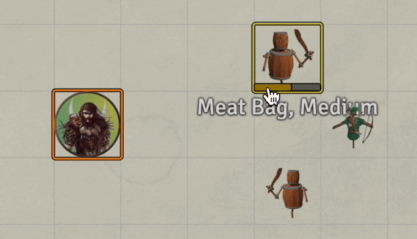
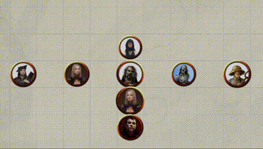

# 1st Level Spells
This repository will contain my automated 1st level spells as I create new or update existing (there are many) that currently reside only in my game data (which is regularly backed up) I'll add them here.

Spells will have notes on elements that I think are interesting.  In some cases differences from RAW, notes on how to use the spell in game, or coding notes.

* [Animal Friendship](#animal-friendship)
* [Binding Curse](#binding-curse)
* [Bless](#bless)
* [Cure Wounds](#cure-wounds)
* [Detect Magic](#detect-magic)
* [Dissonant Whispers](#dissonant-whispers)
* [Earth Tremor](#earth-tremor)
* [Electrify](#electrify)
* [Ensnaring Strike](Cantrips#ensnaring-strike)
* [Entangle](#entangle)
* [Fog Cloud](#fog-cloud) (ASE)
* [Guiding Bolt](#guiding-bolt)
* [Hex](#hex)
* [Longstrider](#longstrider)
* [Mage Armor](#mage-armor)
* [Magic Missle](#magic-missile) (ASE)
* [Nauseating Poison](#nauseating-poison)
* [Protection from Evil and Good](#protection-from-evil-and-good)
* [Ray of Sickness](#ray-of-sickness)
* [Sanctuary](#sanctuary)
* [Searing Smite](1st_Level#searing-smite)
* [Sleep](#sleep)
* [Shield](#shield)
* [Tasha's Caustic Brew](#tasha-caustic-brew)
* [Thunderous Smite](#thunderous-smite)
* [Thunderwave](#thunderwave)
* [Unseen Servant](#unseen-servant)
* [Witch Bolt](#witch-bolt) (ASE)
* [Wrathful Smite](#wrathful-smite)

[*Back to List of All Spells*](../README.md)

---

## Spell Notes

### Animal Friendship

This implementation applies a DAE effect to the target(s) and runs a Rune VFX as a world macro.  It does not do any error checking or perform the saving throw or intelligence check, those are left to be handled manually.

[*Back to 1st Level Spell List*](#1st-level-spells)

---

### Binding Curse

This spell is from [Kibbles Occultist 1.2](https://www.gmbinder.com/share/-M-WtrKeZNFdEXq0MKXw).  I have modified the spell slightly to address a couple of poorly defined elements.  Following is the description I worked to:

> You anchor a creature to its current location, causing glowing chains of light to connect it to that point.
> 
> For the duration of the spell, if the creature attempts to move away from the anchor,  it must make a **Wisdom saving** throw, or be **unable to move more than 5 feet** away from the anchor until the start of their next turn.
> 
> If a creature starts its turn **more than 10 feet** from the binding point, they must make a Strength saving throw or are **dragged 5 feet** toward the binding point.

If the afflicted starts away from the anchor and fails its wisdom save, I assume it may only move toward the anchor, ending up within 5 feet of the anchor.

Implementing this spell was interesting.  It includes the following elements:

1. Warpgate summons of an Anchor (%Anchor% needs to be in the Actors Directory)
2. Saving through on initial cast to resist the whole effect
3. STR save to resist an automatic pull of 5 feet toward anchor if more than 10 feet from anchor
4. Dialog asking if a WIS save should be attempted to allow movement
5. Cleanup the anchor and effect on the target when concentration drops

[*Back to 1st Level Spell List*](#1st-level-spells)

---

### Bless

This spell is implemented without a macro.  

The VFX is done with [Automated Animations](https://github.com/otigon/automated-jb2a-animations), I think I just kept the default setting for this mod.

The modifier, adding a d4 too many rolls is done with DAE.  It runs into an interesting *feature* where sometimes that 1d4 is string concatenated to other modifiers resulting in something like `11d4` instead of `1+1d4` or `+1d42` instead of `+1d4+2` being processed.  The *fix* for this appears to be wrapping the 1d4 with plus signs.  As shown in the PNG of DAE settings embedded below.

This does result in bit of ugly in the chat log, but at least it is correct mathematically.

This is a known issue with DAE, [Active effects concatenated with global bonus in special traits](https://gitlab.com/foundrynet/dnd5e/-/issues/1134).

[*Back to 1st Level Spell List*](#1st-level-spells)

---

### Cure Wounds

Implements the basic cure spell.  It runs a macro that checks to make sure exactly one target is targeted and issues an error message if needed. It also runs a simple rune based VFX on the token that is healed. 

[*Back to 1st Level Spell List*](#1st-level-spells)

---

### Dissonant Whispers

Simple macro that posts a text chat message describing the effect of the spell, success or failure on the saving throw and runs a VFX on the target when it fails its save.  Otherwise, just a standard spell. 

[*Back to 1st Level Spell List*](#1st-level-spells)

---

### Detect Magic

Simple macro that places a persistent VFX attached to the caster that indicates the existence and range of the detect magic effect.  It doesn't do any type of automated highlighting.

[*Back to 1st Level Spell List*](#1st-level-spells)

This spell is included in the [Advanced Spell Effects Module](https://github.com/Vauryx/AdvancedSpellEffects/wiki/Currently-Available-Spells#detect-magic) and it is rather awesome.  Unfortunately, it assumes all detectable things will be tagged which is too much effort for me, so I am sticking with my simpler visual only build.

---

### Earth Tremor

Import of older macro that needs its rough edges sanded off.

[*Back to 1st Level Spell List*](#1st-level-spells)

---

### Electrify

This is another of those tasty **[Kibble's bits: Occultist](https://www.gmbinder.com/share/-M-WtrKeZNFdEXq0MKXw)**.  His spell description:

**Electrify** *1st-level evocation*

* **Classes**: Occultist, Sorcerer, Wizard
* **Casting Time**: 1 bonus action
* **Range**: Self
* **Components**: V, S, M (a pair of singed gloves)
* **Duration**: 1 Round.

*You channel lightning into your hands. After casting this spell, if you make a successful melee spell attack, unarmed strike or a melee weapon attack with a weapon made of a conductive material (such as metal), the target takes 1d10 lightning damage and must make a Constitution saving throw. On a failed save, the target becomes* **stunned** *until the start of their next turn. The spell ends after dealing damage, or at the start of your next turn, whichever occurs first.*

*For the duration of the spell, you can cast the spell* **shocking grasp**.

That is a whopper of events to automate, including:

1. Apply buff effect to user that stores the remaining features similar to a Paladin's smite.
2. Copy **Shocking Grasp** from the Item directory, renaming it to avoid collision with a potentially existing copy.
3. Apply 1d10 (2d10 on a critical) lightning damage when a melee weapon attack (MWAK) or melee spell attack (MSAK) hits a target.
4. On melee hit apply **Stunned** and **Incapacitated** conditions with an expiration condition set for the beginning of the target's next turn.
5. Delete the temp copy of **Shocking Grasp**.

This spell drove the implementation of **Shocking Grasp** which includes a **No Reaction** condition that applies on hit.

[*Back to 1st Level Spell List*](#1st-level-spells)

---

### Ensnaring Strike

Import of older macro that appears to be FoundryVTT 9.x compatible.

[*Back to 1st Level Spell List*](#1st-level-spells)

---

### Fog Cloud

This spell is interesting as built in the [Advanced Spell Effects Module](https://github.com/Vauryx/AdvancedSpellEffects/wiki/Currently-Available-Spells#fog-cloud).  I have kept it as provided.

It uses a fog graphic and places walls to clock vision. 

As this spell is not normally attachable to an object it is a bit simpilier than its close cousin, [Darkness]
(../2nd_Level/#darkness)). 

I have kept my originial implementation in the repository in a subdirectory of this spell.

[*Back to 1st Level Spell List*](#1st-level-spells)

---

### Guiding Bolt

This is spell is implemented by configuration of modules and a little macro that adds an additional expiration term (next attack) to the effect created by DAE.

* DAE ([Dynamic Active Effects](https://gitlab.com/tposney/dae)) -- Applies the effect that forces the target to grant advantage.  This is configured on the item's DAE sheet **and** on the details page where duration controls expiration of the effect.  That is at the start of the caster's next turn.
* A-A ([Automated jb2a Animations](https://github.com/otigon/automated-jb2a-animations)) -- Runs the nifty VFX.  This is actually the default set up from the module.  A snap of the relevant setting page is in the Repo.
* Custom Macro -- Modifies the created effect.

[*Back to 1st Level Spell List*](#1st-level-spells)

---

### Hex

This is based on Crymic's code.  I have added a new ability to move the hex from a *dead* token to a new target per RAW.  This will fail if the old token isn't available on the scene to copy it from.  

This spell is built from two items:

1. Hex -- The *normal* spell/item
2. %%Hex - Move%% -- a *helper* item which is copied and edited by **Hex** into the actor's spellbook as an *at-will* spell. The funky name is intentional.

HOMEBREW: If the user of this spell is a subclass *celestial* (typically a warlock), the damage type is *radiant* instead of *necrotic*.

Following are a few messages that this macro can produce.

[*Back to 1st Level Spell List*](#1st-level-spells)

---

### Longstrider

This is a simple little spell that uses DAE to boost the speed of the target token by 10 and makes a call to jez-lib to run a simple VFX on the target token or an array of target tokens.

[*Back to 1st Level Spell List*](#1st-level-spells)

---

### Mage Armor

This spell is from midi examples with the addition of an ItemMacro call to my world macro: **Run_RuneVFX_onTargets**

The key to this spell is a DAE effect line that reads as follows:
`data.attributes.ac.calc OVERRIDE mage 50`

The value being used *mage* is one of the defined values well hidden in *CONFIG.DND5E.armorClasses*.  Following is a quote from Tim Posney on Discord:

> tposney — 03/27/2022
> 
> **data.attributes.ac.calc** takes on the values from CONFIG.DND5E.armorClasses ('**flat**', '**natural**', '**default**', '**mage**', '**draconic**', '**unarmoredMonk**', '**unarmoredBarb**', '**custom**') mode OVERRIDE will change the calculation. It really should be a dropdown, rather than free text field. If the value is custom then the dnd5e armor calculation will look at the formula.

Here is a dump from the console of CONFIG.DND5E.armorClasses:

~~~
custom:        {label: "Custom Formula"}
default:       {label: "Equipped Armor", formula: "@attributes.ac.base + @abilities.dex.mod"}
draconic:      {label: "Draconic Resilience", formula: "13 + @abilities.dex.mod"}
flat:          {label: "Flat", formula: "@attributes.ac.flat"}
mage:          {label: "Mage Armor", formula: "13 + @abilities.dex.mod"}
natural:       {label: "Natural Armor", formula: "@attributes.ac.flat"}
unarmoredBarb: {label: "Unarmored Defense (Barbarian)", formula: "10 + @abilities.dex.mod + @abilities.con.mod"}
unarmoredMonk: {label: "Unarmored Defense (Monk)", formula: "10 + @abilities.dex.mod + @abilities.wis.mod"}
~~~

Essentially all of those specials are nothing more than predefined custom strings. 

This implementation reduces a token's AC if it already had an effective ac.base of more than 13.  This is left to the players to manage.

[*Back to 1st Level Spell List*](#1st-level-spells)

---

### Magic Missile

I just tossed my original implementation in favor of the [Advanced Spell Effects Module](https://github.com/Vauryx/AdvancedSpellEffects/wiki/Currently-Available-Spells#magic-missile)

This implementation requires that all darts be targeted and then fires them all off in parallel.  This is correct per RAW and just a bit awesome.  

[*Back to 1st Level Spell List*](#1st-level-spells)

---

### Nauseating Poison

This is another of those tasty **[Kibble's bits: Occultist](https://www.gmbinder.com/share/-M-WtrKeZNFdEXq0MKXw)**.  His spell description:

**Nauseating Poison** -- *1st-level necromancy*

* **Classes**: Druid, Occultist, Warlock
* **Casting Time**: 1 bonus action
* **Range**: Self
* **Components**: V, S, M (a piece of rotten meat)
* **Duration**: 1 round.

*You shroud your hand, a weapon you are holding, or a natural weapon in dark ichorous miasma. After casting this spell, if you make a successful melee spell attack, unarmed strike or a melee weapon attack, the target takes an additional 1d8 poison damage and must make a Constitution saving throw. On a failed save, the target becomes poisoned until the end of your next turn.*

*The spell ends after dealing damage, or at the start of your next turn, whichever occurs first.*

That is a rather similar to several of the Paladin Smites:

1. Apply buff effect to user that stores the remaining features similar to a Paladin's smite.
2. Apply 1d8 (2d8 on a critical) poison damage when a melee weapon attack (MWAK) hits a target.
3. On melee hit, the target must attempt a CON saving throw, becoming poisoned until the end of the caster's next turn.

[*Back to 1st Level Spell List*](#1st-level-spells)

---

### Protection from Evil and Good

This spell places a VFX on the recipient, who must be targeted before the spell is cast, giving a visual reminder that it is in place.  It does not automate the benefits, so they must be handled manually.

[*Back to 1st Level Spell List*](#1st-level-spells)

---

### Ray of Sickness

This is closely based on Crymic's macro with the addition of a VFX and a message about the Poisoned effect including a link to the journal entry giving the details of the effect.

[*Back to 1st Level Spell List*](#1st-level-spells)

---

### Sanctuary

One of my initial spells, so style wise the macro leaves a bit too be desired.  This implementation runs a VFX and posts a message about the effect of the spell.  The effect is left for manual implementation of a saving throw.

[*Back to 1st Level Spell List*](#1st-level-spells)

---

### Searing Smite

Imported from older work.  No new documentation.

[*Back to 1st Level Spell List*](#1st-level-spells)

---

### Shield

Macro adds a DAE effect that boosts AC by 5 until the beginning of the actor's next round. This spell is configured to use reactions. It plays a VFX while active.

[*Back to 1st Level Spell List*](#1st-level-spells)

---

### Sleep

Applies sleep effect to targets in area considering various immunities and working with the hit point pools as described in RAW. A fairly nice VFX sequence is triggered on the target template.

The macro is derived from several found online.  More in the comments of the javascript file.

[*Back to 1st Level Spell List*](#1st-level-spells)

---

### Tasha Caustic Brew

Creates an AOE effect that can apply a DoT effect to the targets.  Targets have an option to clean the debuff or take damage each turn.

This implementation ignores the ability to remove the debuff from nearby friendlies, that will need to be handled manually.

The macro underlying this was written by Crymic.  I've only added a bit of documentation. 

[*Back to 1st Level Spell List*](#1st-level-spells)

---

### Thunderous Smite

Older macro imported to GitRepo and updated for FoundryVTT 9.x.  No checking is made for wall or other collisions.

[*Back to 1st Level Spell List*](#1st-level-spells)

---

### Thunderwave

Older macro imported to GitRepo and updated for FoundryVTT 9.x.  No checking is made for wall or other collisions.

[*Back to 1st Level Spell List*](#1st-level-spells)

---

### Unseen Servant

Summons an Unseen Servant from the **Actors Directory**, renaming it to indicate ownership and runs a little VFX.

[*Back to 1st Level Spell List*](#1st-level-spells)

---

### Witch Bolt

This spell is amazing as built in the [Advanced Spell Effects Module](https://github.com/Vauryx/AdvancedSpellEffects/wiki/Currently-Available-Spells#witch-bolt).  I have kept it as provided.

Here are notes from the author's Wiki:

* The continuous stream will break and the spell will end if the caster and target are more than 30ft away.
* Each turn, only the owner of the caster will get a prompt to activate the witch bolt. This will be the GM for NPC tokens, and only players for player owned tokens.

[*Back to 1st Level Spell List*](#1st-level-spells)

---

### Wrathful Smite

Imported from earlier work.

[*Back to 1st Level Spell List*](#1st-level-spells)

---