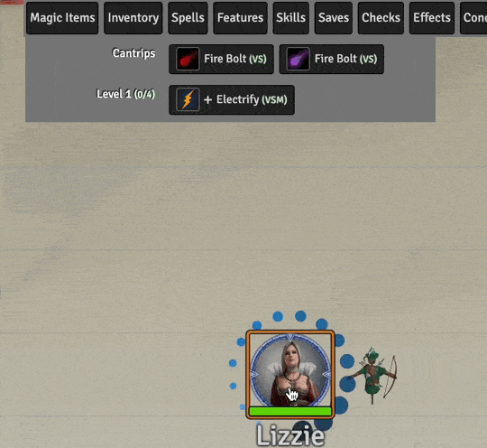

# 1st Level Spells
This repository will contain my automated 1st level spells as I create new or update existing (there are many) that currently reside only in my game data (which is regularly backed up) I'll add them here.

Spells will have notes on elemnts that I think are interesting.  In some cases differences from RAW, notes on how to use the spell in game, or coding notes.

* [Bless](#bless)
* [Detect Magic](#detect-magic)
* [Dissonant Whispers](#dissonant-whispers)
* [Electrify](#electrify)
* [Entangle](#entangle)
* [Fog Cloud](#fog-cloud) (ASE)
* [Hex](#hex)
* [Magic Missle](#magic-missile) (ASE)
* [Protection from Evil and Good](#protection-from-evil-and-good)
* [Ray of Sickness](#ray-of-sickness)
* [Sleep](#sleep)
* [Shield](#shield)
* [Tasha's Caustic Brew](#tasha-caustic-brew)
* [Witch Bolt](#witch-bolt) (ASE)

[*Back to List of All Spells*](../README.md)

---

## Spell Notes

### Bless

This spell is implemented without a macro.  

The VFX is done with [Automated Animations](https://github.com/otigon/automated-jb2a-animations), I think I just kept the default setting for this mod.

The modifier, adding a d4 to many rolls is done with DAE.  It runs into an interesting *feature* where sometimes that 1d4 is string concatenated to other modifiers resulting in something like `11d4` instead of `1+1d4` or `+1d42` instead of `+1d4+2` being processed.  The *fix* for this appears to be wrapping the 1d4 with plus signs.  As shown in the PNG of DAE settings embedded below.

This does result in bit of ugly in the chat log, but at least it is correct mathematically.

This is a known issue with DAE, [Active effects concatenated with global bonus in special traits](https://gitlab.com/foundrynet/dnd5e/-/issues/1134).

[*Back to 1st Level Spell List*](#1st-level-spells)

---

### Dissonant Whispers

Simple macro that posts a text chat message describing the effect of the spell, success or failure on the saving throw and runs a VFX on the target when it fails its save.  Otherwise, just a standard spell. 

[*Back to 1st Level Spell List*](#1st-level-spells)

---

### Detect Magic

Simple macro that places a persistent VFX attached to the caster that indicates the existance and range of the detect magic effect.  It doesn't do any type of automated highlighting.

[*Back to 1st Level Spell List*](#1st-level-spells)

This spell is included in the [Advanced Spell Effects Module](https://github.com/Vauryx/AdvancedSpellEffects/wiki/Currently-Available-Spells#detect-magic) and it is rather awesome.  Unfortunately, it assumes all detectable things will be tagged which is too much effort for me, so I am sticking with my simplier visual only build.

---

### Electrify

This is another of those tasty **[Kibble's bits: Occultist](https://www.gmbinder.com/share/-M-WtrKeZNFdEXq0MKXw)**.  His spell description:

**Electrify** *1st-level evocation*

* **Classes**: Occultist, Sorcerer, Wizard
* **Casting Time**: 1 bonus action
* **Range**: Self
* **Components**: V, S, M (a pair of singed gloves)
* **Duration**: 1 Round.

*You channel lightning into your hands. After casting this spell, if you make a successful melee spell attack, unarmed strike or a melee weapon attack with a weapon made of a conductive material (such as metal), the target takes 1d10 lightning damage and must make a Constitution saving throw. On a failed save, the target becomes* **stunned** *until the start of their next turn. The spell ends after dealing damage, or at the start of your next turn, whichever occurs first.*

*For the duration of the spell, you can cast the spell* **shocking grasp**.

That is a whopper of events to automate, including:

1. Apply buff effect to user that stores the remaining features similar to a Paladin's smite.
2. Copy **Shocking Grasp** from the Item directory, renaming it to avoid collision with a potentially existing copy.
3. Apply 1d10 (2d10 on a critical) lightning damage when a melee weapon attack (MWAK) or melee spell attack (MSAK) hits a target.
4. On melee hit apply **Stunned** and **Incapacitated** conditions with an expiration condition set for the beginning of the target's next turn.
5. Delete the temp copy of **Shocking Grasp**.

This spell drove the implementation of **Shocking Grasp** which includes a **No Reaction** condition that applies on hit.

[*Back to 1st Level Spell List*](#1st-level-spells)

---

### Fog Cloud

This spell is interesting as built in the [Advanced Spell Effects Module](https://github.com/Vauryx/AdvancedSpellEffects/wiki/Currently-Available-Spells#fog-cloud).  I have kept it as provided.

It uses a fog graphic and places walls to clock vision. 

As this spell is not normally attachable to an object it is a bit simpilier than its close cousin, [Darkness]
(../2nd_Level/#darkness)). 

I have kept my originial implementation in the repository in a subdirectory of this spell.

[*Back to 1st Level Spell List*](#1st-level-spells)

---

### Hex

This is based on Crymic's code.  I have added a new ability to move the hex from a *dead* token to a new target per RAW.  This will fail if the old token isn't available on the scene to copy it from.  

This spell is built from two items:

1. Hex -- The *normal* spell/item
2. %%Hex - Move%% -- a *helper* item which is copied and edited by **Hex** into the actor's spellbook as an *at-will* spell. The funky name is intentional.

Following are a few messages this macro can produce.

[*Back to 1st Level Spell List*](#1st-level-spells)

---

### Magic Missle

I just tossed my original implementaton in favor of the [Advanced Spell Effects Module](https://github.com/Vauryx/AdvancedSpellEffects/wiki/Currently-Available-Spells#magic-missile)

This implmentation requires that all darts be targeted and then fires them all off in parallel.  This is correct per RAW and just a bit awesome.  

[*Back to 1st Level Spell List*](#1st-level-spells)

---

### Protection from Evil and Good

This spell places a VFX on the recipient, who must be targeted before the spell is cast, giving a visual reminder that it is in place.  It does not automate the benefits, so they must be handled manually.

[*Back to 1st Level Spell List*](#1st-level-spells)

---

### Ray of Sickness

This is closely based on Crymic's macro with the addition of a VFX and a message about the Poisoned effect including a link to the journal entry giving the details of the effect.

[*Back to 1st Level Spell List*](#1st-level-spells)

---

### Shield

Macro adds a DAE effect that boosts AC by 5 until the beginning of the actor's next round. This spell is configured to use reactions. It plays a VFX while active.

[*Back to 1st Level Spell List*](#1st-level-spells)

---

### Sleep

Applies sleep effect to targets in area considering various immunities and working with the hit point pools as described in RAW. A fairly nice VFX sequence is triggered on the target template.

The macro is derived from several found online.  More in the comments of the javascript file.

[*Back to 1st Level Spell List*](#1st-level-spells)

---

### Tasha Caustic Brew

Creates an AOE effect that can apply a DoT effect to the targets.  Targets have an option to clean the debuff or take damage each turn.

This implementation ignores the ability to remove the debuff from nearby friendlies, that will need to be handled manually.

The macro underlying this was written by Crymic.  I've only added a bit of documention. 

[*Back to 1st Level Spell List*](#1st-level-spells)

---

### Witch Bolt

This spell is amazing as built in the [Advanced Spell Effects Module](https://github.com/Vauryx/AdvancedSpellEffects/wiki/Currently-Available-Spells#witch-bolt).  I have kept it as provided.

Here are notes from the author's Wiki:

* The continuous stream will break and the spell will end if the caster and target are more than 30ft away.
* Each turn, only the owner of the caster will get a prompt to activate the witch bolt. This will be the GM for NPC tokens, and only players for player owned tokens.

[*Back to 1st Level Spell List*](#1st-level-spells)

---