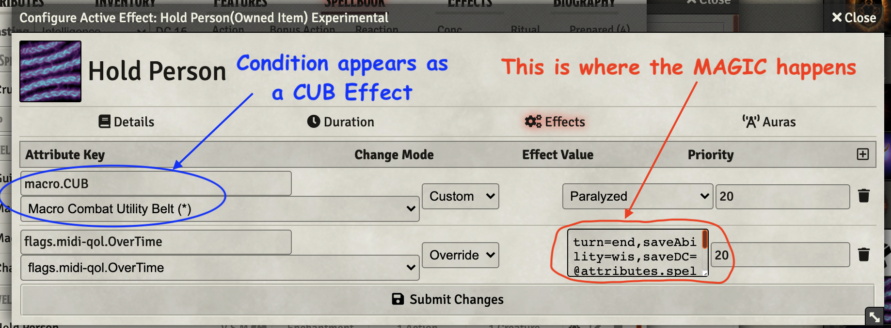

# 2nd Level Spells
This repository will contain my automated 2nd level spells as I create new or update existing (there are many) that currently reside only in my game data (which is regularly backed up) I'll add them here.

Spells will have notes on elemnts that I think are interesting.  In some cases differences from RAW, notes on how to use the spell in game, or coding notes.

* [Darkness](#darkness) (ASE)
* [Crown of Madness](#crown-of-madness)
* [Darkvision](#darkvision)
* [Enlarge/Reduce](#enlargereduce)
* [Hold Person](#hold-person)
* [Invisibility](#invisibility)
* [Knock](#knock)
* [Locate Object](#locate-object)
* [Mirror Image](#mirror-image) (ASE)
* [Moonbeam](#moonbeam) (ASE)
* [Ray of Enfeeblement](#ray-of-enfeeblement)
* [Scorching Ray](#scorching-ray) (ASE)
* [Spiritual Weapon](#spiritual-weapon)

[*Back to List of All Spells*](../README.md)

## Spell Notes

### Crown of Madness

~~~ **In Develoment** ~~~

[Crown of Madness](https://www.dndbeyond.com/spells/crown-of-madness) appears to be quite the complex spell to automate.  The intended flow is currently:

1. Configure the base spell to force a wisdom saving throw of the target,
2. If the save succeeds, don't do anything further, if not, continue,
3. Put a DAE effect on the target that includes 
 	* ItemMacro that runs at start of every turn reminding of effect on target (doEach)
 	* ItemMacro terminates the VFX when it is removed (doOff)
 	* Midi Overtime effect that performs a save at end of each turn 
4. Attach a VFX stars effect to the token marking it as *mad*
5. Modify the concentration effect on the casting token to run a helper world macro at the start of each caster's turn popping a dialog that asks if action is to be spent maintaining the effect.  If caster declines to spend their action on this spell, remove concentration.

### Darkness

This spell is interesting as built in the [Advanced Spell Effects Module](https://github.com/Vauryx/AdvancedSpellEffects/wiki).

If the darkness is cast on a token, the Token Attacher UI must be used manually to attach the darkness overhead tile to the token.  This is a bit challenging, presumably it gets easier with practice.

Operationally, this spell is similar to [Fog Cloud](../1st_Level/#fog-cloud)

[*Back to 2nd Level Spell List*](#2nd-level-spells)

---

### Darkvision

Places a DAE effect on the beneficiary that provides dim light vision out to 60 feet.

[*Back to 2nd Level Spell List*](#2nd-level-spells)

---

### Enlarge/Reduce

This spell uses an OnUse ItemMacro to pop a dialog and ask if the target wants to make a save.  An acceptance of the effect or a failed save the effect is applied and the token size is adjusted in the scene.  WHen the spell expires, the size returns to normal -- or at least it should. ;-)

[*Back to 2nd Level Spell List*](#2nd-level-spells)

---

### Hold Person

This is *simply* a Midi-QoL OverTime effect.  There is no associated macro, rather it depends on two effects coded into the DAE panels:

> flags.midi-qol.OverTime OVERRIDE turn=end,saveAbility=wis,saveDC=@attributes.spelldc,saveMagic=true,label=Hold Person
> StatusEffect OVERRIDE Convenient Effect: Paralyzed

The first of these effects causes affected token(s) to roll a wisdom saving throw against the spell dc of the caster at the end of each turn.  On success both effects are ended.

The second effect places the CUB Paralyzed effect on the token.  This effect appears and can be managed by the *normal* CUB mechanisms.

[*Back to 2nd Level Spell List*](#2nd-level-spells)

---

### Invisibility

This spell requires that the user target token(s) before using it.  It will apply an effect that grants attack advantage and forces disadvantage on inbound attacks.  It drops when the affected token attacks or casts a spell.

Note: concentration does not drop when one (or more of the invisible tokens lose their invisibility as others may still be invisible.  Concentration will need to be removed manually.

Basically the same macro is used by [Greater Invisibility](../4th_Level#greater-invisibility)

[*Back to 2nd Level Spell List*](#2nd-level-spells)

---

### Knock

Nothing more than a tested SRD implmentation. It works.  Nothing special.

[*Back to 2nd Level Spell List*](#2nd-level-spells)

---

### Locate Object

Nothing more than a tested SRD implmentation. It works.  Nothing special.

[*Back to 2nd Level Spell List*](#2nd-level-spells)

---

### Mirror Image

I am implmenting this one by using [Advanced Spell Effects Module](https://github.com/Vauryx/AdvancedSpellEffects/wiki). I have added no value here beyond following the instructions provided by *Vauryx*.

[*Back to 2nd Level Spell List*](#2nd-level-spells)

---

### Moonbeam

This spell appears to be great as built in the [Advanced Spell Effects Module](https://github.com/Vauryx/AdvancedSpellEffects/wiki/Currently-Available-Spells#moonbeam). Other than leaving what seem like persistent ghost images of the beam -- they can be cleared by a reload.

/Moonbeam.gif)

Notes from the author's wiki:

* Adds an 'At-Will' spell to the caster's spellbook called "Move Moonbeam" that can be used to move the beam.
* If a 'Loop' Sound is set in the settings, the sound will follow the beam
* The beam will automatically roll saving throws and damage when a token enters its space for the first time until it has a turn again, or if it starts its turn in its space

I have kept my original implementation of moonbeam in a subdirectory for possible future reference as it does a pretty extensive job of summoning and managing actors and effects.

[*Back to 2nd Level Spell List*](#2nd-level-spells)

---

### Ray of Enfeeblement

Fairly infrequently used spell that places a debuff on the target to reduce their str based attacks by 50%.  Interestingly, there is no save for the first round so it might be used to 
great effect against particularly strong and threating opponents.

This implementation manages an effect marker, handles the per round save, and supplies a VFX.  It does not automate the damage reduction portion.  That will take quite a bit more effort and seems an unwise time investment at this point since the spell is rarely used.

[*Back to 2nd Level Spell List*](#2nd-level-spells)

---

### Scorching Ray

This spell is awesome as built in the [Advanced Spell Effects Module](https://github.com/Vauryx/AdvancedSpellEffects/wiki/Currently-Available-Spells#scorching-ray).

Notes from the author's wiki:

* The caster will enter a special 'Targeting' mode as long as the target selection dialog is open.
* In Targeting mode, left-click on a token to assign a ray to it.
* alt+left-click to add ray with advantage, ctrl+left-click to add it with disadvantage
* Right-click on a token, or click the '-' button next to it in the dialog to remove a ray
* Click 'Done' to launch all rays at the assigned targets

[*Back to 2nd Level Spell List*](#2nd-level-spells)

---

### Spiritual Weapon

This spell is implmented using [Automated Evocations](https://github.com/theripper93/automated-evocations), while not ideal it gets the job done.

AE's implementation requires an acror named **Spiritual Weapon** to exist which will be summoned by a world macro named **AE_Companion_Macro(Spiritual Weapon)**.  I have modified the macro to rename the summoned token, prefixing the standard name with the name of the owner.  The summoned weapon can then be used to *attack* having had its modifiers adjusted to the summoner. 

The part I don't like is the appearance of a selection dialog with exactly one choice.  I expect I can fix that to not appear, but I haven't invested the time. 

There is an [Advanced Spell Effects Module](https://github.com/Vauryx/AdvancedSpellEffects/wiki/Currently-Available-Spells#spiritual-weapon) implmentation, but I'm happy enough with what I have to just let it stand. 

[*Back to 2nd Level Spell List*](#2nd-level-spells)

---