# 3rd Level Spells
This repository will contain my automated 3rd level spells as I create new or update existing (there are many) that currently reside only in my game data (which is regularly backed up) I'll add them here.

Spells will have notes on elements that I think are interesting.  In some cases differences from RAW, notes on how to use the spell in game, or coding notes.

* [Animate Dead](#animate-dead)
* [Beacon of Hope](#beacon-of-hope)
* [Bestow Curse](#bestow-curse)
* [Blinding Smite](#blinding-smite)
* [Call Lightning](#call-lightning) (ASE)
* [Clairvoyance](#clairvoyance)
* [Counterspell](#counterspell)
* [Cruel Puppetry](#cruel-puppetry)
* [Crusader Mantle](crusader-mantle)
* [Dispel Magic](#dispel-magic)
* [Fear](#fear)
* [Fireball](#fireball)
* [Fly](#fly)
* [Haste](#haste)
* [Lightning Bolt](#lightning-bolt)
* [Magic Circle](#magic-circle)
* [Phantom Steed](#phantom-steed)
* [Protection from Energy](#protection-from-energy)
* [Remove Curse](#remove-curse)
* [Revivify](#revivify)
* [Slow](#slow)
* [Speak with Dead](#speak-with-dead)
* [Speak with Plants](#speak-with-plants)
* [Spirit Guardians](#spirit-guardians)
* [Summon Fey](#summon-fey)
* [Summon Lesser Demon](#summon-lesser-demon)
* [Thunder Step](#thunder-step)
* [Tidal Wave](#tidal-wave)
* [Vampiric Touch](#vampiric-touch) (ASE)
* [Water Breathing](#water-breathing)

[*Back to List of All Spells*](../README.md)

## Spell Notes

### Animate Dead

This spell has been converted to use the [Advanced Spell Effects (ASE) Module](https://github.com/Vauryx/AdvancedSpellEffects/wiki/Currently-Available-Spells#animate-dead).  I had set it up to use the[Automated Evocations](https://github.com/theripper93/automated-evocations) module which I uninstalled when moving to Foundry 9.x as it seems to offer little beyond WarpGate other than headaches.

This spell **does require** an adequate number of corpses within 10 feet to operate and doesn't make the summoned undead uniquely named, which is disappointing to me, but it's done, so there is that.

 
Spell in use.

The old version is retained in the repo, marked as depricated.  That version did seem to need the summoned tokens need a few moments to *settle* into the scene.  If they are moved too soon, Token Attacher will get all grumpy and the following command may need to run to fix it:

~~~javascript
tokenAttacher.deleteMissingLinks()
~~~

[*Back to 3rd Level Spell List*](#3rd-level-spells)

---

### Beacon of Hope

This item simply applies the Convenient Effect ***Beacon of Hope*** to preselected targets.  It is removed on a concentration break.  No macro needed to make this go.

[*Back to 3rd Level Spell List*](#3rd-level-spells)

---

### Bestow Curse

Imported older versions and updated for 9.x.  This needs attention.

[*Back to 3rd Level Spell List*](#3rd-level-spells)

---

### Blinding Smite

Imported older versions.

 
Spell in use.

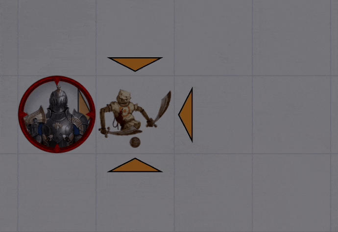

[*Back to 3rd Level Spell List*](#3rd-level-spells)

---

### Call Lightning

This spell is nifty as built in the [Advanced Spell Effects Module](https://github.com/Vauryx/AdvancedSpellEffects/wiki/Currently-Available-Spells#call-lightning).

It first places a large storm cloud and then provides the token with a temporary at-will ability to call down a lightning strike.

 
Spell in use.

When the spell completes, the GM will need to remove the summoned storm cloud as appropriate.

I have left my original implementation in the repo as insurance against the module version going sideways in the future.

[*Back to 3rd Level Spell List*](#3rd-level-spells)

---

### Clairvoyance

Nothing more than a tested SRD implementation. It will be handled between players and GM.  Nothing special.

[*Back to 3rd Level Spell List*](#3rd-level-spells)

---

### Counterspell

Slightly updated spell description from the standard SRD.  Actual use of this spell will be manual for the GM.

04/10/22 Update: Added a call to Run_RuneVFX_onTargets as a world ItemMacro for a bit of visual flair.

[*Back to 3rd Level Spell List*](#3rd-level-spells)

---

### Cruel Puppetry

Import of older Macro.

[*Back to 3rd Level Spell List*](#3rd-level-spells)

---

### Crusader Mantle

This spell uses an Active Order and DAE.  I just changed the description from Crymic's code, found [HERE](https://www.patreon.com/posts/crusaders-mantle-56181429).

[*Back to 3rd Level Spell List*](#3rd-level-spells)

---

### Dispel Magic

This spell is not automated.  It simply has a VFX implemented with [Automated Animations](https://github.com/otigon/automated-jb2a-animations).  

When used, it simply plays a visual on the target.  Any saves or removal of effects is left for manual attention. 

 
Spell in use.

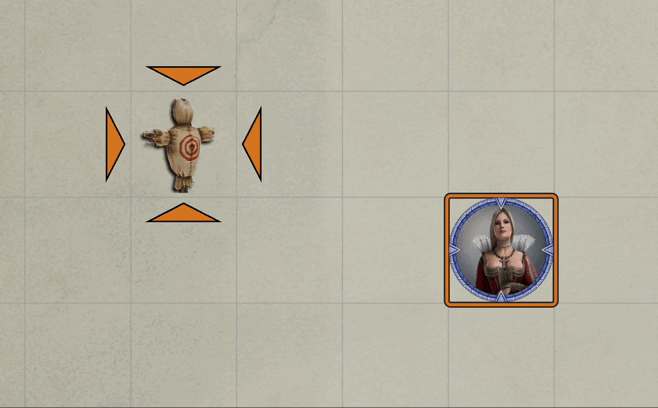

[*Back to 3rd Level Spell List*](#3rd-level-spells)

---

### Fear

Implemented Fear complete with per turn saving throws. 

[*Back to 3rd Level Spell List*](#3rd-level-spells)

---

### Fireball

While this spell worked just fine straight out of [Automated Animations](https://github.com/otigon/automated-jb2a-animations), I couldn't resist adding a bit fore VFX sophistication.

The-macro for this spell use a firebolt in flight followed by and explosion and then three waves of smoke for a bit more visual ooomph.

Probably most interestingly, it reads the name of the icon that represents the spell and attempts to pick the *right* color fireball graphic.  The colors recognized in the image file name and what they map to are:

    orange ==> orange
    blue   ==> blue
    purple ==> purple
    red    ==> orange
    eerie  ==> blue
    sky    ==> blue
    acid   ==> purple

 
Spell in use.

NOTE: I needed to disable Automated Animations global match to fireball to avoid that modules *help.*

[*Back to 3rd Level Spell List*](#3rd-level-spells)

---

### Fly 

This spell applies a DAE effect that upgrades flight speed to 60.  It also makes a call to the world macro, **[Run RuneVFX onTargets](../../Utility_Macros#run-runevfx-ontargets)**, to play a VFX on the target(s), which are assumed to be willing.

 
Spell in use.

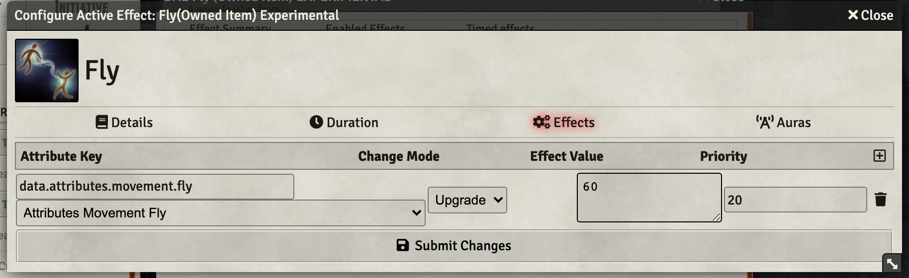

[*Back to 3rd Level Spell List*](#3rd-level-spells)

---

### Haste 

This spell applies a DAE effect that adds the haste automatable benefits to the target.  It also runs an every-turn function that reminds the players of the extra action.  When the effect drops it tags the token with a CUB condition for *no_actions*

 
Spell in use.

 
Chat cards

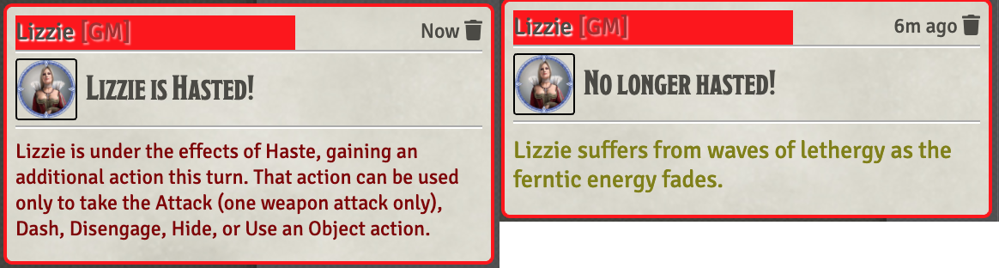

[*Back to 3rd Level Spell List*](#3rd-level-spells)

---

### Lightning Bolt

For some reason this worked great on my initial testing, but the Automated Animations config *broke* (specifically, it went to just empty fields for an unknown reason).  Setting Automated Animations configuration (globally) fixed this.

 
Spell in use.

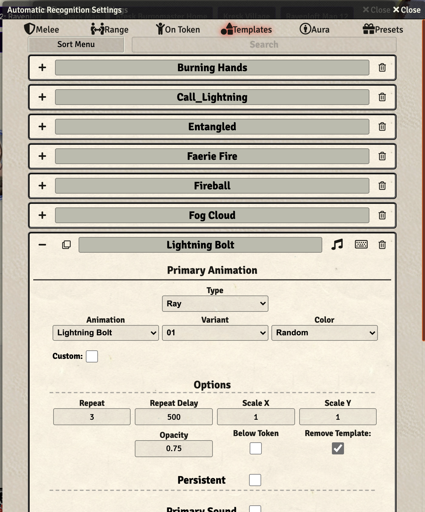

[*Back to 3rd Level Spell List*](#3rd-level-spells)

---

### Magic Circle

This spell places a graphic and names it to indicate the type of creature warded and the direction of warding.  It does nothing mechanically, leaving assignment of penalties and restriction of movement up to the GM and the players.

When cast, it pops a dialog asking for the type of creatures being warded and the direction of warding that looks like this:

 
Dialog to select type of circle

It will then render the graphic where the targeting template had been placed.  When the spell is completed, the GM will need to use the **Show Sequencer Effects Viewer** button (left hand menus, near bottom, looks like a film strip) and remove the effect with a menu that looks like the following (that popup also has info on the selections made for reference):

 
Popup Dialog

Here's what the spell looks like on the random battle map.

 
Spell in use.

[*Back to 3rd Level Spell List*](#3rd-level-spells)

--- 
 
### Phantom Steed

This item use a macro to grab an actor named *%Phantom Steed%* from the actor's directory and place it on the field with a name identifying the summoning actor.  It deletes any previous summonings of this steed and creates a watchdog effect that deletes the new summoning when it expires. 

[*Back to 3rd Level Spell List*](#3rd-level-spells)

---

### Protection from Energy

This spell uses a macro to apply a damage resistance to specified damage type and play a VFX.  The damage type can be specified by including one of the allowed types in the item name or picked from a dialog.  The VFX scales with the size of the protected token.

Types allowed:

* acid,
* cold,
* fire,
* lightning, or
* thunder.

 
Spell in use.

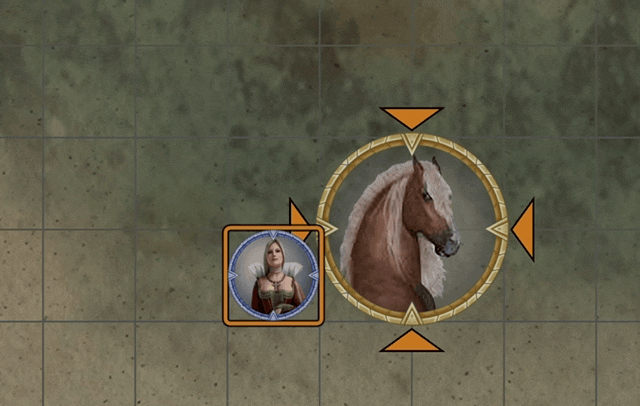

[*Back to 3rd Level Spell List*](#3rd-level-spells)

---

### Remove Curse

Spell plays a RuneVFX on the target effects (if any) are left to the GM.

[*Back to 3rd Level Spell List*](#3rd-level-spells)

---

### Revivify

Fairly generic spell implementation.  A minor Automated Animations effect applied and a new spell component, [Diamond](../../Items#components), added to the spell components inventory.  This requires that the spell be adjusted after it is added to the character sheet to use the Diamond component.

 
Spell in use.

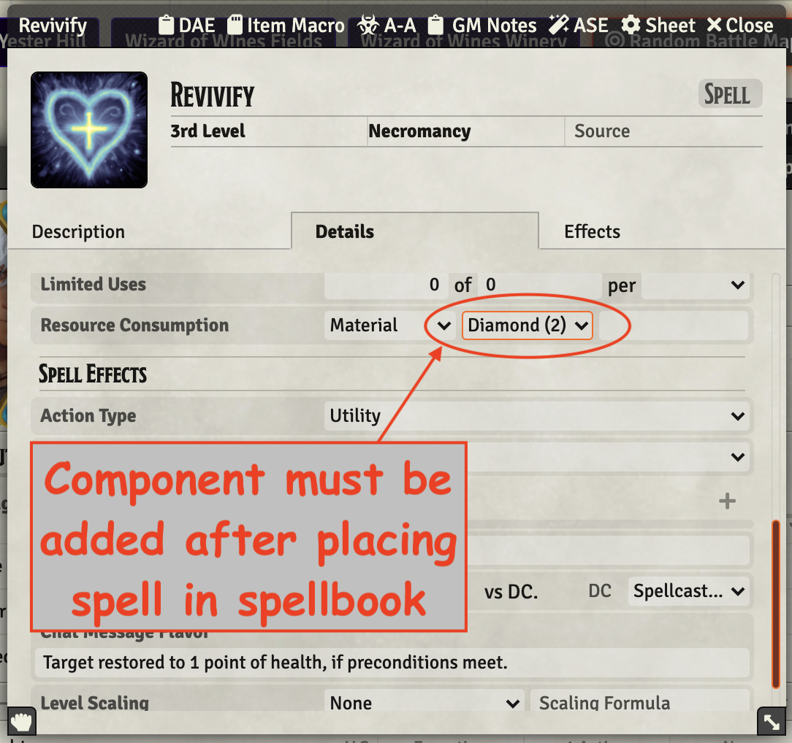

[*Back to 3rd Level Spell List*](#3rd-level-spells)

---

### Slow

This spell targets a 40 foot cube but only affects targets of the caster's choosing.  I've opted to skip automation of the cube element, instead requiring that the targets be pre-selected when the spell is cast and proceeding from there.

The end of turn saves are handled by a DAE Overtime effect of the form:

~~~
flags.midi-qol.OverTime
Add
turn=end,label=Shrug off Slow Effect,saveDC=@attributes.spelldc,saveAbility=wis
~~~

An every turn (at start) ItemMacro is used to post a reminder message to the chat log about the effects of slow.

[*Back to 3rd Level Spell List*](#3rd-level-spells)

---

### Speak with Dead

Spell plays a RuneVFX on the target and places a DAE effect noting the presence of the spell.  It does no checking. 

[*Back to 3rd Level Spell List*](#3rd-level-spells)

---

### Speak with Plants

Spell plays a RuneVFX on the target and places a CE effect noting the presence of the spell.  

[*Back to 3rd Level Spell List*](#3rd-level-spells)

---

### Spirit Guardians

This spell does a couple of interesting things.

1. It uses a helper item %%Spirit Guardians%% which it copies and edits to implement a temp item
2. The temp item is used to manually inflict damage on appropriate tokens (MANUALLY!)
3. A VFX is run showing the area affected by spirit guardians
4. The damage type is set (radiant/necrotic) as appropriate for the caster.

 
Spell in use.

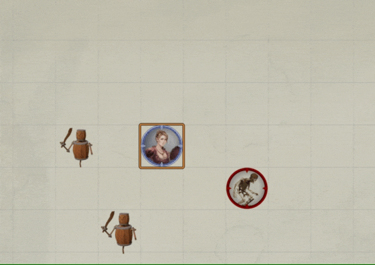

[*Back to 3rd Level Spell List*](#3rd-level-spells)

---

### Summon Fey

Spell imported from earlier automation, does a bunch of things I have forgotten -- so no useful info here.

 
Spell in use.

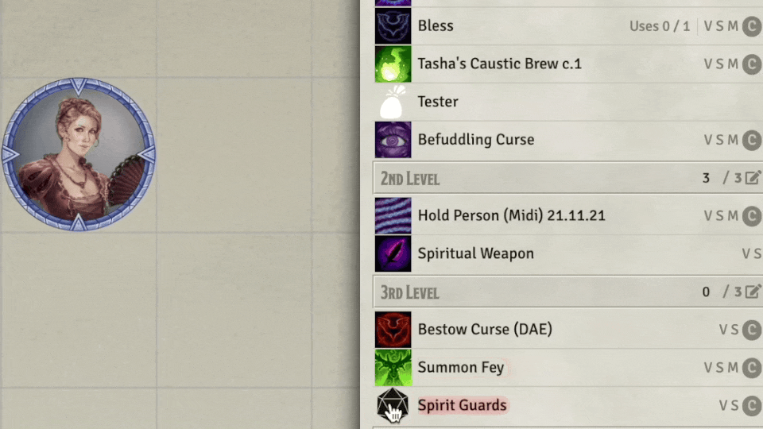

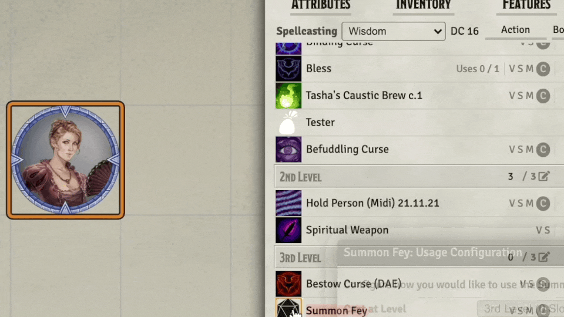

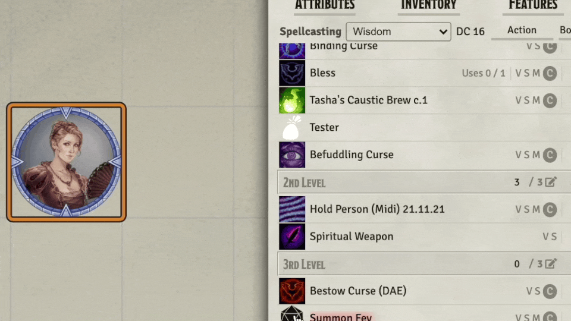

[*Back to 3rd Level Spell List*](#3rd-level-spells)

---

### Summon Lesser Demon

This does a number of interesting things.  Perhaps the most notable is adding the summoned critters and rolling initiative so that players can use it without permission issues.

Automate Summon Lesser Demon, based directly on Summon_Greater_Demon.0.1.js. Key things that this macro accomplishes:

1. Roll a d6 to determine the CR & Qty of demon to summon
2. Build list of available summons (scan sidebar), verifying existence of each
3. Dialog to select a specific creature to summon
4. Place summoned creatures, including making creature "hostile" (use warpgate)
5. Mod concentration to run ItemMacro doEach with a list of summoned tokens. **doEach**: loop through summons, despawn any defeated, drop conc if none remain active, **doOff**: despawn any remaining demons

[*Back to 3rd Level Spell List*](#3rd-level-spells)

---

### Thunder Step

This one operates as two, sometimes three part execution. 

1. The caster needs to use the **Thunder Step (Teleportation)** spell.  It will show the allowed area (which is huge -- 300 foot radius) for teleportation.  The user then clicks the destination and will go poof to the new spot.
2. Optionally, one friendly creature who was next to the caster can be moved with the caster.  This will need to be done by the token owner of the GM, manually.
3. Finally, the caster should use the **Thunder Step (Damage)** spell, making sure not to use a spell slot.  They targeting marker needs to be clicked into the space vacated by the caster. It will then cause the appropriate damage.

All of the above is done without a macro, just **Automated Animations** and standard FoundryVTT settings.

 
Spell in use.

https://github.com/Jeznar/GitRepo/blob/main/Spells/3rd_Level/Thunder_Step/Thunder_Step.gif

I have looked at the [Advanced Spell Effects Module](https://github.com/Vauryx/AdvancedSpellEffects/wiki/Currently-Available-Spells#thunder-step) implementation of this spell.  It is a smoother approach with niftier graphics but depennds on correct marking of tokens friendly status and caused multiple *ghost* moves of the casting token after spell completion.  I don't know what it was doing actually, but I don't see further investigation as worthwhile -- sticking with my three step implementation that I can debug as required. 

[*Back to 3rd Level Spell List*](#3rd-level-spells)

---

### Tidal Wave

This spell is implemented without a custom macro. It does make use of [DAE](https://gitlab.com/tposney/dae) to apply a CUB Prone effect and [Automated Animations](https://github.com/otigon/automated-jb2a-animations) to handle the somewhat inappropriate VFX.  Also, of course MIDI-QoL. Configuration information is included in the screen shots stored in the repository.

This spell is unusual in that the area of effect is stated as *up to* in three dimensions.  Since my world is largely two dimensional (for effects anyway -- z-axis is handled with theater of mind) I'm only worried about height and width of the effect area.  I've opted to ask the caster to adjust these two dimensions on the details page as appropriate.  That's a bit kludgy, but it seems little worse than a pop up menu asking for those dimensions and it is easier to implement.  Below is a screen shot of the two numbers that can be set to desired dimensions (with the maximum values shown as initial values).

 
Screen Shot

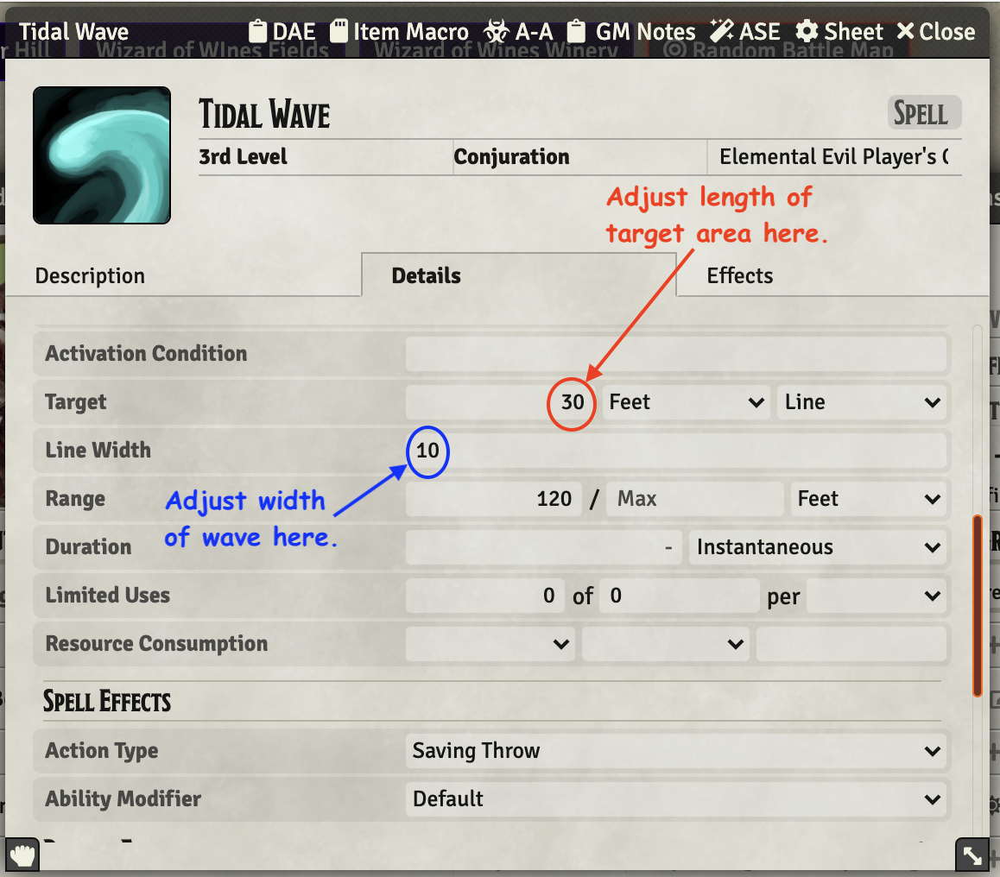

Below is a screen grab video showing the spell.  The graphic is actually a blue acid splash, so a bit off but better than nothing, I suppose.  Notice tokens that failed their saves are marked as prone after the spell is cast. 

 
Spell in use.

[*Back to 3rd Level Spell List*](#3rd-level-spells)

---

### Vampiric Touch

This spell is nifty as built in the [Advanced Spell Effects Module](https://github.com/Vauryx/AdvancedSpellEffects/wiki/Currently-Available-Spells#vampiric-touch).

It heals the using token and creates an at-will ability on that token for subsequent rounds.  Exactly what I'd like to see it do.  

 
Spell in use.

[*Back to 3rd Level Spell List*](#3rd-level-spells)

---

### Water Breathing

Simply applies a CE to targets with a Rune VFX

[*Back to 3rd Level Spell List*](#3rd-level-spells)

---
