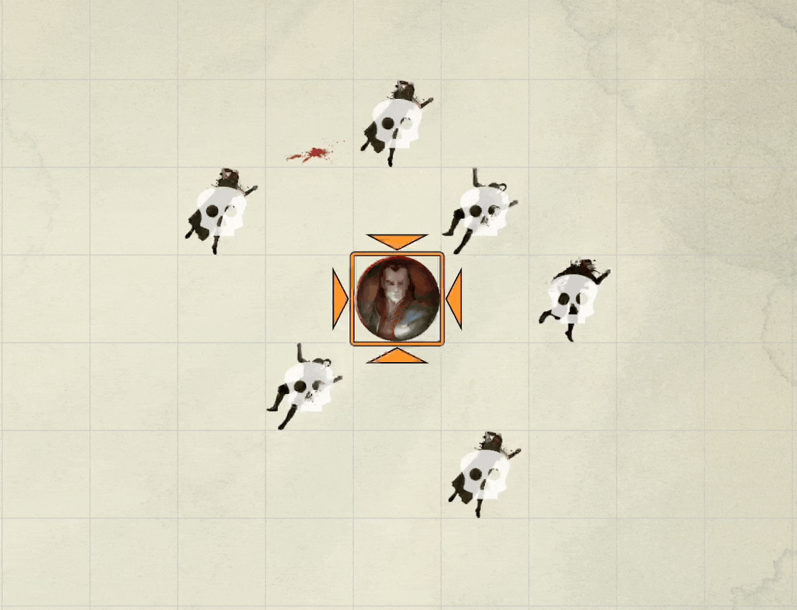
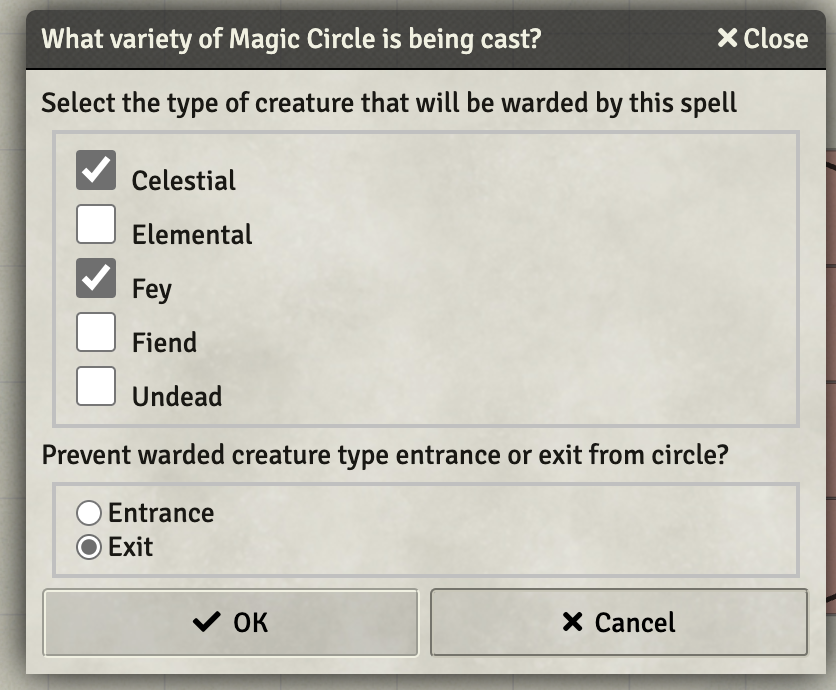
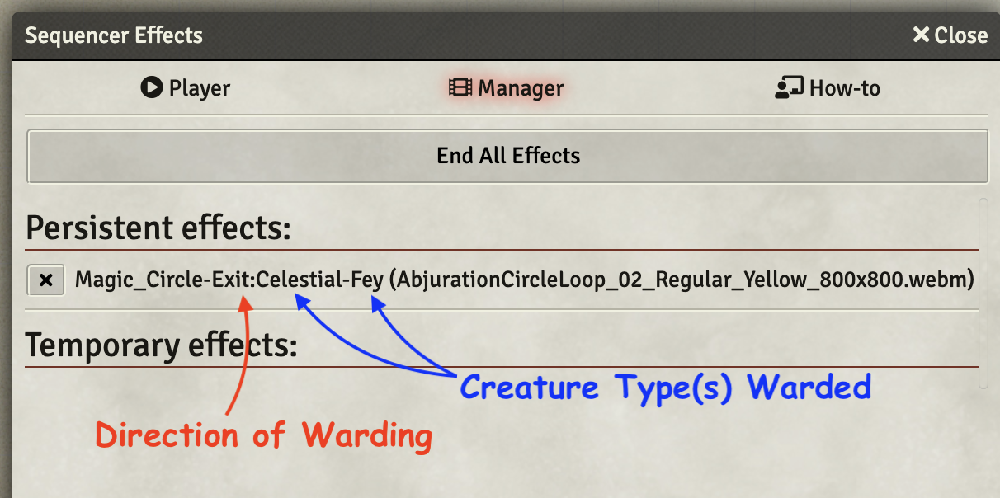

# 3rd Level Spells
This repository will contain my automated 3rd level spells as I create new or update existing (there are many) that currently reside only in my game data (which is regularly backed up) I'll add them here.

Spells will have notes on elemnts that I think are interesting.  In some cases differences from RAW, notes on how to use the spell in game, or coding notes.

* [Animate Dead](#animate-dead)
* [Clairvoyance](#clairvoyance)
* [Counterspell](#counterspell)
* [Lightning Bolt](#lightning-bolt)
* [Magic Circle](#magic-circle)

[*Back to List of All Spells*](../README.md)

## Spell Notes

### Animate Dead

This spell is offered in the [Advanced Spell Effects Module](https://github.com/Vauryx/AdvancedSpellEffects/wiki/Currently-Available-Spells#animate-dead), when I tried to use it I ran into conflicts with [Auomated Evocations](https://github.com/theripper93/automated-evocations) module which I have been using for a while now.  I ended up opting to keep the AE implementation which works just fine and doesn't require (or check for) nearby corpses. That seems like a better choice as I don't want to force the GM to litter dead tokens everywhere they should be.  

It does seem like the summoned tokens need a few moments to *settle* into the scene.  If they are moved too soon, Token Attacher will get all grumpy and the following command may need to run to fix it:

~~~javascript
tokenAttacher.deleteMissingLinks()
~~~

[*Back to 3rd Level Spell List*](#3rd-level-spells)

---
### Clairvoyance

Nothing more than a tested SRD implmentation. It will be handled between players and GM.  Nothing special.

[*Back to 3rd Level Spell List*](#3rd-level-spells)

---

### Counterspell

Slighty updated spell description from the standard SRD.  Actual use of this spell will be manual for the GM.

[*Back to 3rd Level Spell List*](#3rd-level-spells)

---

### Lightning Bolt

This worked great out of the box.  Just a testing of the SRD version.

[*Back to 3rd Level Spell List*](#3rd-level-spells)

---

### Magic Circle

This spell places a graphic and names it to indicate the type of creature warded and the direction of warding.  It does nothing mechanically, leaving assignment of penalties and restriction of movement up to the GM and the players.

When cast, it pops a dialog asking for the type of creatures being warded and the direction of warding that looks like this:

It will then render the graphic where the targeting template had been placed.  When the spell is completed, the GM will need to use the **Show Sequencer Effects Viewer** button (left hand menus, near bottom, looks like a film strip) and remove the effect with a menu that looks like the following (that popup also has info on the selections made for reference):

Here's what the spell looks like on the random battle map.

[*Back to 3rd Level Spell List*](#3rd-level-spells)

---
