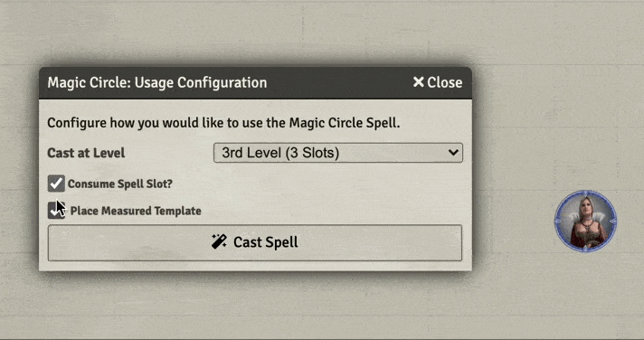

# 3rd Level Spells
This repository will contain my automated 3rd level spells as I create new or update existing (there are many) that currently reside only in my game data (which is regularly backed up) I'll add them here.

Spells will have notes on elemnts that I think are interesting.  In some cases differences from RAW, notes on how to use the spell in game, or coding notes.

* [Animate Dead](#animate-dead)
* [Call Lightning](#call-lightning) (ASE)
* [Clairvoyance](#clairvoyance)
* [Counterspell](#counterspell)
* [Lightning Bolt](#lightning-bolt)
* [Magic Circle](#magic-circle)
* [Thunder Step](#thunder-step)
* [Vampiric Touch](#vampiric-touch) (ASE)

[*Back to List of All Spells*](../README.md)

## Spell Notes

### Animate Dead

This spell is offered in the [Advanced Spell Effects Module](https://github.com/Vauryx/AdvancedSpellEffects/wiki/Currently-Available-Spells#animate-dead), when I tried to use it I ran into conflicts with [Auomated Evocations](https://github.com/theripper93/automated-evocations) module which I have been using for a while now.  I ended up opting to keep the AE implementation which works just fine and doesn't require (or check for) nearby corpses. That seems like a better choice as I don't want to force the GM to litter dead tokens everywhere they should be.  

It does seem like the summoned tokens need a few moments to *settle* into the scene.  If they are moved too soon, Token Attacher will get all grumpy and the following command may need to run to fix it:

~~~javascript
tokenAttacher.deleteMissingLinks()
~~~

[*Back to 3rd Level Spell List*](#3rd-level-spells)

---

### Call Lightning

This spell is nifty as built in the [Advanced Spell Effects Module](https://github.com/Vauryx/AdvancedSpellEffects/wiki/Currently-Available-Spells#call-lightning).

It first places a large storm cloud and then provides the token with a temporary at-will ability to call down a lightning strike.

When the spell completes, the GM will need to remove the summoned storm cloud as appropriate.

I have left my original implementation in the repo as insurance against the module version going sideways in the future.

[*Back to 3rd Level Spell List*](#3rd-level-spells)

---

### Clairvoyance

Nothing more than a tested SRD implmentation. It will be handled between players and GM.  Nothing special.

[*Back to 3rd Level Spell List*](#3rd-level-spells)

---

### Counterspell

Slighty updated spell description from the standard SRD.  Actual use of this spell will be manual for the GM.

[*Back to 3rd Level Spell List*](#3rd-level-spells)

---

### Lightning Bolt

This worked great out of the box.  Just a testing of the SRD version.

[*Back to 3rd Level Spell List*](#3rd-level-spells)

---

### Magic Circle

This spell places a graphic and names it to indicate the type of creature warded and the direction of warding.  It does nothing mechanically, leaving assignment of penalties and restriction of movement up to the GM and the players.

When cast, it pops a dialog asking for the type of creatures being warded and the direction of warding that looks like this:

It will then render the graphic where the targeting template had been placed.  When the spell is completed, the GM will need to use the **Show Sequencer Effects Viewer** button (left hand menus, near bottom, looks like a film strip) and remove the effect with a menu that looks like the following (that popup also has info on the selections made for reference):

Here's what the spell looks like on the random battle map.

[*Back to 3rd Level Spell List*](#3rd-level-spells)

---

### Thunder Step

This one operates as two, sometimes three part exectution. 

1. The caster needs to use the **Thunder Step (Teleportation)** spell.  It will show the allowed area (which is huge -- 300 foot radius) for teleportaion.  The user then clicks the destimation and will go poof to the new spot.
2. Optionally, one freindly creature who was next to the caster can be moved with the caster.  This will need to be done by the token owner of the GM, manually.
3. Finally, the caster should use the **Thunder Step (Damage)** spell, making sure not to use a spell slot.  They targeting marker needs to be clicked into the space vacated by the caster. It will then cause the appropriate damage.

All of the above is done without a macro, just **Automated Animations** and standard FoundryVTT settings.

I have looked at the [Advanced Spell Effects Module](https://github.com/Vauryx/AdvancedSpellEffects/wiki/Currently-Available-Spells#thunder-step) implmenation of this spell.  It is a smoother approach with niftier graphics but depennds on correct marking of tokens friendly status and caused multiple *ghost* moves of the casting token after spell completion.  I don't know what it was doing actually, but I don't see further investigation as worthwhile -- sticking with my three step implementation that I can debug as required. 

[*Back to 3rd Level Spell List*](#3rd-level-spells)

---

### Vampiric Touch

This spell is nifty as built in the [Advanced Spell Effects Module](https://github.com/Vauryx/AdvancedSpellEffects/wiki/Currently-Available-Spells#vampiric-touch).

It heals the using token and creats an at-will ability on that token for subsequent rounds.  Exactly what I'd like to see it do.  

[*Back to 3rd Level Spell List*](#3rd-level-spells)

---
