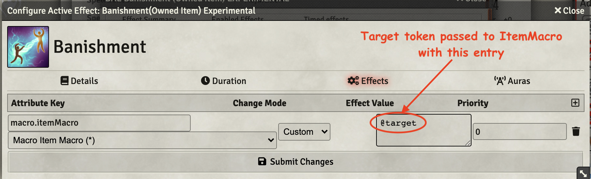
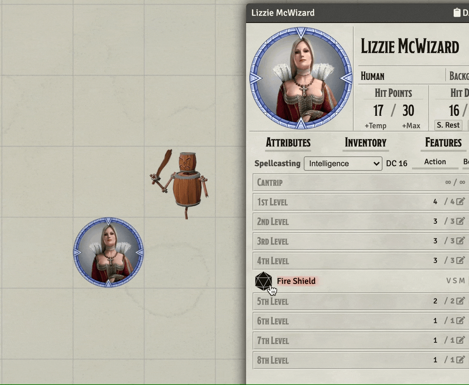
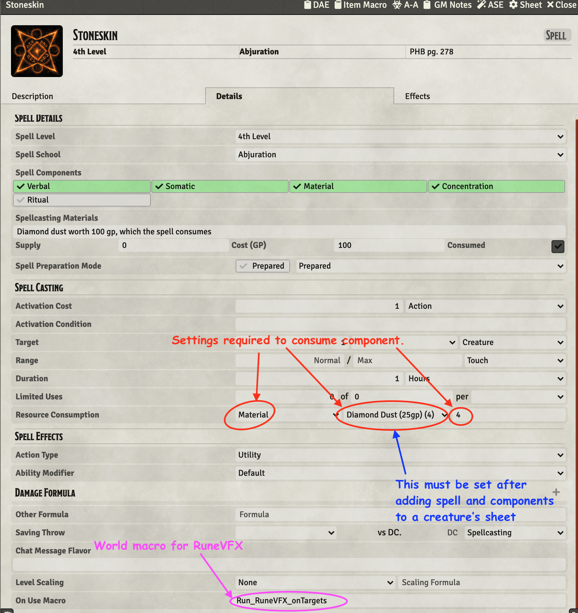

# 4th Level Spells
This repository will contain my automated 4th level spells as I create new or update existing (there are many) that currently reside only in my game data (which is regularly backed up) I'll add them here.

Spells will have notes on elemnts that I think are interesting.  In some cases differences from RAW, notes on how to use the spell in game, or coding notes.

* [Banishment](#banishment)
* [Black Tentacles](#black-tentacles)
* [Blight](#blight)
* [Death Ward](#death-ward)
* [Fire Shield](#fire-shield)
* [Greater Invisibility](#greater-invisibility)
* [Phantasmal Killer](#phantasmal-killer)
* [Polymorph](#polymorph)
* [Stoneskin](#stoneskin)

[*Back to List of All Spells*](../README.md)

## Spell Notes

### Banishment

This is built on a MidiQOL Sample Item which handled "banishing" one target with a very simple set of messages to the GM in chat. 
 
The sample spell already "handles" upcasting by allowing multiple tokens to be targeted, but it doesn't:

1. Provide a VFX
2. Give meaningful messages

Well, it does those things now.  It calls *jez.runRuneVFX(element, school, color)* to run a rune VFX on each target and *jez.postMessage(...)* to handle the messages.  

On interesting element of the sample macro is its use of on/off executions and passing the targeted token to the macro as a parameter driven by the DAE effect configuration.

[*Back to 4th Level Spell List*](#4th-level-spells)

---

### Black Tentacles

This one is a whopper!

This spell creates a 20x20 foot area that has a chance to restrain and damage any creature in the area.  My implementation manages creation and removal of all the elements but it does not automatically apply the effects to creatures, rather it provides an at-will spell item that can be triggered to perform that part.  

Summary of the things this one does:

#### On Use
1. Place a 20x20 square template forcing savings throws and apply a DAE effect that includes adding a CUB condition.  All of this through standard item configuration settings.
2. Delete the template after extracting its coordinates 
3. Place a tile with VFX embedded where the template had been located.  Use VFX file: `modules/jb2a_patreon/Library/4th_Level/Black_Tentacles/BlackTentacles_01_Dark_Purple_600x600.webm`
4. Copy the item named *%%Black Tentacles Effect%%* from the *Items Directory* changing the name and deleting meta elements from the description delimited by **<strong>%%*%%</strong>**, that is bold text bookended by pairs of % symbols into the current actor's spell book as an at-will item.
5. Clear the DAE Flag: *Black_Tentacles* for future use.
6. Modify the *concentrating* effect on the current actor to fire ItemMacro with the ID of the tile that was placed for later deletion.

#### At Will
**Black Tentacles Effect** is used as an at-will item on each token that starts its turn in the area of effect and when they first enter.

1. Perform a saving throw, doing damage and adding effects as appropriate.
2. Store ID into the DAE Flag: *Black_Tentacles*

#### Each Turn
Afflicted tokens take damage and present a dialog that allows a skill check to remove the effect.  

#### Concentration Break

1. Delete the created tile
2. Delete the effects listed in the DAE Flag: *Black_Tentacles*
3. Delete the at-will spell item.

I am sure I have left a fair bit out.  It is quite the spell.

[*Back to 4th Level Spell List*](#4th-level-spells)

---

### Blight

Fairly simple macro that checks the target type giving immunity to undead and constructs; vulnerability to plants, and otherwise just rolling damage.  

The macro also plays a simple rune VFX on the target.

[*Back to 4th Level Spell List*](#4th-level-spells)

---

### Death Ward

There is no macro itemMacro for this one. This item simply calls Rune_RuneVFX_onTargets and places a DAE effect that simply marks the existence of the spell.  Effects to be handled manually.

[*Back to 4th Level Spell List*](#4th-level-spells)

---

### Fire Shield

This is a complex macro that uses an ItemMacro run as DAE On and DAE Off. 

When the macro is executed as an **DAE On** it does the following:

1. Delete any existing related temporary inventory items (Fire Shield (Cold) and Fire Shield (Hot))
2. Pops a dialog that asks if this is a hot or cold shield and then fires off a call back that:
	1. Runs a VFX rune and a persistent fire circle around the protectee
	2. Create the temporary inventory item
	3. Set the appropriate resistance and adjust the effect icon

When the macro is executed as an **DAE Off** it does the following:

1. Terminates the persistent VFX
2. Delete any existing related temporary inventory items (Fire Shield (Cold) and Fire Shield (Hot))
3. Post a completion message

The temporary inventory item is to be used manually to inflict the reflected damage.

[*Back to 4th Level Spell List*](#4th-level-spells)

---

### Greater Invisibility

This is just a minor reskinning of [Invisibility](../2nd_Level#invisibility).  It has a 10 round duration and does not drop when the invisible token attacks or casts a spell.

Curiously, it quietly supports upcasting, in the same manner as the Invisibility spell.  It being easier than having people target correctly than removing the option. 

[*Back to 4th Level Spell List*](#4th-level-spells)

---

### Phantasmal Killer

This spell places a DoT on the target which is allowed a save at the end of each turn. The DoT is implemented with Midi-QoL overtime settings.

[*Back to 4th Level Spell List*](#4th-level-spells)

---

### Polymorph

This spell uses the ability to drop a sheet from Actor's directory onto a token's sheet to transform the *victim* of the spell.  On the pop-up window that appears, ignore all the check boxes and just click the Polymorph button.

Reversing the transform is done with a button that appears at the top of the transformed token's sheet.

[*Back to 4th Level Spell List*](#4th-level-spells)

---

### Stoneskin

No macro required.  

This implementation:

* Places a DAE effect on the target giving damage resistance,
* plays a rune VFX via an ItemMacro call to the world macro: **Run_RuneVFX_onTargets**,
* Consumes 4 stacks of diamond dust valued at 25 gp each (assuming it is configured after adding it to a character's sheet. 

[*Back to 4th Level Spell List*](#4th-level-spells)

---
