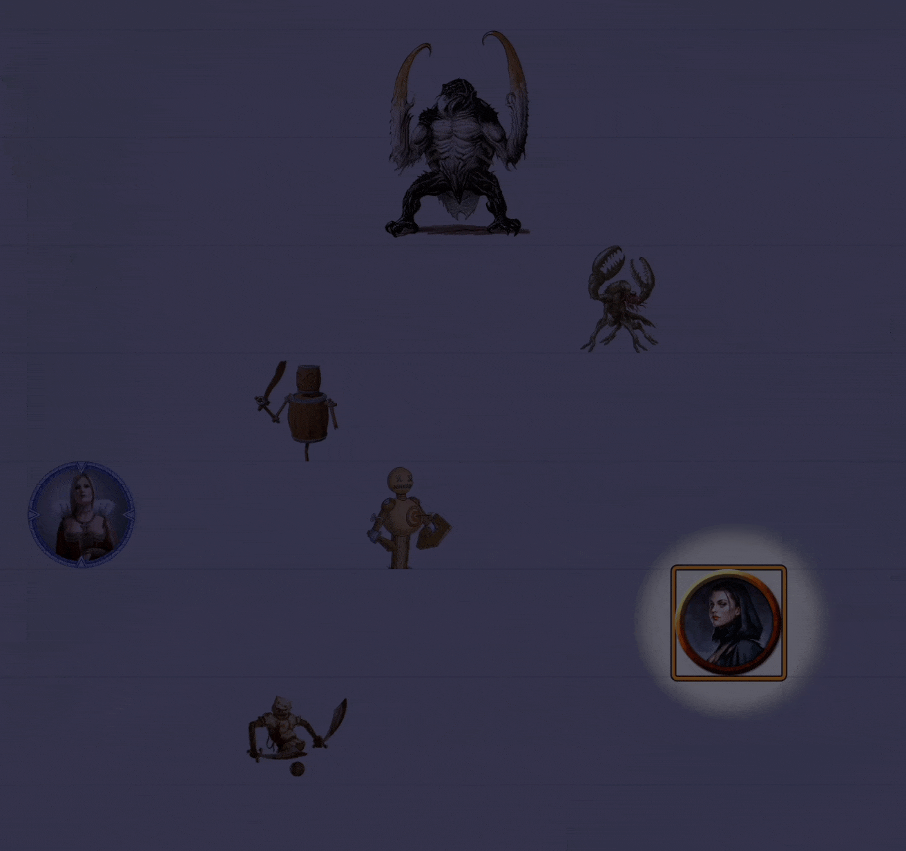
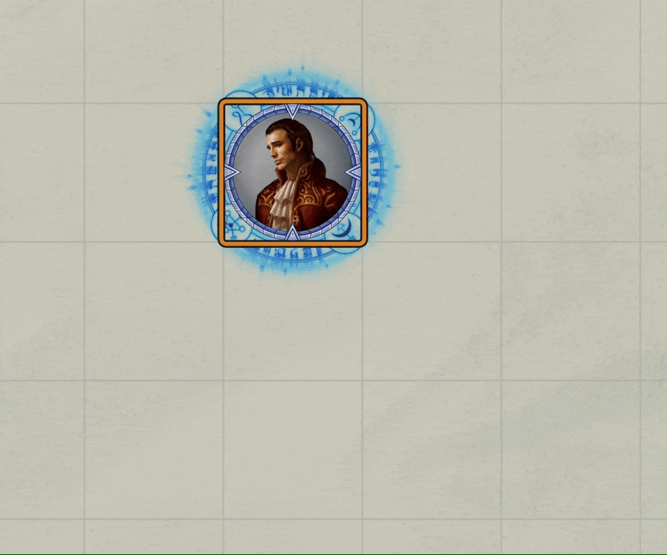
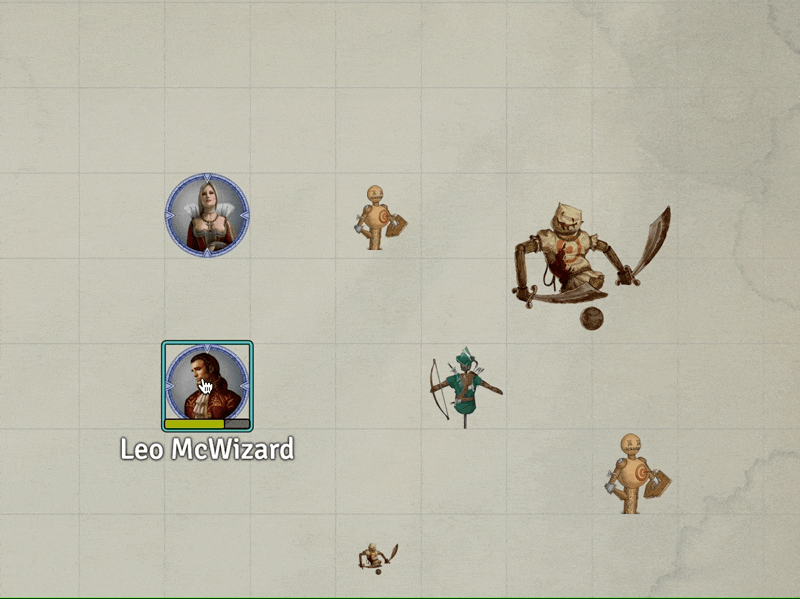

# 4th Level Spells
This repository will contain my automated 4th level spells as I create new or update existing (there are many) that currently reside only in my game data (which is regularly backed up) I'll add them here.

Spells will have notes on elemnts that I think are interesting.  In some cases differences from RAW, notes on how to use the spell in game, or coding notes.

* [Arcane Eye](#arcane-eye)
* [Banishment](#banishment)
* [Black Tentacles](#black-tentacles)
* [Blight](#blight)
* [Confusion](#confusion)
* [Death Ward](#death-ward)
* [Faithful Hound](#faithful-hound)
* [Fire Shield](#fire-shield)
* [Freedom of Movement](#freedom-of-movement)
* [Greater Invisibility](#greater-invisibility)
* [Hypnotic Pattern](#hypnotic-pattern)
* [Ice Storm](#ice-storm)
* [Phantasmal Killer](#phantasmal-killer)
* [Polymorph](#polymorph)
* [Staggering Smite](#staggering-smite)
* [Stoneskin](#stoneskin)

[*Back to List of All Spells*](../README.md)

## Spell Notes

### Banishment

This is built on a MidiQOL Sample Item which handled "banishing" one target with a very simple set of messages to the GM in chat. 
 
The sample spell already "handles" upcasting by allowing multiple tokens to be targeted, but it doesn't:

1. Provide a VFX
2. Give meaningful messages

Well, it does those things now.  It calls *jez.runRuneVFX(element, school, color)* to run a rune VFX on each target and *jez.postMessage(...)* to handle the messages.  

On interesting element of the sample macro is its use of on/off executions and passing the targeted token to the macro as a parameter driven by the DAE effect configuration.

 
Fire Shield in use.

[*Back to 4th Level Spell List*](#4th-level-spells)

---

### Arcane Eye

This one summons an arcane eye to the scene and provides the caster with dark-vision from it.  The eye can be moved as per RAW.  It disappears at spell duration or concentration drop.

The nifty part of this spell is that the placement cursor reads out distance from the caster while being used.  Something that should be retrofit to a lot of my summoning items.

 
Arcane Eye in use.

[*Back to 4th Level Spell List*](#4th-level-spells)

---

### Black Tentacles

This one is a whopper!

This spell creates a 20x20 foot area that has a chance to restrain and damage any creature in the area.  My implementation manages creation and removal of all the elements but it does not automatically apply the effects to creatures, rather it provides an at-will spell item that can be triggered to perform that part.  

Summary of the things this one does:

#### On Use
1. Place a 20x20 square template forcing savings throws and apply a DAE effect that includes adding a CUB condition.  All of this through standard item configuration settings.
2. Delete the template after extracting its coordinates 
3. Place a tile with VFX embedded where the template had been located.  Use VFX file: `modules/jb2a_patreon/Library/4th_Level/Black_Tentacles/BlackTentacles_01_Dark_Purple_600x600.webm`
4. Copy the item named *%%Black Tentacles Effect%%* from the *Items Directory* changing the name and deleting meta elements from the description delimited by **<strong>%%*%%</strong>**, that is bold text bookended by pairs of % symbols into the current actor's spell book as an at-will item.
5. Clear the DAE Flag: *Black_Tentacles* for future use.
6. Modify the *concentrating* effect on the current actor to fire ItemMacro with the ID of the tile that was placed for later deletion.

#### At Will
**Black Tentacles Effect** is used as an at-will item on each token that starts its turn in the area of effect and when they first enter.

1. Perform a saving throw, doing damage and adding effects as appropriate.
2. Store ID into the DAE Flag: *Black_Tentacles*

#### Each Turn
Afflicted tokens take damage and present a dialog that allows a skill check to remove the effect.  

#### Concentration Break

1. Delete the created tile
2. Delete the effects listed in the DAE Flag: *Black_Tentacles*
3. Delete the at-will spell item.

I am sure I have left a fair bit out.  It is quite the spell.

 
Black Tentacles in use.

[*Back to 4th Level Spell List*](#4th-level-spells)

---

### Blight

Fairly simple macro that checks the target type giving immunity to undead and constructs; vulnerability to plants, and otherwise just rolling damage.  

The macro also plays a simple rune VFX on the target.

[*Back to 4th Level Spell List*](#4th-level-spells)

---

### Confusion

This one is built on a DAE SRD macro (checkout *MidiMacros.confusion* from the console) or in that modules compendium. The macro as offered was a bit plain Jane and includes substantial cruft code that isn't used.  My implementation cleans that up and uses Automated Animations to play a VFX in place of the targeting template.

**Note**: *The spell does not upcast in an automated way.  Up casting can be done by manually changing the target area of affect.  This might be automated by using a crafty macro that runs before targeting (if that is possible) to modify the spell and then a corresponding macro to put the range back to normal.*

[*Back to 4th Level Spell List*](#4th-level-spells)

---

### Death Ward

There is no macro itemMacro for this one. This item simply calls Rune_RuneVFX_onTargets and places a DAE effect that simply marks the existence of the spell.  Effects to be handled manually.

[*Back to 4th Level Spell List*](#4th-level-spells)

---

### Faithful Hound

This item leverages WarpGate to place a faithful hound token on the map with an attack ability scaled per RAW.  It setups up a watchdog effect that will de-spawn the summoned token when it is removed. 

The spell does not manage the barking at 30 feet or de-spawn if separated by more than 100 feet elements of the spell.  The player is responsible for using the hound's attack ability when appropriate. 

The summoned hound will be visible to all the players, please remind them that it can only be seen by the summoner.

 
Faithful Hound in use.

[*Back to 4th Level Spell List*](#4th-level-spells)

---

### Fire Shield

This is a complex macro that uses an ItemMacro run as DAE On and DAE Off. 

When the macro is executed as an **DAE On** it does the following:

1. Delete any existing related temporary inventory items (Fire Shield (Cold) and Fire Shield (Hot))
2. Pops a dialog that asks if this is a hot or cold shield and then fires off a call back that:
	1. Runs a VFX rune and a persistent fire circle around the protectee
	2. Create the temporary inventory item
	3. Set the appropriate resistance and adjust the effect icon

When the macro is executed as an **DAE Off** it does the following:

1. Terminates the persistent VFX
2. Delete any existing related temporary inventory items (Fire Shield (Cold) and Fire Shield (Hot))
3. Post a completion message

The temporary inventory item is to be used manually to inflict the reflected damage.

 
Fire Shield in use.

[*Back to 4th Level Spell List*](#4th-level-spells)

---

### Freedom of Movement

There is no macro itemMacro for this one. This item simply calls Rune_RuneVFX_onTargets and places a DAE effect that simply marks the existence of the spell.  Effects to be handled manually.

[*Back to 4th Level Spell List*](#4th-level-spells)

---

### Greater Invisibility

This is just a minor reskinning of [Invisibility](../2nd_Level#invisibility).  It has a 10 round duration and does not drop when the invisible token attacks or casts a spell.

Curiously, it quietly supports upcasting, in the same manner as the Invisibility spell.  It being easier than having people target correctly than removing the option. 

[*Back to 4th Level Spell List*](#4th-level-spells)

---

### Hypnotic Pattern

This spell places runs a simple macro that shows a RuneVFX on the caster and pops a descriptive message onto the chat card.  It also uses the Automated Animations module to replace the standard template with a bit more interesting VFX.

I configured it to use this VFX file: `modules/jb2a_patreon/Library/Generic/Template/Square/TemplateRunesSquare_01_Regular_Blue_600x600.webm`

 
Hypnotic Pattern in use.

[*Back to 4th Level Spell List*](#4th-level-spells)

---

### Ice Storm

This spell places Tile with a cracked earth effect to mark the area of difficult terrain.  The tile should be removed at the end of the caster's next turn, but that is failing as of 5/29 on what seems like a Midi/Times-Up issue that I need to research.

[*Back to 4th Level Spell List*](#4th-level-spells)

---

### Phantasmal Killer

This spell places a DoT on the target which is allowed a save at the end of each turn. The DoT is implemented with Midi-QoL overtime settings.

6/10/22 Update: Now links the concentration and active effect with [jez.pairEffects(...)](../../jez-lib#pairEffectssubject1-effectName1-subject2-effectName2) library function. It also runs VFXes on target.

[*Back to 4th Level Spell List*](#4th-level-spells)

---

### Polymorph

This spell uses the ability to drop a sheet from Actor's directory onto a token's sheet to transform the *victim* of the spell.  On the pop-up window that appears, ignore all the check boxes and just click the Polymorph button.

 
Polymorph transform usage.

Reversing the transform is done with a button that appears at the top of the transformed token's sheet.

 
Polymorph restoration.

[*Back to 4th Level Spell List*](#4th-level-spells)

---

### Staggering Smite

Yet another in the series of smite spells.  This one fully automates the RAW spell.

[*Back to 4th Level Spell List*](#4th-level-spells)

---

### Stoneskin

No macro required.  

This implementation:

* Places a DAE effect on the target giving damage resistance,
* plays a rune VFX via an ItemMacro call to the world macro: **Run_RuneVFX_onTargets**,
* Consumes 4 stacks of diamond dust valued at 25 gp each (assuming it is configured after adding it to a character's sheet. 

 
Stoneskin Details.

[*Back to 4th Level Spell List*](#4th-level-spells)

---
