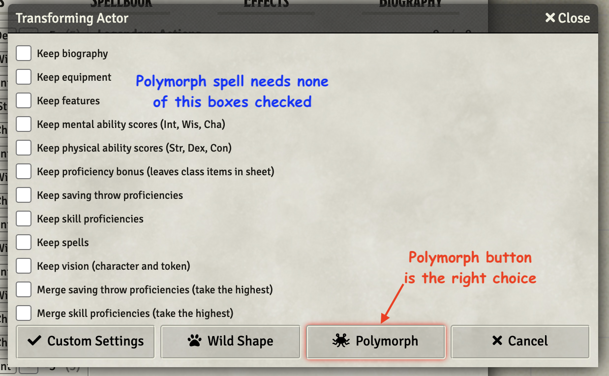
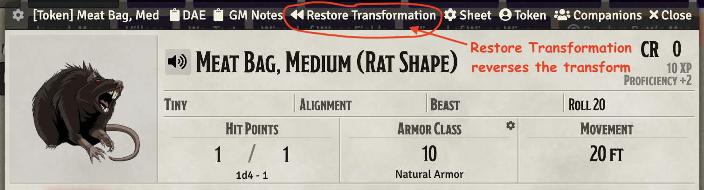

# 4th Level Spells
This repository will contain my automated 4th level spells as I create new or update existing (there are many) that currently reside only in my game data (which is regularly backed up) I'll add them here.

Spells will have notes on elemnts that I think are interesting.  In some cases differences from RAW, notes on how to use the spell in game, or coding notes.

* [Greater Invisibility](#greater-invisibility)
* [Phantasmal Killer](#phantasmal-killer)
* [Polymorph](#polymorph)

[*Back to List of All Spells*](../README.md)

## Spell Notes

### Greater Invisibility

This is just a minor reskinning of [Invisibility](../2nd_Level#invisibility).  It has a 10 round duration and does not drop when the invisible token attacks or casts a spell.

Curiously, it quietly supports upcasting, in the same manner as the Invisibility spell.  It being easier than havimg people target correctly than removing the option. 

[*Back to 4th Level Spell List*](#4th-level-spells)

---

### Phantasmal Killer

This spell places a DoT on the target which is allowed a save at the end of each turn. The DoT is implemented with Midi-QoL overtime settings.

[*Back to 4th Level Spell List*](#4th-level-spells)

---

### Polymorph

This spell uses the ability to drop a sheet from Actor's directory onto a token's sheet to transform the *victim* of the spell.  On the pop-up window that appears, ignore all the check boxes and just click the Polymorph button.

Reversing the transform is done with a button that appears at the top of the transformed token's sheet.

[*Back to 4th Level Spell List*](#4th-level-spells)

---

