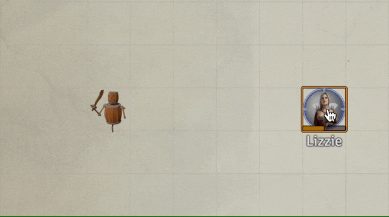
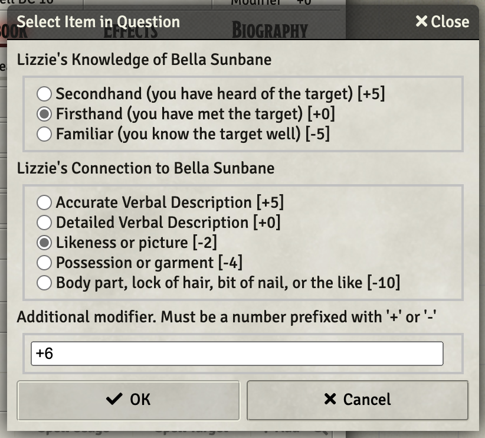
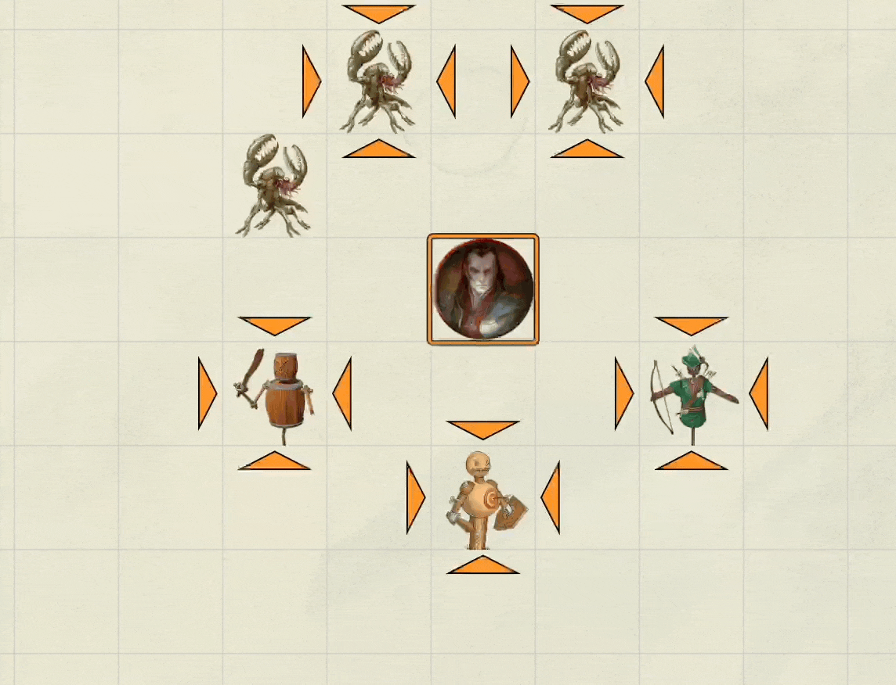

# 5th Level Spells
This repository will contain my automated 5th level spells as I create new or update existing (there are many) that currently reside only in my game data (which is regularly backed up) I'll add them here.

Spells will have notes on elemnts that I think are interesting.  In some cases differences from RAW, notes on how to use the spell in game, or coding notes.

* [Animate Objects](#animate-objects)
* [Cloudkill](#cloudkill)
* [Cone of Cold](#cone-of-cold)
* [Contact Other Plane](#contact-other-plane)
* [Dispel Evil and Good](#dispel-evil-and-good)
* [Geas](#geas)
* [Mass Cure Wounds](#mass-cure-wounds)
* [Raise Dead](#raise-dead)
* [Scrying](#scrying)
* [Steelwind Strike](#steelwind-strike) (ASE)
* [Wall of Force](#wall-of-force) (ASE)

[*Back to List of All Spells*](../README.md)

## Spell Notes

---

### Animate Objects

This item uses an adaptive menu to guide the use of WarpGate to place up to 10 actors from the actor's directory onto the scene.  A watchdog is utilized to remove any summons that may remain at the end of the spell's duration. 

Some spell highlights:

* Checks for availability of all summons before offering them
* Manages a summoning budget, terminating when spent
* Places new actors via warpgate
* Runs some VFXs to dress up the summons
* Deletes all of the summons at end of spell
* Renames summons to mark the summoner and make unique.

[*Back to 5th Level Spell List*](#5th-level-spells)

---

### Cloudkill

This spell creates a Tile with a VFX of an angry yellow-green cloud that represents the area of effect.  That tile can be moved **manually** by the GM as appropriate to represent the 10 feet of movement per turn.  The caster of the spell is given a temporary at-will spell in its spellbook that is to be used to inflict the poison damage effects on targets that begin their turn in the cloud or enter it.

I had trouble with the Active Auras implementation for this spell, so I fell back to my familiar approach of creating a temporary item that can be **manually** used to inflict the effect of the spell.

[*Back to 5th Level Spell List*](#5th-level-spells)

---

### Cone of Cold

This spell is a standard setup with an Automated Animation added, which is I must say, pretty cool! (Get it!!!)

[*Back to 5th Level Spell List*](#5th-level-spells)

---

### Contact Other Plane

Implemented via DAE and a CUB condition without a macro.

A few key elements:

1. The spell description must contain the *magic* phrase ***no damage on save*** to cause a save to do zero damage to the caster.
1. Insane condition is added by using *macro.CUB* as an attribute in the DAE conditions.
1. Insane condition remains till completion of next long rest.

The spell description must contain the *magic* phrase ***no damage on save*** to cause a save to do zero damage to the caster.

[*Back to 5th Level Spell List*](#5th-level-spells)

---

### Dispel Evil and Good

There is no macro itemMacro for this one. This item simply calls Rune_RuneVFX_onSelf and places a DAE effect that simply marks the existence of the spell.  Effects to be handled manually.

[*Back to 4th Level Spell List*](#4th-level-spells)

---

### Geas

This spell simply places a DAE effect that places a CUB condition of charmed on the target, if it fails its save.  It does not handle the damage element or ultimate removal of the effect as that is very much up to GM judgement.

[*Back to 5th Level Spell List*](#5th-level-spells)

---

### Mass Cure Wounds

Spell built on Cure Wounds that allows pre-targeting of tokens, checking to make sure that there are between 1 and 6 targeted. If more than 6, a warning is issued and manual adjustment is needed.

It checks creature types and generates a warning for those that are undead or construct type.  The healing is already applied at that point, so it requires a manual adjustment.

[*Back to 5th Level Spell List*](#5th-level-spells)

---

### Raise Dead

This spell increases the targets HP by one.  It does not check for validity of the cast (e.g.,. is the target dead?).  It also adds four stacks of a debuff that impose the penalty.  One instance of the debuff should be removed at each subsequent long rest.

[*Back to 5th Level Spell List*](#5th-level-spells)

---

### Scrying

This implementation does a few things:

1. Checks to make sure the target is actually targeted (presumably this will usually require the GM to drag a token to the current scene just for this spell),
2. Verifies that the caster has an item named "Scrying Focus" (exact name) in inventory,
3. Pops a dialog to obtain the modifiers that should be applied to the saving throw and then automates the saving throw, 
4. Performs the saving throw,
5. Displays the result.

[*Back to 5th Level Spell List*](#5th-level-spells)

---

### Steelwind Strike

This spell looks awesome as built in the [Advanced Spell Effects Module](https://github.com/Vauryx/AdvancedSpellEffects/wiki/Currently-Available-Spells#steel-wind-strike).

When this spell is used, it is essential that the targets be pre-selected before casting the spell.  I have added a note to that effect.

Side Note: This spell can leave the active token unfortunately rotated.  This can be fixed, on a mac, by selecting the token and rotating it with cmd-mouse wheel.

[*Back to 5th Level Spell List*](#5th-level-spells)

---

### Wall of Force

This spell looks intersecting as built in the [Advanced Spell Effects Module](https://github.com/Vauryx/AdvancedSpellEffects/wiki/Currently-Available-Spells#wall-of-force).

In my testing, some manual cleanup was needed when the spell completes, but on balance, it seems like a very useful implementation.

Here are the author's points from his wiki:

* There are options for pre-made shapes, as well as manual placement.
* When placing the panels manually, move the mouse around to see the eligible spots you can place the next panel at.
* There are template override settings in the module settings that apply to the templates set by this spell

[*Back to 5th Level Spell List*](#5th-level-spells)

---