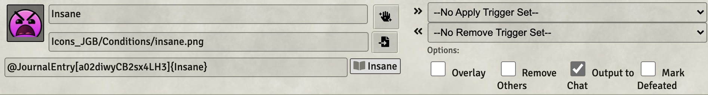

# 5th Level Spells
This repository will contain my automated 5th level spells as I create new or update existing (there are many) that currently reside only in my game data (which is regularly backed up) I'll add them here.

Spells will have notes on elemnts that I think are interesting.  In some cases differences from RAW, notes on how to use the spell in game, or coding notes.

* [Animate Objects](#animate-objects)
* [Arcane Hand](#arcane-hand)
* [Cloudkill](#cloudkill)
* [Cone of Cold](#cone-of-cold)
* [Conjure Elemental](#conjure-elemental)
* [Contact Other Plane](#contact-other-plane)
* [Danse Macabre](#danse-macabre)
* [Dispel Evil and Good](#dispel-evil-and-good)
* [Dream](#dream)
* [Geas](#geas)
* [Hold Monster](#hold-monster)
* [Mass Cure Wounds](#mass-cure-wounds)
* [Raise Dead](#raise-dead)
* [Scrying](#scrying)
* [Steelwind Strike](#steelwind-strike) (ASE)
* [Wall of Force](#wall-of-force) (ASE)

[*Back to List of All Spells*](../README.md)

## Spell Notes

---

### Animate Objects

This item uses an adaptive menu to guide the use of WarpGate to place up to 10 actors from the actor's directory onto the scene.  A watchdog is utilized to remove any summons that may remain at the end of the spell's duration. 

Some spell highlights:

* Checks for availability of all summons before offering them
* Manages a summoning budget, terminating when spent
* Places new actors via warpgate
* Runs some VFXs to dress up the summons
* Deletes all of the summons at end of spell
* Renames summons to mark the summoner and make unique.

 
Animate Objects in use.

[*Back to 5th Level Spell List*](#5th-level-spells)

---

### Arcane Hand

This ability uses WarpGate to summon and customize an actor, *%Arcane Hand%* from the actor's directory.  The caster is first presented with a dialog that allows the selection of one of the supported colors for the hand which will then be used for the token and the image icons for all of the abilities.  

Next The hand is modified when summoned in a couple of ways:

1. The name is changed to incorporate the summoner's name
2. Hit points are set to the maximum health of the summoner
3. Challenge rating of the hand is set to the level of the summoner to force the proficiency bonus to match
4. Intelligence stat is set to match the summoner's casting stat for cast mod purposes.  

The abilities are:

1. **Clenched Fist** this ability is scaled for damage when created.  When used it acts as a simple melee attack against the target.
2. **Forceful Hand** conducts a strength vs athletics test.  If the hand wins, it posts a chat message explaining how far the target is pushed. 
3. **Grasping Hand** this ability is scaled when called to reflect the increased damage caused at higher casting levels.  When used, it checks to see if the hand is currently grappling.  If it is grappling and is targeting the grappled target, it inflicts damage and ends.  If it is grappling a different target, it drops that grapple.  If continuing, it attempts to grapple the current target.
4. **Interposing Hand** posts a message about the effects of this option but doesn't automate them. 

All of the above requires 4 macros and a configured actor in the actor's directory.

One more thing, a utility macro has been crafted so that the grappled/grappling effects can remove their paired effect.  This macro **Remove_Paired_Effect** needs to be placed in the macro folder and is called when effects are removed to cleanse their partner from the scene.

 
Arcane Hand in use.

 
Some of the chat cards this can produce.

[*Back to 5th Level Spell List*](#5th-level-spells)

---

### Cloudkill

This spell creates a Tile with a VFX of an angry yellow-green cloud that represents the area of effect.  That tile can be moved **manually** by the GM as appropriate to represent the 10 feet of movement per turn.  The caster of the spell is given a temporary at-will spell in its spellbook that is to be used to inflict the poison damage effects on targets that begin their turn in the cloud or enter it.

I had trouble with the Active Auras implementation for this spell, so I fell back to my familiar approach of creating a temporary item that can be **manually** used to inflict the effect of the spell.

 
Cloudkill in use.

[*Back to 5th Level Spell List*](#5th-level-spells)

---

### Cone of Cold

This spell is a standard setup with an Automated Animation added, which is I must say, pretty cool! (Get it!!!)

 
Spell in use.

[*Back to 5th Level Spell List*](#5th-level-spells)

---

### Conjure Elemental

This one was, as they might say, interesting to create.  It does the following noteworthy things:

1. Sets the maximum CR of elemental to be summoned (args[0]?.spellLevel || 5)
2. Scans through the actor directory looking for all unlinked NPC elementals, excluding those on an exclusion list (e.g. Spritual Weapon) and those that start with a % character.
3. Sorts the results by CR so that the highest will be presented first in the selection dialog, excluding those that are above maximum CR.
4. Display a selection dialog asking the player to select the desired creature
5. Use a warpgate crosshair to allow placement of the spawn point
6. Run a VFX on the summon event
7. Set control of the new creature to the player
8. Place a timer effect on the summoned creature so it will despawn at end of spell duration (extracted from the item card) with exit VFX.
9. Modify concentration effect on the caster so that if concentration drops, the summoned creature flips disposition, the player loses control of it, and a message goes to chat.

 
Conjure Elemental in use.

Notice the border color of the summoned elemental initially (cyan) and after losing control (red).

 
Conjure Elemental chat cards.

[*Back to 5th Level Spell List*](#5th-level-spells)

---

### Contact Other Plane

Implemented via DAE and a CUB condition without a macro.

A few key elements:

1. The spell description must contain the *magic* phrase ***no damage on save*** to cause a save to do zero damage to the caster.
1. Insane condition is added by using *macro.CUB* as an attribute in the DAE conditions.
1. Insane condition remains till completion of next long rest.

The spell description must contain the *magic* phrase ***no damage on save*** to cause a save to do zero damage to the caster.

 
Spell setup screen grab

[*Back to 5th Level Spell List*](#5th-level-spells)

---

### Danse Macabre

Implement the amazing Danse Macabre spell
 
This macro does quite a few things.  Here are the highlights:

* Verify potentially summoned actors exist
* Ask the user how many skeletons/zombies are to be summoned
* Validate the input, repeating the dialog if invalid
* Place the summoned, modified tokens, on the scene with warpgate, with VFX
* Modify concentrating effect to remove the tokens on completion
* Trigger Dismiss_Tokens when concentrating effect removed to delete summons

 
Spell in use.

 
Example chat card

[*Back to 4th Level Spell List*](#4th-level-spells)

---

### Dispel Evil and Good

There is no macro itemMacro for this one. This item simply calls Rune_RuneVFX_onSelf and places a DAE effect that simply marks the existence of the spell.  Effects to be handled manually.

[*Back to 4th Level Spell List*](#4th-level-spells)

---

### Dream

This spell simply runs a runeVFX on the caster and target.  The description notes that the spell is not automate, but does include clickable links to roll a save and to roll (but not apply) damage.

[*Back to 5th Level Spell List*](#5th-level-spells)

---

### Geas

This spell simply places a DAE effect that places a CUB condition of charmed on the target, if it fails its save.  It does not handle the damage element or ultimate removal of the effect as that is very much up to GM judgement.

[*Back to 5th Level Spell List*](#5th-level-spells)

---

### Hold Monster

The undead immunity element of this spell is accomplished by checking the box next to **Activation Condition true required for effect activation** and putting the right bit of code in the free text box labeled **Activation Condition**.

A macro call to **Run_RuneVFX_onTargets** is included to play a rune on targeted creatures. 

A DAE effect for midi OverTime (*flags.midi-qol.OverTime*) is used to setup the save every turn aspect of this spell. 
`turn=end, saveAbility=wis, saveDC=@attributes.spelldc,label="Save vs Hold Monster"`

[*Back to 5th Level Spell List*](#5th-level-spells)

---

### Mass Cure Wounds

Spell built on Cure Wounds that allows pre-targeting of tokens, checking to make sure that there are between 1 and 6 targeted. If more than 6, a warning is issued and manual adjustment is needed.

It checks creature types and generates a warning for those that are undead or construct type.  The healing is already applied at that point, so it requires a manual adjustment.

[*Back to 5th Level Spell List*](#5th-level-spells)

---

### Raise Dead

This spell increases the targets HP by one.  It does not check for validity of the cast (e.g.,. is the target dead?).  It also adds four stacks of a debuff that impose the penalty.  One instance of the debuff should be removed at each subsequent long rest.

[*Back to 5th Level Spell List*](#5th-level-spells)

---

### Scrying

This implementation does a few things:

1. Checks to make sure the target is actually targeted (presumably this will usually require the GM to drag a token to the current scene just for this spell),
2. Verifies that the caster has an item named "Scrying Focus" (exact name) in inventory,
3. Pops a dialog to obtain the modifiers that should be applied to the saving throw and then automates the saving throw, 
4. Performs the saving throw,
5. Displays the result.

 
Spell Dialog screen grab.

[*Back to 5th Level Spell List*](#5th-level-spells)

---

### Steelwind Strike

This spell looks awesome as built in the [Advanced Spell Effects Module](https://github.com/Vauryx/AdvancedSpellEffects/wiki/Currently-Available-Spells#steel-wind-strike).

When this spell is used, it is essential that the targets be pre-selected before casting the spell.  I have added a note to that effect.

Side Note: This spell can leave the active token unfortunately rotated.  This can be fixed, on a mac, by selecting the token and rotating it with cmd-mouse wheel.

 
Spell in use.

[*Back to 5th Level Spell List*](#5th-level-spells)

---

### Wall of Force

This spell looks intersecting as built in the [Advanced Spell Effects Module](https://github.com/Vauryx/AdvancedSpellEffects/wiki/Currently-Available-Spells#wall-of-force).

 
Spell in use.

In my testing, some manual cleanup was needed when the spell completes, but on balance, it seems like a very useful implementation.

Here are the author's points from his wiki:

* There are options for pre-made shapes, as well as manual placement.
* When placing the panels manually, move the mouse around to see the eligible spots you can place the next panel at.
* There are template override settings in the module settings that apply to the templates set by this spell

[*Back to 5th Level Spell List*](#5th-level-spells)

---