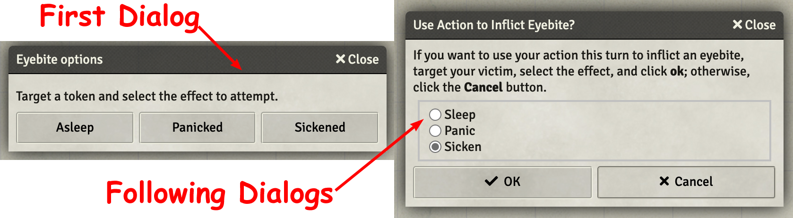

# 6th Level Spells
This repository will contain my automated 6th level spells as I create new or update existing (there are many) that currently reside only in my game data (which is regularly backed up) I'll add them here.

Spells will have notes on elemnts that I think are interesting.  In some cases differences from RAW, notes on how to use the spell in game, or coding notes.

* [Chain Lightning](#chain-lightning) (ASE)
* [Eyebite](#eyebite)
* [Globe of Invulnerability](#globe-of-invulnerability)
* [Steel Wind Strike](#steel-wind-strike)

[*Back to List of All Spells*](../README.md)

## Spell Notes

### Chain Lightning

This spell is awesome as built in the [Advanced Spell Effects Module](https://github.com/Vauryx/AdvancedSpellEffects/wiki).

The only change I made was a slight tweak to the random delay range.

[*Back to 6th Level Spell List*](#6th-level-spells)

---

### Eyebite

This spell places a buff on the caster that will initially and at the start of the turn while the buff is active present an option to the user to attempt to place a debuff on a specific target.  The debuff option is presented as a dialog, the first offering the three debuffs andexpecting the user to target one (exactly one) token that will be forced to make a saving throw or be debuffed.

Each of the debuffs has a unique exit condition which is automated by this macro.

1. **Sleep** -- *Unconscious* until jostled (manual) or damaged (automated)
1. **Panic** -- *Frightened* until no line of sight to caster and more than 60 feet away (automated)
1. **Sicken** -- *Poison* effect until a saving throw is made at end of target's turn (automated)

The debuffs are managed with the Combat Utility Belt (CUB) module, so they can be seen in the debuff status windows.

[*Back to 6th Level Spell List*](#6th-level-spells)

---

### Globe of Invulnerability

This implementation runs a VFX indicating the area containing the globe.  It does nothing to implement the effects in an automated way. 

[*Back to 6th Level Spell List*](#6th-level-spells)

---

### Steel Wind Strike

This spell seems awesome as built in the [Advanced Spell Effects Module](https://github.com/Vauryx/AdvancedSpellEffects/wiki).

[*Back to 6th Level Spell List*](#6th-level-spells)

---

