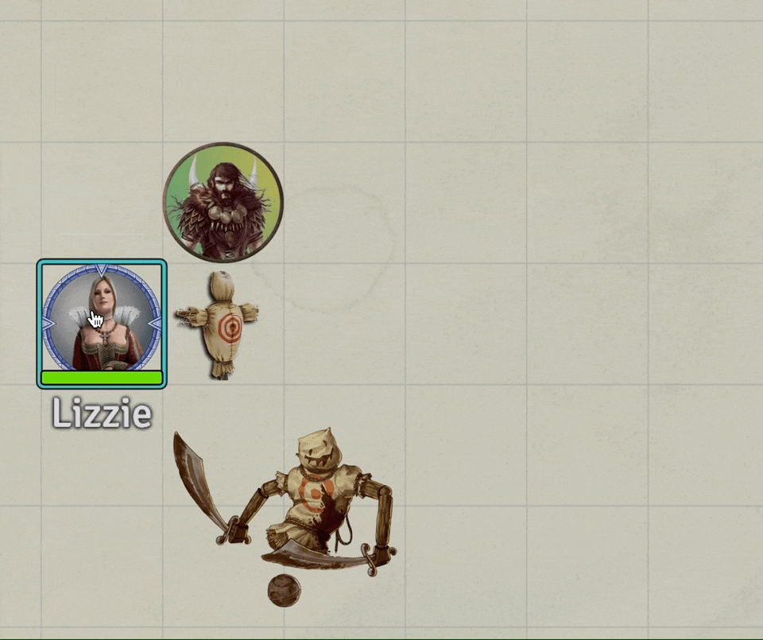
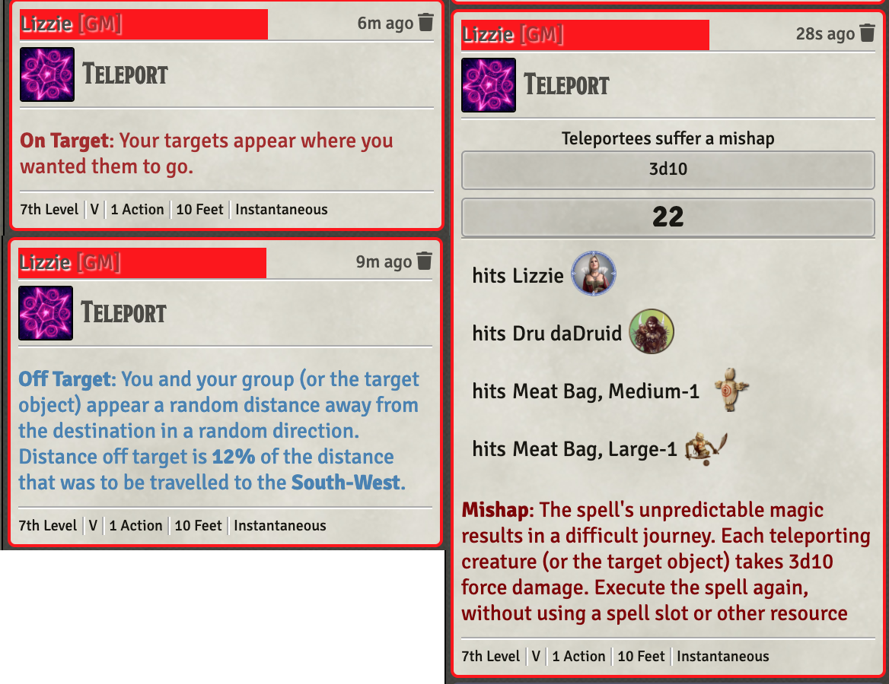

# 7th Level Spells
This repository will contain my automated 7th level spells as I create new or update existing (there are many) that currently reside only in my game data (which is regularly backed up) I'll add them here.

Spells will have notes on elements that I think are interesting.  In some cases differences from RAW, notes on how to use the spell in game, or coding notes.

* [Finger of Death](#finger_of_death)
* [Magnificent Mansion](#magnificent-mansion)
* [Mirage Arcane](#mirage_arcane)
* [Plane Shift](#plane-shift-self-only)
* [Teleport](#teleport)

[*Back to List of All Spells*](../README.md)

## Spell Notes

### Finger of Death

This implementation simply updated the description of the spell noting that the zombie *raising* when the spell kills a humanoid is to be handled **manually**.  It also uses a very generic macro that runs a VFX on the targeted tokens.

[*Back to 7th Level Spell List*](#7th-level-spells)

---

### Magnificent Mansion

Simply runs a RuneVFX on the caster and checks for a component (Magnificent Mansion Components) that can be added to inventory and configured into the spell.

[*Back to 7th Level Spell List*](#7th-level-spells)

---

### Mirage Arcane

This spell is handled manually by the GM/Players.  The only change is an update to the description to this effect.

[*Back to 7th Level Spell List*](#7th-level-spells)

---

### Plane Shift (Self Only)

This is a self-only variation of the RAW spell. It is simply a VFX and hiding of the casting token.

[*Back to 7th Level Spell List*](#7th-level-spells)

---

### Teleport

This spell presents a dialog that allows selection of the relationship between the caster and the desired destination.  It then plays a runeVFX on each targeted token and evaluates the results of the teleport, applying damage if needed.  The GM will need to move tokens between scenes if appropriate. 

[*Back to 7th Level Spell List*](#7th-level-spells)

---