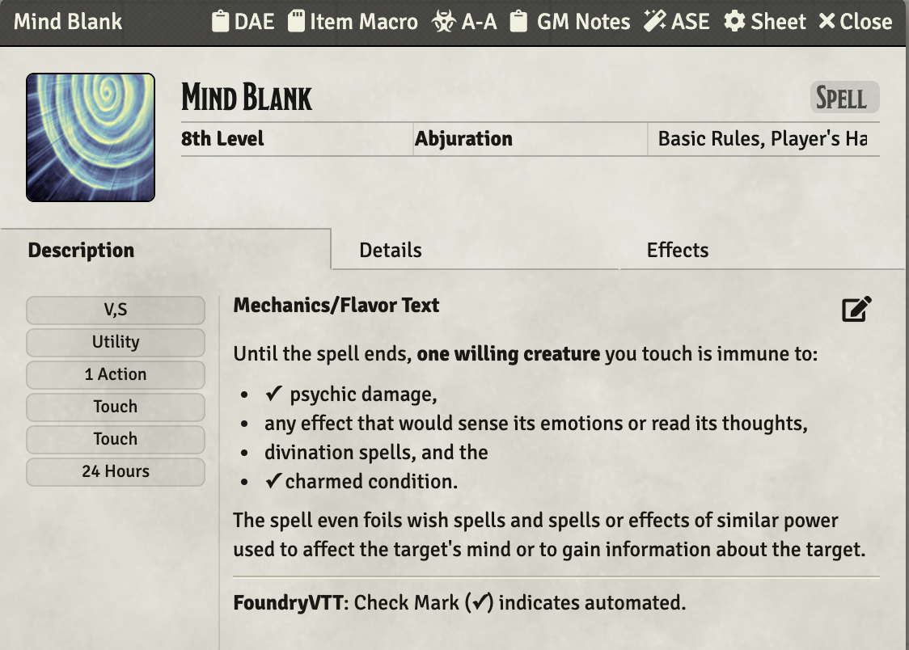

# 8th Level Spells
This repository will contain my automated 8th level spells as I create new or update existing (there are many) that currently reside only in my game data (which is regularly backed up) I'll add them here.

Spells will have notes on elements that I think are interesting.  In some cases differences from RAW, notes on how to use the spell in game, or coding notes.

* [Mind Blank](#mind-blank)
* [Power Word Stun](#power-word-stun)

[*Back to List of All Spells*](../README.md)

## Spell Notes

### Mind Blank

This spell applies a DAE effect to the target if the target that automates two elements of the spell:

1. Psychic damage,
1. Charmed condition.

The other two effects are to be handled manually

1. any effect that would sense its emotions or read its thoughts,
1. divination spells.

It runs a VFX by using the world macro: **Run_RuneVFX_onTargets**

[*Back to 8th Level Spell List*](#8th-level-spells)

---

### Power Word Stun

This spell applies a DAE effect to the target if the target has less than 151 hit points.  That DAE condition does two things:

Uses macro.CUB to add the CUB condition *Stunned* to the target, which in turn adds the related CUB condition *Incapacitated*.

Adds a Midi-QoL OverTime effect that causes the afflicted to attempt a saving through at the end of each of its turns.

It also makes a *jez.runRuneVFX(tToken, jez.getSpellSchool(aItem))* call to run a simple VFX on the target, regardless of success/failure.

[*Back to 8th Level Spell List*](#8th-level-spells)

---
