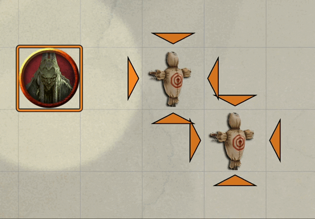
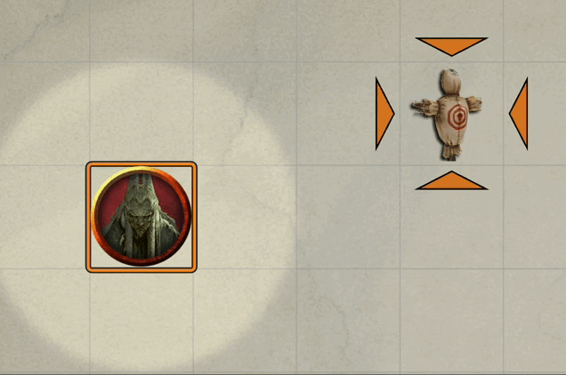
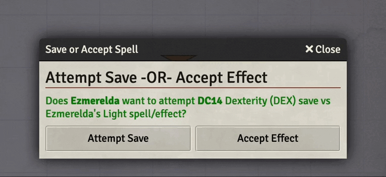
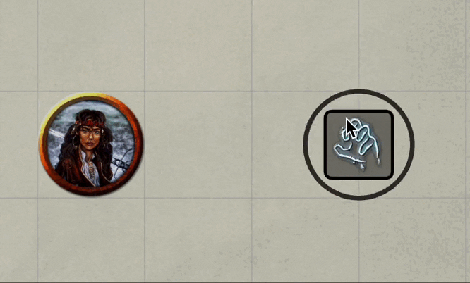

# Cantrips
This repository will contain my automated Cantrips as I create new or update existing (there are many) that currently reside only in my game data (which is regularly backed up) I'll add them here.

Spells will have notes on elemnts that I think are interesting.  In some cases differences from RAW, notes on how to use the spell in game, or coding notes.

* [Acid Splash](#acid-splash)
* [Agonizing Blast](#agonizing-blast)
* [Druid Craft](#druid-craft)
* [Eldritch Blast](#eldritch-blast)
* [Fire Bolt](#fire-bolt)
* [Light](#light)
* [Mage Hand](#mage-hand)
* [Prestidigitation](#prestidigitation)

[*Back to List of All Spells*](../README.md)

## Spell Notes

### Acid Splash

This spell is configured using Automated Animations to add a green explosion on the target(s).  No error checking or macro is provided.

**Reminder**: For NPC's cantrips need to be scaled manually as they have no level for automated scaling.

### Agonizing Blast
 
This spell is *very* similar to [eldritch blast](#eldritch-blast).  The differences are adding the casters spell modifier to the damage roll and a different, darker, set of animations.

This spell is available through [Advanced Spell Effects Module](https://github.com/Vauryx/AdvancedSpellEffects/wiki/Currently-Available-Spells#eldritch-blast) and a configuartion check box to make [Eldritch Blast](#eldritch-blast) into Agonizing blast.  As discussed in my Eldritch Blast notes below, I am sticking with mu implementation.

[*Back to Cantrips List*](#cantrips)

---

### Druid Craft

This macro simply plays a VFX of a D12 over the casting token and spits out some text very briefly describing the spell.

[*Back to Cantrips List*](#cantrips)

---

### Eldritch Blast

Most of this spell is implemented by the configuratinn on the **Details** page. A screen shot of that configuration is included in the spells Repo data files. It is a copy of the Midi-SRD spell with scaling removed. 

It has an OnUse ItemMacro that implmenets a visual effect (VFX) by picking from a list of JB2A animations.  The animations selected are picked based on the distance between the two tokens involved in the casting. 

At higher caster levels (5+) this spell is supposed to have seperate beams that each have a to-hit roll, and I presume chance to break concentration.  I've chosen to implment this by making the spell itself not scale, the player simply needs to repeat the attack an appropriate number of times.

This spell is included in the [Advanced Spell Effects Module](https://github.com/Vauryx/AdvancedSpellEffects/wiki/Currently-Available-Spells#eldritch-blast) and works very similarly to the Magic Missle implementation with a targeting mode and then simultanous firing of bolts.  I'm less happy with that for this spell as I allow it to hit the same target multiple times possibly triggering multiple concentartion checks etc.  [RAW](https://www.dndbeyond.com/spells/eldritch-blast) states that the player should *Make a separate attack roll for each beam* which isn't what ASE is doing (I think). So I am sticking with my implmentation.

[*Back to Cantrips List*](#cantrips)

---

### Fire Bolt

Standard Fire Bolt setup plus a simple onuse ItemMacro to provide a bit of visual effects.

**Reminder**: For NPC's cantrips need to be scaled manually as they have no level for automated scaling.

---

### Light

Pops a dialog that allows the target to attempt a save or accept the light effect.  If light is to be applied it is added into FoundryVTT's lighting system with an option to select a color for the light.

[*Back to Cantrips List*](#cantrips)

---

### Mage Hand

Use warpgate to summon an actor named *magehand* to the scene and rename it for uniquness and to make ownership clear.  The new name is of the form: `Owner_Name's Magehand #`
Where # is the combat round of the summoning.

The summoner of the hand may move the token.  No effort is made to remove the hand at the end of spell duration as that is rarely an issue.

[*Back to Cantrips List*](#cantrips)

---

### Prestidigitation

This macro simply plays a VFX of a D12 over the casting token and spits out some text very briefly describing the spell.

[*Back to Cantrips List*](#cantrips)

---
