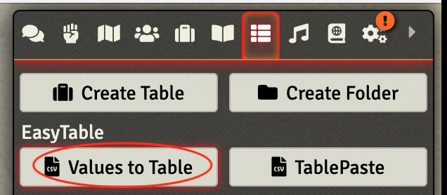
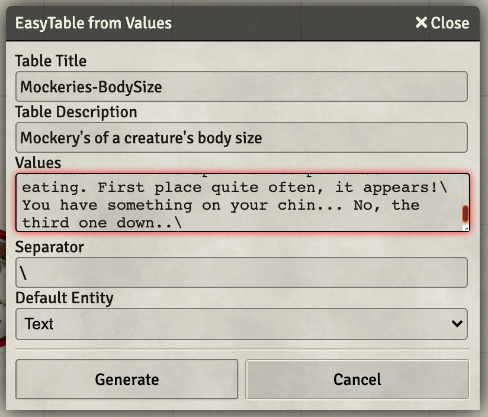

# Vicious Mockery Tables

I wanted a bunch more insults than the 100 that Crymic offered up in his macro.  Fortunately, I bumped into a post on Reddit, [100 Bard Insults for Vicious Mockery](https://www.reddit.com/r/dndnext/comments/3k7qpl/100_bard_insults_for_vicious_mockery/?utm_source=share&utm_medium=ios_app&utm_name=iossmf) that pointed me to a treasure trove on [Google Drive](https://docs.google.com/spreadsheets/d/1EAptYba75TxZcKgWketKzEJ4I3DeIm9ROhpJSzz71KA/edit#gid=0).

That gave me access to hundreds of insults that I wanted to roll into **FoundryVTT** rollable tables.  Another Reddit post suggested some methods: [Any easy ways of generating a rollable table from a .csv?](https://www.reddit.com/r/FoundryVTT/comments/t9lk44/any_easy_ways_of_generating_a_rollable_table_from/?utm_source=share&utm_medium=ios_app&utm_name=iossmf).  The answer seemed to be the [EasyTable by Blitz](https://github.com/BlitzKraig/fvtt-EasyTable) mod.  So I went to install that.  

## Building the Tables

The spreadsheet that I downloaded had multiple pages that had three columns each.

1. A check box
2. Actual string
3. Various comments

I deleted columns 1 and 3 and then reviewed what was presented in column 2, with an eye to removing jokes I felt inappropriate for my table and any asides the original author included (there were many).

I then added a new column (B), and added into cell B2 the following: `=A1&"\"` and copied it down the entire page. This creates a column that ends with the needed delimiter.

The resulting column can then be cut'n'paste'd to EasyTable. First click the **Values to Table** button in top portion of tables view.

Then fill in the popup window, pasting the column of text into the Values area.

Rinse and repeat for all of the tables desired.

## Final Touch
I took all of the tables and created one combined table that I pointed the Vicious Mockery macro at.