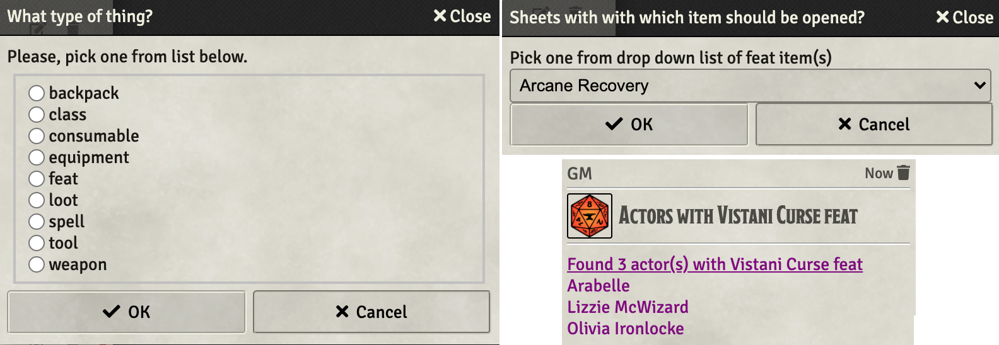
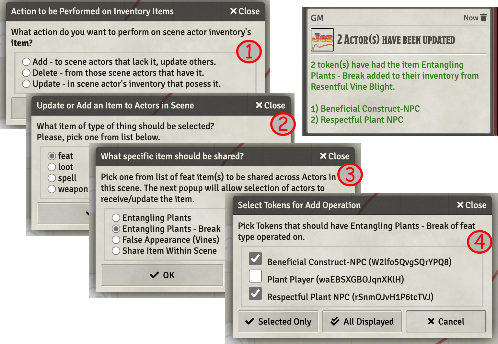

# Utility Macros

This repo holds macros that I have found to be of general utility **and** have foud the time to push to GitHub so that others might make of them what they will.

[Link back to my Repo Listing](https://github.com/Jeznar/GitRepo)

---

This readme contains a summary of the functions and for at least some of them a followup section with any notes that I felt worth sharing about each one.

## Functions in this Repo

* **[Demo Template VFX](#demo-temlate-vfx)** Demonstrates placement of a VFX at a template location.
* **[Get Entities](#get-entities)** accesses various actor, token, scene, item data from a single selected token. This is a demo of how to access various data types, not something directly useful. 
* **[Open Actor Sheets With...](#open-actor-sheets-with...)** fetchs a list of items from an actor allowing the user to pick one and then opens al of the actor's sheets that contain that item.
* **[Share Item Within Scene](#share-item-within-scene)** Adds/Updates/Deletes an item from a token to other tokens in the same scene.
* **[Swap Hidden Tokens](#swap-hidden-tokens)** swaps the visibility state of all or selected npc tokens.
* **[Swap Map](#swap-map)** swaps the current background image for the next or base. A naming convention must be followed.

## Notes on Functions

### **Demo Template VFX** 

Simple little macro that runs a VFX at the location of the template created by the invoking macro (ItemMacro OnUse). The macro deletes the template and uses a arandomized grpahic effect with a few other settings tossed in for fun.

[*Back to Utility Macros List*](#functions-in-this-repo)

---

### **Get Entities**

This macro is an exercise in obtaining various types of data from other types of data, e.g. fetch a token's data from a token ID number or name.   I use this as a reference when I have one of those situations where I know something about an entity but need something else and don't recall haow to get from here to there.

To use this macro, select a token and run it, likely from the hot bar.  Following is the (somewhat abbreviated) output as seen on my console.

<b>Console Output -- General Data Dug Up by ID / Name</b>

~~~javascript
Get_Entities
Token (Lizzie) ID XeuO8AZgdNQTmE53 ▸ Token5e {_events: i, _eventsCount: 2, tempDisplayObjectParent: null, ...}
Actor (Lizzie McWizard) ID aqNN90V6BjFcJpI5 ▸  Actor5e {overrides: {…}, _preparationWarnings: Array(0), ...}
Item 0 (Wizard) ID 0lsTnjT4oL9yON7c ▸ Item5e {labels: {…}, apps: {…}, _sheet: null, parent: Actor5e, ...}
Scene (Fidatov Manor), ID dVPUJ8RYs7i1eBmL ▸ Scene {dimensions: {…}, apps: {…}, _sheet: SceneConfig, ...}
Journal 0 (4. After Effects), ID 0Wl47Q3koIjt0xZb ▸ JournalEntry {apps: {…}, _sheet: null, parent: null, ...} 

Fetch data from "known" ID
--------------------------
TokenDoc fetched by ID TokenDocument5e {apps: {…}, _sheet: null, _object: Token5e, _actor: Actor5e, parent: Scene,...}
Token5e  fetched by ID Token5e {_events: i, _eventsCount: 2, tempDisplayObjectParent: null, transform: t, alpha: 1,...}
Actor5E  fetched by ID Actor5e {overrides: {…}, _preparationWarnings: Array(0), armor: null, shield: null, _classes: {…},...}
Item5E   fetched by ID Item5e {labels: {…}, apps: {…}, _sheet: null, parent: Actor5e, pack: null,...}
Scene    fetched by ID Scene {dimensions: {…}, apps: {…}, _sheet: SceneConfig, _view: true, _viewPosition: {…},...}
JournalEntry     by ID JournalEntry {apps: {…}, _sheet: null, parent: null, pack: null, data: JournalEntryData}
 
Fetch data from "known" Name
----------------------------
TokenDoc fetched by Name TokenDocument5e {apps: {…}, _sheet: null, _object: Token5e, _actor: Actor5e, parent: Scene,...}
Token5e  fetched by Name Token5e {_events: i, _eventsCount: 3, tempDisplayObjectParent: null, transform: t, alpha: 1,...}
Actor5E  fetched by Name Actor5e {overrides: {…}, _preparationWarnings: Array(0), armor: null, shield: null, _classes: {…},...}
Item5E   fetched by Name Item5e {labels: {…}, apps: {…}, _sheet: null, parent: Actor5e, pack: null,...}
Scene    fetched by Name Scene {dimensions: {…}, apps: {…}, _sheet: SceneConfig, _view: true, _viewPosition: {…},...}
JournalEntry     by Name JournalEntry {apps: {…}, _sheet: null, parent: null, pack: null, data: JournalEntryData}
~~~

<b>Console Output -- Looking into all actors in game</b>

~~~javascript
Bunches of Actors
-----------------
Game PCs (22) ▸ [Actor5e, Actor5e, Actor5e, Actor5e, Actor5e, ...]
Game NPCs (444) ▸ [Actor5e, Actor5e, Actor5e, Actor5e, Actor5e, ...]
 
Names of Character (PC) with same Actor & Token Names
-----------------------------------------------------
   2 actor/token Cai'Lee
   4 actor/token Clair deCleric
   5 actor/token Construct-PC
   9 actor/token Elfy-PC
  10 actor/token Galahad
  11 actor/token Human-PC
  14 actor/token No-Race-PC
  16 actor/token Olivia Ironlocke
  17 actor/token Olivia Ironlocke (Flopsy)
  18 actor/token Rue
  19 actor/token Sparky
  21 actor/token Undead-PC
  22 actor/token Wildfire Spirit
 
 Names of Character (PC) with different Actor & Token Names
 ----------------------------------------------------------
   1 actor Brayton Biltram, token Brayton.
   3 actor Charlie Adaline Murphy, token CAM.
   6 actor Dask-with-Crimson-Nails, token Dask.
   7 actor DoorKnocker UI, token Door Knocker.
   8 actor Dru daDruid, token Dru.
  12 actor Lizzie McWizard, token Lizzie.
  13 actor Muriel Vinshaw (Char), token Muriel Vinshaw.
  15 actor Odwald Kilkenny, token Odwald.
  20 actor Sun'Chu'Luk (Copy), token Sun'Chu'Luk.
~~~

[*Back to Utility Macros List*](#functions-in-this-repo)

---

### **Open Actor Sheets With...** 

This macro should be run with a token of interest selected.  The intent of the macro is to make it easier to chec or update all of the users of a given item.  Something I find both common and bothersome.

It does the following:

1. Finds the types of items on that token (e.g. spell, weapon, etc.),
1. Provides a dialog soliciting the type of interest,
1. Finds all of the items of the specified type,
1. Provides a dialog soliciting a specific item of interest,
1. Opens the sheet of all the actors in the *Actors Directory*.

[*Back to Utility Macros List*](#functions-in-this-repo)

---

### Share Item Within Scene

This macro is intended to be used from the hotbar and serve as aid when it comes time to update items on tokens within a scene.

It requires that one token be selected which will serve as the source for the execution.  Nect fire off the macro and then setp through four (yes, that is too many) pop-up dialogs that setup the main execution of the item.  The dialogs that appear and their purpose:

1. Pick the mode of operation Add, Delete, or Update;
2. Pick the type of item to be operated on (depends on source token's inventory);
3. Pick the specific item to be operated on;
4. Select one, some or all eligible actors to be operated on.

 

The macro can operate in one of three modes:

1. Add - An item selected via the dialogs on the source token will be added to all of the selected (via dialog) tokens. If a target has an existing copy of this item, it iis first deleted, effectively making this an add or update operation.
2. Delete - Selected item on the source token will be deleted from the other selected tokens. 
3. Update - Selected item on the source token will be updated (no adds) on the other selected tokens. 

All of the actions are limited to tokens on a given scene.  

[*Back to Utility Macros List*](#functions-in-this-repo)

---

### Swap Hidden Tokens

Swaps visible/hidden status for all of the selected NPC tokens, if any tokens are selected.  If no tokens are selected, it swaps visibility for all NPC tokens in the current scene.

[*Back to Utility Macros List*](#functions-in-this-repo)

---

### Swap Map

This macro will swap the current scene's background image with the *next* image.  If the next image doesn't exist, it swaps to the base image.

A naming convention for the files that are used by this macro is essential.

~~~javascript
File_Name.<SeqNum>.<Extension>
~~~

The file name can be whatever, though, it must be a constant across the set of files used by this macro.  It **must** be followed by a period (.) that delimits the next element. The **SeqNum** (sequence number) is an integer, quite likely single digit, but I know of no limit other than patience of the user.  After the SeqNum is another period (.) that marks the beginning of the file **Extension** (e.g. webp, jpeg, png).

A base image is assumed to exist with SeqNum zero (0) or one (1).  If both exist we are clearly dealing with a programmer at the keyboard and zero will be the starting point.

[*Back to Utility Macros List*](#functions-in-this-repo)

---