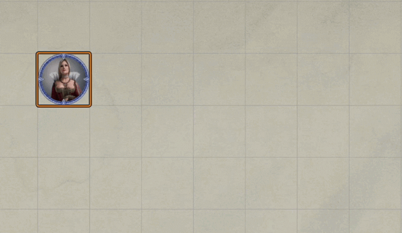
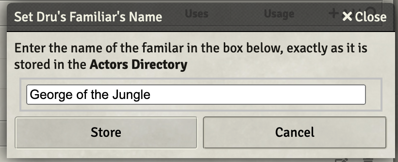
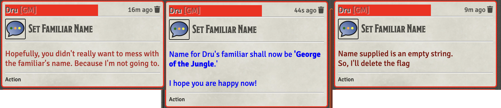

# Utility Macros

This repo holds macros that I have found to be of general utility **and** have foud the time to push to GitHub so that others might make of them what they will.

[Link back to my Repo Listing](https://github.com/Jeznar/GitRepo)

---

This readme contains a summary of the functions and for at least some of them a followup section with any notes that I felt worth sharing about each one.

## Functions in this Repo

* **[Cleanse-Selected-Tokens](#cleanse-selected-tokens)** Removes temporary effects from selected tokens
* **[Demo Conc Mgmt](#demo-conc-mgmt)** Modifies concentration to remove and manage an existing effect
* **[Demo Copy Edit Item](#demo-copy-edit-item)** Copies/Edits Item
* **[Demo Flag Mgmt](#demo-flag-mgmt)** Exercise in use of DAE Flags
* **[Demo Get Functions](#demo-get-functions)** Exercise a collection of Get functions
* **[Demo Template VFX](#demo-temlate-vfx)** Demonstrates placement of a VFX at a template location.
* **[DisplayDescription](#displaydescription)** Prints the item description to the bottom of the chat card.
* **[Get Entities](#get-entities)** accesses various actor, token, scene, item data from a single selected token. This is a demo of how to access various data types, not something directly useful. 
* **Light Picker**: sample macro that sets the type of light emitted by a token.
* **[Open Actor Sheets With...](#open-actor-sheets-with...)** fetchs a list of items from an actor allowing the user to pick one and then opens al of the actor's sheets that contain that item.
* **[Run RuneVFX onSelf](#run-runevfx-onself)** Fires the runRuneVFX on the using token for the using item.
* **[Run RuneVFX onTargets](#run-runevfx-ontargets)** Fires the runRuneVFX on targeted token(s) for the using item.
* **[Samples](#samples)** Various sample macros that do itty bitty things
* **[Set Familiar Name](#set-familiar-name)** Manages stored familiar name for actor
* **[Share Item Within Scene](#share-item-within-scene)** Adds/Updates/Deletes an item from a token to other tokens in the same scene.
* **[Swap Hidden Tokens](#swap-hidden-tokens)** swaps the visibility state of all or selected npc tokens.
* **[Swap Map](#swap-map)** swaps the current background image for the next or base. A naming convention must be followed.
* **[World Macros](world-macros)** Special world macros like: BubblesForAll

## Notes on Functions

### **Cleanse Selected Tokens**

Intended to be run by the GM as a macro from the quick bar to clean effects from selected tokens.

### **Demo Conc Mgmt** 

A pair of onUse ItemMacros that together manage an effect, modifying the automatic concentration effect to have a *doOff* function that removes the cretaed effect and a seperate macro (Demo Conc Mgmt Apply Effect) that moves the effect from one token to another.  

The *magic* of this function is using a DAE flag to keep track of the targeted token that has the effect in question. 

CUB is used to manage the condition because I am lazy and this is a demonstration of managing concentration and existance of effect, not the creation of fancy ones.

[*Back to Utility Macros List*](#functions-in-this-repo)

### **Demo Copy Edit Item** 

Macro that copies an existing macro (%%Black Tentacles Effect%%) to character sheet executing this onUse ItemMacro.  

It then edits the name to something more specific, of the form *\<TOKEN_NAME>'s Black Tentacles Effect*.  

It also looks for any strings wrapped in bold and %% symbols in the description.  Any **%%string%%** followed by any amount of white space is then deleted from the description -- as a demonstration of capability.

I expect this will be useful for creating temporary items, being easier than the create them from scratch method in a macro.

[*Back to Utility Macros List*](#functions-in-this-repo)

### **Demo Flag Mgmt**

Accomplish nothing macro that populates a DAE Flag, reads that flag and processes the stashed & passed information.  The calls it exercises are:

 *  DAE.unsetFlag(actor5e, flag) -- Clears "flag" from "actor5e" data object
 *  DAE.getFlag(actor5e, flag) -- Returns the contents of "actor5e's" "flag"
 *  DAE.setFlag(actor5e, flag, value) -- stores "value" to "flag" on "actor5e" 

 Sample output of an execution with three tokens targeted follows.

~~~ 
Lizzie current DAE flag0bj content ▸{damageApplied: 31, familiar name: '", Cruel Puppetry: (.}}
Value of flag after clear undefined
Value of flag after originator ODlJtGYdKdSoCPDb
Value of flag after target 1 0DlJtGYdKdSoCPDb 36plhIAopoCCiuCw
Value of flag after target 2 0DlJtGYdKdSoCPDb 36plhIAopoCCiuCw mPmHx0KFozFjuKzu
Value of flag after target 3 0DlJtGYdKdSoCPDb 36plhIAopoCCiuCw mPmHx0KFozFjukzu jkM3Fiq9HPoRrgad
Lizzie started this fine mess and targeted 3 tokens
 1) Good-natured Meat Bag, Medium
 2) Virginal Meat Bag, Medium
 3) Chipper Meat Bag, Medium
Lizzie current DAE flag0bj content ▸{damageApplied: 31, familiar_name: "", Cruel_Puppetry: (…}, Demo_Flag_Mgmt: "ODlJtGYdKdSoCPDb 36plhIAopoCCiuCw mPmHxOKFozFjuKzu jkM3Fiq9HPoRrgad"}
~~~

### **Demo Get Functions** 

A series of functions that return simple integer values or false on errors with a fair 
amount of error checking.

- jez.getCastMod(subject) -- Returns the subject's casting stat modifier
- jez.getCastStat(subject) -- Returns the subject's casting stat string (e.g. "int")
- jez.getStatMod(subject,stat) -- Returns the subject's modifier for passed stat string
- jez.getProfMod(subject) -- Returns the subject's proficiency modifer
- jez.getTokenById(subjectId) -- Returns the Token5e acssociated with the passed ID

Parameters
Subject: Token5e or Actor5e object or 16 character id of a token
Stat: A string from: "str", "dex", "con", "int", "wis", "chr"
SubjectId: 16 character identifier for a token in the current scene

[*Back to Utility Macros List*](#functions-in-this-repo)

---

### **Demo Template VFX** 

Simple little macro that runs a sleep VFX at the location of the template created by the invoking macro (ItemMacro OnUse). The macro deletes the template and uses a a sleep .webm with a few other settings tossed in for fun.

[*Back to Utility Macros List*](#functions-in-this-repo)

---

### **DisplayDescription**

Macro to be used as an OnUse macro from an item sheet.  It simply echos the item description to the bottom of the item card.  Useful for items that need manual attention from the players.

Used by adding the following to the OnUse Macro field at the bottom of the **Item Details** page:

~~~javasctipt
DisplayDescription
~~~

[*Back to Utility Macros List*](#functions-in-this-repo)

---

### **Demo Tile VFX** 

Simple little macro that pops a tile with a VFX at the location of the targeting template from the calling item (ItemMacro OnUse).  The macro deletes the template and uses a black tenticles video file.

[*Back to Utility Macros List*](#functions-in-this-repo)

---

### **Get Entities**

This macro is an exercise in obtaining various types of data from other types of data, e.g. fetch a token's data from a token ID number or name.   I use this as a reference when I have one of those situations where I know something about an entity but need something else and don't recall haow to get from here to there.

To use this macro, select a token and run it, likely from the hot bar.  Following is the (somewhat abbreviated) output as seen on my console.

<b>Console Output -- General Data Dug Up by ID / Name</b>

~~~javascript
Get_Entities
Token (Lizzie) ID XeuO8AZgdNQTmE53 ▸ Token5e {_events: i, _eventsCount: 2, tempDisplayObjectParent: null, ...}
Actor (Lizzie McWizard) ID aqNN90V6BjFcJpI5 ▸  Actor5e {overrides: {…}, _preparationWarnings: Array(0), ...}
Item 0 (Wizard) ID 0lsTnjT4oL9yON7c ▸ Item5e {labels: {…}, apps: {…}, _sheet: null, parent: Actor5e, ...}
Scene (Fidatov Manor), ID dVPUJ8RYs7i1eBmL ▸ Scene {dimensions: {…}, apps: {…}, _sheet: SceneConfig, ...}
Journal 0 (4. After Effects), ID 0Wl47Q3koIjt0xZb ▸ JournalEntry {apps: {…}, _sheet: null, parent: null, ...} 

Fetch data from "known" ID
--------------------------
TokenDoc fetched by ID TokenDocument5e {apps: {…}, _sheet: null, _object: Token5e, _actor: Actor5e, parent: Scene,...}
Token5e  fetched by ID Token5e {_events: i, _eventsCount: 2, tempDisplayObjectParent: null, transform: t, alpha: 1,...}
Actor5E  fetched by ID Actor5e {overrides: {…}, _preparationWarnings: Array(0), armor: null, shield: null, _classes: {…},...}
Item5E   fetched by ID Item5e {labels: {…}, apps: {…}, _sheet: null, parent: Actor5e, pack: null,...}
Scene    fetched by ID Scene {dimensions: {…}, apps: {…}, _sheet: SceneConfig, _view: true, _viewPosition: {…},...}
JournalEntry     by ID JournalEntry {apps: {…}, _sheet: null, parent: null, pack: null, data: JournalEntryData}
 
Fetch data from "known" Name
----------------------------
TokenDoc fetched by Name TokenDocument5e {apps: {…}, _sheet: null, _object: Token5e, _actor: Actor5e, parent: Scene,...}
Token5e  fetched by Name Token5e {_events: i, _eventsCount: 3, tempDisplayObjectParent: null, transform: t, alpha: 1,...}
Actor5E  fetched by Name Actor5e {overrides: {…}, _preparationWarnings: Array(0), armor: null, shield: null, _classes: {…},...}
Item5E   fetched by Name Item5e {labels: {…}, apps: {…}, _sheet: null, parent: Actor5e, pack: null,...}
Scene    fetched by Name Scene {dimensions: {…}, apps: {…}, _sheet: SceneConfig, _view: true, _viewPosition: {…},...}
JournalEntry     by Name JournalEntry {apps: {…}, _sheet: null, parent: null, pack: null, data: JournalEntryData}
~~~

<b>Console Output -- Looking into all actors in game</b>

~~~javascript
Bunches of Actors
-----------------
Game PCs (22) ▸ [Actor5e, Actor5e, Actor5e, Actor5e, Actor5e, ...]
Game NPCs (444) ▸ [Actor5e, Actor5e, Actor5e, Actor5e, Actor5e, ...]
 
Names of Character (PC) with same Actor & Token Names
-----------------------------------------------------
   2 actor/token Cai'Lee
   4 actor/token Clair deCleric
   5 actor/token Construct-PC
   9 actor/token Elfy-PC
  10 actor/token Galahad
  11 actor/token Human-PC
  14 actor/token No-Race-PC
  16 actor/token Olivia Ironlocke
  17 actor/token Olivia Ironlocke (Flopsy)
  18 actor/token Rue
  19 actor/token Sparky
  21 actor/token Undead-PC
  22 actor/token Wildfire Spirit
 
 Names of Character (PC) with different Actor & Token Names
 ----------------------------------------------------------
   1 actor Brayton Biltram, token Brayton.
   3 actor Charlie Adaline Murphy, token CAM.
   6 actor Dask-with-Crimson-Nails, token Dask.
   7 actor DoorKnocker UI, token Door Knocker.
   8 actor Dru daDruid, token Dru.
  12 actor Lizzie McWizard, token Lizzie.
  13 actor Muriel Vinshaw (Char), token Muriel Vinshaw.
  15 actor Odwald Kilkenny, token Odwald.
  20 actor Sun'Chu'Luk (Copy), token Sun'Chu'Luk.
~~~

[*Back to Utility Macros List*](#functions-in-this-repo)

---

### **Open Actor Sheets With...** 

This macro should be run with a token of interest selected.  The intent of the macro is to make it easier to chec or update all of the users of a given item.  Something I find both common and bothersome.

It does the following:

1. Finds the types of items on that token (e.g. spell, weapon, etc.),
1. Provides a dialog soliciting the type of interest,
1. Finds all of the items of the specified type,
1. Provides a dialog soliciting a specific item of interest,
1. Opens the sheet of all the actors in the *Actors Directory*.

[*Back to Utility Macros List*](#functions-in-this-repo)

---

### Run RuneVFX onTargets

Macro to be used as an OnUse macro from an item sheet.  It simply runs [jez.runRuneVFX(...)](../jez-lib/#runRuneVFX) on the targeted token(s), making sure the color is the same random selection on each.

Used by adding the following to the OnUse Macro field at the bottom of the **Item Details** page:

~~~javasctipt
Run_RuneVFX_onTargets
~~~

[*Back to Utility Macros List*](#functions-in-this-repo)

---

### Run RuneVFX onSelf

Macro to be used as an OnUse macro from an item sheet.  It simply runs [jez.runRuneVFX(...)](../jez-lib/#runRuneVFX) on the using token.

Used by adding the following to the OnUse Macro field at the bottom of the **Item Details** page:

~~~javasctipt
Run_RuneVFX_onSelf
~~~

[*Back to Utility Macros List*](#functions-in-this-repo)

---

### Samples 

Some small macros that just handle small things.

- **Shrink or Enlarge**: Flips selected tokens between 1 square and 2 square sizes.  Not great for tokens of other than 1x1 or 2x2 shapes.

[*Back to Utility Macros List*](#functions-in-this-repo)

---

### Set Familiar Name

This utility item displays the currently defined value of the DAE flag **Familiar_Name** for the invoking actor.  It will delete the flag if given an empty string as input.  It will store the string for other macros if it receives a non-zero input string and the **Store** button is selected.

The dialog appears as follows:

Some of the chat messages that can be generated are shown below:

[*Back to Utility Macros List*](#functions-in-this-repo)

---

### Share Item Within Scene

This macro is intended to be used from the hotbar and serve as aid when it comes time to update items on tokens within a scene.

It requires that one token be selected which will serve as the source for the execution.  Nect fire off the macro and then setp through four (yes, that is too many) pop-up dialogs that setup the main execution of the item.  The dialogs that appear and their purpose:

1. Pick the mode of operation Add, Delete, or Update;
2. Pick the type of item to be operated on (depends on source token's inventory);
3. Pick the specific item to be operated on;
4. Select one, some or all eligible actors to be operated on.

 

The macro can operate in one of three modes:

1. Add - An item selected via the dialogs on the source token will be added to all of the selected (via dialog) tokens. If a target has an existing copy of this item, it iis first deleted, effectively making this an add or update operation.
2. Delete - Selected item on the source token will be deleted from the other selected tokens. 
3. Update - Selected item on the source token will be updated (no adds) on the other selected tokens. 

All of the actions are limited to tokens on a given scene.  

[*Back to Utility Macros List*](#functions-in-this-repo)

---

### Swap Hidden Tokens

Swaps visible/hidden status for all of the selected NPC tokens, if any tokens are selected.  If no tokens are selected, it swaps visibility for all NPC tokens in the current scene.

[*Back to Utility Macros List*](#functions-in-this-repo)

---

### Swap Map

This macro will swap the current scene's background image with the *next* image.  If the next image doesn't exist, it swaps to the base image.

A naming convention for the files that are used by this macro is essential.

~~~javascript
File_Name.<SeqNum>.<Extension>
~~~

The file name can be whatever, though, it must be a constant across the set of files used by this macro.  It **must** be followed by a period (.) that delimits the next element. The **SeqNum** (sequence number) is an integer, quite likely single digit, but I know of no limit other than patience of the user.  After the SeqNum is another period (.) that marks the beginning of the file **Extension** (e.g. webp, jpeg, png).

A base image is assumed to exist with SeqNum zero (0) or one (1).  If both exist we are clearly dealing with a programmer at the keyboard and zero will be the starting point.

[*Back to Utility Macros List*](#functions-in-this-repo)

---

### World Macros

Macros created to provide global functions including:

**BubblesForAll** -- Displays a chat bubble above named speaker when called via its function: `bubbleForAll(tokenD.id, mockeryStr, true, true)`.  See [World_Macro_Install.md](../Documentation/World_Macro_Install.md) for how this was done.

[*Back to Utility Macros List*](#functions-in-this-repo)

---