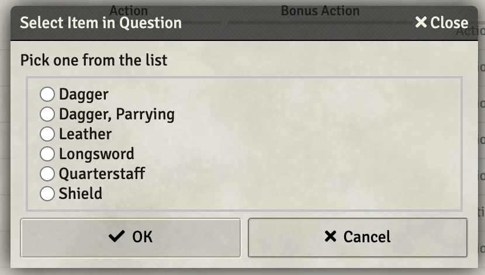

# Jez Lib -- Common Functions Used by My Macros

This module contains common functions that many of my macros use.  They are all things that I tend to want to do and either need to cut'n'paste or reinvent the wheel for new macro.  

[Link back to my Repo Listing](https://github.com/Jeznar/GitRepo)

## jez.log() as an Example

The single most commonly used function in my macros is **jez.log()**.  This little work horse does nothing more than accept a number of arguments, perform formatting if it has more than one and dump them to the console with a *console.log()* call.  Oh, yes, it checks in with [Developer Mode](https://github.com/League-of-Foundry-Developers/foundryvtt-devMode) module to determine if the message will be suppressed.  I'll get more into that later in this document. 

## Actually Using this Module

I crafted this module with the intent of only using it for my own macros.  As such, I had no interest in making it available from within FoundryVTT. To be honest, I didn't want to spend the time to figure out how to do that.  I put this module together after following an excellent tutorial posted on Reddit by [theElfFriend](https://www.reddit.com/user/theElfFriend/) in an article titled: [Module Making for Beginners - A Step by Step Tutorial](https://www.reddit.com/r/FoundryVTT/comments/oibp3h/module_making_for_beginners_a_step_by_step/).

I ran into a few challenges following the tutorial.  The most notable being:

* Developer Mode module must be installed if it is to be used (yea, kinda obvious)
* My Functions need to be embedded in a relevant class (jez, in my case)
* Function declarations are written a bit differently.  A *normal* declaration like, `async function pickFromListArray(...)`, becomes `static async pickFromListArray(...)`.

The small bundle of files that make up this module need to be paced on the server in the `data/modules/jez-lib` subdirectory.  FoundryVTT must be restarted after placing the files.  The module should then appear and be able to be activated in whatever world.  Of course, it doesn't do anything by itself, as it is just a set of functions that I like to leverage. 

## Functions in this Module

The functions currently included in this module are:

* **[jez.addMessage(chatMessage, msgParm)](#addmessagechatmessage-msgparm)** -- Adds to an existing message in the **Chat Log**
* **[jez.deleteItems(itemName, type, subject)](#deleteItemsitemName-type-subject)** -- Deletes all copies of specified item
* **[jez.getActor5eDataObj(subject)](#get-functions)** -- Returns the subject's actor5e data object
* **[jez.getCastMod(subject)](#get-functions)** -- Returns the subject's casting stat modifier
* **[jez.getCastStat(subject)](#get-functions)** -- Returns the subject's casting stat string (e.g. "int")
* **[jez.getCharLevel(subject)](#getCharacterLevel)** -- Returns the subject's character level
* **[jez.getDistance5e(one, two)](#getdistance5eone-two)** -- Returns alternate D&D 5E distance between two placeables
* **[jez.getEffectDataObj(effect, subject)](#get-functions)** -- Returns the effect's data object
* **[jez.getRandomRuneColor()](#getrandomrunecolor)** -- Return a string with a random valid JB2A rune color
* **[jez.getRange(itemD, allowedUnits)](#getrangeaitem-allowedunits)** -- Returns the maximum range for specified item.
* **[jez.getSize(token5e)](#getsizetoken5e)** -- Returns an object with size info for specified token.
* **[jez.getSpellDC(subject)](#get-functions)** -- Returns a string containing the subjects spell DC
* **[jez.getSpellSchool(item)](#getspellschoolitem)** -- Returns a string naming the school of passed item
* **[jez.getStatMod(subject)](#get-functions)** -- Returns the subject's modifier for passed stat string
* **[jez.getProfMod(subject)](#get-functions)** -- Returns the subject's proficiency modifier
* **[jez.getRace(entity)](#getraceentity)** -- Returns a string containing the race of the entity
* **[jez.getTokenById(subjectId)](#get-functions)** -- Returns the Token5e associated with the passed ID
* **[jez.inRange(token1, token2, maxRange)](#inrangetoken1-token2-maxrange)** -- Returns a boolean, true if distance between tokens is less than or equal to maximum range specified.
* **[jez.itemAddToActor(token5e, ItemName)](#item-functions)** -- Copies an item to Actor
* **[jez.itemDeleteFromActor(token5e, itemName, itemType)](#item-functions)** -- Deletes an item from Actor
* **[jez.itemFindOnActor(token5e, itemName, itemType)](#item-functions)** -- Finds and item on Actor
* **[jez.itemUpdateOnActor(token5e, itemName, itemUpdate, itemType)](#item-functions)** -- Updates an Item on Actor
* **[jez.log(...parms)](#logparms)** -- Posts parameters, with some minimal formatting, to console if enabled
* **[jez.moveToken(anchorToken, movingToken, move, delay)](#movetokenanchorToken-movingToken-move-delay)** -- Push or pull token 1, 2 or 3 spaces
* **[jez.pairEffects(subject1, effectName1, subject2, effectName2)](#pairEffectssubject1-effectName1-subject2-effectName2))** -- Add lines to DAE effects to remove other member of pair when either removed.
* **[jez.pickCheckListArray(queryTitle, queryText, pickCallBack, queryOptions)](#pickfromlistarrayquerytitle-querytext-pickcallback-queryoptions)** -- Pops a check box dialog offering list of selections.  User's selection array is passed to the specified callback function. 
* **[jez.pickFromListArray(queryTitle, queryText, pickCallBack, queryOptions)](#pickfromlistarrayquerytitle-querytext-pickcallback-queryoptions)** -- Pops a selection dialog offering a drop down list.  User's selection is passed to the specified callback function. 
* **[jez.pickRadioListArray(queryTitle, queryText, pickCallBack, queryOptions)](#pickRadioListArrayquerytitle-querytext-pickcallback-queryoptions)** -- Pops a selection dialog offering a radio button list.  User's selection is passed to the specified callback function.
* **[jez.postMessage(msgParm)](#postmessagemsgparm)** -- Posts a new message to the **Chat Log**
* **[jez.randomDarkColor()](#randomdarkcolor)** -- Returns the name of a color from a list.
* **[jez.replaceSubString(string, substring, newSubstring)](#replaceSubStringstring-substring-newSubstring))** -- Returns updated string and count of replacements in an object.
* **[jez.runRuneVFX(...)](#runRuneVFX)** -- Run a three stage run VFX on specified token.
* **[jez.tokensInRange(sel, range)](#tokensinrangeseltoken-range)** -- Returns an array of tokens within range of selected token
* **[jez.wait(ms)](#wait)** -- Waits for specified milliseconds.

More about each of these in the following sections. 

---

### addMessage(chatMessage, msgParm)

This function is similar to [postMessage(msgParm)](#postmessagemsgparm) but it adds additional information to an existing chat message in the log.  

The first parameter, **chatMessage**, must be of type *ChatMessage*.  If this is being used as an OnUse ItemMacro, the chat card for the current message can be obtained with: `game.messages.get(args[args.length - 1].itemCardId);` In other circumstances, it can be rather more complex to obtain and beyond the scope of this documentation. 

The passed **msgParm** can be a string or an object as in the cousin function, [postMessage(msgParm)](#postmessagemsgparm).  If the more complex object parameter is specified, it may contain the following fields (fields not specified will default to more or less reasonable values):

* **fSize**: Number specifying the font size (in points),
* **color**: String naming the foreground color,
* **msg**: String containing the actual text to be displayed.
* **tag**: String naming the anchor location from: saves, attack, damage, hits, other

The following code snippet produces a chat card with quite a few added messages.  One thing worth noting is that repeated invocations to the same tag point (the simple form in the below example) will appear before any other message added at the tag, so messages may need to be presented *backwards*.

~~~javascript
let chatMessage = game.messages.get(args[args.length - 1].itemCardId);
jez.addMessage(chatMessage, "and Again!!!")
jez.addMessage(chatMessage, "Again! ")
jez.addMessage(chatMessage, "Hey There ")
let msg = "Saves-Display Message Area"
jez.addMessage(chatMessage, {color:"purple", fSize:15, msg:msg, tag:"saves" })
msg = "Attack-Roll Message Area"
jez.addMessage(chatMessage, {color:"darkred", fSize:15, msg:msg, tag:"attack" })
msg = "Damage-Roll Message Area"
jez.addMessage(chatMessage, {color:"blue", fSize:15, msg:msg, tag:"damage" })
msg = "Hits-Display Message Area"
jez.addMessage(chatMessage, {color:"darkgreen", fSize:15, msg:msg, tag:"hits" })
msg = "Other-Roll Message Area"
jez.addMessage(chatMessage, {color:"crimson", fSize:15, msg:msg, tag:"other" })
~~~

The above, will generate a message such as the following:


[*Back to Functions list*](#functions-in-this-module)

---

### deleteItems(itemName, type, subject)

Function to delete all copies of a named item of a given type from actor

Parameters

- **itemName**: A string naming the item to be found in actor's inventory
- **subject**: actor, token, or token Id to be searched
- **type**: type of item to be deleted, e.g. spell, weapon 

A brief deletion messages is popped for each item deleted. Sample call:

```javascript
await jez.deleteItems(ATTACK_ITEM, "spell", aActor);
```

[*Back to Functions list*](#functions-in-this-module)

---

### Get Functions

A series of functions that return simple integer values or false on errors with a fair amount of error checking.

#### Functions
- **jez.getCastMod(subject)** -- Returns the subject's casting stat modifier
- **jez.getCastStat(subject)** -- Returns the subject's casting stat string (e.g. "int")
- **jez.getCharLevel(subject)** -- Returns the subject's character level (useful for Cantrip scaling)
- **jez.getStatMod(subject,stat)** -- Returns the subject's modifier for passed stat string
- **jez.getSpellDC(subject)** -- Returns the subject's spell save DC
- **jez.getProfMod(subject)** -- Returns the subject's proficiency modifier
- **jez.getTokenById(subjectId)** -- Returns the Token5e associated with the passed ID

#### Parameters
* Subject: Token5e or Actor5e object or 16 character id of a token
* Stat: A string from: "str", "dex", "con", "int", "wis", "chr"
* SubjectId: 16 character identifier for a token in the current scene

#### And Two more
Two additional get functions intended to make handling the overloaded inputs a bit easier to code:

- **jez.getActor5eDataObj(subject)** -- Function to return the Actor5e data associated with the passed parameter. The subject can be  actor5e data object, token5e data object, token Id or actor Id
- **getEffectDataObj(effect, subject)** -- Function to return the Effect data object identified by arguments. The **effect** parameter can be either a string naming the effect, an id or a uuid, e.g. 52 character string: `Actor.i9vqeZXzvIcdZ3BU.ActiveEffect.DmvGS7OsCz3HoggP`. **Subject** (optional) identifies the actor with effect in question, it just be a type supported by getActor5eDataObj, this parameter is not required if effect is a UUID.

[*Back to Functions list*](#functions-in-this-module)

---

### getDistance5e(one, two)

This function returns the distance between two placeable entities (e.g. tokens) in the D&D 5E alternate rule set where diagonal movement is charged as 5-10-5-10-5 feet of movement.  The returned value will be evenly divisible by 5.

I snarfed the logic from Vance Cole's lovely Distance macro, which can be found at: [macros/distance.js](https://github.com/VanceCole/macros/blob/master/distance.js) 

[*Back to Functions list*](#functions-in-this-module)

--- 

### getRace(entity)

Return the race of the passes **Actor5e**, **Token5e**, or **TokenDocument5e**.  The value will be a lowercase string, which may be empty.  It is taken from a user input field, so garbage may be present.  

If passed a parameter not of a supported type, returns FALSE

~~~javascript
for ( let token of canvas.tokens.controlled ){
  let race = jez.getRace(token.document))
  if (race.includes("construct")) console.log(`${token.name} is construct`)
}
~~~

---

### getRandomRuneColor()

This function returns a string naming a valid random JB2A rune color.  Possible returned values are:

* blue, 
* green,
* pink,
* purple,
* red, and
* yellow.

[*Back to Functions list*](#functions-in-this-module)

---

### getRange(aItem, allowedUnits)

This function returns the maximum range defined on the names item and verifies that the units set on that item are in the allowed set.  The set of allowedUnits is an array of strings. 

Following is a sample call.

~~~javascript
const ALLOWED_UNITS = ["", "ft", "any"];

let maxRange = jez.getRange(aItem, ALLOWED_UNITS)
if (!maxRange) {
    msg = `Range is 0 or incorrect units on ${aItem.name}`;
    jez.log(msg);
    ui.notifications.warn(msg);
    return(false)
}
~~~

Below is a sample output from the test harness function (included in the library repo) that ran this function and then displayed the results.


[*Back to Functions list*](#functions-in-this-module)

---

### getSize(token5e)

This function pops grabs size information from the specified token and returns an object with size expressed in several formats.

The returned object will be composed of:

* @typedef  {Object} CreatureSizes
* @property {integer} value  - Numeric value of size: 1 is tiny to 6 gargantuan
* @property {string}  str    - Short form for size generally used in FoundryVTT data 
* @property {string}  string - Spelled out size all lower case
* @property {string}  String - Spelled out size with the first letter capitalized  

[*Back to Functions list*](#functions-in-this-module)

---

### getSpellSchool(item)

This function obtains the spell school from the passed parameter.  The school will be a string as used by JB2A module.  Possible returned values are:

* abjuration
* conjuration
* divination
* enchantment
* evocation
* illusion
* necromancy
* transmutation
* and FALSE (if no valid school found)

[*Back to Functions list*](#functions-in-this-module)

---

### inRange(token1, token2, maxRange)

This function returns true if distance between token1 and token2 is less than or equal to the maximum range specified.

Following is a sample call.

~~~javascript
// maxRange obtained earlier with a jez.getRange(...) call
if(!jez.inRange(aToken, tToken, maxRange)) {
    msg = `Target is not in range for ${aItem.name}`;
    jez.log(msg);
    ui.notifications.warn(msg);
    return(false);
}
~~~

[*Back to Functions list*](#functions-in-this-module)

---

### Item Functions

A set of functions built to standardize how I handle copying items from the Item Directory to actors and manipulate them.  Parameters used by these are listed below along with their meanings.

* **token5e** -- token data of the type "token5e" (I didn't bother to make these functions extra flexible with inputs).
* **itemName** -- A string naming the item in question, must be an exact match.
* **itemType** -- This is typically an optional parameter, that narrows the selection by giving a string that names an item type.  The item types of which I am aware are: backpack, class, consumable, equipment, feat, loot, spell, tool, weapon
* **itemUpdate** -- This is an object that defines changes to be made to an item.  More on this below.

The functions, short descriptions, and samples usage follow.

#### jez.itemAddToActor(token5e, ItemName)

Copy the item specified by "ItemName" from the items directory to the token identified as "token5e".  Since we control the items directory, going to assume the wisdom to make ItemName unique is exercised.

~~~javascript
await jez.itemAddToActor(aToken, TEMPLATE_NAME)
~~~

#### jez.itemDeleteFromActor(token5e, itemName, itemType)

Delete specified item specified by "ItemName" from specified token5e.  Return true on success, false on failure. If a third parameter "itemType" is passed limit the search to items of that type.
 
This function is similar to [jez.deleteItems(...)](#deleteItemsitemName-type-subject), but only deletes one copy of the item.

~~~javascript
// As long as an item is deleted, keep on deleting
do { } while (await jez.itemDeleteFromActor(aToken, TEMP_SPELL_NAME, "spell"));

~~~

#### jez.itemFindOnActor(token5e, itemName, itemType)

Search the specified Token5e's actor for the named item.  Return false if not found, return the item if found.  If a third parameter "itemType" is passed limit the search to items of that type.

~~~javascript
let getItem = await jez.itemFindOnActor(aToken, itemName, "spell");
~~~

#### jez.itemUpdateOnActor(token5e, itemName, itemUpdate, itemType)

For the item named as "itemName", optionally of the specified itemType on the token5e update the item as specified in the itemUpdate object.  

~~~javascript
//-------------------------------------------------------------------------------------------
// Update the item's name and extract the comments from the description
//
let itemUpdate = {
    name: ATTACK_ITEM,                 // Change to actor specific name for temp item
}
await jez.itemUpdateOnActor(aToken, "%%Heat Metal Damage%%", itemUpdate, "spell")
~~~

**Special case**, if data.description.value is not specified in the update object, then this function will strip out anything set off in bold surrounded by double percent symbols. This is intended to remove the **don't change this message** assumed to be embedded in the item description.  Within the HTML It should be of the form: `<p><strong>%%.*%%</strong></p>` it can have any amount of white space trailing it which will also be stripped out.

Following is a complete use of a couple of these commands to place and update an item.  In this example the update is run twice, the first time renames the item and strips the comments.  The data on the item is then used as a basis for the second set of changes.

~~~javascript
//-------------------------------------------------------------------------------------------
// Update the item's name and extract the comments from the description
//
let itemUpdate = {
    name: ATTACK_ITEM,                 // Change to actor specific name for temp item
}
await jez.itemUpdateOnActor(aToken, "%%Heat Metal Damage%%", itemUpdate, "spell")
//-------------------------------------------------------------------------------------------
// Grab the data for the new item from the actor
//
let getItem = await jez.itemFindOnActor(aToken, ATTACK_ITEM, "spell");
//-------------------------------------------------------------------------------------------
// Update the description field
//
let description = getItem.data.data.description.value
description = description.replace(/%NUMDICE%/g, `${NUM_DICE}`);         // Replace %NUMDICE%
description = description.replace(/%TARGETNAME%/g, `${tToken.name}`);   // Replace %TARGETNAME%
//-------------------------------------------------------------------------------------------
// Update the macro field
//
let macro = getItem.data.flags.itemacro.macro.data.command
macro = macro.replace(/%ACTORID%/g, `${tActor?.data._id}`); // Replace %ACTORID%
macro = macro.replace(/%NUMDICE%/g, `${NUM_DICE}`);         // Replace %NUMDICE%
//-------------------------------------------------------------------------------------------
// Build a new itemUpdate Object
//
itemUpdate = {
    data: { description: { value: description } },   // Drop in altered description
    flags: {
        itemacro: {
            macro: {
                data: {
                    command: macro,
                    name: ATTACK_ITEM,
                    img: args[0].item.img,
                },
            },
        },
    },
    img: args[0].item.img,
}
//-------------------------------------------------------------------------------------------
// Update the item with new information
//
await jez.itemUpdateOnActor(aToken, ATTACK_ITEM, itemUpdate, "spell")
~~~

[*Back to Functions list*](#functions-in-this-module)

---

### log(...parms)

This function utilizes the [Developer Mode](https://github.com/League-of-Foundry-Developers/foundryvtt-devMode) module to determine if passed parameter(s) should be written to the console log.  All messages are prefaced with the module name (jez-lib) and a vertical bar symbol.  

If only a single parameter is passed, the function simply echos that parameter to the console.

~~~javascript
> jez.log("hello world")
jez-lib | hello world
> jez.log(_token)
jez-lib | ▸ Token5e {_events: i, _eventsCount: 2, …}
~~~

Objects, arrays, and other compound data elements display with a *clickable* arrow indicating. they can be expanded to show more content.

If two parameters are passed, they are written to a single line on the console separated by a colon. 

~~~javascript
> jez.log("My token of interest", _token)
jez-lib | ▸ My token of interest : Token5e {_events: i, _eventsCount: 2, …}
~~~
	
It also provides limited formatting of the output if more than one a parameter is passed. With more than two parameters, the first (for odd counts of parameters) or first two (even counts) are written to the console followed by numbered pairs on additional lines. 

~~~javascript
> jez.log("------------- BREAK ---------------","Selected Token",_token,"Selected Token Name",_token.name)
jez-lib | ------------- BREAK ---------------
jez-lib |  (1) Selected Token : ▸ Token5e {_events: i, _eventsCount: 2, …}
jez-lib |  (2) Selected Token Name : Meat Bag, Medium
~~~

<details>
<summary>Hidden Image: Enabled Console Messages Setting Dialog</summary>


</details>

<!---->

[*Back to Functions list*](#functions-in-this-module)

---

### moveToken(anchorToken, movingToken, move, delay)

This function moves the **movingToken** 1, 2, or 3 spaces (specified by value of **move**) away (positive values of move) or toward (negative values) the **anchorToken** adding a **delay** in milliseconds before the actual move (intended to allow VFX or other timing steps).  

The alternate 5e m=diagonal movement rules are assumed (5-10-5) and the closest or furthest space reachable in the specified **move** is selected for the movingToken to arrive in.  There is no consideration of walls, other terrain, or creatures on the map -- I am assuming the GM will fine tune the automated movement by hand when necessary.  

Following is a typical call to this function:

```
jez.moveToken(anchorToken, aToken, -1, 1500)
```
The above would move *aToken* (active token) one space toward the *anchorToken* after a wait of 1.5 seconds.

The function returns a boolean value with false indicating a problem encountered and true representing normal completion. 

[*Back to Functions list*](#functions-in-this-module)

---
### pairEffects(subject1, effectName1, subject2, effectName2)

Add a macro execute line calling the macro "Remove_Paired_Effect" which must exist in the macro folder to named effect on the pair of tokens supplied.  

Note: This operates on effect by name which can result in unexpected results if multiple effects on a an actor have the same name.  Not generally an issue, but it might be.

* **subject1** & **subject2** are types supported by jez.getActor5eDataObj (actor5e, token5e, token5e.id, actor5e.id)
* **effectName1** & **effectName2** are strings that name effects on their respective token actors.

~~~javascript
jez.pairEffects(aActor, CONDITION1, aActor, CONDITION2)
~~~

The function adds a line to the bottom of both effects that triggers [Remove_Paired_Effect](../Utility_Macros#remove-paired-effect) macro when the effect is removed.  That macro will then exterminate the other member of the pair.  

It will result in something like as the last line in the effects:


[*Back to Functions list*](#functions-in-this-module)

---

### pickCheckListArray(queryTitle, queryText, pickCallBack, queryOptions)

This function pops a check box dialog with list of options allowing the user to select desired choices. After the selection, the *pickCallBack* function is invoked with the selection array.  

The parameters passed to this function should be:

* **queryTitle** -- The title that should appear at the top of the dialog,
* **queryText** -- Block of text that appears above the dialog,
* **pickCallBack** -- a function to be used as a callback that will receive selection,
* **queryOptions** -- An array of strings to be offered as choices in the dialog.

Here is an example use:

~~~javascript
const queryTitle = "Select Item in Question"
const queryText = "Pick one from the list"
jez.pickCheckListArray(queryTitle, queryText, pickCheckCallBack, actorItems.sort());

async function pickCheckCallBack(selection) { ... }
~~~

**WARNING**: Double quotes within the queryOptions will cause the selection to be prematurely terminated.


The return values from this function can be:

* ***SelectionArray*** selected lines (strings) in an array if the **Ok** button is clicked.  Note: the array will be empty (and thus length zero) if nothing was selected.
* ***null*** if the **Cancel** button is clicked
* Simple termination of the function without calling call back if the **Close** button is clicked

The following callback function is setup to process the return value possibilities. 

~~~javascript
function pickCheckCallBack(selection) {
   msg = `pickCheckCallBack: ${selection.length} actor(s) selected in the dialog`
   jez.log(msg)
   //--------------------------------------------------------------------------------------------
   // If cancel button was selected on the preceding dialog, null is returned ==> Terminate
   //
   if (selection === null) return;
   //--------------------------------------------------------------------------------------------
   // If nothing was selected (empty array), call preceding function and terminate this one
   //
   if (selection.length === 0) {
       jez.log("No selection passed to pickCheckCallBack(selection), trying again.")
       itemCallBack(itemSelected)		// itemSelected is a global that is passed to preceding func
       return;
   }
   //--------------------------------------------------------------------------------------------
   // Start doing actual things to advance the mission...
   //
   ...
~~~

[*Back to Functions list*](#functions-in-this-module)

---

### pickFromListArray(queryTitle, queryText, pickCallBack, queryOptions)

This function pops a dialog with a simple drop down selector box that allows the user to make a selection. After the selection, the *pickCallBack* function is invoked with the selection made.  

The parameters passed to this function should be:

* **queryTitle** -- The title that should appear at the top of the dialog,
* **queryText** -- Block of text that appears above the dialog,
* **pickCallBack** -- a function to be used as a callback that will receive selection,
* **queryOptions** -- An array of strings to be offered as choices in the dialog.

Here is an example use:

~~~javascript
const queryTitle = "Select How to Use Doll"
const queryText = "Pick one from drop down list"
const flavors = [
    "Hold the doll still: Restrains the victim.",
    `Force the doll to move: Victim moves ${distance} feet as you like.`,
    `Smash the doll: causing it take ${numDice}d6 bludgeoning damage.`,
    `Rip the doll in half: ends spell and does ${numDice}d12 necrotic damage.`
]
pickFromListArray(queryTitle, queryText, itemCallBack, flavors);
~~~


The return values from this function can be:

* ***Line*** selected (string) in the dialog if the **Ok** button is clicked.  Note: the string will be empty (and thus falsey) if nothing was selected.
* ***null*** if the **Cancel** button is clicked
* Simple termination of the function without calling call back if the **Close** button is clicked

The following callback function is setup to process the return value possibilities.

~~~javascript
function itemCallBack(itemSelected) {
   msg = `itemCallBack: Item named "${itemSelected}" was selected in the dialog`
   jez.log(msg)
   //--------------------------------------------------------------------------------------------
   // If cancel button was selected on the preceding dialog, null is returned ==> Terminate
   //
   if (itemSelected === null) return;
   //--------------------------------------------------------------------------------------------
   // If nothing was selected call preceding function and terminate this one
   //
   if (!itemSelected) {
       jez.log("No selection passed to itemCallBack(itemSelected), trying again.")
       typeCallBack(itemType);
       return;
   }
   //--------------------------------------------------------------------------------------------
   // Now, start doing actual things to advance the mission...
   //
   ...
~~~

[*Back to Functions list*](#functions-in-this-module)

---

### pickRadioListArray(queryTitle, queryText, pickCallBack, queryOptions)

This function presents a simple radio button selection dialog to solicit the user's choice from the provided options. After obtaining the choice, a callback function is passed the selection for continued processing. This is very similar to [pickFromListArray(...)](#pickFromListArray) but it utilizes radio buttons in place of a drop down selector. 

The parameter expected by this function are:

1. **queryTitle** -- String to serve as title of the popped dialog box,
1. **queryText** -- String giving a bit more explanation of the dialog,
1. **pickCallBack** --  a function to be used as a callback that will receive selection,
1. **queryOptions** -- An array of strings to be offered as choices in the dialog.

Here is an example use:

~~~javascript
async function pickFlavorCallBack(selection) { ... }

const queryTitle = "Select Item in Question"
const queryText = "Pick one from the list"
let actorItems = [];
const INCLUDED_TYPES = ["weapon", "equipment"]

for (let i = 0; i < aActor.items.contents.length; i++) {
    if (INCLUDED_TYPES.includes(aActor.items.contents[i].type)) {
        actorItems.push(aActor.items.contents[i].name);
    }
}

jez.pickRadioListArray(queryTitle, queryText, pickFlavorCallBack, actorItems.sort());
~~~



Refer to [pickFromListArray(...)](#pickfromlistarrayquerytitle-querytext-pickcallback-queryoptions), the previous function, for an example of a call back function and explanation of return values, which are the same.

[*Back to Functions list*](#functions-in-this-module)

---

### postMessage(msgParm)

This function creates a new message at the current bottom of the *chat log* with a number of optional parameters to allow some simple formatting of the message.  

The simplest use of this function is to just pass a string which will be posted.  

jez.postMessage("Here is an example message") 

The above, produces the following unadorned chat message. 


The passed parameter (msgParm), optionally may be an object with one or more of the following defined:

* **title**: String specifying the title of the chat entry,
* **fSize**: Number specifying the font size (in points),
* **color**: String naming the foreground color,
* **icon**: String specifying the file name that contains the icon to be used,
* **msg**: String containing the actual text to be displayed,
* **token**: Token5e object that represents the *speaking* entity

Here are examples:

~~~javascript
jez.postMessage({color:"purple", fSize:18, icon:"icons/vtt-512.png", msg:"or so, Sheldon said...", title:"Bazinga!!!" })

jez.postMessage({color: "dodgerblue", 
                fSize: 14, 
                icon: aToken.data.img, 
                msg: "This is direct from the acting token", 
                title: `${aToken.name} says...`, 
                token: aToken})

~~~


[*Back to Functions list*](#functions-in-this-module)

---

### randomDarkColor() 

This function returns the name of a random selected dark color from a built in list.  The colors should all be fine for use on the standard FoundryVTT text background color.

~~~javascript
let chatMessage = game.messages.get(args[args.length - 1].itemCardId);
msg = `<strong>${actor.name}</strong> summons <strong>${MINION_NAME}</strong> to the field.`;
jez.addMessage(chatMessage, {color:jez.randomDarkColor(), fSize:15, msg:msg, tag:"saves" })
~~~

[*Back to Functions list*](#functions-in-this-module)

---

### replaceSubString(string, substring, newSubstring) 

Accept a string and find the substring passed with it.  Return an object that has count and an updated string with the substring replaced. 

Inputs

* **string** the string that will be searched and updated
* **substring** the substring that will be sought and replaced
* **newSubstring** the string that will replace occurrences of substring
* **wrapChar** a string, usually a special character that wraps the substring

Return Object:

* **count**  - Count of times substring appears in string
* **string** - Updated string with substring replaced by newSubstring

#### Example Calls:
~~~javascript
testString = "rocket RoCKEt hi Rocket This is a roc ket. ROCKET's engine Rocketeer Sprocket"
result = jez.replaceSubString(testString, "ROCKET", "%TOKENNAME%")
console.log(result.count, result.string)
// ==> 4 "%TOKENNAME% %TOKENNAME% hi %TOKENNAME% This is a roc ket. %TOKENNAME%'s engine Rocketeer Sprocket"

testString = "rocket RoCKEt hi Rocket This is a roc ket. ROCKET's engine Rocketeer Sprocket"
result = jez.replaceSubString(testString, "ROCKET", "%TOKENNAME%").string
console.log(result)
// ==> %TOKENNAME% %TOKENNAME% hi %TOKENNAME% This is a roc ket. %TOKENNAME%'s engine Rocketeer Sprocket

let descObj = jez.replaceSubString(itemDescription, 'TOKENNAME', tActor.data.token.name, '%')
if (descObj.count > 0) 
    console.log(`Replaced "%TOKENNAME%" with ${tActor.data.token.name} ${descObj.count} time(s)`)
itemDescription = descObj.string
~~~

[*Back to Functions list*](#functions-in-this-module)

---

### runRuneVFX(...)

This function will run a simple three stage VFX on a passed token. It supports a number of optional parameters.  The complete of parms allowed is as follows:

```javascript
runRuneVFX(token, school, color, scale, opacity)
```
* **token** -- required and typically a token5e or TokenDocument5e, though anything sequencer accepts for atLocation() call is fine. This can also be an array of such items.
* **school** -- a string naming a spell school as used in JB2A runes, defaults to "enchantment" often specified as `jez.getSpellSchool(aItem)`
* **color** - string representing a valid JB2A rune color (see [jez.getRandomRuneColor()](#getrandomrunecolor) for color strings.  If not provided will be selected randomly.
* **scale** - real number specifying size relative to token size.  Defaults to 1.2 which is generally fine.
* **opacity** - real number specifying opacity, 0 to 1.  Defaults to 1.0 which is generally fine.

This function might typically be called as one of the following:

```javascript
jez.runRuneVFX(tToken, jez.getSpellSchool(aItem))
jez.runRuneVFX(args[0].targets, jez.getSpellSchool(aItem), jez.getRandomRuneColor())
```


[*Back to Functions list*](#functions-in-this-module)

---

### tokensInRange(selToken, range) 

This function returns an array of all the tokens within *range* feet (plus a fudge factor, currently 4 feet, to make diagonals happier), excluding the passed token. If no tokens are in range, the returned array will be zero length. 

Here is a sample usage.

~~~javascript
const RANGE = 30
let inRangers = await jez.tokensInRange(aToken, RANGE)
let inRangeCount = inRangers?.length
jez.log(`${inRangeCount} Token(s) found within ${RANGE} feet`, inRangers)
~~~

[*Back to Functions list*](#functions-in-this-module)

---

### wait(ms) 

Hey!   This one is easy.  It just does a wait for the specified milliseconds.  Perhaps the only trick too using it is to be sure to await the wait, or it is rather pointless.

~~~javascript
    await jez.wait(1000) // Will wait for 1 second, 1,000 milliseconds
~~~

[*Back to Functions list*](#functions-in-this-module)

---
