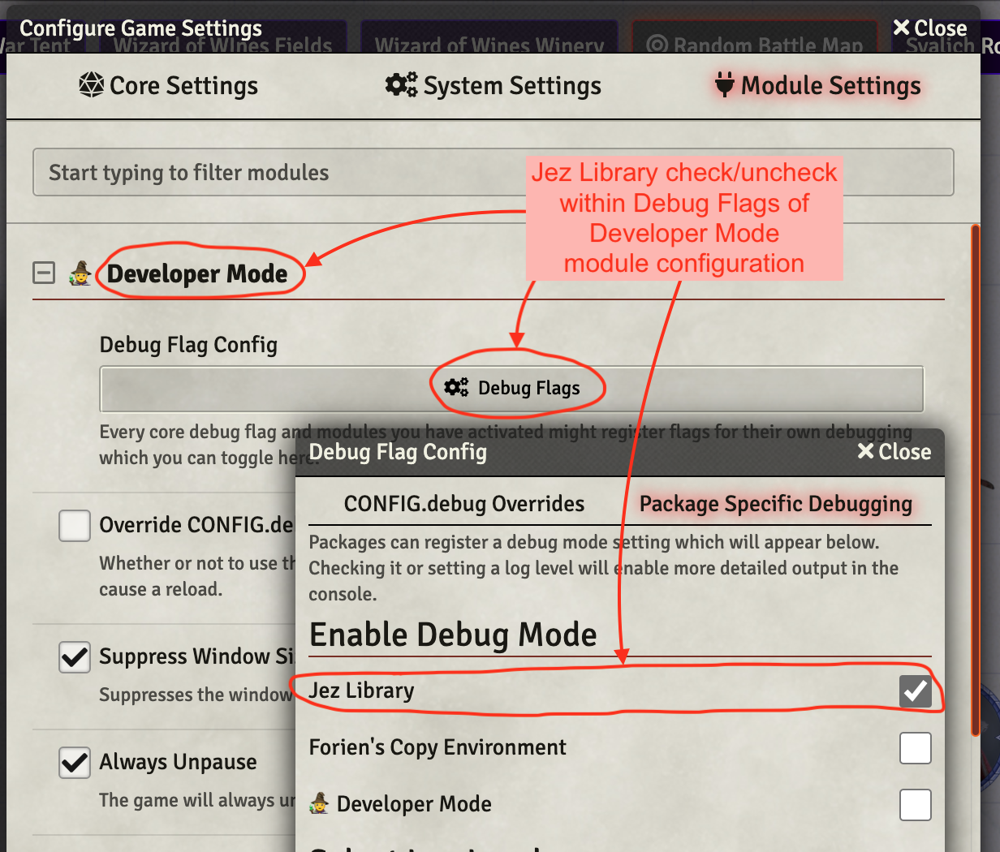

# Jez Lib -- Common Functions Used by My Macros

This module contains common functions that many of my macros use.  They are all things that I tend to want to do and either need to cut'n'paste or reinvent the wheel for new macro.  

[Link back to my Repo Listing](https://github.com/Jeznar/GitRepo)

## jez.log() as an Example

The single most commonly used function in my macros is **jez.log()**.  This little work horse does nothing more than accept a number of arguments, perform formatting if it has more than one and dump them to the console with a *console.log()* call.  Oh, yes, it checks in with [Developer Mode](https://github.com/League-of-Foundry-Developers/foundryvtt-devMode) module to determine if the message will be suppressed.  I'll get more into that later in this document. 

## Actually Using this Module

I crafted this module with the intent of only using it for my own macros.  As such, I had no interest in making it available from within FoundryVTT. To be honest, I didn't want to spend the time to figure out how to do that.  I put this module together after following an excellent tutorial posted on Reddit by [theElfFriend](https://www.reddit.com/user/theElfFriend/) in an article titled: [Module Making for Beginners - A Step by Step Tutorial](https://www.reddit.com/r/FoundryVTT/comments/oibp3h/module_making_for_beginners_a_step_by_step/). 

I ran into a few challenges following the tutorial.  The most notable being:

* Developer Mode module must be installed if it is to be used (yea, kinda obvious)
* My Functions need to be embedded in a relevant class (jez, in my case)
* Function declarations are written a bit differently.  A *normal* declaration like, `async function pickFromListArray(...)`, becomes `static async pickFromListArray(...)`.

The small bundle of files that make up this module need to be paced on the server in the `data/modules/jez-lib` subdirectory.  FoundryVTT must be restarted after placing the files.  The module should then appear and be able to be activated in whatever world.  Of course, it doesn't do anything by itself, as it is just a set of functions that I like to leverage. 

## Jezcon (Condition) Functions

A second set of functions is located in jez-con.js.  These are all focused on managing conditions and effects.  It is documented [separately](jez-con.md).

## Functions in this Module

The functions currently included in this module are (all need to be proceeded by **jez.** when called):

* **[addMessage(chatMessage, msgParm)](#addmessagechatmessage-msgparm)** -- Adds to an existing message in the **Chat Log**
* **[badNews(message, \<badness\>)](#badnewsmessage-badnews)** -- Displays warning message on console and ui then returns false
* **[createEmbeddedDocs(type, updates)](#embeddeddoc-functions)** -- Creates an embedded document, wraps a RunAsGM function
* **[combatAddRemove(ACTION, SUBJECT, options = {})](#combataddremoveaction-subject-options--)** -- Add/Remove/Toggle Token in combat tracker
* **[combatInitiative(SUBJECT, options = {})](#combatinitiativesubject-options--)** Roll token's initiative if not already rolled
* **[deleteEffectAsGM(UUID, options = {})](#deleteeffectasgmuuid-options--)** GM wrapped macro to delete an entity by UUID
* **[deleteEmbeddedDocs(type, ids)](#embeddeddoc-functions)** -- Deletes an embedded document, wraps a RunAsGM function
* **[deleteItems(itemName, type, subject)](#deleteItemsitemName-type-subject)** -- Deletes all copies of specified item
* **[fireRay(TARGET_TOKEN, ACTIVE_TOKEN, OPTIONS = {})](#fireraytarget_token-active_token-options--)** -- Executes one beholder style beam
* **[getActor5eDataObj(subject)](#get-functions)** -- Returns the subject's actor5e data object
* **[getCastMod(subject)](#get-functions)** -- Returns the subject's casting stat modifier
* **[getCastStat(subject)](#get-functions)** -- Returns the subject's casting stat string (e.g. "int")
* **[getCEDesc()](#getcedescsubject-effectname-optionobj--)** -- Converts passed subject and returns Actor5e object.
* **[getCharLevel(subject)](#getCharacterLevel)** -- Returns the subject's character level
* **[getClassLevel(subject, className, options = {})](#get-functions)** -- Returns the subject's specific class level
* **[getDistance5e(one, two)](#getdistance5eone-two)** -- Returns alternate D&D 5E distance between two placeables
* **[getEffectDataObj(effect, subject)](#get-functions)** -- Returns the effect's data object
* **[getItemUses(item, options = {})](#getitemusesitem-options--)** -- Returns item use data object
* **[getMacroRunAsGM(macroName)](#getmacrorunasgmmacroname)** -- Obtains a run as GM macro or issues error
* **[getRandomRuneColor()](#getrandomrunecolor)** -- Return a string with a random valid JB2A rune color
* **[getRange(itemD, allowedUnits)](#getrangeaitem-allowedunits)** -- Returns the maximum range for specified item.
* **[getSize(token5e)](#getsizetoken5e)** -- Returns an object with size info for specified token.
* **[getSpellDC(subject)](#get-functions)** -- Returns a string containing the subjects spell DC
* **[getSpellSchool(item)](#getspellschoolitem)** -- Returns a string naming the school of passed item
* **[getStatMod(subject)](#get-functions)** -- Returns the subject's modifier for passed stat string
* **[getProfMod(subject)](#get-functions)** -- Returns the subject's proficiency modifier
* **[getRace(entity)](#getraceentity)** -- Returns a string containing the race of the entity
* **[getTokenById(subjectId)](#get-functions)** -- Returns the Token5e associated with the passed ID
* **[getTokenObjFromUuid(uuid, optionObj = {})](#gettokenobjfromuuiduuid-optionobj--)** Get a Token object from a appropriate UUID
* **[inRange(token1, token2, maxRange)](#inrangetoken1-token2-maxrange)** -- Returns a boolean, true if distance between tokens is less than or equal to maximum range specified.
* **[inRangeTargets(origin, RANGE, opts = {})](#inrangetargetsorigin-range-opts--)** -- Return array of range tokens after apply exclusion rules
* **[isActorUUID((string, options={})](#isactoruuidstring-options)**
* **isEffectUUID(string)** -- Determines if string looks like an ActiveEffect's UUID, returning a boolean.
* **isActor5e(obj)** -- Returns true if obj is an Actor5e object, otherwise false.
* **[isEqual(obj1, obj2)](#isEqualobj1-obj2)** -- Somewhat simple minded object comparison function based on one found online.
* **[isNPC(actorUuid, options = {})](#isnpcactorUuid-options--))** -- Returns boolean, true if provided UUID is a NPC
* **[isPC(actorUuid, options = {})](#ispcactorUuid-options--))** -- Returns boolean, true if provided UUID is a PC
* **isToken5e(obj)** -- Returns true if obj is an Token5e object, otherwise false.
* **[itemAddToActor(token5e, ItemName)](#item-functions)** -- Copies an item to Actor
* **[itemDeleteFromActor(token5e, itemName, itemType)](#item-functions)** -- Deletes an item from Actor
* **[itemFindOnActor(token5e, itemName, itemType)](#item-functions)** -- Finds and item on Actor
* **[itemMgmt_itemCount(array, name, type)](#itemMgmt_itemCountarray-name-type)** -- Returns count of item/type in array
* **[itemUpdateOnActor(token5e, itemName, itemUpdate, itemType)](#item-functions)** -- Updates an Item on Actor
* **[log(...parms)](#logparms)** -- Posts parameters, with some minimal formatting, to console if enabled
* **[modConcentratingEffect(aToken, macroName, argArray)](#modConcentratingEffectaToken-macroName-argArray)** -- Modify existing concentrating effect to call specified macro with supplied arguments.
* **[moveToken(anchorToken, movingToken, move, delay)](#movetokenanchorToken-movingToken-move-delay)** -- Push or pull token 1, 2 or 3 spaces
* **[pairEffects(subject1, effectName1, subject2, effectName2)](#pairEffectssubject1-effectName1-subject2-effectName2))** -- Add lines to DAE effects to remove other member of pair when either removed.
* **[pickCheckListArray(queryTitle, queryText, pickCallBack, queryOptions)](#pickfromlistarrayquerytitle-querytext-pickcallback-queryoptions)** -- Pops a check box dialog offering list of selections.  User's selection array is passed to the specified callback function. 
* **[pickFromListArray(queryTitle, queryText, pickCallBack, queryOptions)](#pickfromlistarrayquerytitle-querytext-pickcallback-queryoptions)** -- Pops a selection dialog offering a drop down list.  User's selection is passed to the specified callback function. 
* **[pickRadioListArray(queryTitle, queryText, pickCallBack, queryOptions)](#pickRadioListArrayquerytitle-querytext-pickcallback-queryoptions)** -- Pops a selection dialog offering a radio button list.  User's selection is passed to the specified callback function.
* **[postMessage(msgParm)](#postmessagemsgparm)** -- Posts a new message to the **Chat Log**
* **[randomDarkColor()](#randomdarkcolor)** -- Returns the name of a color from a list.
* **[refundSpellSlot(token5e, SPELL_LEVEL, options = {})](#refundspellslottoken5e-spell_level-options--)** -- Refunds a spell slot
* **[replaceSubString(string, substring, newSubstring)](#replaceSubStringstring-substring-newSubstring)** -- Returns updated string and count of replacements in an object.
* **[resourceAvail(actor5eUuid, resourceName, aItemUuid, options = {})](#resourceavailactor5eUuid-resourcename-aitemuuid-options--)))** -- Checks the availaibility of named resource on passed actor.
* **[resourceRefund(actor5eUuid, resourceName, aItemUuid, options = {})](#resourcerefundactor5eUuid-resourcename-aitemuuid-options--)))** -- For PCs, increment the verified resource but not past max.
* **[resourceSpend(actor5eUuid, resourceName, aItemUuid, options = {})](#resourcespendactor5eUuid-resourcename-aitemuuid-options--)))** -- For PCs, decrement resource, verifying it exists and at least a value of 1.
* **[runRuneVFX(...)](#runRuneVFX)** -- Run a three stage run VFX on specified token.
* **[selectItemOnActor(sToken, prompts, nextFunc)](#selectitemonactorstoken-prompts-nextfunc)** -- Complex function that runs a series of dialogs to return a list of actors who have an item selected from targeted actor.
* **[setCEDesc()](#setcedescsubject-effectname-description-optionobj--)** -- Converts passed subject and returns Actor5e object.
* **[setCEDescAsGM()](#setcedescasgmsubject-effectname-description-optionobj--)** -- Wrapper for setCEDesc() adding RunAsGM.
* **[setItemUses(item, uses, options = {})](#setitemusesitem-uses-options--)** -- Sets the number of uses for specified item
* **[spawnAt(MINION, aToken, aActor, aItem, argObj)](#spawnatminion-atoken-aactor-aitem-argobj)** -- this one is ambitious.  It aims to make the summoning, customizing and placement of VFXs for that summoning a one call affair.* **[suppressTokenMoldRenaming(\<delay = 500\>, \<{traceLvl:1}\>)](#suppresstokenmoldrenamingdelay--500-traceLvl1)** -- Suppresses token-mold renaming for specified number of milliseconds
* **[subjectToActor()](#subjectToActorsubject-fname)** -- Converts passed subject and returns Actor5e object.
* **[tileCreate(tileProps)](#tilecreatetileprops)** -- Creates a tile with specified properties
* **[tileCreate(tileId)](#tiledeletetileid)** -- Deletes a tile with specified ID
* **[tokensInRange(sel, range)](#tokensinrangeseltoken-range)** -- Returns an array of tokens within range of selected token
* **[trc(level, threshold, ...parms)](#trclevel-threshold-parms)** -- Posts parameters, with some minimal formatting, to console if traceLevel greater than level
* **[typeOf(arg)](typeofarg)** -- Returns type of arg, differentiating arrays and objects.
* **[updateEmbeddedDocs(type, updates)](#embeddeddoc-functions)** -- Updates an embedded document, wraps a RunAsGM function
* **[vfxPreSummonEffects(template, optionObj](#vfxPreSummonEffectstemplate-optionObj)** -- Run pre VFX for warpgate summons
* **[vfxPostSummonEffects(template, optionObj](#vfxPostSummonEffectstemplate-optionObj)** -- Run pre VFX for warpgate summons
* **[warpCrossHairs(...)](#warpcrosshairs)** -- Put a range display on warpgate summons 
* **[wait(ms)](#waitms)** -- Waits for specified milliseconds.
* **[writeTrcLog(prefix, ...parms)](#writetrclogprefix-parms)** -- Worker function for **trc** and **log**.


                                
More about many of these in the following sections. 

---

### addMessage(chatMessage, msgParm)

This function is similar to [postMessage(msgParm)](#postmessagemsgparm) but it adds additional information to an existing chat message in the log.  

The first parameter, **chatMessage**, must be of type *ChatMessage*.  If this is being used as an OnUse ItemMacro, the chat card for the current message can be obtained with: `game.messages.get(args[args.length - 1].itemCardId);` In other circumstances, it can be rather more complex to obtain and beyond the scope of this documentation. 

The passed **msgParm** can be a string or an object as in the cousin function, [postMessage(msgParm)](#postmessagemsgparm).  If the more complex object parameter is specified, it may contain the following fields (fields not specified will default to more or less reasonable values):

* **fSize**: Number specifying the font size (in points),
* **color**: String naming the foreground color,
* **msg**: String containing the actual text to be displayed.
* **tag**: String naming the anchor location from: saves, attack, damage, hits, other

<details> <summary>Sample Code Snippet</summary>

The following code snippet produces a chat card with quite a few added messages.  One thing worth noting is that repeated invocations to the same tag point (the simple form in the below example) will appear before any other message added at the tag, so messages may need to be presented *backwards*.

~~~javascript
let chatMessage = game.messages.get(args[args.length - 1].itemCardId);
jez.addMessage(chatMessage, "and Again!!!")
jez.addMessage(chatMessage, "Again! ")
jez.addMessage(chatMessage, "Hey There ")
let msg = "Saves-Display Message Area"
jez.addMessage(chatMessage, {color:"purple", fSize:15, msg:msg, tag:"saves" })
msg = "Attack-Roll Message Area"
jez.addMessage(chatMessage, {color:"darkred", fSize:15, msg:msg, tag:"attack" })
msg = "Damage-Roll Message Area"
jez.addMessage(chatMessage, {color:"blue", fSize:15, msg:msg, tag:"damage" })
msg = "Hits-Display Message Area"
jez.addMessage(chatMessage, {color:"darkgreen", fSize:15, msg:msg, tag:"hits" })
msg = "Other-Roll Message Area"
jez.addMessage(chatMessage, {color:"crimson", fSize:15, msg:msg, tag:"other" })
~~~

The above, will generate a message such as the following:


</details>

[*Back to Functions list*](#functions-in-this-module)

---

### badNews(message, \<badnews\>)

Pop the passed string (message) onto the console and as ui notification and return false.

This function can accept one or two arguments

* message: required string that will be used as the error message
* badnews: optional severity indicator.  It can be an integer (1, 2, or 3) or a string that begins with a i, w, or e (technically, the code is much more permissive but this is intent.)

```javascript
if (matches === 0) return jez.badNews(`"${nameOfItem}" of type "${typeOfItem}" not in Item Directory, can not continue.`)

jez.badNews("Info Message", 1)  // Information
jez.badNews("Warn Message", 2)  // Warning
jez.badNews("Error Message", 3) // Error
```

[*Back to Functions list*](#functions-in-this-module)

---

### combatAddRemove(ACTION, SUBJECT, options = {})

Add/Remove/Toggle combat state, defined by ACTION, for the tokens specified by SUBJECT. This function depends on a call to runAsGM macro: **ToggleCombatAsGM**.

ACTION can be: "Add", "Remove", or "Toggle"

SUBJECT can be an atomic value or an array of any of these data types:

- Token5e Data Object
- TokenDocument5e Data Object
- Token ID
- Token Document UUID
 
Options has one defined field:

- traceLvl: Trace Level for this function call.

<details> <summary>Sample Call, Summoning and rolling initiatives</summary>

Following block of code summons demonCnt demons to the field, adds them to combat, rolls initiative, and makes a space delimited list of the resultant token.id's for the summoned tokens.

```javascript
    let demonUuids = ""
    for (let i = 1; i <= demonCnt; i++) {
        let dUuid = await summonCritter(demonList[SEL_DEMON].data, i, { traceLvl: TL })
        await jez.combatAddRemove('Add', dUuid, { traceLvl: TL })               // Add demon to combat
        await jez.wait(100)
        await jez.combatInitiative([ dUuid ], { formula: null, traceLvl: 0 })   // Roll demon initiative
        if (TL > 2) jez.trace(`${TAG} Demon UUID ${i}`, dUuid)
        if (demonUuids) demonUuids += ' ' + dUuid; else demonUuids += dUuid
    }
```
</details>

See related function: [combatInitiative(SUBJECT, options = {})](#combatinitiativesubject-options--)

[*Back to Functions list*](#functions-in-this-module)

---  

### combatInitiative(SUBJECT, options = {})

Roll initiative(s) for token(s) specified in SUBJECT that don't already have initiative values. This function depends on a call to runAsGM macro: **RollInitiativeAsGM**.

**SUBJECT** can be an atomic value or an array of any of these data types:

- Token5e Data Object
- TokenDocument5e Data Object
- Token ID
- Token Document UUID
 
**Options** has two defined fields:

- formula: formula passed to Roll function, if not using default, this might be a "20" if forcing the initiative roll result.
- traceLvl: Trace Level for this function call.

<details> <summary>Sample Call, Summoning and Forcing 20 Initiative</summary>

Following block of code summons a lair tracker token belonging to aToken (using a not shown function) and then forces it to roll a 20 initiative.

```javascript
//-----------------------------------------------------------------------------------------------
//  Spawn in the Lair Token
//
const LAIR_TOKEN_ID = await spawnToken(aToken, {traceLvl: TL})
//-----------------------------------------------------------------------------------------------
//  Add the lair tracker to combat tracker and force an initiative roll to 20
//
await jez.combatAddRemove('Add', LAIR_TOKEN_ID, { traceLvl: TL })         // Add to combat
await jez.wait(100)                                                       // Allow add to finish
await jez.combatInitiative(LAIR_TOKEN_ID, { formula: "20", traceLvl: 0 }) // Force 20 initiative
```
</details>

See related function: [combatAddRemove(ACTION, SUBJECT, options = {})](#combataddremoveaction-subject-options--)

[*Back to Functions list*](#functions-in-this-module)

---  

### deleteEffectAsGM(UUID, options = {})

Wrapper around a run as GM to delete an item, ostensibly an effect (though likely anything with a UUID can be affected), by UUID asGM.

```javascript
if (oldEffect) jez.deleteEffectAsGM(OLD_UUID, { traceLvl: TL })
```
Nothing is returned and no error handling is performed. 

[*Back to Functions list*](#functions-in-this-module)

---  

### deleteItems(itemName, type, subject)

Function to delete all copies of a named item of a given type from actor

Parameters

- **itemName**: A string naming the item to be found in actor's inventory
- **subject**: actor, token, or token Id to be searched
- **type**: type of item to be deleted, e.g. spell, weapon 

A brief deletion messages is popped for each item deleted. Sample call:

```javascript
await jez.deleteItems(ATTACK_ITEM, "spell", aActor);
```

[*Back to Functions list*](#functions-in-this-module)

---
 
### fireRay(TARGET_TOKEN, ACTIVE_TOKEN, OPTIONS = {})

Special case library call that implements the eye ray attack of beholder style creatures (e.g. Gauth, Spectator).  It depends on a large set of options to execute the types of things Beholder eye rays can do.  

<details> <summary>Options Content</summary>

Options parameters fall into four categories: Always, Effects, Damage, Push Back.  The last three only having a use on rays that place effects, do damage, or include a knockback.

#### Always
1. **RAY_NAME** = OPTIONS.RayName ?? "Devour Magic"
1. **VFX_COLOR** = OPTIONS.VFXColor ?? "*"
1. **ceDesc** = OPTIONS.ceDesc ?? `Randomly selected magic item affected by ${ACTIVE_TOKEN.name}'s ${RAY_NAME}`
1. **SAVE_TYPE** = OPTIONS.saveType ?? "dex";
1. **SAVE_DC** = OPTIONS.saveDC ?? ACTIVE_TOKEN.actor.data.data.attributes.spelldc
2. **traceLvl** = OPTIONS.traceLvl ?? 0

#### Effects
1. **EFFECT_ICON** = OPTIONS.icon ?? "systems/dnd5e/icons/skills/yellow_26.jpg"
1. **EFFECT_NAME** = OPTIONS.effectName ?? false
1. **CHANGES** = OPTIONS.changes ?? [{ key: `flags.gm-notes.notes`, mode: jez.ADD, value: ceDesc, priority: 20 }]
1. **SPEC_DUR** = OPTIONS.specDur ?? ["turnStartSource", "newDay", "longRest", "shortRest"]
1. **ROUNDS** = OPTIONS.rounds ?? 2

#### Damage
1. **DAMAGE_ROLL** = OPTIONS.damageRoll ?? false
1. **DAMAGE_TYPE** = OPTIONS.damageType ?? false
1. **ACTIVE_ITEM** = OPTIONS.aItem ?? null

#### Knock Back
1. **PUSH_BACK** = OPTIONS.pushBack ?? 0
</details>

<details> <summary>Devoir Magic Ray Call (Effect)</summary>

```javascript
...
rayName = "Devour Magic"
options = {
    RayName: rayName,
    VFXColor: "rainbow02",
    ceDesc: devourMagicDesc,
    traceLvl: TL,
    saveType: "dex",
    icon: aItem.img,
    effectName: rayName,
    changes: [{key: `flags.gm-notes.notes`, mode: jez.ADD, value: devourMagicDesc, priority: 20}]    
}
msg = await jez.fireRay(targetArray[i], aToken, options);
```
</details>


<details> <summary>Pushing Ray Call (Knock Back)</summary>

```javascript
...
rayName = "Pushing Ray"
options = {
    RayName: rayName,
    VFXColor: "yellow",
    ceDesc: `Pushed back up to 15 feet and speed reduced by half by ${aToken.name}'s ${rayName}`,
    traceLvl: TL,
    saveType: "str",
    icon: "Icons_JGB/Conditions/slow1.png",                  
    effectName: rayName,
    pushBack: 15,
    changes: [
        { key: `data.attributes.movement.walk`, mode: jez.MULTIPLY, value: 0.5, priority: 20 },
        { key: `data.attributes.movement.swim`, mode: jez.MULTIPLY, value: 0.5, priority: 20 },
        { key: `data.attributes.movement.fly`, mode: jez.MULTIPLY, value: 0.5, priority: 20 },
        { key: `data.attributes.movement.climb`, mode: jez.MULTIPLY, value: 0.5, priority: 20 },
        { key: `data.attributes.movement.burrow`, mode: jez.MULTIPLY, value: 0.5, priority: 20 },
    ]    
}
msg = await jez.fireRay(targetArray[i], aToken, options);
```
</details>

<details> <summary>Fire Ray Call (Damage)</summary>

```javascript
...
rayName = "Fire Ray"
options = {
    RayName: rayName,
    VFXColor: "orange",
    ceDesc: `${tToken.name} damaged by ${aToken.name}'s ${rayName}`,
    traceLvl: TL,
    saveType: "dex",
    damageRoll: "4d10",
    damageType: "fire",
    effectName: false,
    aItem: aItem
}
msg = await jez.fireRay(targetArray[i], aToken, options);
```
</details>

[*Back to Functions list*](#functions-in-this-module)

---

### EmbeddedDoc Functions

Series of functions that wrap runAsGM Macros to manage embedded documents when fired off by the GM or by players.

* **createEmbeddedDocs(type, updates)** -- Creates an embedded document, wraps a RunAsGM function
* **deleteEmbeddedDocs(type, ids)** -- Deletes an embedded document, wraps a RunAsGM function
* **updateEmbeddedDocs(type, updates)** -- Updates an embedded document, wraps a RunAsGM function

All of them utilize static variables included in jez-lib that name the macros to be called.  These variables are available to other macros, but are likely not needed by them.  They must map to macros with the runAsGM flag set. 

~~~javascript
 CREATE_EMBEDDED_MACRO = "CreateEmbeddedDocuments"
 DELETE_EMBEDDED_MACRO = "DeleteEmbeddedDocuments"
 UPDATE_EMBEDDED_MACRO = "UpdateEmbeddedDocuments"
~~~

#### createEmbeddedDocs(type, updates)

This function will create a document of the type named by  *type*, which is a string with values like: *item*, *tile*.  The updates parameter should be an object describing the new object.  The function will return an ID to the GM and nothing to players.  To make this work for players some creativity is needed.  Following is a chunk of code that handles this for Minor_Illusion.js.

~~~javascript
let existingTiles = []
for (tile of game.scenes.current.tiles.contents) {
    jez.trc(4,trcLvl,"tile ID", tile.id)
    existingTiles.push(tile.id)
}
jez.trc(3,trcLvl,"Value of existingTiles",existingTiles)
let newTile = await jez.createEmbeddedDocs("Tile", [tileProps])  
jez.trc(3, "jez.createEmbeddedDocs returned", newTile);
if (newTile) {
    let returnValue = newTile[0].data._id
    jez.trc(2,`--- Finished --- ${MACRONAME} ${FUNCNAME} --- Generated:`,returnValue);
    return returnValue; // If newTile is defined, return the id.
}
else {   // newTile will be undefined for players, so need to fish for a tile ID
    let gameTiles = null
    let i
    for (i = 1; i < 20; i++) {
        let delay = 5
        await jez.wait(delay)   // wait for a very short time and see if a new tile has appeared
        jez.trc(3,trcLvl,`Seeking new tile, try ${i} at ${delay*i} ms after return`)
        gameTiles = game.scenes.current.tiles.contents
        if (gameTiles.length > existingTiles.length) break
    }
    if (i === 40) return jez.badNews(`Could not find new tile, sorry about that`,"warn")
    jez.trc(3,trcLvl,"Seemingly, the new tile has id",gameTiles[gameTiles.length - 1].id)
    let returnValue = gameTiles[gameTiles.length - 1].id
    jez.trc(2,trcLvl,`--- Finished --- ${MACRONAME} ${FUNCNAME} --- Scraped:`,returnValue);
    return returnValue
}
~~~

#### deleteEmbeddedDocs(type, ids)

This function is similar. The *ids* argument needs to be an array of ids that will be deleted. Following is an example usage.

~~~javascript
if (args[1] === "Tile") {
    const TILE_ID = args[2]
    jez.trc(3,trcLvl,`Delete the VFX tile`, TILE_ID)
    await jez.deleteEmbeddedDocs("Tile", [TILE_ID])  
    jez.trc(3,trcLvl,`Deleted Tile ${TILE_ID}`)
} 
~~~

#### updateEmbeddedDocs(type, updates)

This one allows a player to make changes to tokens they typical cannot change. 

~~~javascript
if (jez.isToken5e(tok)) {
    let updates = [];
    updates.push({
        _id: tok.id,
        height: newWidth,
        scale: newScale,
        width: newWidth
    });
    await jez.updateEmbeddedDocs("Token", updates)  
} 
~~~

[*Back to Functions list*](#functions-in-this-module)

---

### Get Functions

A series of functions that return simple integer values or false on errors with a fair amount of error checking.

#### Functions
- **jez.getCastMod(subject)** -- Returns the subject's casting stat modifier
- **jez.getCastStat(subject)** -- Returns the subject's casting stat string (e.g. "int")
- **jez.getCharLevel(subject)** -- Returns the subject's character level (useful for Cantrip scaling)
- **jez.getClassLevel(subject, className, options = {})** -- For PCs returns the class level of the character's named class.  For NPCs returns the character level.
- **jez.getStatMod(subject,stat)** -- Returns the subject's modifier for passed stat string
- **jez.getSpellDC(subject)** -- Returns the subject's spell save DC
- **jez.getProfMod(subject)** -- Returns the subject's proficiency modifier
- **jez.getTokenById(subjectId)** -- Returns the Token5e associated with the passed ID

#### Parameters
* Subject: Token5e or Actor5e object or 16 character id of a token
* Stat: A string from: "str", "dex", "con", "int", "wis", "chr"
* ClassName: A string naming a character class, e.g. "Druid", "wizard", "FIGHTER"
* SubjectId: 16 character identifier for a token in the current scene

#### And Two more
Two additional get functions intended to make handling the overloaded inputs a bit easier to code:

- **jez.getActor5eDataObj(subject)** -- Function to return the Actor5e data associated with the passed parameter. The subject can be  actor5e data object, token5e data object, token.id or actor.uuid. Also accepts actor.id with a warning as it returns the sidebar actor for unlinked tokens.
- **getEffectDataObj(effect, subject)** -- Function to return the Effect data object identified by arguments. The **effect** parameter can be either a string naming the effect, an id or a uuid, e.g. 52 character string: `Actor.i9vqeZXzvIcdZ3BU.ActiveEffect.DmvGS7OsCz3HoggP`. **Subject** (optional) identifies the actor with effect in question, it just be a type supported by getActor5eDataObj, this parameter is not required if effect is a UUID.

[*Back to Functions list*](#functions-in-this-module)

---

### getCEDesc(subject, effectName, optionObj = {})

Function that returns the Convenient Effects Description (convenientDescription) for the effect named by the **effectName** parameter from the actor identified by **subject**.  Subject is first processed by [subjectToActor()](#subjectToActorsubject-fname) so it can be an Actor5e object, Token5e object, token id string, or any other supported identification (see subjectToActor).

Inputs Are

- **subject**: An Actor5e or Token5e data object, or a token id. 
- **effectName**: A string naming an effect to be read from the subject.
- **optionObj**: Options passed, currently just **traceLvl** is supported.

<details> <summary>Sample Call</summary>

```javascript
let tToken = canvas.tokens.get(args[0]?.targets[0]?.id); // First Targeted Token, if any
const EFFECT = "Frightened"
const TL = 2

const CE_DESC = await jez.getCEDesc(tToken, EFFECT, { traceLvl: TL })
```
</details>

Related Function: **[setCEDesc()](#setcedescsubject-effectname-description-optionobj--)**

[*Back to Functions list*](#functions-in-this-module)

---

### getDistance5e(one, two)

This function returns the distance between two placeable entities (e.g. tokens) in the D&D 5E alternate rule set where diagonal movement is charged as 5-10-5-10-5 feet of movement.  The returned value will be evenly divisible by 5.

I snarfed the logic from Vance Cole's lovely Distance macro, which can be found at: [macros/distance.js](https://github.com/VanceCole/macros/blob/master/distance.js) 

[*Back to Functions list*](#functions-in-this-module)

---

### getItemUses(item, options = {})

Returns the item use data object for specified item.  Typical returned value:

~~~javascript
max: 2
per: "day"
value: 1
~~~

See related function: **[setItemUses(item, uses, options = {})](#setitemusesitem-uses-options--)**
           
[*Back to Functions list*](#functions-in-this-module)

--- 

### getRace(entity)

Return the race of the passes **Actor5e**, **Token5e**, or **TokenDocument5e**.  The value will be a lowercase string, which may be empty.  It is taken from a user input field, so garbage may be present.  

If passed a parameter not of a supported type, returns FALSE

~~~javascript
for ( let token of canvas.tokens.controlled ){
  let race = jez.getRace(token.document))
  if (race.includes("construct")) console.log(`${token.name} is construct`)
}
~~~

---

### getMacroRunAsGM(macroName)

Test to see if the received string links to a run as GM macro.  Return the macro or false.

~~~javascript
console.log(jez.getMacroRunAsGM("ImaginaryMacro"))  // Generates an error
console.log(jez.getMacroRunAsGM("Test getRace"))    // Should exist but not be run As GM
console.log(jez.getMacroRunAsGM("ActorUpdate"))     // Should actually exist and be Run as GM

const GM_MACRO = jez.getMacroRunAsGM("ActorUpdate") // This macro will display ui.notification.error
if (!GM_MACRO) return false
~~~

[*Back to Functions list*](#functions-in-this-module)

---

### getRandomRuneColor()

This function returns a string naming a valid random JB2A rune color.  Possible returned values are:

* blue, 
* green,
* pink,
* purple,
* red, and
* yellow.

[*Back to Functions list*](#functions-in-this-module)

---

### getRange(aItem, allowedUnits)

This function returns the maximum range defined on the names item and verifies that the units set on that item are in the allowed set.  The set of allowedUnits is an array of strings. 

Following is a sample call.

~~~javascript
const ALLOWED_UNITS = ["", "ft", "any"];

let maxRange = jez.getRange(aItem, ALLOWED_UNITS)
if (!maxRange) {
    msg = `Range is 0 or incorrect units on ${aItem.name}`;
    jez.log(msg);
    ui.notifications.warn(msg);
    return(false)
}
~~~

Below is a sample output from the test harness function (included in the library repo) that ran this function and then displayed the results.


[*Back to Functions list*](#functions-in-this-module)

---

### getSize(token5e)

This function pops grabs size information from the specified token and returns an object with size expressed in several formats.

The returned object will be composed of:

* @typedef  {Object} CreatureSizes
* @property {integer} value  - Numeric value of size: 1 is tiny to 6 gargantuan
* @property {string}  str    - Short form for size generally used in FoundryVTT data 
* @property {string}  string - Spelled out size all lower case
* @property {string}  String - Spelled out size with the first letter capitalized  

<details> <summary>**Sample getSize Use**</summary>

~~~javascript
...
const FUNCNAME = "doOnUse()";
const FNAME = FUNCNAME.split("(")[0] 
const TAG = `${MACRO} ${FNAME} |`
//----------------------------------------------------------------------------------
// Obtain the size of the aActor and tActor to determine advantage/disadvantage
// 
if (TL>2) jez.trace(`${TAG} await jez.getSize(aToken)`, await jez.getSize(aToken))
let aTokenSizeValue = (await jez.getSize(aToken)).value
let tTokenSizeValue = (await jez.getSize(tToken)).value
if (TL>1) jez.trace(`${TAG} ${aToken.name} size = ${aTokenSizeValue}, ${tToken.name} size = ${tTokenSizeValue}`)
if (aTokenSizeValue + 3 <= tTokenSizeValue) {
    msg = `${tToken.name} is too large to be frightend by ${aToken.name}`
    if (TL>0) jez.trace(`${TAG} msg`);
    await jez.addMessage(chatMsg, {color:"dodgerblue", fSize:15, msg:msg, tag: "saves" })
    return;
}
~~~

</details>


[*Back to Functions list*](#functions-in-this-module)

---

### getSpellSchool(item)

This function obtains the spell school from the passed parameter.  The school will be a string as used by JB2A module.  Possible returned values are:

* abjuration
* conjuration
* divination
* enchantment
* evocation
* illusion
* necromancy
* transmutation
* and FALSE (if no valid school found)

[*Back to Functions list*](#functions-in-this-module)

---

### getTokenObjFromUuid(uuid, optionObj = {})

This function obtains and return a Token5e or PrototypeTokenData object associated with the uuid passed into this function. UUID is assumed to look like one of the following:

* **Linked Actor Item**  : Actor.lZ487ouiBiQs3lql.Item.fyhrudodjr8ooucb
* **Unlinked Actor Item**: Scene.MzEyYTVkOTQ4NmZk.Token.lZ487ouiBiQs3lql.Item.fyhrudodjr8ooucb

This function works by starting on the left and processing the UUID until a result is found so shorter UUIDs like these, also work:
      
* **Linked Actor**  : Actor.lZ487ouiBiQs3lql
* **Unlinked Actor**: Scene.MzEyYTVkOTQ4NmZk.Token.lZ487ouiBiQs3lql

Returns a **Token5e** or **PrototypeTokenData** object.  If function fails, return false

Following is a sample call.

~~~javascript
let oToken = await jez.getTokenObjFromUuid(LAST_ARG.origin, { traceLvl: TL })
~~~

[*Back to Functions list*](#functions-in-this-module)

---

### inRange(token1, token2, maxRange)

This function returns true if distance between token1 and token2 is less than or equal to the maximum range specified.

Following is a sample call.

~~~javascript
// maxRange obtained earlier with a jez.getRange(...) call
if(!jez.inRange(aToken, tToken, maxRange)) {
    msg = `Target is not in range for ${aItem.name}`;
    jez.log(msg);
    ui.notifications.warn(msg);
    return(false);
}
~~~

[*Back to Functions list*](#functions-in-this-module)

---

### inRangeTargets(origin, RANGE, opts = {})

Find all the tokens in range of the origin following exclusion rules described in the options object.  The return is either an object containing Token5e objects that met the criteria or false if none did.

_Arguments_

* **origin** : Token5e object defining the origin of the effect.
* **RANGE**  : Distance, usually in feet, defining maximum range for this list.
* **opts**   : optional Object that can have multiple attributes as described below.
 
_Options Attributes (first value is  default)_

* **exclude**  : string  - self, friendly, none 
* **direction**: string  - t2o, o2t  (target to origin or vice versa for 1-way obstuctions)
* **chkMove**  : boolean - false, true (check for wall blocking movement)
* **chkSight** : boolean - false, true (check for wall blocking light)
* **chkHear**  : boolean - false, true (check for wall blocking sound)
* **chkSpeed** : boolean - false, true (does the target have any movement?)
* **chkBlind** : boolean - false, true (does the target have blinded condition?)
* **chkDeaf**  : boolean - false, true (does the target have deafened condition?)

Following is a sample call, with a bunch of options set, rarely if ever would all of these options need to be set

~~~javascript
let options = {
    exclude: "Friendly",    // self, friendly, or none (self is default)
    direction: "t2o",       // t2o or o2t (Origin to Target) (t2o is default) 
    chkMove: true,          // Boolean (false is default)
    chkSight: true,         // Boolean (false is default)
    chkHear: false,         // Boolean (false is default)
    chkSpeed: true,         // Boolean (false is default)
    chkBlind: true,         // Boolean (false is default)
    chkDeaf: true,          // Boolean (false is default)
    traceLvl: TL,           // Trace level, integer typically 0 to 5
}
let returned = await jez.inRangeTargets(aToken, 30, options);
if (returned.length === 0) return jez.badNews(`No effectable targets in range`, "i")
if (TL>1) for (let i = 0; i < returned.length; i++) jez.trace(`${FNAME} | Targeting: ${returned[i].name}`)
~~~

Some of the exclusion rules are a tad bit tortured.  They do as described in the comment very specifically, e.g. being blind is defined by having the blinded condition, or not.


[*Back to Functions list*](#functions-in-this-module)

---

### isActorUUID(string, options={})

Determines if the passed argument "looks like" an actor's UUID, returning a boolean result. An Actor UUID should be one of the following general formats

| Actor Type | Example Value                                 |
|-----------:|-----------------------------------------------|
| Linked     | Actor.8D0C9nOodjwHDGQT                        |
| Unlinked   | Scene.MzEyYTVkOTQ4NmZk.Token.Snu5Wo5FRsogPmGO |

Example Call

~~~javascript
const TL = 2
let targetUuid = args[args.length - 1].targetUuids[0]

if (!isActorUUID(targetUuid, {traceLvl:TL})) return false
~~~

[*Back to Functions list*](#functions-in-this-module)

---

### isEqual(obj1, obj2)

This function returns true if the two arguments evaluate as equal.

Somewhat simple minded object comparison function based on one found online.
[https://medium.com/geekculture/object-equality-in-javascript-2571f609386e](https://medium.com/geekculture/object-equality-in-javascript-2571f609386e)

[*Back to Functions list*](#functions-in-this-module)

---

### isNPC(actorUuid, options = {})

Returns true if the actor identified by actorUuid is a NPC, false otherwise.

<details> <summary>**Sample isNPC Use**</summary>

This is an async function, so be sure to await the result.

~~~javascript
...
if (await jez.isNPC(aActor.uuid, { traceLvl: 0 })) console.log(`${aToken.name} is an NPC`)
~~~

</details>

[*Back to Functions list*](#functions-in-this-module)

---

### isPC(actorUuid, options = {})

Returns true if the actor identified by actorUuid is a PC, false otherwise.

<details> <summary>**Sample isNPC Use**</summary>

This is an async function, so be sure to await the result.

~~~javascript
...
if (await jez.isPC(aActor.uuid, { traceLvl: 0 })) console.log(`${aToken.name} is a PC`)
~~~

</details>

[*Back to Functions list*](#functions-in-this-module)

---

### Item Functions

A set of functions built to standardize how I handle copying items from the Item Directory to actors and manipulate them.  Parameters used by these are listed below along with their meanings.

* **token5e** -- token data of the type "token5e" (I didn't bother to make these functions extra flexible with inputs).
* **itemName** -- A string naming the item in question, must be an exact match.
* **itemType** -- This is typically an optional parameter, that narrows the selection by giving a string that names an item type.  The item types of which I am aware are: backpack, class, consumable, equipment, feat, loot, spell, tool, weapon
* **itemUpdate** -- This is an object that defines changes to be made to an item.  More on this below.

The functions, short descriptions, and samples usage follow.

#### jez.itemAddToActor(token5e, ItemName)

Copy the item specified by "ItemName" from the items directory to the token identified as "token5e".  Since we control the items directory, going to assume the wisdom to make ItemName unique is exercised.

~~~javascript
await jez.itemAddToActor(aToken, TEMPLATE_NAME)
~~~

#### jez.itemDeleteFromActor(token5e, itemName, itemType)

Delete specified item specified by "ItemName" from specified token5e.  Return true on success, false on failure. If a third parameter "itemType" is passed limit the search to items of that type.
 
This function is similar to [jez.deleteItems(...)](#deleteItemsitemName-type-subject), but only deletes one copy of the item.

~~~javascript
// As long as an item is deleted, keep on deleting
do { } while (await jez.itemDeleteFromActor(aToken, TEMP_SPELL_NAME, "spell"));

~~~

#### jez.itemFindOnActor(token5e, itemName, itemType)

Search the specified Token5e's actor for the named item.  Return false if not found, return the item if found.  If a third parameter "itemType" is passed limit the search to items of that type.

~~~javascript
let getItem = await jez.itemFindOnActor(aToken, itemName, "spell");
~~~

#### jez.itemUpdateOnActor(token5e, itemName, itemUpdate, itemType)

For the item named as "itemName", optionally of the specified itemType on the token5e update the item as specified in the itemUpdate object.  

~~~javascript
//-------------------------------------------------------------------------------------------
// Update the item's name and extract the comments from the description
//
let itemUpdate = {
    name: ATTACK_ITEM,                 // Change to actor specific name for temp item
}
await jez.itemUpdateOnActor(aToken, "%%Heat Metal Damage%%", itemUpdate, "spell")
~~~

**Special case**, if data.description.value is not specified in the update object, then this function will strip out anything set off in bold surrounded by double percent symbols. This is intended to remove the **don't change this message** assumed to be embedded in the item description.  Within the HTML It should be of the form: `<p><strong>%%.*%%</strong></p>` it can have any amount of white space trailing it which will also be stripped out.

Following is a complete use of a couple of these commands to place and update an item.  In this example the update is run twice, the first time renames the item and strips the comments.  The data on the item is then used as a basis for the second set of changes.

~~~javascript
//-------------------------------------------------------------------------------------------
// Update the item's name and extract the comments from the description
//
let itemUpdate = {
    name: ATTACK_ITEM,                 // Change to actor specific name for temp item
}
await jez.itemUpdateOnActor(aToken, "%%Heat Metal Damage%%", itemUpdate, "spell")
//-------------------------------------------------------------------------------------------
// Grab the data for the new item from the actor
//
let getItem = await jez.itemFindOnActor(aToken, ATTACK_ITEM, "spell");
//-------------------------------------------------------------------------------------------
// Update the description field
//
let description = getItem.data.data.description.value
description = description.replace(/%NUMDICE%/g, `${NUM_DICE}`);         // Replace %NUMDICE%
description = description.replace(/%TARGETNAME%/g, `${tToken.name}`);   // Replace %TARGETNAME%
//-------------------------------------------------------------------------------------------
// Update the macro field
//
let macro = getItem.data.flags.itemacro.macro.data.command
macro = macro.replace(/%ACTORID%/g, `${tActor?.data._id}`); // Replace %ACTORID%
macro = macro.replace(/%NUMDICE%/g, `${NUM_DICE}`);         // Replace %NUMDICE%
//-------------------------------------------------------------------------------------------
// Build a new itemUpdate Object
//
itemUpdate = {
    data: { description: { value: description } },   // Drop in altered description
    flags: {
        itemacro: {
            macro: {
                data: {
                    command: macro,
                    name: ATTACK_ITEM,
                    img: args[0].item.img,
                },
            },
        },
    },
    img: args[0].item.img,
}
//-------------------------------------------------------------------------------------------
// Update the item with new information
//
await jez.itemUpdateOnActor(aToken, ATTACK_ITEM, itemUpdate, "spell")
~~~

[*Back to Functions list*](#functions-in-this-module)

---

### itemMgmt_itemCount(array, name, type) 

Search the passed array for items of a given name and type. Return the number of matches

The passed array should be an array of Item5e objects that contain, at a minimum these fields:

* **name**  - Count of times substring appears in string
* **type** - Updated string with substring replaced by newSubstring

#### Typical Calls

~~~javascript
let matches = 0
let nameOfItem = "Longsword"
let typeOfItem = "weapon"
// matches = jez.itemMgmt_itemCount(game.items.contents, nameOfItem, typeOfItem)  // matches in sidebar
matches = jez.itemMgmt_itemCount(tActor.items.contents, nameOfItem, typeOfItem)   // matches on actor
if (matches > 1) return jez.badNews(`"${nameOfItem}" of type "${typeOfItem}" not unique (found ${matches}) in Item Directory, can not continue.`)
~~~

[*Back to Functions list*](#functions-in-this-module)

---

### log(...parms)

This function utilizes the [Developer Mode](https://github.com/League-of-Foundry-Developers/foundryvtt-devMode) module to determine if passed parameter(s) should be written to the console log.  All messages are prefaced with the module name (jez-lib) and a vertical bar symbol.  

If only a single parameter is passed, the function simply echos that parameter to the console.

6/29/22: The actual work of this function is now handled by: **[jez.writeTrcLog(prefix, ...parms)](#writetrclogprefix-parms)**

[*Back to Functions list*](#functions-in-this-module)

---

### modConcentratingEffect(aToken, macroName, argArray)

Modify an existing concentrating effect to contain a DAE effect line of the form: 

```macro.execute custom <macroName> <argument[1]> <argument[2]> ...```

**macroName** should be a string that names an existing macro to be called by DAE when the effect is removed with the arguments provided.

**argArray** should be an array of arguments to pass to macroName as a string with a single space between each.  

Following is a typical call to this function:

```
jez.modConcentratingEffect(aToken, "Dismiss_Tokens", ["Scene.MzEyYTVkOTQ4NmZk.Token.MsbMe9mgA23RTjV2"])
```
Note: A token's UUID is stored in the Token5e data object as parameter `Token5e.document.uuid`


The above would move *aToken* (active token) one space toward the *anchorToken* after a wait of 1.5 seconds.

The function returns a boolean value with false indicating a problem encountered and true representing normal completion. 

[*Back to Functions list*](#functions-in-this-module)

---

### moveToken(anchorToken, movingToken, move, delay)

This function moves the **movingToken** 1, 2, or 3 spaces (specified by value of **move**) away (positive values of move) or toward (negative values) the **anchorToken** adding a **delay** in milliseconds before the actual move (intended to allow VFX or other timing steps).  

The alternate 5e m=diagonal movement rules are assumed (5-10-5) and the closest or furthest space reachable in the specified **move** is selected for the movingToken to arrive in.  There is no consideration of walls, other terrain, or creatures on the map -- I am assuming the GM will fine tune the automated movement by hand when necessary.  

Following is a typical call to this function:

```
jez.moveToken(anchorToken, aToken, -1, 1500)
```
The above would move *aToken* (active token) one space toward the *anchorToken* after a wait of 1.5 seconds.

The function returns a boolean value with false indicating a problem encountered and true representing normal completion. 

[*Back to Functions list*](#functions-in-this-module)

---
### pairEffects(subject1, effectName1, subject2, effectName2)

Alternatively it can be called as **pairEffects(effect1.Uuid, effect2.Uuid)**.  This seems avoids possible ambiguities caused by multiple effects with the same name.  Though, it can be tricky to nab those uuid's for the effects.

Add a macro execute line calling the macro "Remove_Paired_Effect" which must exist in the macro folder to named effect on the pair of tokens supplied.  

Note: This operates on effect by name which can result in unexpected results if multiple effects on a an actor have the same name.  Not generally an issue, but it might be.

* **subject1** & **subject2** are types supported by jez.getActor5eDataObj (actor5e, token5e, token5e.id, actor5e.uuid)
* **effectName1** & **effectName2** are strings that name effects on their respective token actors.

<details> <summary>Simple Example (that fails for players)</summary>

~~~javascript
jez.pairEffects(aToken.id, CONDITION1, aToken.id, CONDITION2)
~~~

</details>

Issues with the simple example will occur if a player is trying to update a token they don't have rights to, in this case, use the Fancier Example. 

<details> <summary>Fancier Example</summary>

This one uses a library function to fetch a run as GM macro that wraps the pair effects function.  If using this, be sure to use the token.id or effect.uuid form of this call (the others explode into virtual flames).

~~~javascript
const GM_PAIR_EFFECTS = jez.getMacroRunAsGM("PairEffects")
if (!GM_PAIR_EFFECTS) return 
GM_PAIR_EFFECTS.execute(aToken.id, "Concentrating", tToken.id, EFFECT_NAME)
~~~

</details>

The function adds a line to the bottom of both effects that triggers [Remove_Paired_Effect](../Utility_Macros#remove-paired-effect) macro when the effect is removed.  That macro will then exterminate the other member of the pair.  

<details> <summary>It will result in something like the last line in the effects of this example.</summary>


</details>

[*Back to Functions list*](#functions-in-this-module)

---

### pickCheckListArray(queryTitle, queryText, pickCallBack, queryOptions)

This function pops a check box dialog with list of options allowing the user to select desired choices. After the selection, the *pickCallBack* function is invoked with the selection array.  

The parameters passed to this function should be:

* **queryTitle** -- The title that should appear at the top of the dialog,
* **queryText** -- Block of text that appears above the dialog,
* **pickCallBack** -- a function to be used as a callback that will receive selection,
* **queryOptions** -- An array of strings to be offered as choices in the dialog.

Here is an example use:

~~~javascript
const queryTitle = "Select Item in Question"
const queryText = "Pick one from the list"
jez.pickCheckListArray(queryTitle, queryText, pickCheckCallBack, actorItems.sort());

async function pickCheckCallBack(selection) { ... }
~~~

**WARNING**: Double quotes within the queryOptions will cause the selection to be prematurely terminated.


The return values from this function can be:

* ***SelectionArray*** selected lines (strings) in an array if the **Ok** button is clicked.  Note: the array will be empty (and thus length zero) if nothing was selected.
* ***null*** if the **Cancel** button is clicked
* Simple termination of the function without calling call back if the **Close** button is clicked

The following callback function is setup to process the return value possibilities. 

~~~javascript
function pickCheckCallBack(selection) {
   msg = `pickCheckCallBack: ${selection.length} actor(s) selected in the dialog`
   jez.log(msg)
   //--------------------------------------------------------------------------------------------
   // If cancel button was selected on the preceding dialog, null is returned ==> Terminate
   //
   if (selection === null) return;
   //--------------------------------------------------------------------------------------------
   // If nothing was selected (empty array), call preceding function and terminate this one
   //
   if (selection.length === 0) {
       jez.log("No selection passed to pickCheckCallBack(selection), trying again.")
       itemCallBack(itemSelected)		// itemSelected is a global that is passed to preceding func
       return;
   }
   //--------------------------------------------------------------------------------------------
   // Start doing actual things to advance the mission...
   //
   ...
~~~

[*Back to Functions list*](#functions-in-this-module)

---

### pickFromListArray(queryTitle, queryText, pickCallBack, queryOptions)

This function pops a dialog with a simple drop down selector box that allows the user to make a selection. After the selection, the *pickCallBack* function is invoked with the selection made.  

The parameters passed to this function should be:

* **queryTitle** -- The title that should appear at the top of the dialog,
* **queryText** -- Block of text that appears above the dialog,
* **pickCallBack** -- a function to be used as a callback that will receive selection,
* **queryOptions** -- An array of strings to be offered as choices in the dialog.

Here is an example use:

~~~javascript
const queryTitle = "Select How to Use Doll"
const queryText = "Pick one from drop down list"
const flavors = [
    "Hold the doll still: Restrains the victim.",
    `Force the doll to move: Victim moves ${distance} feet as you like.`,
    `Smash the doll: causing it take ${numDice}d6 bludgeoning damage.`,
    `Rip the doll in half: ends spell and does ${numDice}d12 necrotic damage.`
]
pickFromListArray(queryTitle, queryText, itemCallBack, flavors);
~~~


The return values from this function can be:

* ***Line*** selected (string) in the dialog if the **Ok** button is clicked.  Note: the string will be empty (and thus falsey) if nothing was selected.
* ***null*** if the **Cancel** button is clicked
* Simple termination of the function without calling call back if the **Close** button is clicked

The following callback function is setup to process the return value possibilities.

~~~javascript
function itemCallBack(itemSelected) {
   msg = `itemCallBack: Item named "${itemSelected}" was selected in the dialog`
   jez.log(msg)
   //--------------------------------------------------------------------------------------------
   // If cancel button was selected on the preceding dialog, null is returned ==> Terminate
   //
   if (itemSelected === null) return;
   //--------------------------------------------------------------------------------------------
   // If nothing was selected call preceding function and terminate this one
   //
   if (!itemSelected) {
       jez.log("No selection passed to itemCallBack(itemSelected), trying again.")
       typeCallBack(itemType);
       return;
   }
   //--------------------------------------------------------------------------------------------
   // Now, start doing actual things to advance the mission...
   //
   ...
~~~

[*Back to Functions list*](#functions-in-this-module)

---

### pickRadioListArray(queryTitle, queryText, pickCallBack, queryOptions)

This function presents a simple radio button selection dialog to solicit the user's choice from the provided options. After obtaining the choice, a callback function is passed the selection for continued processing. This is very similar to [pickFromListArray(...)](#pickFromListArray) but it utilizes radio buttons in place of a drop down selector. 

The parameter expected by this function are:

1. **queryTitle** -- String to serve as title of the popped dialog box,
1. **queryText** -- String giving a bit more explanation of the dialog,
1. **pickCallBack** --  a function to be used as a callback that will receive selection,
1. **queryOptions** -- An array of strings to be offered as choices in the dialog.

On 11/26/22 updated to allow it to be awaited and altered to return the selected item to calling function.

<details> <summary>Here is an example use.</summary>

~~~javascript
async function pickFlavorCallBack(selection) { ... }

const queryTitle = "Select Item in Question"
const queryText = "Pick one from the list"
let actorItems = [];
const INCLUDED_TYPES = ["weapon", "equipment"]

for (let i = 0; i < aActor.items.contents.length; i++) {
    if (INCLUDED_TYPES.includes(aActor.items.contents[i].type)) {
        actorItems.push(aActor.items.contents[i].name);
    }
}

jez.pickRadioListArray(queryTitle, queryText, pickFlavorCallBack, actorItems.sort());
~~~
</details>

<details> <summary>Sample Dialog from above.</summary>


</details>

<details> <summary>A second example.</summary>

~~~javascript
const queryTitle = "Select Item in Question"
const queryText = "Pick one from the list"
let rc = await jez.pickRadioListArray(queryTitle, queryText, pickRadioCallBack, actorItems.sort());
jez.log(` ==> Done!`,rc);
~~~
</details>

Refer to [pickFromListArray(...)](#pickfromlistarrayquerytitle-querytext-pickcallback-queryoptions), the previous function, for an example of a call back function and explanation of return values, which are the same.

[*Back to Functions list*](#functions-in-this-module)

---

### postMessage(msgParm)

This function creates a new message at the current bottom of the *chat log* with a number of optional parameters to allow some simple formatting of the message.  

The simplest use of this function is to just pass a string which will be posted.  

jez.postMessage("Here is an example message") 

The above, produces the following unadorned chat message. 


The passed parameter (msgParm), optionally may be an object with one or more of the following defined:

* **title**: String specifying the title of the chat entry,
* **fSize**: Number specifying the font size (in points),
* **color**: String naming the foreground color,
* **icon**: String specifying the file name that contains the icon to be used,
* **msg**: String containing the actual text to be displayed,
* **token**: Token5e object that represents the *speaking* entity

Here are examples:

~~~javascript
jez.postMessage({color:"purple", fSize:18, icon:"icons/vtt-512.png", msg:"or so, Sheldon said...", title:"Bazinga!!!" })
let title = `${aToken.name} says...`
let msg = "This is direct from the acting token"
jez.postMessage({color: jez.randomDarkColor(), fSize: 14, icon: aToken.data.img, msg: msg, title: title, token: aToken})

~~~


[*Back to Functions list*](#functions-in-this-module)

---

### randomDarkColor() 

This function returns the name of a random selected dark color from a built in list.  The colors should all be fine for use on the standard FoundryVTT text background color.

~~~javascript
let chatMessage = game.messages.get(args[args.length - 1].itemCardId);
msg = `<strong>${actor.name}</strong> summons <strong>${MINION_NAME}</strong> to the field.`;
jez.addMessage(chatMessage, {color:jez.randomDarkColor(), fSize:15, msg:msg, tag:"saves" })
~~~

[*Back to Functions list*](#functions-in-this-module)

---

### refundSpellSlot(token5e, SPELL_LEVEL, options = {})

Refund a spellSlot and post appropriate message.  This function recognizes warlocks and uses their
pact slots instead of normal spell slots.  

It checks to make sure that the refunded slot will not put the actor above their max, but it can
refund a spell slot that wasn't actually used.  Unless specified, it posts a chat card explaining
what it has done.
 
#### Inputs:

* **token5e**: Token5e data object whose actor should receive the refund
* **SPELL_LEVEL**: level of spell to refund.  Often this should be: args[args.length - 1].spellLevel
* **options**: data object with three potential members

#### Options:
 
1. **traceLvl**: Trace level for execution, typically TL or 0, defaults to 0
2. **quiet**: Boolean that supresses the chatcard when true, defaults to false
3. **spellName**: Name of spell for chatcard, defaults to blank 

Sample Call

~~~javascript
const LAST_ARG = args[args.length - 1]
jez.refundSpellSlot(aToken, LAST_ARG.spellLevel, {traceLvl:TL, quiet:false, spellName:aItem.name})
~~~

[*Back to Functions list*](#functions-in-this-module)


---

### replaceSubString(string, substring, newSubstring) 

Accept a string and find the substring passed with it.  Return an object that has count and an updated string with the substring replaced. 

Inputs

* **string** the string that will be searched and updated
* **substring** the substring that will be sought and replaced
* **newSubstring** the string that will replace occurrences of substring
* **wrapChar** a string, usually a special character that wraps the substring

Return Object:

* **count**  - Count of times substring appears in string
* **string** - Updated string with substring replaced by newSubstring

#### Example Calls:
~~~javascript
testString = "rocket RoCKEt hi Rocket This is a roc ket. ROCKET's engine Rocketeer Sprocket"
result = jez.replaceSubString(testString, "ROCKET", "%TOKENNAME%")
console.log(result.count, result.string)
// ==> 4 "%TOKENNAME% %TOKENNAME% hi %TOKENNAME% This is a roc ket. %TOKENNAME%'s engine Rocketeer Sprocket"

testString = "rocket RoCKEt hi Rocket This is a roc ket. ROCKET's engine Rocketeer Sprocket"
result = jez.replaceSubString(testString, "ROCKET", "%TOKENNAME%").string
console.log(result)
// ==> %TOKENNAME% %TOKENNAME% hi %TOKENNAME% This is a roc ket. %TOKENNAME%'s engine Rocketeer Sprocket

let descObj = jez.replaceSubString(itemDescription, 'TOKENNAME', tActor.data.token.name, '%')
if (descObj.count > 0) 
    console.log(`Replaced "%TOKENNAME%" with ${tActor.data.token.name} ${descObj.count} time(s)`)
itemDescription = descObj.string
~~~

[*Back to Functions list*](#functions-in-this-module)

---

### resourceAvail(actor5eUuid, resourceName, aItemUuid, options = {})

Checks the availaibility of named resource on passed actor. 

#### Inputs Required:

* **actor5eUuid**: Actor UUID e.g. `Actor.qvVZIQGyCMvDJFtG` (linked) or `Scene.MzEyYTVkOTQ4NmZk.Token.HNjb9QaxP5K1V1NG` (unlinked)
* **resourceName**: String that must match (exactly) one of a PC's predefined resource slots
* **aItemUuid**: Item UUID on the calling macro, e.g. `Scene.MzEyYTVkOTQ4NmZk.Token.HNjb9QaxP5K1V1NG.Item.9vm3k6d26nbuqezf`
* **options**: Two supported option fields.

#### Options

- **traceLvl**: Integer controlling verbosity of logging.  Default is 0 which is silent
- **quiet**: boolean value.  Default is false which enables display of error messages.  True suppresses them.

#### Return values

* **Positive integer**: 1 or more charges is available on a PC/NPC
* **Zero**: 0 charges are available on a PC/NPC
* **False**: named resource does not exist on a PC/NPC
* **Null**: The actor is a NPC and none of the above passed tests

<details> <summary>**Sample Use**</summary>

This is an async function, so be sure to await the result.

~~~javascript
const RES_AVAIL = await jez.resourceAvail(aActor.uuid, RESOURCE_NAME, aItem.uuid, { traceLvl: TL, quiet: false })
if (RES_AVAIL > 0) console.log(`Actor has charges remaining`, RES_AVAIL)
else switch (RES_AVAIL) {
    case null: console.log(`Actor is an NPC and for some reason the resource exists (should not happen)`); break
    case false: console.log(`${RESOURCE_NAME} for PC or limited uses on ${aItem.name} for NPC not defined`); break
    case 0: console.log(`${RESOURCE_NAME} for PC or limited uses on ${aItem.name} already exhausted`); break
    default: return jez.badNews()`resourceAvail returned unexpected value ${RES_AVAIL}`
}
if (TL > 1) jez.trace(`${TAG} resourceAvail result`, RES_AVAIL)
~~~

</details>

[*Back to Functions list*](#functions-in-this-module)

---

### resourceRefund(actor5eUuid, resourceName, aItemUuid, options = {})

For PCs, increment the verified resource but not past max.

#### Inputs Required:

* **actor5eUuid**: Actor UUID e.g. `Actor.qvVZIQGyCMvDJFtG` (linked) or `Scene.MzEyYTVkOTQ4NmZk.Token.HNjb9QaxP5K1V1NG` (unlinked)
* **resourceName**: String that must match (exactly) one of a PC's predefined resource slots
* **aItemUuid**: Item UUID on the calling macro, e.g. `Scene.MzEyYTVkOTQ4NmZk.Token.HNjb9QaxP5K1V1NG.Item.9vm3k6d26nbuqezf`
* **options**: Two supported option fields.

#### Options

- **traceLvl**: Integer controlling verbosity of logging.  Default is 0 which is silent
- **quiet**: boolean value.  Default is false which enables display of error messages.  True suppresses them.

#### Return values

* **Null**: actor is a NPC making this irrelevant
* **True**: PC actor's resource successfully incremented
* **False**: PC actor's resource was not found (not set on actor)
* **Zero**: PC actor's resource was already at (or above) max

<details> <summary>**Sample Use**</summary>

This is an async function, so be sure to await the result.

~~~javascript
const CONTINUE = await jez.resourceRefund(aActor.uuid, RESOURCE_NAME, aItem.uuid, { traceLvl: TL, quiet: false })
switch (CONTINUE) {
    case null: console.log(`Actor is an NPC, can't increment a resource`); break
    case true: console.log(`Actor is a PC & resource incremented`); break
    case false: console.log(`Actor is a PC but doesn't have the resource defined`); break
    case 0: console.log(`Actor is a PC but resource is already at maximum charges`); break
    default: return jez.badNews()`resourceRefund returned unexpected value ${CONTINUE}`
}
if (TL > 1) jez.trace(`${TAG} resourceRefund result`, CONTINUE)
if (CONTINUE === false) return jez.badNews(`${SPELL_NAME} cancelled for lack of defined ${RESOURCE_NAME}`, 'w')
if (CONTINUE === 0) return jez.badNews(`${SPELL_NAME} cancelled for ${RESOURCE_NAME} charges, already at maximum`, 'w')
~~~

</details>

[*Back to Functions list*](#functions-in-this-module)

---

### resourceSpend(actor5eUuid, resourceName, aItemUuid, options = {})

For PCs, decrement resource, verifying it exists and at least a value of 1.

#### Inputs Required:

* **actor5eUuid**: Actor UUID e.g. `Actor.qvVZIQGyCMvDJFtG` (linked) or `Scene.MzEyYTVkOTQ4NmZk.Token.HNjb9QaxP5K1V1NG` (unlinked)
* **resourceName**: String that must match (exactly) one of a PC's predefined resource slots
* **aItemUuid**: Item UUID on the calling macro, e.g. `Scene.MzEyYTVkOTQ4NmZk.Token.HNjb9QaxP5K1V1NG.Item.9vm3k6d26nbuqezf`
* **options**: Two supported option fields.

#### Options

- **traceLvl**: Integer controlling verbosity of logging.  Default is 0 which is silent
- **quiet**: boolean value.  Default is false which enables display of error messages.  True suppresses them.

#### Return values

* **Null**: actor is a NPC making this irrelevant
* **True**: PC actor's resource successfully decremented
* **False**: PC actor's resource was not found (not set on actor)
* **Zero**: PC actor's resource was already zero (or below), and could not be decremented.

<details> <summary>**Sample Use**</summary>

This is an async function, so be sure to await the result.

~~~javascript
if (TL > 1) jez.trace(`${TAG} Time to use a resource`)
if (SPEND_RESOURCE) {
    const CONTINUE = await jez.resourceSpend(aActor.uuid, RESOURCE_NAME, aItem.uuid, { traceLvl: TL, quiet: false })
    switch (CONTINUE) {
        case null: console.log(`Actor is an NPC, can't decrement a resource`); break
        case true: console.log(`Actor is a PC & resource decrimented`); break
        case false: console.log(`Actor is a PC but doesn't have the resource defined`); break
        case 0: console.log(`Actor is a PC but resource has no available charges`); break
        default: return jez.badNews()`resourceSpend returned unexpected value ${CONTINUE}`
    }
    if (TL > 1) jez.trace(`${TAG} resourceSpend result`, CONTINUE)
    if (CONTINUE === false) return jez.badNews(`${SPELL_NAME} cancelled for lack of defined ${RESOURCE_NAME}`, 'w')
    if (CONTINUE === 0) return jez.badNews(`${SPELL_NAME} cancelled for lack of ${RESOURCE_NAME} charges`, 'w')
}
~~~

</details>

[*Back to Functions list*](#functions-in-this-module)

---

### runRuneVFX(...)

This function will run a simple three stage VFX on a passed token. It supports a number of optional parameters.  The complete of parms allowed is as follows:

```javascript
runRuneVFX(token, school, color, scale, opacity)
```
* **token** -- required and typically a token5e or TokenDocument5e, though anything sequencer accepts for atLocation() call is fine. This can also be an array of such items.
* **school** -- a string naming a spell school as used in JB2A runes, defaults to "enchantment" often specified as `jez.getSpellSchool(aItem)`
* **color** - string representing a valid JB2A rune color (see [jez.getRandomRuneColor()](#getrandomrunecolor) for color strings.  If not provided will be selected randomly.
* **scale** - real number specifying size relative to token size.  Defaults to 1.2 which is generally fine.
* **opacity** - real number specifying opacity, 0 to 1.  Defaults to 1.0 which is generally fine.

This function might typically be called as one of the following:

```javascript
jez.runRuneVFX(tToken, jez.getSpellSchool(aItem))
jez.runRuneVFX(args[0].targets, jez.getSpellSchool(aItem), jez.getRandomRuneColor())
```


[*Back to Functions list*](#functions-in-this-module)

---

### selectItemOnActor(sToken, prompts, nextFunc)

Complex series of 3 dialogs to select an Item from an actor and then find all of the actors that 
have that item, building a data object that is passed to nextFunc (passed in as a parameter).

Execution can be aborted from each dialog by selecting cancel or the X button.  If that is the 
case a false if returned.
 
#### Inputs

* sToken (Token5e object) - a Token5e data object representing the source token to be read
* prompts (Custom object) - An object containing a number of strings, any of which may be omitted
* nextFunc (function) - Called at successful conclusion and passed selection object
 
#### Prompts Object Contents

| Variable   | Purpose              | Default Value                                         |
|------------|----------------------|-------------------------------------------------------|
| **title1** | Title for 1st dialog | "What type of thing?"                                 |
| **text1**  | Text for 1st dialog  | "Please, pick one from list below."                   |
| **title2** | Title for 2nd dialog | "Which specific item should be acted upon?"           | 
| **text2**  | Text for 2nd dialog  | \`Pick one item from list of "\${itemType}" item(s)\` |
| **title3** | Title for 3rd dialog | "Select Actor(s) to have their item acted upon."      | 
| **text3**  | Text for 3rd dialog  | \`Choose the actor(s) to have their \${itemSelected} of type \${itemType} acted upon.\`|

#### nextFunc Argument

The nextFunc is called with a selection object (selObj) that will contain the following

* **sToken** - a Token5e data object representing the source token to be read
* **actorsIdsToUpdate** - array of actor IDs for the actor selected in dialogs
* **itemSelected** - string naming the item being acted upon
* **itemType** - string naming the type of object (e.g. spell, weapon) targeted

Here is a sample usage, it does the following major steps:

1. Obtain the selected token data (Token5e)
2. Create two custom dialog titles to override the defaults
3. Define a dialog that explains what the macro is about to do allowing the user to cancel out
4. Define callback function for yes to **jez.selectItemOnActor(sToken, promptObj, workHorse)**
5. Define callback function for no to a snarky console message
6. Set the default button to yes (a false value sets No to be default)

~~~javascript
// Step 1
let sToken = canvas.tokens.controlled[0]                            

// Step 2
let promptObj = {
    title1: "What item of type of thing should be Updated?",
    title2: "Which specific item should be Updated?",
}

// Step 3
Dialog.confirm({
    title: "Update Item on Actors' Sheets",
    content: `<p>This macro will lead you through selecting an item located on 
    <b>${sToken.name}</b>'s actor's sheet.  It will then find all actors in the actor's 
    directory that have that item and ask you to select those that you would like those 
    that you want to update the item on.</p>
    <p>If you commit the update, the version of the item in the Item Directory (sidebar) 
    will first be updated from ${sToken.name}'s copy of the item. Then the item on the 
    selected actors will be updated from the sidebar.</p>
    <p>
    <ul>
    <li>Description -- See below</li>
    <li>Item Macro -- Update macro body to match source</li>
    <li>Animations -- Update animations to match source</li>
    </ul>
    </p><p>
    The description will be customized if it contains the 
    token's name, %TOKENNAME%, or is a special case REGENERATION item.</p>
    <p>Would you like to continue?</p>`,

// Step 4    
    yes: () => jez.selectItemOnActor(sToken, promptObj, workHorse),

// Step 5
    no: () => console.log("You choose ... poorly"),

// Step 6
    defaultYes: true
});
~~~

A sample workhorse function is shown below.

~~~javascript
async function workHorse(dataObj) {
   //----------------------------------------------------------------------------------------------
   // Update item in side bar, by calling a macro from this macro
   //
   if (!await updateItemInSidebar(dataObj.sToken, dataObj.itemName, dataObj.itemType)) return (false);
   //----------------------------------------------------------------------------------------------
   // Update the selected actor's item, all of the selected actors
   //
   for (let line of dataObj.idArray) await pushUpdate(line, dataObj.itemName, dataObj.itemType);
}
~~~

[*Back to Functions list*](#functions-in-this-module)

---

### setCEDesc(subject, effectName, description, optionObj = {})

Function that sets the Convenient Effects Description (convenientDescription) for the effect named by the **effectName** parameter on the actor identified by **subject** to the value contained in **description**.  Subject is first processed by [subjectToActor()](#subjectToActorsubject-fname) so it can be an Actor5e object, Token5e object, token id string, or any other supported identification (see subjectToActor).

Inputs Are

- **subject**: An Actor5e or Token5e data object, or a token id. 
- **effectName**: A string naming an effect to be read from the subject.
- **description**: A string that will be displayed as the convenientDescription 
- **optionObj**: Options passed, currently just **traceLvl** is supported.

<details> <summary>Sample Call</summary>

```javascript
let tToken = canvas.tokens.get(args[0]?.targets[0]?.id); 
const EFFECT = "Frightened";
const NEW_DESC = "String describing the effect of the effect!";
const TL = 2;

await jez.setCEDesc(tToken, EFFECT, NEW_DESC, { traceLvl: TL });
```
</details>

Related Function: **[getCEDesc()](#getcedescsubject-effectname-optionobj--)**, **[setCEDescAsGM()](#setcedescasgmsubject-effectname-optionobj--)**

[*Back to Functions list*](#functions-in-this-module)

---

### setCEDescAsGM(subject, effectName, description, optionObj = {})

Wraps **[setCEDesc()](#setcedescsubject-effectname-optionobj--)** with a call to **CEDescUpdate** runAsGM macro that simply passes the arguments along.  Because this is going through an execute call, objects lose some structure which breaks the check for Actor5e and Token5e object types, so, the subject **MUST** be a *token.id* string!

<details> <summary>CEDescUpdate.0.2.js code</summary>

The following macro (or newer) must exist and have run as GM turned on.

```javascript
const MACRONAME = "CEDescUpdate.0.2.js"
/*********1*********2*********3*********4*********5*********6*********7*********8*********9*********0
 * Run this macro with "Execute as GM" checked. It updates an effect,
 * See code for loading the variables for required arguments.
 * 
 * 10/18/22 0.1 Creation of Macro 
 *********1*********2*********3*********4*********5*********6*********7*********8*********9*********/
const MACRO = MACRONAME.split(".")[0]     // Trim of the version number and extension
const FUNCNAME = `${MACRO}(subject, effect, description, optionObj={})`;
const FNAME = FUNCNAME.split("(")[0]
const TAG = `${FNAME} |`
jez.log(`============== Starting === ${MACRONAME} =================`);
for (let i = 0; i < args.length; i++) jez.log(` CEDescUpdate >>> args[${i}]`, args[i]);
if (args.length != 4) return jez.badNews(`${TAG} Wrong number of arguments`)
//---------------------------------------------------------------------------------------------------
// Load our variables from the passed arguments
//
let subject = args[0]       // Must be a token.id
let effectName = args[1]    
let description = args[2]
let optionObj = args[3]
const TL = optionObj?.traceLvl ?? 0
//---------------------------------------------------------------------------------------------------
// Print some log messages
//
if (TL === 1) jez.trace(`--- Called ${FNAME} ---`);
if (TL > 1) jez.trace(`--- Called ${FUNCNAME} ---`, "subject", subject, "effectName", effectName,
    "description", description, "optionObj", optionObj);
//---------------------------------------------------------------------------------------------------
// Do some input validation
//
if (typeof subject !== "string") return jez.badNews(`${TAG} First argument must be a string`,"e")           
if (subject.length !== 16) return jez.badNews(`${TAG} First argument must be 16 characters`,"e")           
if (typeof effectName !== "string") return jez.badNews(`${TAG} Second argument must be a string`,"e")           
if (typeof description !== "string") return jez.badNews(`${TAG} Third argument must be a string`,"e")           
//---------------------------------------------------------------------------------------------------
// Make library call, importantly as GM
//
jez.setCEDesc(subject, effectName, description, optionObj)
```
</details>

Related Function: **[getCEDesc()](#getcedescsubject-effectname-optionobj--)**

[*Back to Functions list*](#functions-in-this-module)

---

### spawnAt(minion, aToken, aActor, aItem, argObj)

While most of the functions in this library perform relatively simple, atomic functions, this one is a lot more ambitious.  It aims to make the summoning, customizing and placement of VFXs for that summoning a one call affair.

<details> <summary>**Highlights of the tasks it performs**</summary>

1. Set up a default data object that will fill in almost all of the many inputs that may be provided with plausible defaults.
2. Build a data object from the supplied argument object (argObj) and the default object
3. Polish up the data object with a bit more computing 
4. Set the snap value so that tokens that are an odd number of squares will have their center in the middle of a square while even tokens will be placed on square intersections.
5. Verify the warpgate module (pre-req) is active
6. Verify that a template actor exists to be summoned matching inputs
7. Set the maximum range based on information in the item card or, if not there from the input data
8. Call **[jez.warpCrossHairs(...)](#warpcrosshairs)** to obtain an in range spot for the summoning
9. Call **[suppressTokenMoldRenaming(...)](#suppresstokenmoldrenamingdelay--500-traceLvl1)** to suppress Token-Mold's pesky renaming of GM summoned tokens. (Which I generally like just not when summoning from a macro.)
10. Actually do the summoning deed with a call to **warpgate.spawnAt(...)**

A lot of work for this function is performed in other functions.  Two key ones not mentioned so far:

1. **[vfxPreSummonEffects(template, optionObj](#vfxPreSummonEffectstemplate-optionObj)**
2. **[vfxPostSummonEffects(template, optionObj](#vfxPostSummonEffectstemplate-optionObj)**

Those two functions manage the VFX that is run immediately before the summoning and after.  They have been trained to know about three different types of effects.  Others should work, but I only spent enough time testing to get the three done.  I'll outline how to use them and provide videos of them.
</details>

<details> <summary>**Arguments for spawnAt()**</summary>

* **minion** - a string that names the actor that will be summoned, e.g. **Magehand**, **Bonfire**, etc.  I typically wrap those names in percent symbols, %Magehand% is in my actor directory and this macro assumes that convention is maintained.
* **aToken** - the token5e data object for the caster, used essentially just for the name of the caster.  Specifically aToken.name is the field used, really the only property that needs to be on this object.
* **aActor** -  Used by warpgate.spawnAt(), supposedly to close active actor data sheets during a spawn.  Seems unecessary, but it is easily obtained by the calling macro.
* **aItem** - the item data object from the calling item.  It is used to obtain the range for the invoking item.
* **argObj** - this is the big one.  It can be a whopper or almost nothing depending on which properties need to be changed from default values.  The following table steps through the swarm of properties that can be set.
</details>

<details> <summary>**Argument Object (argObj)**</summary>

 Property      | Type             | Default Value             | Purpose                                                    |
|--------------|------------------|:-------------------------:|------------------------------------------------------------|
| allowedColorsIntro | Array of Strings | complex             | Array of allowed colors for introVFX default depends on introVFX, not needed for the basic types. 
| allowedColorsOutro | Array of Strings | complex             | Array of allowed colors for OutroVFX default depends on outroVFX, not needed for the basic types.
| allowedUnits | Array of Strings | ["", "ft", "any"]         | Strings naming allowed units for range on item card 
| callbacks    | Object           | See Callbacks Object below| Callback functions to run the VFX (and maybe other things)
| colorIntro   | String           | *                         | Name of a color or wildcard for the Intro effect
| colorOutro   | String           | *                         | Name of a color or wildcard for the Outro effect
| defaultRange | Integer			 | 30 feet                   | Default range for item in feet 
| duration     | Integer          | 1000 ms                   | Duration of the intro VFX played just before the summons               
| img          | String (filepath)| icons/svg/mystery-man.svg | Image to use on the summon location cursor (while in range)                                   
| introTime    | Integer          | 1000 ms                   | Amount of time to wait for intro VFX before continuing                
| introVFX     | String (filepath)| '~Explosion/Explosion_*_${color}_400x400.webm' | VFX to play before the summon, the pre or intro VFX                
| minionName   | String           | \${aToken.name}'s \${MINION}| Name that will be placed on the summoned token                
| name         | String           | Summoning                 | Name of action (for a message only), typically aItem.name                
| opacity      | Real Number      | 1                         | Opacity for the VFX's that will be played                
| options      | Object           | {controllingActor:aActor} | Allegedly hides an open character sheet, didn't work for me                
| outroVFX     | String (filepath)| '~Smoke/SmokePuff01_01_Regular_${color}_400x400.webm' | VFX to play after the summon, the post or outro VFX                  
| scale        | Real Number      | 0.7                       | Scale for the VFX's to be played                
| snap         | Integer          | -1                        | Value passed to **[jez.warpCrossHairs(...)](#warpcrosshairs)**                
| source       | Object           | {center:{x:315,y:385}}    | Coordinates for source (within center), typically aToken
| suppressTokenMold | Integer     | 2000 or introTime + 500   | Time (in ms) to suppress TokenMold's renaming setting must be longer than **introTime**             
| templateName | String           | `$`             | Name of actor in sidebar, the MINION argument wrapped in percentage symbols 
| traceLvl     | Integer          | null                      | Level of code tracing to console log, 0 turns it off               
| updates      | Object           | See Updates Object below  | Updates to be applied to the summoned token, this will often want to be {} for linked tokens.                
| waitForSuppress | Integer       | 100 ms                    | Time (in ms) to wait of for Suppression to begin                
| width        | Integer          | 1                         | Width of token being summoned (assumed square)                
</details>

<details> <summary>**Callbacks Object**</summary>

 Property      | Type             | Default Value             | Purpose                                                    |
|--------------|------------------|:-------------------------:|------------------------------------------------------------|
| pre          | Function         | Complex see below         | Function called immediately before spawn
| post         | Function         | Complex see below         | Function called immediately before spawn

By default each of these functions calls another function, jez.vfxPreSummonEffects / jez.vfxPostSummonEffects with a number of properties from the above:

* **allowedColors** -- Array of color names, typically from allowedColorsIntro / allowedColorsOutro
* **color** -- color choice from colorIntro or colorOutro
* **opacity** -- Real number between 0 and 1 inclusive that controls the opacity of the effect
* **scale** -- Real number between 0 and 1 inclusive that controls the scale of the effect
* **vfxFile** -- the introVFX or outroVFX file path, often including wildcard asterisks.

The pre function also waits for **introTime** which allows the introVFX some time to play before the token appears.  This can be fiddly to get good enough.
</details>

<details> <summary>**Updates Object**</summary>

 Property      | Type             | Default Value             | Purpose                                                    |
|--------------|------------------|:-------------------------:|------------------------------------------------------------|
| actor        | Object           | { name: `${aToken.name}'s ${MINION}` } | New name for the summoned token
| token        | Object           | { name: `${aToken.name}'s ${MINION}` } | New name for actor summoned to field

Another Example, this one updating the saving throw on a Sting attack

~~~javascript
// ---------------------------------------------------------------------------------------------
// Special case treatment of Imp to set its attack saving throw
//
if (summonData.name === "Imp") {
if (TL > 1) jez.trace(`${TAG} Special case treatment of our ${summonData.name}`)
    argObj.updates = {
       actor: {
           name: famName,
           // 'data.attributes.hp': { value: 66, max: 66 }
       },
       token: { name: famName },
       embedded: {
           Item: {
              "Sting": {
                   // 'data.damage.parts': [[`1d6 + 3`, "fire"]],
                   // 'data.attackBonus': `2[mod] + 3[prof]`,   
                   'data.save.dc': jez.getSpellDC(aActor),
               },
            }
        }
    }
}
~~~
        
</details>

I've tried to craft this to allow for a lot of customization on the summons while requiring less coding for each.  In the following subsections, I'll walk through how to setup each of three summoning effects:

1. Explosion/Smoke
2. Fireworks
3. Portal 


#### Explosion Effect

<details> <summary>**Explosion Effect Data Object**</summary>

~~~javascript
//--------------------------------------------------------------------------------------------------
// Build the dataObject for our summon call
//
let argObj = {
    defaultRange: 30,                   // Defaults to 30, but this varies per spell
    duration: 1000,                     // Duration of the intro VFX
    introTime: 1000,                     // Amount of time to wait for Intro VFX
    introVFX: '~Explosion/Explosion_01_${color}_400x400.webm', // default introVFX file
    minionName: `${aToken.name}'s ${summons}`,
    name: aItem.name,                   // Name of action (message only), typically aItem.name
    outroVFX: '~Smoke/SmokePuff01_01_Regular_${color}_400x400.webm', // default outroVFX file
    scale: 0.7,								// Default value but needs tuning at times
    source: aToken,                     // Coords for source (with a center), typically aToken
    width: 1,                           // Width of token to be summoned, 1 is the default
    traceLvl: TL                        // Trace level, matching calling function decent choice
}
//--------------------------------------------------------------------------------------------------
// Nab the data for our soon to be summoned critter so we can have the right image (img) and use it
// to update the img attribute or set basic image to match this item
//
let summonData = await game.actors.getName(MINION)
argObj.img = summonData ? summonData.img : aItem.img
//--------------------------------------------------------------------------------------------------
// Do the actual summon
//
return (await jez.spawnAt(MINION, aToken, aActor, aItem, argObj))
~~~
</details>

<details> <summary>**Explosion Effect Recording**</summary>


</details>

#### Fireworks Effect

<details> <summary>**Fireworks Effect Data Object**</summary>

~~~javascript
let argObj = {
    defaultRange: 30,
    duration: 3000,                     // Duration of the intro VFX
    introTime: 1000,                    // Amount of time to wait for Intro VFX
    introVFX: '~Energy/SwirlingSparkles_01_Regular_${color}_400x400.webm', // default introVFX file
    minionName: `${aToken.name}'s ${summons}`,
    name: aItem.name,                   // Name of action (message only), typically aItem.name
    outroVFX: '~Fireworks/Firework*_02_Regular_${color}_600x600.webm', // default outroVFX file
    scale: 0.7,								// Default value but needs tuning at times
    source: aToken,                     // Coords for source (with a center), typically aToken
    templateName: `%${MINION}%`,        // Name of the actor in the actor directory
    width: 1,                           // Width of token to be summoned
    traceLvl: TL
}
//--------------------------------------------------------------------------------------------------
// Nab the data for our soon to be summoned critter so we can have the right image (img) and use it
// to update the img attribute or set basic image to match this item
//
let summonData = await game.actors.getName(MINION)
argObj.img = summonData ? summonData.img : aItem.img
//--------------------------------------------------------------------------------------------------
// Do the actual summon
//
return (await jez.spawnAt(MINION, aToken, aActor, aItem, argObj))

~~~
</details>

<details> <summary>**Fireworks Effect Recording**</summary>


</details>

#### Portal Effect

<details> <summary>**Portal Effect Data Object**</summary>

~~~javascript
//--------------------------------------------------------------------------------------------------
// Portals need the same color for pre and post effects, so get that set here. Even though only used
// when we are doing portals
//
const PORTAL_COLORS = ["Bright_Blue", "Dark_Blue", "Dark_Green", "Dark_Purple", "Dark_Red",
"Dark_RedYellow", "Dark_Yellow", "Bright_Green", "Bright_Orange", "Bright_Purple", "Bright_Red", 
"Bright_Yellow"]
let index = Math.floor((Math.random() * PORTAL_COLORS.length))
let portalColor = PORTAL_COLORS[index]
//--------------------------------------------------------------------------------------------------
// Build the dataObject for our summon call
//
let argObj = {
    defaultRange: 30,                   // Defaults to 30, but this varies per spell
    duration: 4000,                     // Duration of the intro VFX
    introTime: 250,                     // Amount of time to wait for Intro VFX
    introVFX: `~Portals/Portal_${portalColor}_H_400x400.webm`, // default introVFX file
    minionName: `${aToken.name}'s ${summons}`,
    name: aItem.name,                   // Name of action (message only), typically aItem.name
    outroVFX: `~Portals/Masked/Portal_${portalColor}_H_NoBG_400x400.webm`, // default outroVFX file
    scale: 0.7,								// Default value but needs tuning at times
    source: aToken,                     // Coords for source (with a center), typically aToken
    width: 1,                           // Width of token to be summoned, 1 is the default
    traceLvl: TL                        // Trace level, matching calling function decent choice
}
//--------------------------------------------------------------------------------------------------
// Nab the data for our soon to be summoned critter so we can have the right image (img) and use it
// to update the img attribute or set basic image to match this item
//
let summonData = await game.actors.getName(MINION)
argObj.img = summonData ? summonData.img : aItem.img
//--------------------------------------------------------------------------------------------------
// Do the actual summon
//
return (await jez.spawnAt(MINION, aToken, aActor, aItem, argObj))

~~~
</details>

<details> <summary>**Portal Effect Recording**</summary>


</details>

[*Back to Functions list*](#functions-in-this-module)

---

### setItemUses(item, uses, options = {})

Updates the value field of uses within the passed item to be uses.

See related function: **[getItemUses(item, options = {})](#getitemusesitem-options--)**     

[*Back to Functions list*](#functions-in-this-module)

---

### suppressTokenMoldRenaming(\<delay = 500\>, \<{traceLvl:1}\>) 

If the token-mold module is active, check to see if renaming is enabled.  If it is, turn it off for a bit and then turn it back on. The bit is determined by the optional argument, which defaults to a half second.

This is one that should not have "await" applied...

7/15/22 Update: Added check to skip suppression if not GM and support for options argument with traceLvl

~~~javascript
jez.suppressTokenMoldRenaming()
jez.suppressTokenMoldRenaming(500,{traceLvl:TL}) 
~~~

[*Back to Functions list*](#functions-in-this-module)

---

### subjectToActor(subject, fname)

Utility function that accepts a *subject* and returns the appropriate Actor5e data object or false if none can be found. This is intended to be used mostly by other library functions so they can be more flexible accepting inputs.

Inputs Are

- **subject**: An Actor5e or Token5e data object, or a token id. 
- **fname**: A string naming the function that is calling this function, for use in error messages.

<details> <summary>Sample Call</summary>

```javascript
const FUNCNAME = "getCEDesc(subject, effect, optionObj={})";
const FNAME = FUNCNAME.split("(")[0];
let tToken = canvas.tokens.get(args[0]?.targets[0]?.id); 

let actor5e = jez.subjectToActor(tToken, FNAME);
```
</details>

Known Use Functions: **[getCEDesc()](#getcedescsubject-effectname-optionobj--)**, **[setCEDesc()](#setcedescsubject-effectname-description-optionobj--)**

[*Back to Functions list*](#functions-in-this-module)

---

### tileCreate(tileProps) 

This function creates a tile in the current scene with the specified properties.  This is intended to hide the niggling details of needing GM level permissions to make a tile.  It hides a RunAsGM macro and a bit of fishing for the created tile id when run by a non-GM account.

The argument needs to be an object that is ultimately useable by `game.scenes.current.createEmbeddedDocuments(args[0], args[1])` as args[1]. The first argument passed to that function will be 'Tile' and is hidden by this function. 

Following is an example object:

~~~javascript
const GRID_SIZE = canvas.scene.data.grid;     // Stash the grid size

let tileProps = {
    x: template.center.x - GRID_SIZE / 2,     // X coordinate is center of the template
    y: template.center.y - GRID_SIZE / 2,     // Y coordinate is center of the template
    img: "modules/jb2a_patreon/Library/Generic/Fire/GroundCrackLoop_03_Regular_Orange_600x600.webm",
    width: GRID_SIZE * 3,                     // VFX should occupy 3 tiles horizontally
    height: GRID_SIZE * 3                     // VFX should occupy 3 tiles vertically
    alpha: 0.5                                // Opacity of our placed tile 0 to 1.0  
};
~~~

* **x** and **y** properties define the location of the tile and may need some finagling. 
* **img** names the graphic file to be placed in the tile
* **width** and height define exactly what they sound like.
* **alpha** is opacity of the tile, is very much optional, defaults to 1.0

The return value will be the id of the tile just created.  This may well be needed for subsequent deletion. Here is an example call:

~~~javascript
let tileId = await jez.tileCreate(tileProps)
~~~

[*Back to Functions list*](#functions-in-this-module)

---

### tileDelete(tileId) 

This function deletes a tile with the specified tile ID.  This is intended to hide the niggling details of needing GM level permissions to make a tile.  It hides a RunAsGM macro and a bit of fishing for the created tile id when run by a non-GM account.

Here is an example call:

~~~javascript
jez.tileDelete(tileId)
~~~

[*Back to Functions list*](#functions-in-this-module)

---

### tokensInRange(selToken, range) 

This function returns an array of all the tokens within *range* feet (plus a fudge factor, currently 4 feet, to make diagonals happier), excluding the passed token. If no tokens are in range, the returned array will be zero length. 

Here is a sample usage.

~~~javascript
const RANGE = 30
let inRangers = await jez.tokensInRange(aToken, RANGE)
let inRangeCount = inRangers?.length
jez.log(`${inRangeCount} Token(s) found within ${RANGE} feet`, inRangers)
~~~

[*Back to Functions list*](#functions-in-this-module)

---

### trc(level, threshold, ...parms) 

This function checks **level** against **traceLevel** (which is likely a global value).  If traceLevel is not declared in the code, then a **2** is assumed. If level is less than or equal to traceLevel, then **writeTrcLog** is called with a prefix of "* TRACE *"

The actual work of this function is now handled by: **[jez.writeTrcLog(prefix, ...parms)](#writetrclogprefix-parms)**

~~~javascript
let trcLvl = 2;
jez.trc(1, trcLvl, `=== Starting === ${MACRONAME} ===`);
for (let i = 0; i < args.length; i++) jez.trc(2, trcLvl, `  args[${i}]`, args[i]);
...
jez.trc(1, trcLvl, `=== Finished === ${MACRONAME} ===`);


jez.trc(2,trcLvl,`--- Starting --- ${MACRONAME} ${FUNCNAME} ---`);
jez.trc(3,trcLvl,"Parameters","TEMPLATE_ID",TEMPLATE_ID)
...
jez.trc(2,trcLvl,`--- Finished --- ${MACRONAME} ${FUNCNAME} ---`);

~~~

[*Back to Functions list*](#functions-in-this-module)

---

### typeOf(arg) 

Return a type string that differentiates object objects from array objects which are the same thing when looked at with the normal typeof function.

This uses the object prototype, which seemingly exists for all variables and a few add on bits of magic to return the same type of string returned by typeof, but with a bit more precision.

~~~javascript
const fruits = ['Apple', 'Mango', 'Banana'];

const user = {
    name: 'John Doe',
    age: 12
};

Object.prototype.toString.call(fruits); // [object Array]
Object.prototype.toString.call(user);   // [object Object]
~~~

This was derived from: https://attacomsian.com/blog/javascript-check-variable-is-object

Example results

~~~javascript
jez.typeOf("John")                  // string
jez.typeOf("3.14")                  // number
jez.typeOf("NaN")                   // number
jez.typeOf("false")                 // boolean
jez.typeOf("[1,2,3,4]")             // array
jez.typeOf("{name:'John', age:34}") // object
jez.typeOf("new Date()")            // date
jez.typeOf("function () {}")        // function
jez.typeOf("null")                  // null
~~~

[*Back to Functions list*](#functions-in-this-module)

---

### vfxPreSummonEffects(template, optionObj) 

Runs a VFX explosion useful to warpgate summons as a pre-effect.  It is called with a template object (e.g. {x: 875, y: 805}) that defines the location for the explosion and accepts a number of optional parameters in the optionObj, which is defined as:

**optionObj** an object that can have the following properties:

* color - a supported color ("Blue", "Green", "Orange", "Purple", "Yellow", "\*"), defaults to "\*"
* opacity - real number defining opacity, defaults to 1.0
* scale - real number defining scale, defaults to 1.0

~~~javascript
...
  const CALLBACKS = {
    pre: async (template) => {
      jez.vfxPreSummonEffects(template, {color:"*", scale:1, opacity:1, traceLvl: TL});
      await warpgate.wait(500);
    },
    post: async (template) => {
      jez.vfxPostSummonEffects(template, {color:"*", scale:1, opacity:1, traceLvl: TL});
      await warpgate.wait(500); 
    }
  };
  return(await warpgate.spawn(summons, updates, CALLBACKS, OPTIONS))
}
~~~

---

### vfxPostSummonEffects(template, optionObj) 

Runs a VFX smoke useful to warpgate summons as a post-effect.  It is called with a template object (e.g. {x: 875, y: 805}) that defines the location for the puff and accepts a number of optional parameters in the optionObj, which is defined as:

**optionObj** an object that can have the following properties:

* color - a supported color ("Blue", "Black", "Green", "Purple", "Grey", "\*"), defaults to "\*"
* opacity - real number defining opacity, defaults to 1.0
* scale - real number defining scale, defaults to 1.0

See **[vfxPreSummonEffects(template, optionObj](#vfxPreSummonEffectstemplate-optionObj)]** for an example usage.

---

### warpCrosshairs(...) 

Lifted from the MidiSRD module, just adding some documentation upon adding to jez-lib

Declaration

~~~javascript
static async warpCrosshairs(source, maxRange, icon, name = "Spell", tokenData = {}, snap = -1, options = {}) {
~~~

Arguments

~~~javascript
@param {Token} source Source of range distance (usually)
@param {Number} maxRange range of crosshairs
@param {String} icon Crosshairs Icon
@param {String} name Name to use for out of range error message
@param {Object} tokenData {width} -- Optional
@param {Number} snap - Optional snap position:  
                     2: half grid intersections, 
                     1: on grid intersections, 
                     0: no snap, 
                    -1: grid centers (default), 
                    -2: half grid centers
@param {Object} options {traceLvl: 0} -- Optional to specify trace level, if used preceding args
                                         all must be specified
@returns 
~~~

Example Calls

~~~javascript
const TEXTURE = texture || sourceItem.img
const MAX_RANGE = jez.getRange(aItem, ALLOWED_UNITS) ?? 30
let { x, y } = await jez.warpCrosshairs(aToken,MAX_RANGE,TEXTURE,aItem.name,{},-1,{traceLvl: 5})
let { x, y } = await jez.warpCrosshairs(aToken,MAX_RANGE,TEXTURE,aItem.name,{},-1)
let { x, y } = await jez.warpCrosshairs(aToken,MAX_RANGE,TEXTURE)
~~~

[*Back to Functions list*](#functions-in-this-module)

---

### wait(ms) 

Hey!   This one is easy.  It just does a wait for the specified milliseconds.  Perhaps the only trick too using it is to be sure to await the wait, or it is rather pointless.

~~~javascript
    await jez.wait(1000) // Will wait for 1 second, 1,000 milliseconds
~~~

[*Back to Functions list*](#functions-in-this-module)

---

### writeTrcLog(prefix, ...parms)

This function utilizes the [Developer Mode](https://github.com/League-of-Foundry-Developers/foundryvtt-devMode) module to determine if passed parameter(s) should be written to the console log.  All messages are prefaced with the module name (jez-lib) and a vertical bar symbol.  

**prefix** is used to tag the line of output with, you know, a prefix.

If only a single parameter is passed to **...parms**, the function simply echos that parameter to the console.

This function does the work for:

* **[log(...parms)](#logparms)**
* **[trc(level, ...parms)](#trclevel-parms)**

Following describes the use of log with this function.  This one should not typically be used outside the above two functions. 

~~~javascript
> jez.log("hello world")
jez-lib | hello world
> jez.log(_token)
jez-lib |  Token5e {_events: i, _eventsCount: 2, }
~~~

Objects, arrays, and other compound data elements display with a *clickable* arrow indicating. they can be expanded to show more content.

If two parameters are passed, they are written to a single line on the console separated by a colon. 

~~~javascript
> jez.log("My token of interest", _token)
jez-lib |  My token of interest : Token5e {_events: i, _eventsCount: 2, }
~~~
	
It also provides limited formatting of the output if more than one a parameter is passed. With more than two parameters, the first (for odd counts of parameters) or first two (even counts) are written to the console followed by numbered pairs on additional lines. 

~~~javascript
> jez.log("------------- BREAK ---------------","Selected Token",_token,"Selected Token Name",_token.name)
jez-lib | ------------- BREAK ---------------
jez-lib |  (1) Selected Token :  Token5e {_events: i, _eventsCount: 2, }
jez-lib |  (2) Selected Token Name : Meat Bag, Medium
~~~

<details>
<summary>Hidden Image: Enabled Console Messages Setting Dialog</summary>


</details>

<!---->

[*Back to Functions list*](#functions-in-this-module)

---
